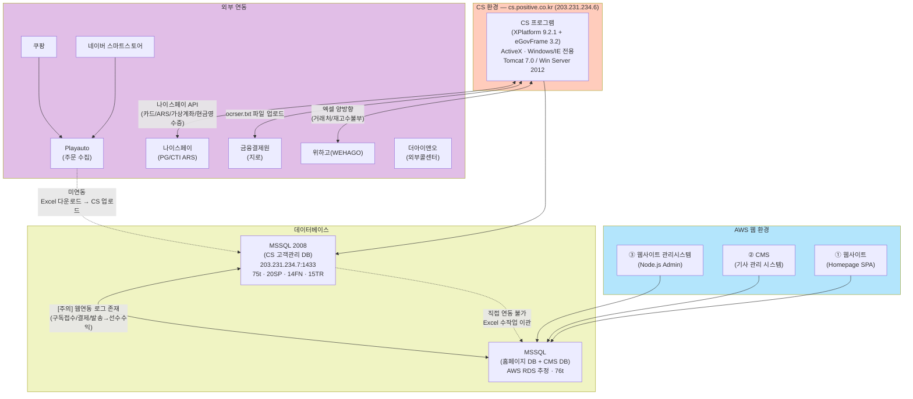
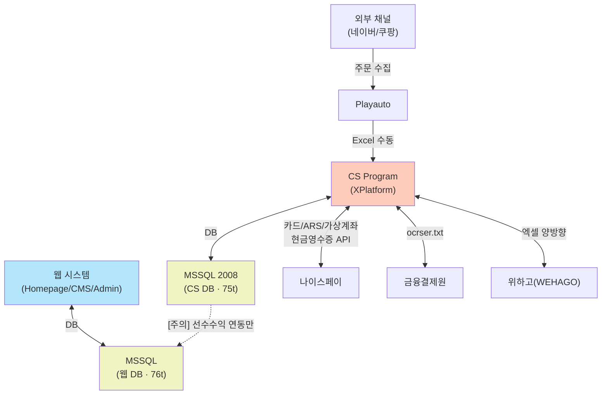
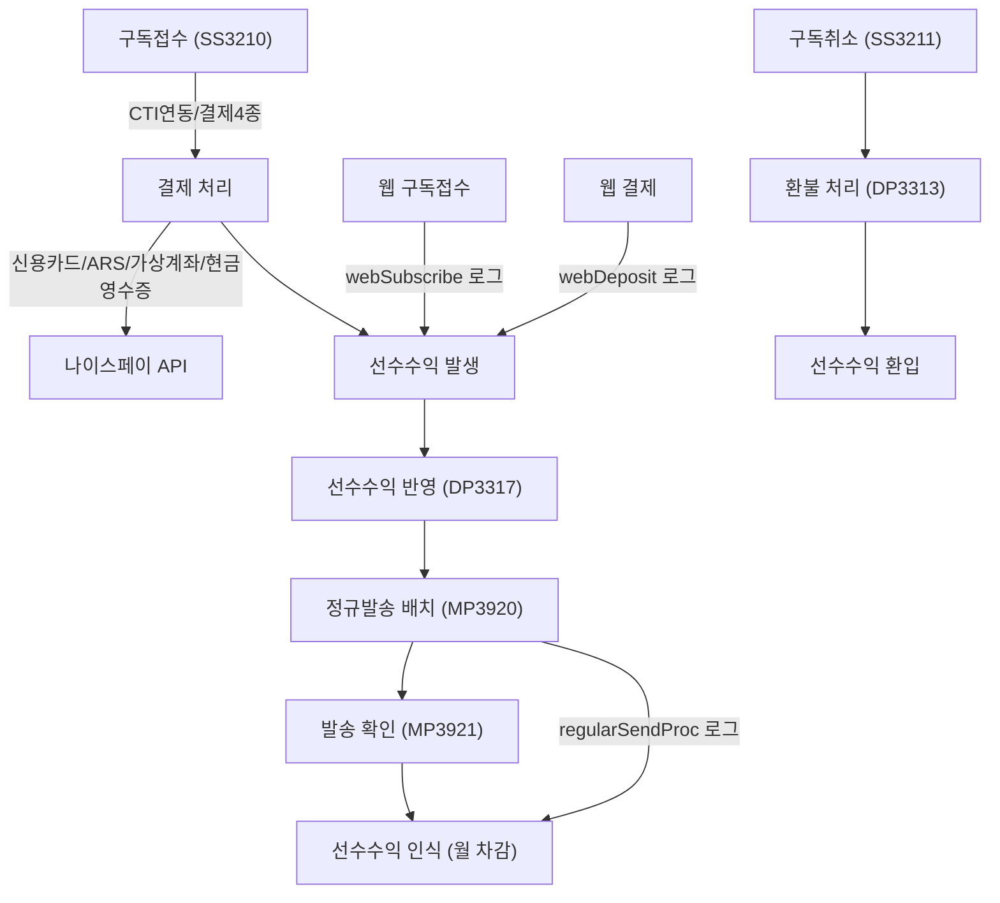
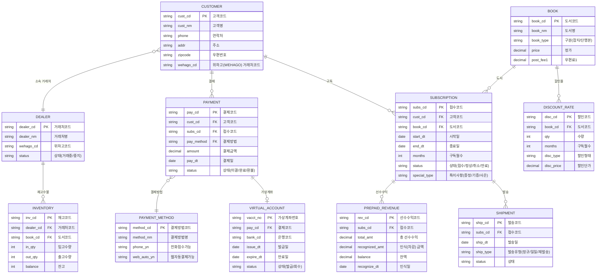
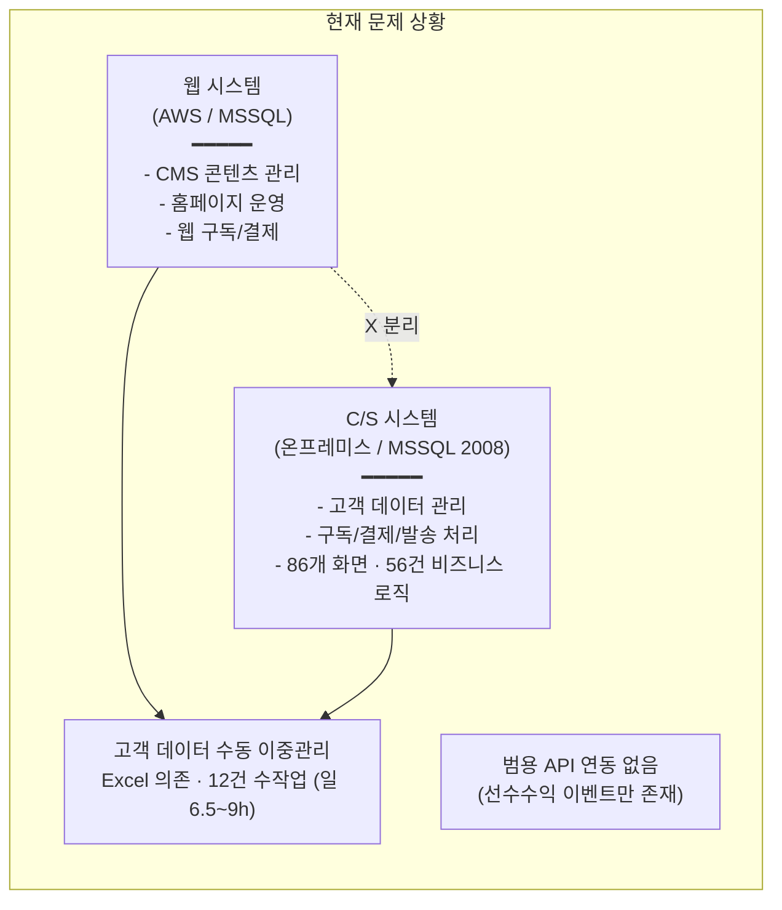
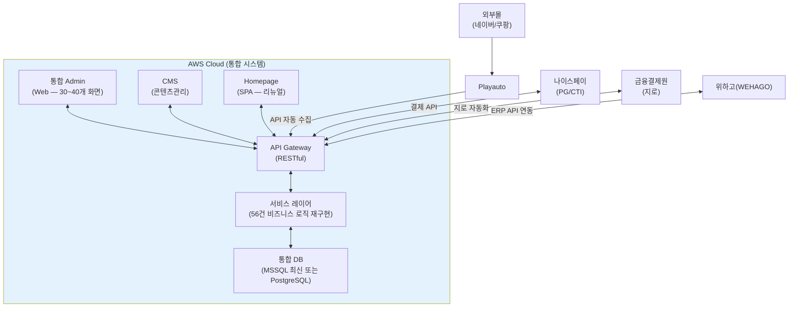

# 시스템 정밀진단

CS 고객관리 프로그램(Tobesoft XPlatform/eGovFrame) 매뉴얼 분석 결과와 MSSQL DB 구조 역공학(Reverse Engineering) 결과를 종합한다.

> **분석 원본 자료**: 사용자 매뉴얼 V2.4 (125p), 관리자 매뉴얼 V1.1 (47p)
> **CSV 전체 목록**: [`cs-program-menu-structure.csv`](/goodthinking-isp/00-clinet_document/cs-program-menu-structure.csv) (86개 화면)

---

## AS-IS 시스템 아키텍처

### 인프라 상세 (관리자 매뉴얼 V1.1에서 확인)

| 구분 | 항목 | 상세 |
|------|------|------|
| **CS 웹서버** | URL | `http://cs.positive.co.kr/` (`203.231.234.6`) |
| | OS | Windows Server 2012 |
| | WAS | Tomcat 7.0 (`C:\PROJECTS\Tomcat 7.0`) |
| | 개발 Tool | XPlatform 9.2.1 + Eclipse (eGovFrame 3.2) |
| | 형상관리 | Visual SVN Server |
| | 라이선스 | XPlatform Client/Server License (XML) |
| **CS DB서버** | IP | `203.231.234.7` (Port 1433) |
| | DBMS | **MSSQL Server 2008** |
| | 규모 | 75 Tables, 20 SP, 14 Function, 15 Trigger |
| **웹 시스템** | 위치 | AWS |
| | Homepage | SPA 기반 (대외 홈페이지) |
| | CMS | 기사/콘텐츠 관리 시스템 |
| | Admin | Node.js 기반 웹사이트 관리시스템 |
| | DB | **MSSQL** (AWS RDS 추정) — 홈페이지 63t + CMS 13t |

### 아키텍처 다이어그램



> **주의**: 관리자 매뉴얼의 로그 경로(`D:\POSITIVEWebIntefaceLog\`)로 보아 웹→CS 간 **구독접수·결제·발송 시 선수수익 반영**에 한해 일부 연동이 존재한다. 다만 범용 API 연동이 아닌 특정 이벤트 기반의 제한적 연동으로 추정된다.

### 시스템 구성 요소

| 구분 | 컴포넌트 | 기술 스택 | 역할 | 위치 |
|------|----------|-----------|------|------|
| **CS 시스템** | CS Program | XPlatform 9.2.1 + Java (eGovFrame 3.2) | 고객관리 프로그램 (ActiveX 기반) | `203.231.234.6` (Win 2012) |
| | CS DB | MSSQL Server 2008 | CS 시스템 데이터 저장 | `203.231.234.7` |
| | SVN | Visual SVN Server | 소스 형상관리 | CS 웹서버 내 |
| **웹 시스템** | Homepage | SPA | 고객용 홈페이지 | AWS |
| | CMS | - | 기사/콘텐츠 관리 | AWS |
| | Admin | Node.js | 웹사이트 관리시스템 | AWS |
| | Web DB | MSSQL (AWS RDS 추정) | 홈페이지 63t + CMS 13t | AWS |
| **외부 연동** | Playauto | 외부 솔루션 | 외부몰 주문 수집 | - |
| | 나이스페이 | PG사 | 카드/ARS/가상계좌/현금영수증 | API |
| | 금융결제원 | 공공기관 | 지로 입금 파일(ocrser.txt) | 파일업로드 |
| | 위하고(WEHAGO) | SaaS | 거래처/재고수불부 엑셀 연동 | 엑셀 양방향 |
| | 더아이앤오 | 외부 콜센터 | 아웃바운드 콜 (\~4명) | - |

### 소스 코드 구조 (관리자 매뉴얼 III장)

```
XPlatform *.xfdl (화면: Design + Source + Script)
  → *Controller.java (Spring MVC)
    → *Service.java / *ServiceImpl.java
      → *DAO.java
        → *_SQL.xml (MyBatis 쿼리)
```

**업무 폴더별 prefix**: `BS`(기본/관리자), `SS`(접수), `DP`(입금), `FW`(발송/반송), `SD`(영업), `MP`(관리/출력)

**공통 스크립트 (Lib)**: `common_util`, `common_tran`, `common_form`, `common_auth`, `common_info`, `common_grid`, `common_date`, `common_popup` (8개)

### 데이터 흐름



---

## 분석 대상

### 1. 애플리케이션 (C/S 시스템)

| 항목 | 내용 |
|------|------|
| **프로그램명** | 고객관리 프로그램 (Positive) |
| **접속 URL** | `http://cs.positive.co.kr/` (`203.231.234.6`) |
| **개발 플랫폼** | Tobesoft XPlatform 9.2.1 + Java (eGovFrame 3.2) |
| **WAS** | Tomcat 7.0 (Windows Server 2012) |
| **형상관리** | Visual SVN Server |
| **프로젝트 경로** | `C:\eGovFramework\workspace\positive\` |
| **화면 파일** | `*.xfdl` (XPlatform 화면 — Design/Source/Script) |
| **접근 조건** | ActiveX 기반 — Windows/IE 전용, 내부망/VPN 필수 |
| **화면 수** | **86개** (사용자 매뉴얼 74개 + 관리자 매뉴얼 12개) |
| **외부 연동** | 나이스페이(PG/CTI), 금융결제원(지로), 위하고(WEHAGO), Playauto |

### 2. 애플리케이션 (웹 시스템)

| 항목 | 내용 |
|------|------|
| **Homepage** | SPA (Single Page Application) — 온라인 구독 신청/결제 |
| **CMS** | 기사/콘텐츠 관리 시스템 — 편집실 사용 |
| **Admin** | Node.js 기반 웹사이트 관리시스템 — 회원/주문 관리 |
| **호스팅** | AWS |
| **DB** | MSSQL (AWS RDS 추정) |

### 3. 데이터베이스

| 항목 | CS 시스템 DB | 웹 시스템 DB |
|------|-------------|--------------|
| **DBMS** | MSSQL Server 2008 | MSSQL (AWS RDS 추정) |
| **서버 IP** | `203.231.234.7:1433` | AWS 내부 |
| **규모** | 75t + 20SP + 14FN + 15TR | 홈페이지 63t + CMS 13t (7 SP) |
| **용도** | 구독/주문/결제/발송/영업 | 웹 콘텐츠/사용자/CMS |
| **연동 상태** | [주의] 선수수익 반영 연동만 존재 | [주의] 선수수익 반영 연동만 존재 |

---

## CS 프로그램 화면 분석 (매뉴얼 기반)

### 화면 ID 체계

| Prefix | 업무 영역 | 화면 수 | 비고 |
|:------:|-----------|:-------:|------|
| **BS** | 기본/관리자 (Basic/System) | 12 | 사원·도서·코드·거래처·권한 관리 |
| **SS** | 접수 (Subscription) | 11 | 구독접수·구독취소·계산서 |
| **DP** | 입금 (Deposit) | 11 | 미결·지로·무통장·입금약속·선수수익 |
| **MP** | 발송 (Management/Print) | 48 | 발송관리 10 + 관리자리포트 38 |
| **SD** | 영업 (Sales/Distribution) | 2 | 영업입금·재고수불부 |
| **FW** | 발송/반송 (Forward) | 0 | 화면 없음 (MP에서 처리) |
| | **추가프로그램** | 2 | 현금영수증 발행/미발행 |
| | **합계** | **86** | 사용자 74 + 관리자 12 |

### 대분류별 핵심 화면

#### 관리자 (BS) — 12개

| 화면ID | 화면명 | 핵심 기능 |
|--------|--------|-----------|
| BS3110 | 사원관리 | CRUD, 관리등급/부서/메뉴·버튼 권한, **위하고 사원번호 매핑**, 논리삭제 |
| BS3111 | 도서관리 | 잡지/단행본 코드 CRUD (도서명/구분/가격/우편료1\~4/신간) |
| BS3112 | 도서할인율관리 | 수량/구독월수/할인형태별 할인단가 |
| BS3114 | 기초코드관리 | 대분류/소분류 2레벨 코드 (프로그램 전체 코드체계) |
| BS3115 | 결제코드관리 | 결제방법 코드 (전화접수가능여부, **웹자동결제가능여부**) |
| BS3116 | 국가코드관리 | 국가 정보 (국제전화/지역구분) — 해외구독 지원 |
| BS3117 | 거래처관리 | CRUD + **가상계좌 발급/회수** + **4종 결제** + 거래중지/재거래 + **위하고 엑셀 양방향** |
| BS3195 | 프로그램관리 | Sub Menu 등록/수정 (모듈ID/모듈명/클래스명) |
| BS3193 | 메뉴관리 | Main→Sub Menu 배치, 메뉴 추가/이동 (Tree 구조) |
| BS3197 | 버튼관리 | 화면별 버튼 등록/수정 |
| BS3201 | 메뉴/버튼별 권한관리 | 권한정책 CRUD + 메뉴/버튼 권한 매트릭스 (RBAC) |
| MP3949 | 선수수익 발송거래 오류내역 | 발송거래 선수수익 적용 오류 조회, 단건/일괄 재처리 |

#### 접수 (SS) — 11개

주요 화면: SS3210(구독접수 — CTI연동/결제4종/특이사항3종), SS3211(구독취소), SS3212(접수현황조회), SS3214(도서별 접수현황), SS3215(기간별 통합접수현황), SS3217(소속/영업 접수현황), SS3218(접수상세내역조회), SS3219(접수취소현황), SS3220(사원별 접수취소현황), SS3250/SS3252(새벽햇살 기증접수/계산서)

#### 입금 (DP) — 11개

주요 화면: DP3310(미결건), DP3311(지로입금/반영 — 금융결제원 ocrser.txt), DP3312(무통장 입금처리), DP3313(환불/기타입금), DP3315(가상계좌입금반영), DP3316(입금약속관리), DP3317(선수수익 반영), DP3318(입금처리현황), DP3319(결제현황)

#### 발송 (MP) — 10개

주요 화면: MP3902(지로DM발송등록), MP3910/MP3911(스티커인쇄), MP3920/MP3921(정규발송배치/확인), MP3930/MP3931(일일발송/재발송)

#### 영업 (SD) — 2개

SD3515(영업입금 — 위하고 코드변환), SD3530(재고수불부 — 위하고 엑셀 Import)

#### 관리자 리포트/운영 (MP) — 38개

반송관리(5), 발송현황(7), 매출통계(14), 운영관리(8), 영업리포트(4)

> **전체 86개 화면 상세**: [`cs-program-menu-structure.csv`](/goodthinking-isp/00-clinet_document/cs-program-menu-structure.csv) 참조

### 핵심 비즈니스 로직

#### 결제 처리 (4종 — 나이스페이 연동)

| 결제 수단 | 처리 방식 | 로그 경로 |
|-----------|-----------|-----------|
| 신용카드 | 나이스페이 API (실시간) | `D:\POSITIVENiceLog\CardPayment\` |
| ARS 결제 | 나이스페이 CTI 연동 (ARS 녹취) | `D:\POSITIVENiceLog\CardARSNoti\` |
| 가상계좌 | 나이스페이 가상계좌 발급/회수/과오납 | `D:\POSITIVENiceLog\VtAccChkReq\` |
| 현금영수증 | 나이스페이 발급/취소 | `D:\POSITIVENiceLog\ReceiptIssue\` |

#### 선수수익 반영 (웹↔CS 연동)

| 연동 이벤트 | 방향 | 로그 경로 |
|-------------|------|-----------|
| 웹 구독접수 | 웹→CS | `D:\POSITIVEWebIntefaceLog\webSubscribe\` |
| 웹 결제 반영 | 웹→CS | `D:\POSITIVEWebIntefaceLog\webDeposit\` |
| 정규발송 처리 | CS→발송+선수수익 | `D:\POSITIVEWebIntefaceLog\regularSendProc\` |
| 일일발송/재발송 | CS→발송+선수수익 | `D:\POSITIVEWebIntefaceLog\dailySendProc\` |

> **발견 사항**: 웹↔CS 간 범용 API 연동은 없으나, **선수수익 반영에 한해 이벤트 기반 연동이 존재**한다. 이는 기존 분석에서 "연동 전무"라 했던 것의 수정 포인트.

#### 구독 관리 핵심 플로우



### 외부 연동 상세

| 연동 대상 | 연동 방식 | 관련 화면 | 연동 빈도 |
|-----------|-----------|-----------|-----------|
| **나이스페이 (PG)** | API (카드/가상계좌/현금영수증) | SS3210, BS3117, DP3315 | 실시간 |
| **나이스페이 (CTI)** | ARS 녹취 연동 | SS3210 (CTI 접수) | 실시간 |
| **금융결제원** | 파일 업로드 (`ocrser.txt`) | DP3311 (지로입금) | 일 1회 |
| **위하고(WEHAGO)** | 엑셀 양방향 (거래처/재고/영업) | BS3117, SD3515, SD3530 | 수시 (수동) |
| **Playauto** | 미연동 — 엑셀 수동 다운로드/업로드 | (직접 연동 화면 없음) | 수동 |
| **더아이앤오** | 외부콜센터 (\~4명) 아웃바운드 | SS3210 접수 데이터 공유 | 수시 |
| **웹 시스템** | 선수수익 이벤트 연동 (제한적) | DP3317, MP3920\~3931 | 이벤트 기반 |

---

## DB 역공학 분석

### 테이블 규모

| DB 구분 | DBMS | Tables | SP | Function | Trigger | 비고 |
|---------|------|:------:|:--:|:--------:|:-------:|------|
| **CS 고객관리** | MSSQL 2008 | 75 | 20 | 14 | 15 | `203.231.234.7:1433` |
| **CMS** | MSSQL (추정) | 13 | - | - | - | AWS |
| **홈페이지** | MSSQL (추정) | 63 | 7 | - | - | AWS |
| **합계** | | **151** | **27** | **14** | **15** | **비즈니스 로직 56건** |

> **비즈니스 로직 56건** = CS DB (20 SP + 14 Function + 15 Trigger = 49건) + 홈페이지 DB (7 SP)
> 이 56건의 로직이 TO-BE에서 서비스 레이어로 재구현되어야 하는 핵심 전환 대상이다.

### 추정 ERD (매뉴얼 기반 엔티티)



> **주의**: 위 ERD는 매뉴얼 화면 분석을 통해 **추정**한 것이다. 실제 DB 스키마 덤프 후 검증이 필요하다.

---

## 시스템 구조적 문제점

### 핵심 문제: 시스템 이원화



### 기술적 문제

| 문제 | 상세 내용 | 영향 | 심각도 |
|------|-----------|------|:------:|
| **ActiveX/IE 종속** | XPlatform 9.2.1 — Windows/IE 전용, ActiveX 필수 | 원격근무 불가, 크로스브라우저 불가 | Critical |
| **DB 이원화** | MSSQL 2008 (CS) + MSSQL RDS (웹) 분리 운영 | 실시간 데이터 공유 불가 | Critical |
| **MSSQL 2008 EOL** | 2019년 7월 지원 종료, 보안 패치 중단 | 보안 취약, 컴플라이언스 위반 | Critical |
| **비즈니스 로직 56건** | 20 SP + 14 Function + 15 Trigger + 7 SP (웹) | DB 내장 로직 — 단위테스트·버전관리 불가 | High |
| **PG 종속 (나이스페이)** | 4종 결제 모두 나이스페이 단일 PG | PG 장애 시 전체 결제 중단 | High |
| **수동 데이터 연동** | Playauto → CS 수동 Excel, 위하고 엑셀 양방향 | 처리 지연, 오류 가능성 | High |
| **레거시 스택** | XPlatform 9.2.1 (Tobesoft 단종 위험), eGovFrame 3.2 | 유지보수 인력 확보 어려움 | Medium |
| **문서화 부재** | API 명세·DB 스키마 문서 없음, 매뉴얼만 존재 | 시스템 이해/이관 어려움 | Medium |

### 데이터 문제

| 문제 | 상세 내용 | 영향 | 심각도 |
|------|-----------|------|:------:|
| **고객 데이터 분리** | CS 고객 ↔ 웹 회원 데이터 불일치 | 통합 고객 뷰 불가 | Critical |
| **CMS 권한 수동 처리** | 구독 결제 → CMS 콘텐츠 접근 권한 수작업 부여 | 처리 지연, 누락 발생 | High |
| **엑셀 의존도** | 위하고 연동·Playauto 주문·영업리포트 모두 Excel 경유 | 데이터 정합성 위험 | High |
| **선수수익 오류** | MP3949 화면이 별도 존재할 정도로 선수수익 적용 오류 빈발 | 재무 정확성 저하 | High |
| **주문 채널 분산** | 네이버/쿠팡/웹/전화 채널별 개별 관리 | 통합 분석 어려움 | Medium |

### 운영 문제

| 문제 | 상세 내용 | 영향 | 심각도 |
|------|-----------|------|:------:|
| **Windows Server 2012 EOL** | 2023년 10월 지원 종료, 보안 패치 중단 | 보안 위험 | Critical |
| **수작업 12건** | 일일 6.5\~9시간 수동 처리 (Playauto·지로·발송·리포트 등) | 인력 낭비, 오류 발생 | Critical |
| **VPN 보안** | MikroTik PPTP — PPTP 프로토콜 보안 취약 (MS-CHAPv2) | 외부 접속 보안 위험 | High |
| **실시간 현황 불가** | 데이터 분리로 통합 대시보드 불가 | 의사결정 지연 | Medium |
| **백업/DR 미확인** | 백업 정책·재해복구 계획 미확인 | 데이터 손실 위험 | Medium |

---

## TO-BE 개선 방향

### 목표 아키텍처 개요



### 주요 개선 포인트

| AS-IS | TO-BE | 기대 효과 |
|-------|-------|----------|
| C/S 86개 화면 (ActiveX/IE) | 웹 기반 Admin \~30\~40개 통합 화면 | 어디서나/모든 브라우저 접속 |
| MSSQL 2008 (EOL) × 2개 DB | 통합 DB (MSSQL 최신 또는 PostgreSQL) | 실시간 데이터 공유, 보안 패치 |
| DB 내장 56건 비즈니스 로직 | 서비스 레이어 재구현 (단위테스트 가능) | 유지보수성·확장성 확보 |
| 나이스페이 단일 PG 종속 | PG 추상화 레이어 (멀티 PG 대응) | PG 장애 리스크 분산 |
| Playauto Excel 수동 | API 자동 주문 수집 | 처리 지연 해소 |
| 위하고 엑셀 양방향 | ERP API 직접 연동 | 실시간 재고/매출 동기화 |
| CMS 권한 수동 부여 | 결제→권한 자동 부여 | 처리 시간 90% 단축 |
| VPN(PPTP) 보안 취약 | HTTPS + OAuth2 인증 | 보안 강화 |
| 수작업 12건 (일 6.5\~9h) | 자동화 (일 1h 미만 목표) | 인력 재배치 가능 |
| 151 테이블 분산 | \~30\~40 테이블 통합 설계 | 데이터 모델 정규화 |

> 상세 설계는 [목표 모델 설계 (TO-BE Design)](/goodthinking-isp/04-design/) 섹션 참조

---

## 분석 진행 기록

### 체크리스트

| 항목 | 상태 |
|------|:----:|
| 사용자 매뉴얼 V2.4 분석 완료 (74개 화면) | 완료 |
| 관리자 매뉴얼 V1.1 분석 완료 (12개 화면) | 완료 |
| CS 프로그램 화면 목록 CSV 작성 완료 (86개) | 완료 |
| 인프라 상세 정보 확인 (IP/OS/WAS/DB) | 완료 |
| 외부 연동 현황 파악 (7종) | 완료 |
| 로그 관리 구조 파악 (나이스페이 + 웹연동) | 완료 |
| 추정 ERD 작성 (매뉴얼 기반) | 완료 |
| Tobesoft 프로그램 소스 접근 권한 확보 | 미완료 |
| MSSQL 접속 정보 확보 (DB 직접 접근) | 미완료 |
| DB 스키마 덤프 및 실제 테이블 검증 | 미완료 |
| 테이블별 용도 파악 (151t 전수 조사) | 미완료 |
| 주요 Stored Procedure 분석 (56건) | 미완료 |
| 실제 ERD 작성 (추정 ERD 검증) | 미완료 |

### 작성 이력

| 날짜 | 작성자 | 변경 내용 |
|------|--------|----------|
| 2026-03-07 | 김명직 | 초안 작성 (as-is-to-be.md 기반) |
| 2026-03-08 | 김명직 | 사용자 매뉴얼 V2.4 기반 AS-IS 아키텍처 상세화 |
| 2026-03-09 | 김명직 | 매뉴얼 V2.4/V1.1 기반 전면 개편 — 86개 화면 분석, 인프라 상세, 추정 ERD, 문제점/TO-BE 구체화 |
