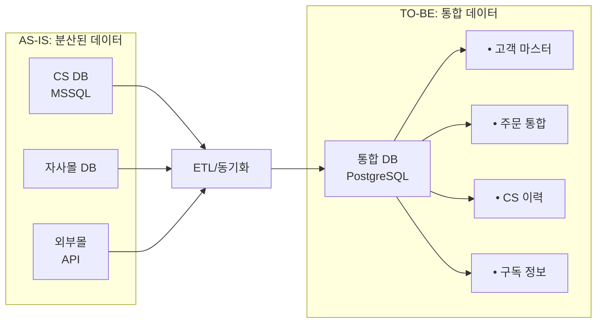
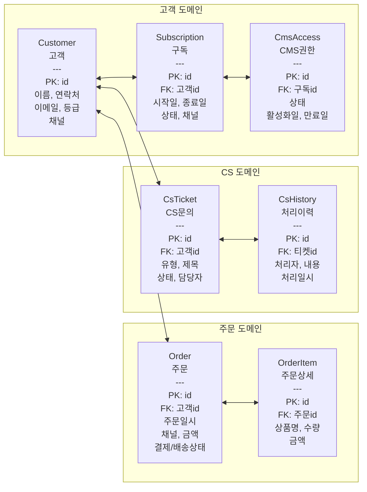
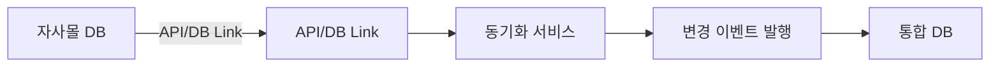
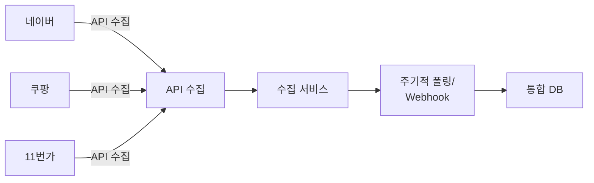
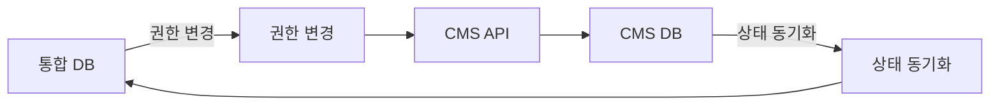

# 데이터 통합 모델

외부 채널 데이터를 포용하는 통합 DB 스키마(ERD) 설계

---

## 데이터 통합 전략

### AS-IS → TO-BE 전환

---

## TO-BE ERD (개념 모델)

### 핵심 엔터티

---

## 테이블 정의 (초안)

### 1. Customer (고객)

| 컬럼명 | 타입 | 필수 | 설명 |
|--------|------|:----:|------|
| id | BIGSERIAL | PK | 고객 ID |
| customer_code | VARCHAR(20) | UK | 고객 코드 |
| name | VARCHAR(100) | Y | 이름 |
| phone | VARCHAR(20) | Y | 연락처 |
| email | VARCHAR(100) | | 이메일 |
| address | TEXT | | 주소 |
| grade | VARCHAR(20) | | 등급 |
| primary_channel | VARCHAR(20) | | 최초 유입 채널 |
| created_at | TIMESTAMP | Y | 생성일시 |
| updated_at | TIMESTAMP | Y | 수정일시 |

### 2. Subscription (구독)

| 컬럼명 | 타입 | 필수 | 설명 |
|--------|------|:----:|------|
| id | BIGSERIAL | PK | 구독 ID |
| customer_id | BIGINT | FK | 고객 ID |
| product_type | VARCHAR(50) | Y | 상품 유형 |
| start_date | DATE | Y | 시작일 |
| end_date | DATE | Y | 종료일 |
| status | VARCHAR(20) | Y | 상태 |
| channel | VARCHAR(20) | Y | 가입 채널 |
| created_at | TIMESTAMP | Y | 생성일시 |

### 3. Order (주문)

| 컬럼명 | 타입 | 필수 | 설명 |
|--------|------|:----:|------|
| id | BIGSERIAL | PK | 주문 ID |
| order_code | VARCHAR(30) | UK | 주문 코드 |
| customer_id | BIGINT | FK | 고객 ID |
| channel | VARCHAR(20) | Y | 주문 채널 |
| order_date | TIMESTAMP | Y | 주문일시 |
| total_amount | DECIMAL(12,2) | Y | 총금액 |
| payment_status | VARCHAR(20) | Y | 결제상태 |
| delivery_status | VARCHAR(20) | | 배송상태 |
| external_order_id | VARCHAR(50) | | 외부 주문번호 |
| created_at | TIMESTAMP | Y | 생성일시 |

---

## 데이터 표준화

### 코드 표준

| 도메인 | 코드 | 값 |
|--------|------|-----|
| 주문채널 | CHANNEL | OWN_MALL, NAVER, COUPANG, SPONSOR |
| 결제상태 | PAY_STATUS | PENDING, PAID, REFUNDED, CANCELLED |
| 배송상태 | DELIV_STATUS | READY, SHIPPED, DELIVERED |
| 구독상태 | SUBS_STATUS | ACTIVE, EXPIRED, CANCELLED |
| CS유형 | CS_TYPE | INQUIRY, COMPLAINT, REFUND, ETC |

### 데이터 정제 규칙

| 항목 | 규칙 |
|------|------|
| 연락처 | 숫자만, 11자리 (010XXXXXXXX) |
| 이메일 | 소문자 변환, 유효성 검증 |
| 이름 | 공백 제거, 특수문자 제거 |
| 주소 | 우편번호 분리 저장 |

---

## 데이터 동기화 방안

### 1. 자사몰 연동

### 2. 외부몰 연동

### 3. CMS 연동

---

## 마이그레이션 고려사항

### 데이터 매핑

| AS-IS (MSSQL) | TO-BE (PostgreSQL) | 변환 규칙 |
|---------------|-------------------|----------|
| (분석 후 작성) | customer | |
| | subscription | |
| | order | |

### 중복 데이터 처리

- 고객: 연락처 + 이름 기준 매칭
- 주문: 외부 주문번호 기준 중복 체크

---

## 작성 이력

| 날짜 | 작성자 | 변경 내용 |
|------|--------|----------|
| YYYY-MM-DD | - | 초안 작성 |
