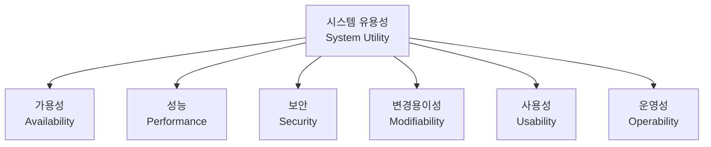

# Utility Tree

Utility Tree는 아키텍처 설계 시 품질 속성의 우선순위를 결정하기 위한 도구입니다. 비즈니스 중요도와 기술적 난이도를 함께 고려하여 아키텍처 드라이버를 식별합니다.

---

## Utility Tree 구조



### 우선순위 표기법

- **비즈니스 중요도**: H(High), M(Medium), L(Low)
- **기술적 난이도**: H(High), M(Medium), L(Low)
- **표기**: (중요도, 난이도) - 예: (H, M)

> **(H, H)** 시나리오는 **아키텍처 드라이버**로서 가장 먼저 설계에 반영해야 합니다.

---

## 좋은생각 웹 시스템 Utility Tree

```mermaid
graph TD
    Root["좋은생각 웹 시스템 Utility"]
    
    AV["가용성 Availability"]
    SysRecovery["시스템 장애 복구"]
    A1["A-1: 웹 서버 크래시 시<br/>5분 내 복구 (H,M)"]
    ExternalFailure["외부 연동 장애 대응"]
    A2["A-2: 채널 API 장애 시<br/>재시도 및 알림 (H,H) ⭐"]
    DataProtect["데이터 보호"]
    A3["A-3: DB 장애 시<br/>데이터 유실 0건 (H,H) ⭐"]
    
    PF["성능 Performance"]
    RespTime["응답 시간"]
    P2["P-2: 고객 조회<br/>2초 이내 응답 (H,M) ⭐"]
    Throughput["처리량"]
    P1["P-1: 일 500건 주문<br/>10분 내 수집 (M,L)"]
    LargeLoad["대용량 처리"]
    P3["P-3: 50만건 마이그레이션<br/>4시간 내 완료 (M,H)"]
    
    SEC["보안 Security"]
    AccessControl["접근 통제"]
    S1["S-1: 개인정보 권한 기반<br/>접근 및 마스킹 (H,M) ⭐"]
    AttackDefense["외부 공격 방어"]
    S2["S-2: SQL Injection, XSS<br/>100% 차단 (H,M)"]
    DataLeakage["데이터 유출 방지"]
    S3["S-3: 대량 다운로드<br/>승인 및 로깅 (H,L)"]
    
    MOD["변경용이성 Modifiability"]
    FeatureExtend["기능 확장"]
    M1["M-1: 신규 판매채널<br/>5일 내 추가 (M,H) ⭐"]
    ProcessChange["프로세스 변경"]
    M2["M-2: 워크플로우<br/>설정만으로 변경 (M,M)"]
    ReportChange["리포트 변경"]
    M3["M-3: 리포트 양식<br/>2일 내 수정 (L,L)"]
    
    USE["사용성 Usability"]
    Learning["학습 용이성"]
    U1["U-1: 4시간 교육 후<br/>업무 수행 가능 (M,L)"]
    ErrorHandle["오류 대응"]
    U2["U-2: 명확한 오류 메시지<br/>및 해결 안내 (M,L)"]
    Efficiency["업무 효율성"]
    U3["U-3: 주요 업무<br/>5클릭 내 완료 (H,M)"]
    
    OPE["운영성 Operability"]
    Monitoring["모니터링"]
    O1["O-1: 이상 징후<br/>5분 내 감지 (M,M)"]
    FailureResp["장애 대응"]
    O2["O-2: 배치 실패 시<br/>즉시 알림 및 재실행 (M,L)"]
    
    Root --> AV
    Root --> PF
    Root --> SEC
    Root --> MOD
    Root --> USE
    Root --> OPE
    
    AV --> SysRecovery
    AV --> ExternalFailure
    AV --> DataProtect
    SysRecovery --> A1
    ExternalFailure --> A2
    DataProtect --> A3
    
    PF --> RespTime
    PF --> Throughput
    PF --> LargeLoad
    RespTime --> P2
    Throughput --> P1
    LargeLoad --> P3
    
    SEC --> AccessControl
    SEC --> AttackDefense
    SEC --> DataLeakage
    AccessControl --> S1
    AttackDefense --> S2
    DataLeakage --> S3
    
    MOD --> FeatureExtend
    MOD --> ProcessChange
    MOD --> ReportChange
    FeatureExtend --> M1
    ProcessChange --> M2
    ReportChange --> M3
    
    USE --> Learning
    USE --> ErrorHandle
    USE --> Efficiency
    Learning --> U1
    ErrorHandle --> U2
    Efficiency --> U3
    
    OPE --> Monitoring
    OPE --> FailureResp
    Monitoring --> O1
    FailureResp --> O2
```



---

## 아키텍처 드라이버 (Architecture Drivers)

(H, H) 또는 비즈니스 중요도 H인 시나리오들이 아키텍처 설계의 핵심 드라이버입니다.

### Tier 1: 핵심 드라이버 (H, H)

| ID | 시나리오 | 품질 속성 | 아키텍처 결정 영향 |
|----|----------|-----------|-------------------|
| A-2 | 채널 API 장애 시 재시도 및 알림 | 가용성 | Circuit Breaker 패턴, 메시지 큐 도입 |
| A-3 | DB 장애 시 데이터 유실 0건 | 가용성 | DB 이중화, 트랜잭션 관리 |

### Tier 2: 주요 드라이버 (H, M) 또는 (M, H)

| ID | 시나리오 | 품질 속성 | 아키텍처 결정 영향 |
|----|----------|-----------|-------------------|
| P-2 | 고객 조회 2초 이내 응답 | 성능 | 캐싱 전략, 인덱스 최적화 |
| S-1 | 개인정보 권한 기반 접근 | 보안 | RBAC, 데이터 마스킹 레이어 |
| M-1 | 신규 판매채널 5일 내 추가 | 변경용이성 | 어댑터 패턴, 플러그인 아키텍처 |
| U-3 | 주요 업무 5클릭 내 완료 | 사용성 | UI/UX 설계, 업무 흐름 최적화 |

---

## 품질 속성별 우선순위 매트릭스

|  | 높은 난이도 (H) | 중간 난이도 (M) | 낮은 난이도 (L) |
|--|:---------------:|:---------------:|:---------------:|
| **높은 중요도 (H)** | A-2, A-3 | A-1, P-2, S-1, S-2, U-3 | S-3 |
| **중간 중요도 (M)** | M-1, P-3 | M-2, O-1 | P-1, U-1, U-2, O-2 |
| **낮은 중요도 (L)** | - | - | M-3 |

### 우선순위 결정 원칙

1. **(H, H)**: 최우선 - 아키텍처 초기 설계에 반드시 반영
2. **(H, M)**: 높음 - 상세 설계 시 반드시 고려
3. **(H, L)**: 중간 - 구현 시 표준 패턴 적용
4. **(M, H)**: 중간 - 기술적 검토 필요, 대안 탐색
5. **(M, M) 이하**: 낮음 - 일반적인 설계/구현 적용

---

## 아키텍처 전략 도출

### 1. 가용성 전략

**드라이버**: A-2 (채널 API 장애), A-3 (데이터 보호)

```mermaid
graph LR
    A["가용성 전략"]
    B["Circuit Breaker 패턴<br/>적용 외부 API 연동"]
    C["메시지 큐 기반<br/>비동기 처리 주문 수집"]
    D["DB 이중화<br/>Master-Slave Replication"]
    E["자동 페일오버 구성"]
    F["배치 작업 재시도 메커니즘"]
    
    A --> B
    A --> C
    A --> D
    A --> E
    A --> F


### 2. 성능 전략

**드라이버**: P-2 (고객 조회 응답)

```mermaid
graph LR
    A["성능 전략"]
    B["Redis 캐싱 적용<br/>자주 조회되는 고객 데이터"]
    C["DB 인덱스 최적화<br/>검색 조건 기반"]
    D["페이지네이션 및<br/>Lazy Loading"]
    E["쿼리 최적화 및<br/>실행 계획 분석"]
    
    A --> B
    A --> C
    A --> D
    A --> E


### 3. 보안 전략

**드라이버**: S-1 (개인정보 접근 통제)

```mermaid
graph LR
    A["보안 전략"]
    B["RBAC<br/>Role-Based Access Control"]
    C["개인정보 마스킹 레이어<br/>API 레벨"]
    D["감사 로그 자동 기록"]
    E["WAF<br/>Web Application Firewall"]
    F["암호화<br/>전송중: TLS, 저장시: AES-256"]
    
    A --> B
    A --> C
    A --> D
    A --> E
    A --> F


### 4. 변경용이성 전략

**드라이버**: M-1 (신규 판매채널 추가)

```mermaid
graph LR
    A["변경용이성 전략"]
    B["어댑터 패턴<br/>채널별 API 연동"]
    C["플러그인 아키텍처<br/>신규 채널 추가 용이"]
    D["설정 기반<br/>워크플로우 엔진"]
    E["API 버저닝 전략"]
    F["모듈화된 컴포넌트 설계"]
    
    A --> B
    A --> C
    A --> D
    A --> E
    A --> F


---

## Tradeoff 분석

### 가용성 vs 비용

| 선택지 | 가용성 | 비용 | 권장 |
|--------|:------:|:----:|:----:|
| 단일 서버 | 낮음 | 낮음 | ❌ |
| Active-Standby | 높음 | 중간 | ✅ |
| Active-Active | 매우 높음 | 높음 | △ (향후) |

**결정**: 초기에는 Active-Standby로 시작, 트래픽 증가 시 Active-Active 전환

### 성능 vs 일관성

| 선택지 | 성능 | 일관성 | 권장 |
|--------|:----:|:------:|:----:|
| 동기 처리 | 낮음 | 높음 | 주문 처리 |
| 비동기 처리 | 높음 | 중간 | 주문 수집 |
| 캐시 사용 | 높음 | 낮음 | 조회 기능 |

**결정**: 업무 특성에 따라 혼합 적용

---

## 다음 단계

- [품질 속성 시나리오](./quality-scenarios) - 상세 시나리오 정의
- [Web 시스템 아키텍처](./web-architecture) - 드라이버 기반 아키텍처 설계
- [아키텍처 설계 방법론](./architecture-methodology) - 설계 프로세스 가이드
