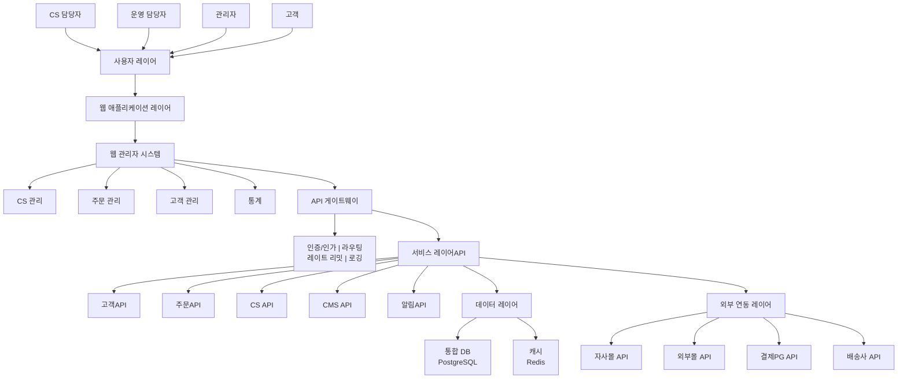
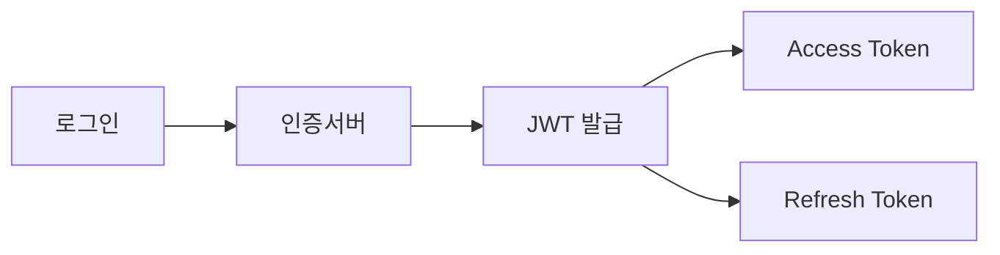

# Web 시스템 아키텍처

클라우드 기반의 웹 관리자(Admin) 시스템 구조 및 보안 정책 수립

---

## 아키텍처 개요

### TO-BE 시스템 구성도



---

## 기술 스택 (안)

### Frontend

| 구분 | 기술 | 비고 |
|------|------|------|
| Framework | React / Vue.js | 선택 필요 |
| UI Library | Ant Design / Material UI | 관리자 UI에 적합 |
| State Management | Redux / Vuex | |
| Build Tool | Vite | |

### Backend

| 구분 | 기술 | 비고 |
|------|------|------|
| Framework | Node.js + Express / NestJS | 또는 Python + FastAPI |
| API | RESTful API | OpenAPI 문서화 |
| Authentication | JWT + OAuth2 | |
| ORM | Prisma / TypeORM | |

### Database

| 구분 | 기술 | 비고 |
|------|------|------|
| Primary DB | PostgreSQL | 관계형 데이터 |
| Cache | Redis | 세션, 캐시 |
| Search | Elasticsearch | 검색 기능 (선택) |

### Infrastructure

| 구분 | 기술 | 비고 |
|------|------|------|
| Cloud | AWS / NCP | 선택 필요 |
| Container | Docker | |
| Orchestration | Kubernetes (EKS) | 규모에 따라 |
| CI/CD | GitHub Actions | |

---

## 보안 정책

### 1. 인증 (Authentication)



| 항목 | 정책 |
|------|------|
| 인증 방식 | ID/Password + JWT |
| 토큰 만료 | Access: 1시간, Refresh: 7일 |
| 2FA | 관리자 계정 필수 (선택) |
| 비밀번호 | 8자 이상, 복잡도 규칙 적용 |

### 2. 인가 (Authorization)

| 역할 | 권한 |
|------|------|
| 최고관리자 | 전체 기능 |
| 관리자 | 설정 외 전체 |
| CS담당자 | CS, 고객 조회 |
| 운영담당자 | 주문, 배송 관리 |

### 3. 데이터 보안

| 항목 | 정책 |
|------|------|
| 전송 암호화 | HTTPS (TLS 1.3) |
| 저장 암호화 | 개인정보 필드 AES 암호화 |
| 접근 통제 | IP 화이트리스트 (선택) |
| 로그 | 모든 접근/변경 기록 |

### 4. 감사 로그

```sql
-- 감사 로그 예시 구조
audit_log (
  id,
  user_id,
  action,        -- CREATE, READ, UPDATE, DELETE
  resource,      -- 대상 테이블/기능
  resource_id,   -- 대상 레코드 ID
  old_value,     -- 변경 전 (JSON)
  new_value,     -- 변경 후 (JSON)
  ip_address,
  user_agent,
  created_at
)
```

---

## 화면 설계 (Wireframe)

### 주요 화면 목록

| No | 화면 | 설명 | 상태 |
|----|------|------|:----:|
| 1 | 대시보드 | 핵심 지표 요약 | ⬜ |
| 2 | 고객 목록 | 통합 고객 조회 | ⬜ |
| 3 | 고객 상세 | 고객 정보 및 이력 | ⬜ |
| 4 | 주문 목록 | 다채널 주문 통합 조회 | ⬜ |
| 5 | 주문 상세 | 주문 처리 및 이력 | ⬜ |
| 6 | CS 목록 | 문의 접수 및 처리 | ⬜ |
| 7 | 설정 | 시스템 설정 | ⬜ |

---

## 작성 이력

| 날짜 | 작성자 | 변경 내용 |
|------|--------|----------|
| YYYY-MM-DD | - | 초안 작성 |
