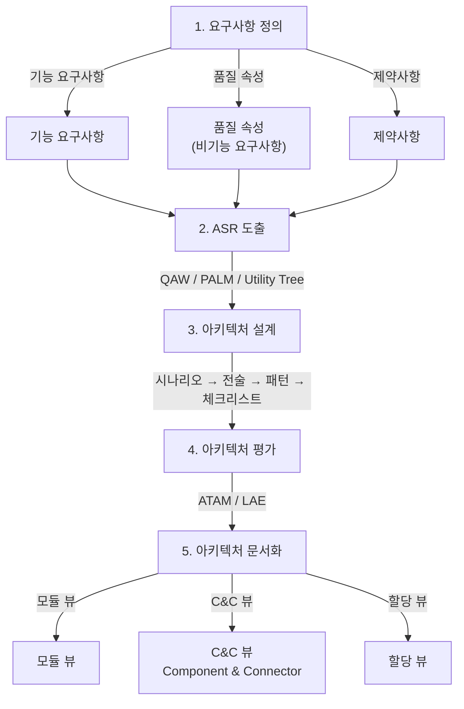
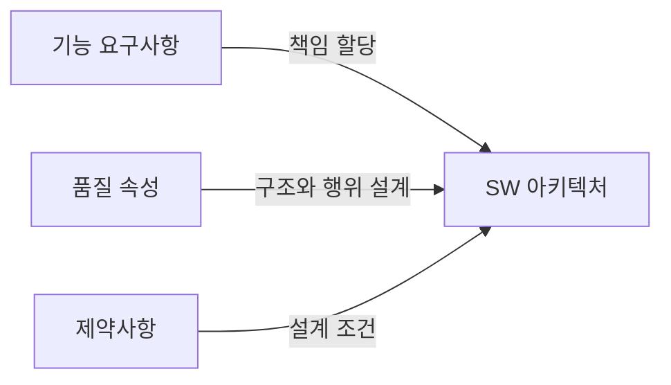
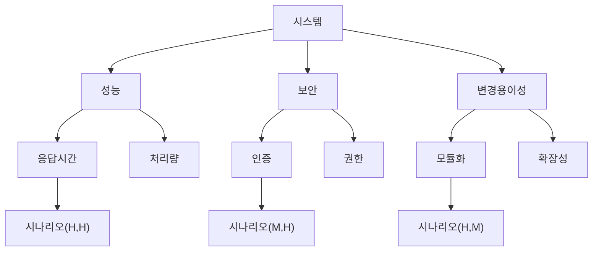
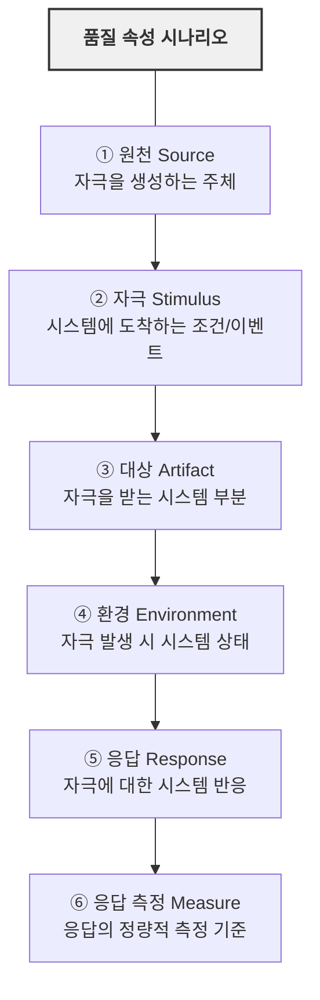
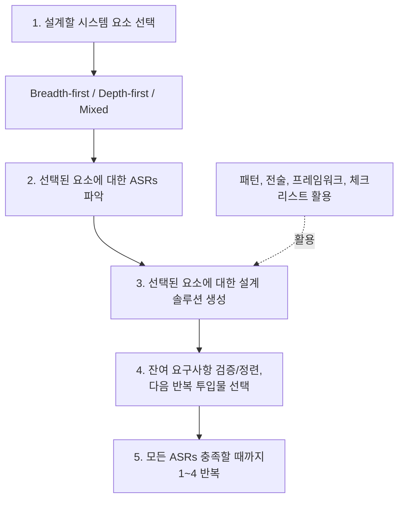

# 아키텍처 설계 방법론

목표 모델(TO-BE) 설계를 위한 SW 아키텍처 프로세스 및 방법론

---

## 아키텍처 설계 프로세스 개요

---

## 1. 요구사항과 아키텍처

### 요구사항 유형

| 유형 | 설명 | 아키텍처 영향 |
|:---|:---|:---|
| **기능 요구사항** | 시스템이 해야 할 것 | 책임 할당 |
| **품질 속성** | 기능의 자격 요건 (성능, 보안 등) | 구조와 행위 설계 |
| **제약사항** | 선택 여지 없는 결정 (언어, 플랫폼 등) | 설계 조건 |

---

## 2. ASR (Architecturally Significant Requirement)

### ASR 정의
아키텍처에 **중요한 영향을 미치는 요구사항**으로, 이 요구사항이 없으면 아키텍처가 완전히 달라질 수 있음

### ASR 도출 기법

#### QAW (Quality Attribute Workshop)
SW 아키텍처 완성 전, 이해당사자 참여를 통해 품질 속성 시나리오를 도출

| 단계 | 활동 |
|:---:|------|
| 1 | QAW 소개 |
| 2 | 업무/미션 발표 |
| 3 | 아키텍처 계획 발표 |
| 4 | 아키텍처 동인 파악 |
| 5 | 시나리오 브레인스토밍 |
| 6 | 시나리오 통합 |
| 7 | 시나리오 우선순위 부여 |
| 8 | 시나리오 정련 |

#### Utility Tree
품질 속성을 계층적으로 정리하고 우선순위를 부여

---

## 3. 품질 속성 (Quality Attributes)

### 핵심 품질 속성

| 품질 속성 | 정의 | 주요 관심사 |
|:---------|:----|:---------|
| **가용성 (Availability)** | 시스템이 필요할 때 운영 가능한 정도 | 장애 감지, 복구, 예방 |
| **상호운영성 (Interoperability)** | 다른 시스템과 정보 교환 능력 | 인터페이스, 프로토콜 |
| **변경용이성 (Modifiability)** | 변경 비용과 위험 | 모듈화, 결합도, 응집도 |
| **성능 (Performance)** | 시간 제약 내 응답 능력 | 응답시간, 처리량, 자원 |
| **보안 (Security)** | 무단 접근 방지 | 인증, 인가, 기밀성, 무결성 |
| **테스트 가능성 (Testability)** | 결함 발견 용이성 | 관찰 가능성, 제어 가능성 |
| **사용성 (Usability)** | 사용자가 원하는 작업 수행 용이성 | 학습성, 효율성, 오류 방지 |

### 품질 속성 시나리오 구조

### 품질 속성 시나리오 예시

:::note[좋은생각 적용]
아래 예시를 좋은생각사람들 시스템에 맞게 구체화한 전체 시나리오는 [품질 속성 시나리오](/goodthinking-isp/04-design/quality-scenarios/)를 참조하세요. 17개 시나리오가 6개 품질 속성에 걸쳐 정의되어 있습니다.
:::

| 요소 | 성능 시나리오 예시 (좋은생각) |
|:---|:---|
| 원천 | 정기구독팀 사용자 |
| 자극 | 고객 통합 조회 요청 (PT_Customer + PT_Subscribe + PT_Finance) |
| 대상 | 통합 웹 관리자 시스템 (고객 관리 모듈) |
| 환경 | 정상 운영 상태, 동시 접속 15명 |
| 응답 | 고객 상세 정보 + 구독 이력 + 결제 이력 반환 |
| 응답 측정 | 3초 이내 응답 (JOIN 3개 테이블, 결과 50건 이내) |

---

## 4. ADD (Attribute-Driven Design) Method

### ADD 프로세스

### 설계 체크리스트 (7가지 범주)

| 범주 | 설명 | 예시 |
|:---|:---|:---|
| **① 책임 할당** | 각 요소에 책임 할당 | 모듈별 기능 분배 |
| **② 조정 모델** | 요소 간 상호작용 방식 | 동기/비동기, 이벤트 기반 |
| **③ 데이터 모델** | 데이터 구조와 저장 | ERD, 데이터 흐름 |
| **④ 아키텍처 요소간 매핑** | 요소 간 관계 정의 | 인터페이스, 의존성 |
| **⑤ 자원 관리** | 공유 자원 관리 방식 | 커넥션 풀, 캐시 |
| **⑥ 바인딩 시간 결정** | 결정 시점 (컴파일/런타임) | 설정, 플러그인 |
| **⑦ 기술 선택** | 구현 기술 결정 | 프레임워크, 라이브러리 |

---

## 5. 아키텍처 평가 - ATAM

### ATAM (Architecture Tradeoff Analysis Method)

SW 아키텍처를 **체계적이고 종합적으로 평가**하는 방법

### ATAM 프로세스

| 단계 | 활동 | 설명 |
|:---:|:---|:---|
| **1단계** | **발표 (Presentation)** | |
| step1 | ATAM 소개 | 평가 리더가 프로세스 설명 |
| step2 | 사업 동인 설명 | 프로젝트 대표가 비즈니스 관점 설명 |
| step3 | 아키텍처 설명 | 아키텍트가 아키텍처 설명 |
| | **조사와 분석 (Investigation)** | |
| step4 | 아키텍처 접근법 파악 | 아키텍처 분석 |
| step5 | 품질 속성 Utility Tree 생성 | 품질 속성 목표 정교화 |
| step6 | 아키텍처 접근법 분석 | 시나리오 분석, 위험 문서화 |
| **2단계** | **우선순위 부여 및 확정** | |
| step7 | 브레인스토밍과 우선순위 | 시나리오 우선순위 결정 |
| step8 | 아키텍처 접근법 분석/확정 | 구현 방안 설명 |
| | **보고 (Reporting)** | |
| step9 | 결과 발표 | 이해당사자에게 설명 |

### LAE (Lightweight Architecture Evaluation)

ATAM의 경량화 버전 (총 4\~6시간)

| 단계 | 소요 시간 |
|:---|:---:|
| 비즈니스 동인 소개 | 15분 |
| 아키텍처 소개 | 30분 |
| 아키텍처 접근법 식별 | 15분 |
| 품질속성 Utility Tree 작성 | 30분\~1시간 30분 |
| 아키텍처 접근법 분석 | 2\~3시간 |

---

## 6. 품질 속성 간 Tradeoff

### 품질 속성 상관관계

| | 효율성 | 유연성 | 보안 | 유지보수 | 성능 | 사용성 |
|:---|:---:|:---:|:---:|:---:|:---:|:---:|
| **가용성** | - | | | + | | |
| **효율성** | | - | - | - | | - |
| **유연성** | - | | | + | | |
| **보안** | - | - | | | - | - |
| **유지보수성** | - | + | | | | |
| **신뢰성** | - | + | | + | | + |

`+` : 긍정적 영향, `-` : 부정적 영향 (tradeoff)

---

## 7. 아키텍처 산출물

### 필수 산출물

| 산출물 | 설명 |
|:---|:---|
| 아키텍처 명세서 | 전체 아키텍처 구조 및 설계 원칙 |
| 품질 속성 시나리오 | 주요 품질 속성별 시나리오 |
| Utility Tree | 품질 속성 우선순위 |
| 아키텍처 뷰 | 모듈 뷰, C&C 뷰, 배치 뷰 |
| 설계 가이드라인 | 아키텍처/DB/프로그래밍 가이드 |
| 프로토타입 | 아키텍처 검증용 실행 코드 |

---

## 좋은생각 ISP 적용 결과

### 적용한 방법론과 산출물 연결

| 단계 | 방법론 | ISP 산출물 | 상태 | 비고 |
|:---|:---|:---|:---:|:---|
| ASR 도출 | QAW (간소화) | [품질 속성 시나리오](/goodthinking-isp/04-design/quality-scenarios/) | 90% | 17개 시나리오, 6개 품질 속성 |
| 우선순위 | Utility Tree | [Utility Tree](/goodthinking-isp/04-design/utility-tree/) | 90% | 품질 속성별 우선순위, Tradeoff 분석 |
| 설계 | ADD Method | [웹 시스템 아키텍처](/goodthinking-isp/04-design/web-architecture/) | 80% | 12모듈, NestJS+React+PostgreSQL |
| 평가 | LAE (경량화 ATAM) | utility-tree.md 내 Tradeoff 분석 | 80% | 비용/리스크/기술 Tradeoff |

### 방법론 적용 상세

#### QAW → 품질 속성 시나리오 (quality-scenarios.md)

QAW 8단계를 좋은생각 ISP에 적용한 결과:

| QAW 단계 | 좋은생각 적용 | 결과 |
|:---:|:---|:---|
| 1-3 | 킥오프 미팅 (3/3\~4) + ISP 소개 | 사업 배경, 아키텍처 방향 공유 |
| 4 | 현행 시스템 역공학 (DB 151t 분석) | 아키텍처 동인: C/S 폐쇄성, DB 이원화, 수동 이관 |
| 5-6 | DB 분석 + 업무 플로우 기반 시나리오 도출 | 17개 시나리오 (성능 3, 보안 3, 가용성 2, 상호운영 4, 변경용이 3, 사용성 2) |
| 7 | 우선순위 부여 (H/M/L × 비즈니스/기술) | P-1\~P-3 등급 분류 |
| 8 | 현행 DB 테이블/SP 기반 시나리오 정련 | 실제 PT_Customer, PT_Subscribe 등 매핑 |

#### Utility Tree → 품질 속성 우선순위 (utility-tree.md)

| 최상위 품질 속성 | 하위 항목 수 | 최고 우선순위 항목 |
|:---|:---:|:---|
| 상호운용성 | 4건 | 다채널 주문 자동 수집 (H,H) |
| 변경용이성 | 3건 | C/S 비즈니스 로직 → API 전환 (H,H) |
| 성능 | 3건 | 월간지 발송 5만건 배치 처리 (H,M) |
| 보안 | 3건 | 5만 고객 개인정보 보호 (H,M) |
| 가용성 | 2건 | 업무 시간 99.5% SLA (M,L) |
| 사용성 | 2건 | 비IT 실무자 30분 내 학습 (M,L) |

#### ADD Method → TO-BE 아키텍처 (web-architecture.md)

ADD 7가지 설계 체크리스트를 좋은생각 시스템에 적용:

| 체크리스트 | 좋은생각 적용 결과 |
|:---|:---|
| ① 책임 할당 | 12개 도메인 모듈 (대시보드\~시스템 관리), 각 모듈에 DB 테이블/SP 매핑 |
| ② 조정 모델 | RESTful API (동기) + BullMQ (비동기 배치), 트리거 → 이벤트 핸들러 전환 |
| ③ 데이터 모델 | PostgreSQL 통합 스키마 \~100t, PT_Customer 허브 엔티티, TypeORM 엔티티 매핑 |
| ④ 요소간 매핑 | 모듈 의존 관계 (고객→구독→주문→결제/배송), API Gateway 라우팅 |
| ⑤ 자원 관리 | Redis 캐시 (세션, 빈번 조회), S3 파일 스토리지, DB 커넥션 풀 |
| ⑥ 바인딩 시간 | 환경별 설정 (Dev/Staging/Prod), 코드 마스터 런타임 로딩 |
| ⑦ 기술 선택 | NestJS (백엔드) + React/Ant Design (프론트) + PostgreSQL (AWS RDS) |

#### LAE → Tradeoff 분석 (utility-tree.md)

주요 Tradeoff 결정:

| Tradeoff 항목 | 선택 | 근거 |
|:---|:---|:---|
| MSSQL 유지 vs PostgreSQL | PostgreSQL 전환 | 라이선스 비용 제거 (DB 비용 63~74% 절감), 오픈소스 생태계, 49개 SP/Trigger/Function은 애플리케이션 코드로 전환 |
| 모놀리식 vs MSA | 모놀리식 (NestJS 모듈) | 15명 규모에 MSA 오버 엔지니어링, 점진적 분리 가능 |
| ECS Fargate vs K8s | ECS Fargate 또는 EC2 | K8s 운영 비용/복잡도 > 이점 (월 \~$73 절감) |
| 자체 인프라 vs AWS 전면 이전 | AWS 전면 이전 | On-Prem MSSQL 유지 비용 > RDS 비용, VPN 취약점 해소 |

### 일정 (실적)

| 주차 | 계획 | 실적 |
|:---:|------|------|
| 1-2주 | 킥오프 + 현행 분석 | 킥오프 완료 (3/3\~4), Google Drive 23개 파일 전수 분석, DB 역공학 |
| 3-4주 | QAW 워크샵, Utility Tree 작성 | DB 분석 기반 시나리오 17건 도출, Utility Tree 작성 (인터뷰 후 보정 예정) |
| 5-6주 | ADD 기반 아키텍처 설계 | TO-BE 아키텍처 설계 (12모듈, 기술스택 권장안), 자동화 프로세스 설계 |
| 7-8주 | LAE 평가, RFP 작성 | Tradeoff 분석 완료, RFP 초안 작성 중 |

### 향후 과제

:::caution[인터뷰 미수행]
현재 QAW 시나리오와 Utility Tree는 **DB 역공학 + 문서 분석 기반**으로 작성되었습니다.
인터뷰 수행 후 다음 항목의 보정이 필요합니다:
- 품질 속성 시나리오의 정량 목표값 (응답시간, 처리량 등)
- Utility Tree 우선순위 (비즈니스 관점 검증)
- TO-BE 아키텍처의 모듈 범위 (홈페이지 리뉴얼 포함 여부)
:::

---

## 작성 이력

| 날짜 | 작성자 | 변경 내용 |
|------|--------|----------|
| 2026-02-26 | - | 초안 작성 (방법론 이론 정리) |
| 2026-03-03 | 김명직 | 좋은생각 ISP 적용 결과 반영: QAW→17개 시나리오 연결, ADD→12모듈 체크리스트 매핑, LAE→Tradeoff 4건, 시나리오 예시 좋은생각 맥락으로 구체화, 일정 실적 반영 |
| 2026-04-20 | 김명직 | Tradeoff 결정 변경: MSSQL 유지 → PostgreSQL 전환, ADD 기술 선택 반영 |
