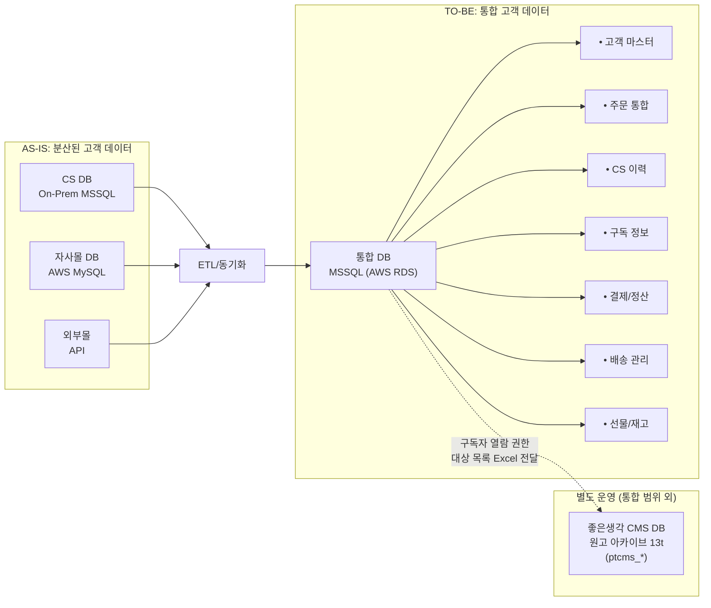
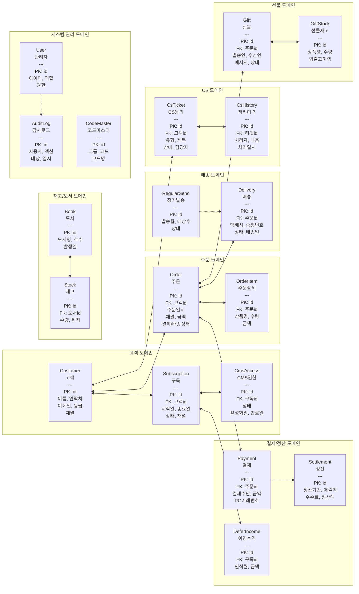
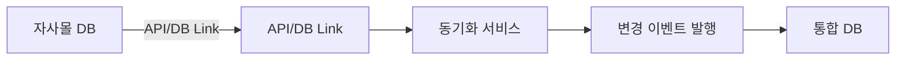
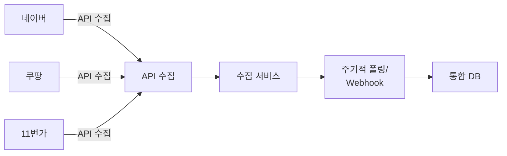
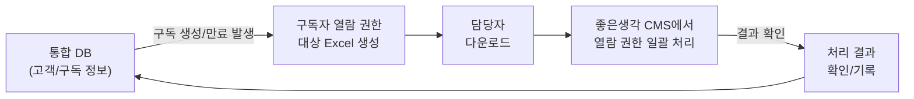

# 데이터 통합 모델

외부 채널 데이터를 포용하는 통합 DB 스키마(ERD) 설계

---

## 데이터 통합 전략

### AS-IS → TO-BE 전환

---

## TO-BE ERD (개념 모델)

### 핵심 엔터티

---

## 테이블 정의 (초안)

### 1. Customer (고객)

| 컬럼명 | 타입 | 필수 | 설명 |
|--------|------|:----:|------|
| id | BIGINT IDENTITY(1,1) | PK | 고객 ID |
| customer_code | NVARCHAR(20) | UK | 고객 코드 |
| name | NVARCHAR(100) | Y | 이름 |
| phone | VARCHAR(20) | Y | 연락처 |
| email | VARCHAR(100) | | 이메일 |
| address | NVARCHAR(MAX) | | 주소 |
| grade | NVARCHAR(20) | | 등급 |
| primary_channel | VARCHAR(20) | | 최초 유입 채널 |
| created_at | DATETIME2 | Y | 생성일시 |
| updated_at | DATETIME2 | Y | 수정일시 |

### 2. Subscription (구독)

| 컬럼명 | 타입 | 필수 | 설명 |
|--------|------|:----:|------|
| id | BIGINT IDENTITY(1,1) | PK | 구독 ID |
| customer_id | BIGINT | FK | 고객 ID |
| product_type | NVARCHAR(50) | Y | 상품 유형 |
| start_date | DATE | Y | 시작일 |
| end_date | DATE | Y | 종료일 |
| status | VARCHAR(20) | Y | 상태 |
| channel | VARCHAR(20) | Y | 가입 채널 |
| created_at | DATETIME2 | Y | 생성일시 |

### 3. Order (주문)

| 컬럼명 | 타입 | 필수 | 설명 |
|--------|------|:----:|------|
| id | BIGINT IDENTITY(1,1) | PK | 주문 ID |
| order_code | VARCHAR(30) | UK | 주문 코드 |
| customer_id | BIGINT | FK | 고객 ID |
| channel | VARCHAR(20) | Y | 주문 채널 |
| order_date | DATETIME2 | Y | 주문일시 |
| total_amount | DECIMAL(12,2) | Y | 총금액 |
| payment_status | VARCHAR(20) | Y | 결제상태 |
| delivery_status | VARCHAR(20) | | 배송상태 |
| external_order_id | VARCHAR(50) | | 외부 주문번호 |
| created_at | DATETIME2 | Y | 생성일시 |

---

## 데이터 표준화

### 코드 표준

| 도메인 | 코드 | 값 |
|--------|------|-----|
| 주문채널 | CHANNEL | OWN_MALL, NAVER, COUPANG, SPONSOR |
| 결제상태 | PAY_STATUS | PENDING, PAID, REFUNDED, CANCELLED |
| 결제수단 | PAY_METHOD | CREDIT_CARD, BANK_TRANSFER, GIRO, VIRTUAL_ACCOUNT |
| 배송상태 | DELIV_STATUS | READY, SHIPPED, IN_TRANSIT, DELIVERED, RETURNED |
| 배송사 | CARRIER | POST_OFFICE, CJ_LOGISTICS |
| 구독상태 | SUBS_STATUS | ACTIVE, EXPIRED, CANCELLED, SUSPENDED |
| CS유형 | CS_TYPE | INQUIRY, COMPLAINT, REFUND, SUBSCRIPTION, DELIVERY, ETC |
| 선물상태 | GIFT_STATUS | ORDERED, SHIPPED, DELIVERED, CANCELLED |
| 사용자역할 | USER_ROLE | SUPER_ADMIN, ADMIN, CS_AGENT, OPERATOR, CALLCENTER |

### 데이터 정제 규칙

| 항목 | 규칙 |
|------|------|
| 연락처 | 숫자만, 11자리 (010XXXXXXXX) |
| 이메일 | 소문자 변환, 유효성 검증 |
| 이름 | 공백 제거, 특수문자 제거 |
| 주소 | 우편번호 분리 저장 |

---

## 데이터 동기화 방안

### 1. 자사몰 연동

### 2. 외부몰 연동

### 3. 좋은생각 CMS 연동 (구독자 열람 권한 — Excel 기반)

> **좋은생각 CMS**는 월간지 발행 원고를 아카이브하고 참고하기 위한 시스템으로, CS 시스템과는 **목적이 다르며 분리 운영**됩니다. CS 시스템에서 CMS로의 유일한 접점은 **구독자 열람 권한 대상 목록 전달**(Excel)이며, 데이터 통합 대상이 아닙니다.

---

## 마이그레이션 고려사항

### 데이터 매핑

| AS-IS (On-Prem MSSQL + AWS MySQL) | TO-BE (AWS RDS for SQL Server 통합) | 변환 규칙 |
|-----------------------------------|-------------------------------------|----------|
| PT_Customer (On-Prem, 48컬럼) | customer | 컬럼 정리, 정규화 |
| PT_Subscribe (On-Prem) | subscription | 구독 유형별 분리 |
| PTM_Orders / PT_Finance (혼재) | order + payment | 주문-결제 분리 |
| PT_Councel_History (On-Prem) | cs_ticket + cs_history | 티켓-이력 분리 |
| PTM_ShippingInfos + PT_SendHistory | delivery | 배송 통합 |
| PT_GiftStock + PT_Stock | gift + stock | 선물-재고 분리 |
| 홈페이지 DB (AWS MySQL 63t) | 통합 DB로 이관 | 고객 매칭 후 이관 |

> **참고**: 좋은생각 CMS DB (ptcms_* 13t)는 원고 아카이브 전용으로, CS 통합 DB 이관 범위에 포함되지 않습니다. CMS 데이터 통합은 웹사이트 Admin과의 2단계 과제입니다.

### 중복 데이터 처리

- 고객: 연락처 + 이름 기준 매칭
- 주문: 외부 주문번호 기준 중복 체크

---

## 작성 이력

| 날짜 | 작성자 | 변경 내용 |
|------|--------|----------|
| YYYY-MM-DD | - | 초안 작성 |
| 2026-04-20 | ISP팀 | 3장 기능요건 정합성 반영: DB 엔진 PostgreSQL→MSSQL(AWS RDS) 통일, 데이터타입 MSSQL 표준으로 전환 (BIGINT IDENTITY, DATETIME2, NVARCHAR), ERD 4도메인→11도메인 확장 (배송/결제정산/선물/재고도서/시스템관리 추가), 마이그레이션 매핑 테이블 구체화 (On-Prem MSSQL+AWS MySQL→AWS RDS 통합), 코드 표준 확장 (결제수단/배송사/선물상태/사용자역할 추가) |
| 2026-04-20 | ISP팀 | 외부 연동 현실성 반영: CMS 연동 Mermaid를 API 기반→Excel 기반 흐름으로 수정 |
| 2026-04-20 | ISP팀 | CMS 개념 보정: AS-IS 다이어그램에서 CMS DB(ptcms_* 13t)를 CS 통합 DB 범위에서 분리, CMS 연동 섹션에 좋은생각 CMS 용도(원고 아카이브) 명시, 마이그레이션 범위에서 CMS 제외 명시 |
