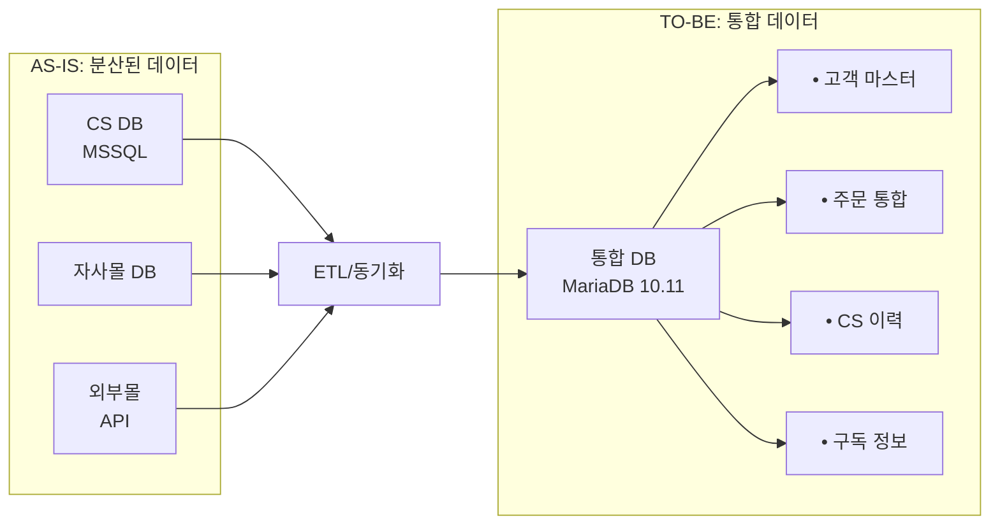
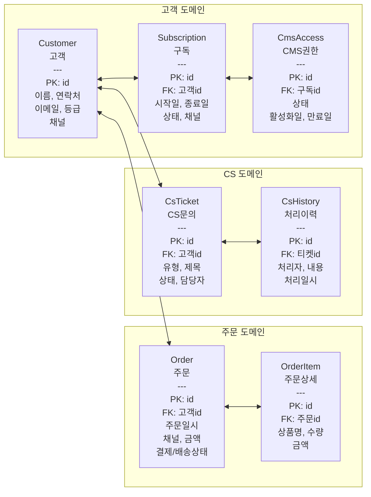
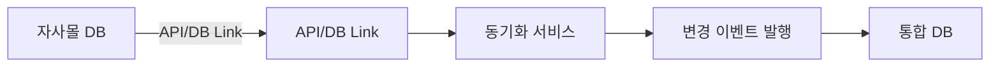
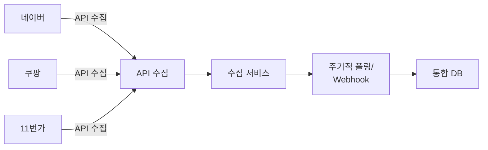
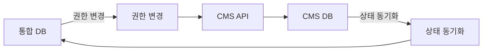

# 데이터 통합 모델

외부 채널 데이터를 포용하는 통합 DB 스키마(ERD) 설계

:::note[ISP 단계 산출물 — 제한사항]
본 데이터 통합 모델은 **ISP 단계**에서 다음 자료를 기반으로 작성되었습니다:
- 고객사 제공 문서 (Google Drive): 고객관리 프로그램 테이블목록 및 구조정의.xlsx, 고객관리 프로그램_DB_정의서.docx, TOTAL_ERD.pdf, 홈페이지 DB 테이블 정의서.xlsx, CMS 테이블/프로시저 정의서.xlsx
- DB 역공학 분석 결과: CS DB 75t + 홈페이지 DB 63t + CMS 13t = 151 tables
- 업무 인터뷰 및 현행 시스템 분석

**최종 개발환경이 제공되지 않은 상태**이므로, 개발 과업 착수 시 실제 DB 스키마 덤프 기반으로 **상세 ERD를 최종 확정**해야 합니다. 특히 다음 항목의 보정이 필요합니다:
- 151개 테이블의 개별 컬럼 레벨 매핑 검증
- 56개 비즈니스 로직 객체(20 SP + 14 Function + 15 Trigger + 7 SP) 전환 상세 설계
- 인덱스/제약조건/트리거 전환 명세
:::

---

## 데이터 통합 전략

### AS-IS → TO-BE 전환

---

## TO-BE ERD (개념 모델)

### 핵심 엔터티

---

## 테이블 정의 (초안)

### 1. Customer (고객)

| 컬럼명 | 타입 | 필수 | 설명 |
|--------|------|:----:|------|
| id | BIGINT AUTO_INCREMENT | PK | 고객 ID |
| customer_code | VARCHAR(20) | UK | 고객 코드 |
| name | VARCHAR(100) | Y | 이름 |
| phone | VARCHAR(20) | Y | 연락처 |
| email | VARCHAR(100) | | 이메일 |
| address | TEXT | | 주소 |
| grade | VARCHAR(20) | | 등급 |
| primary_channel | VARCHAR(20) | | 최초 유입 채널 |
| created_at | TIMESTAMP | Y | 생성일시 |
| updated_at | TIMESTAMP | Y | 수정일시 |

### 2. Subscription (구독)

| 컬럼명 | 타입 | 필수 | 설명 |
|--------|------|:----:|------|
| id | BIGINT AUTO_INCREMENT | PK | 구독 ID |
| customer_id | BIGINT | FK | 고객 ID |
| product_type | VARCHAR(50) | Y | 상품 유형 |
| start_date | DATE | Y | 시작일 |
| end_date | DATE | Y | 종료일 |
| status | VARCHAR(20) | Y | 상태 |
| channel | VARCHAR(20) | Y | 가입 채널 |
| created_at | TIMESTAMP | Y | 생성일시 |

### 3. Order (주문)

| 컬럼명 | 타입 | 필수 | 설명 |
|--------|------|:----:|------|
| id | BIGINT AUTO_INCREMENT | PK | 주문 ID |
| order_code | VARCHAR(30) | UK | 주문 코드 |
| customer_id | BIGINT | FK | 고객 ID |
| channel | VARCHAR(20) | Y | 주문 채널 |
| order_date | TIMESTAMP | Y | 주문일시 |
| total_amount | DECIMAL(12,2) | Y | 총금액 |
| payment_status | VARCHAR(20) | Y | 결제상태 |
| delivery_status | VARCHAR(20) | | 배송상태 |
| external_order_id | VARCHAR(50) | | 외부 주문번호 |
| created_at | TIMESTAMP | Y | 생성일시 |

---

## 데이터 표준화

### 코드 표준

| 도메인 | 코드 | 값 |
|--------|------|-----|
| 주문채널 | CHANNEL | OWN_MALL, NAVER, COUPANG, SPONSOR |
| 결제상태 | PAY_STATUS | PENDING, PAID, REFUNDED, CANCELLED |
| 배송상태 | DELIV_STATUS | READY, SHIPPED, DELIVERED |
| 구독상태 | SUBS_STATUS | ACTIVE, EXPIRED, CANCELLED |
| CS유형 | CS_TYPE | INQUIRY, COMPLAINT, REFUND, ETC |

### 데이터 정제 규칙

| 항목 | 규칙 |
|------|------|
| 연락처 | 숫자만, 11자리 (010XXXXXXXX) |
| 이메일 | 소문자 변환, 유효성 검증 |
| 이름 | 공백 제거, 특수문자 제거 |
| 주소 | 우편번호 분리 저장 |

---

## 데이터 동기화 방안

### 1. 자사몰 연동

### 2. 외부몰 연동

### 3. CMS 연동

---

## 마이그레이션 고려사항

### 데이터 매핑

| AS-IS (MSSQL) | TO-BE (MariaDB) | 변환 규칙 |
|---------------|-------------------|----------|
| PT_Customer (고객 마스터) | customer | cust_cd → customer_code, 연락처 정규화 (숫자 11자리), 주소 분리 저장 |
| PT_Subscribe (구독 정보) | subscription | subs_cd → id, 구독 상태 코드 표준화 (ACTIVE/EXPIRED/CANCELLED) |
| PT_Finance (결제/입금) | payment *(신규)* | 결제수단별 분리 저장, pay_method 코드 표준화 |
| PT_SendHistory (발송 이력) | shipment *(신규)* | 배송사 코드 통합, 송장번호 형식 정규화 |
| PT_Councel_History (상담) | cs_ticket + cs_history | 상담 건 → ticket, 처리 이력 → history 분리 |
| PT_NicepayCreditcardIncome | payment | PG 결제 데이터 payment 테이블로 통합 |
| PT_DEFERINCOME_* (선수수익) | deferred_revenue *(신규)* | 이연수익 계산 로직 서비스 레이어로 전환 |
| PT_Stock / PT_GiftStock | inventory *(신규)* | 재고 유형별 통합 관리 |
| PTM_Orders (외부몰 주문) | order | external_order_id로 외부 주문번호 보존, 채널 코드 표준화 |
| PTM_Products (상품) | product *(신규)* | 자사/외부몰 상품 통합, SKU 기반 관리 |
| 홈페이지 DB 63t (회원/게시판/CMS) | 통합 CMS 관리 | CMS 플랫폼 자체 테이블로 전환, 기존 콘텐츠 마이그레이션 |
| CMS 13t (기사/태그) | 통합 CMS 관리 | CMS Entity로 전환, 태그/카테고리 구조 재설계 |

### AS-IS 테이블 통합 규모

| 영역 | AS-IS 테이블 수 | TO-BE 예상 테이블 수 | 비고 |
|------|:-:|:-:|------|
| 고객관리 (CS DB) | 75 | ~25-30 | 정규화 + 중복 제거 |
| 홈페이지 (Web DB) | 63 | CMS 내장 | CMS 플랫폼 자체 테이블 활용 |
| CMS | 13 | CMS 내장 | CMS Entity 통합 |
| 신규 (외부몰/재고 등) | — | ~10 | 자동화 지원 테이블 |
| **합계** | **151** | **~35-40 + CMS** | 개발 착수 시 확정 |

### 중복 데이터 처리

| 대상 | 매칭 기준 | 처리 방식 |
|------|----------|----------|
| 고객 | 연락처 + 이름 | 동일인 판정 → 마스터 레코드 병합, 이력 보존 |
| 주문 | 외부 주문번호 (external_order_id) | 중복 체크 후 무시, 변경분만 업데이트 |
| 구독 | 고객ID + 상품유형 + 기간 | 중복 구독 방지, 갱신은 기존 레코드 상태 변경 |

---

## 작성 이력

| 날짜 | 작성자 | 변경 내용 |
|------|--------|----------|
| 2026-02-23 | - | 초안 작성 (개념 모델, 테이블 정의 초안) |
| 2026-04-23 | 김명직 | AS-IS→TO-BE 데이터 매핑 12건 작성 (고객사 제공 DB 정의서 기반), 테이블 통합 규모 산정, 중복 데이터 처리 기준 정의, ISP 단계 제한사항 명시 (최종 개발환경 미제공) |
