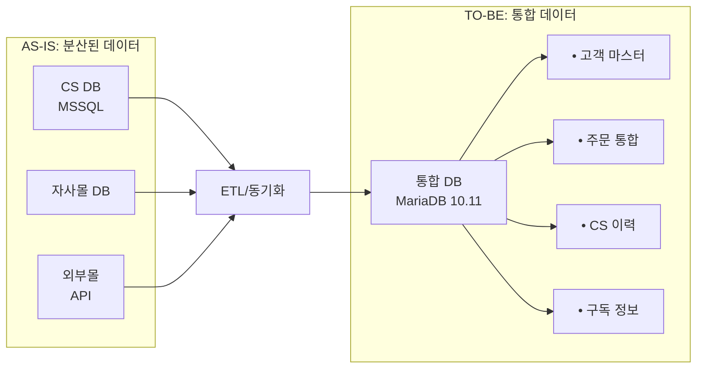
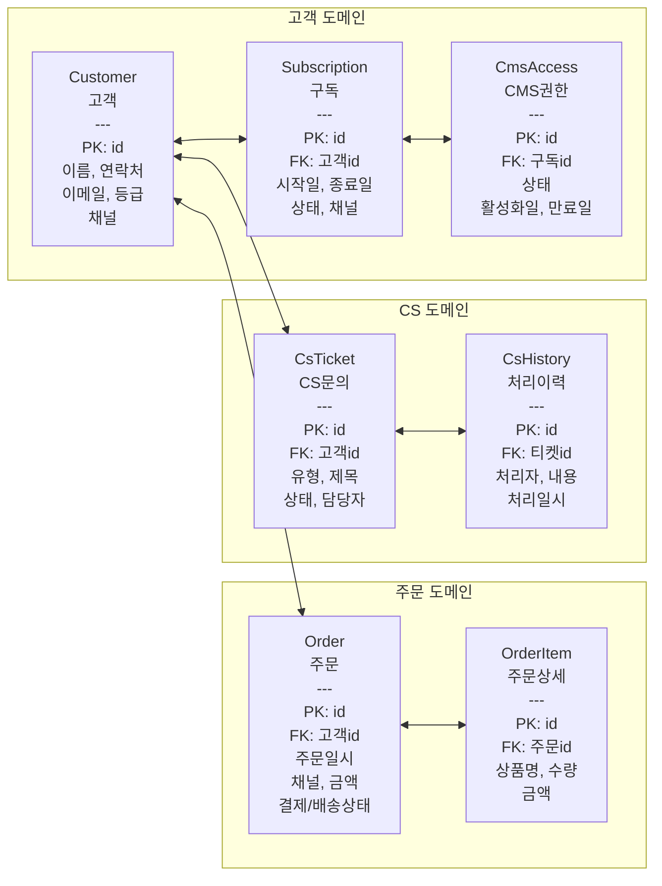
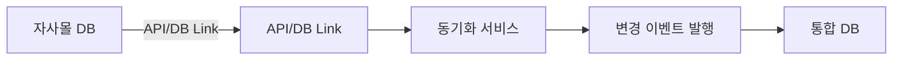
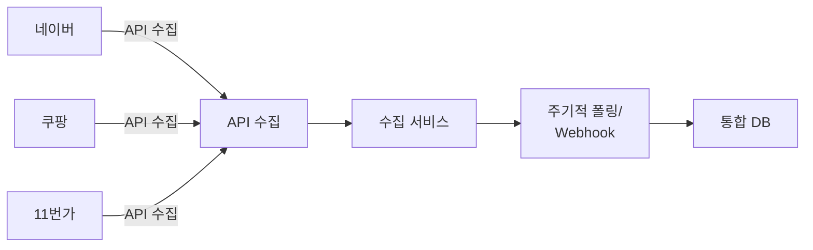
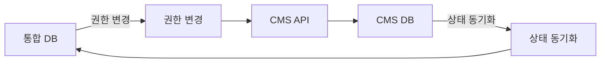

# 데이터 통합 모델

외부 채널 데이터를 포용하는 통합 DB 스키마(ERD) 설계

:::note[ISP 단계 산출물 — 제한사항]
본 데이터 통합 모델은 **ISP 단계**에서 다음 자료를 기반으로 작성되었습니다:
- 고객사 제공 문서 (Google Drive): 고객관리 프로그램 테이블목록 및 구조정의.xlsx, 고객관리 프로그램_DB_정의서.docx, TOTAL_ERD.pdf, 홈페이지 DB 테이블 정의서.xlsx, CMS 테이블/프로시저 정의서.xlsx
- DB 역공학 분석 결과: CS DB 75t + 홈페이지 DB 63t + CMS 13t = 151 tables
- 업무 인터뷰 및 현행 시스템 분석

**최종 개발환경이 제공되지 않은 상태**이므로, 개발 과업 착수 시 실제 DB 스키마 덤프 기반으로 **상세 ERD를 최종 확정**해야 합니다. 특히 다음 항목의 보정이 필요합니다:
- 151개 테이블의 개별 컬럼 레벨 매핑 검증
- 56개 비즈니스 로직 객체(20 SP + 14 Function + 15 Trigger + 7 SP) 전환 상세 설계
- 인덱스/제약조건/트리거 전환 명세
:::

---

## 데이터 통합 전략

### AS-IS → TO-BE 전환

---

## TO-BE ERD (개념 모델)

### 핵심 엔터티

---

## 테이블 정의 (초안)

### 1. Customer (고객)

| 컬럼명 | 타입 | 필수 | 설명 |
|--------|------|:----:|------|
| id | BIGINT AUTO_INCREMENT | PK | 고객 ID |
| customer_code | VARCHAR(20) | UK | 고객 코드 |
| name | VARCHAR(100) | Y | 이름 |
| phone | VARCHAR(20) | Y | 연락처 |
| email | VARCHAR(100) | | 이메일 |
| address | TEXT | | 주소 |
| grade | VARCHAR(20) | | 등급 |
| primary_channel | VARCHAR(20) | | 최초 유입 채널 |
| created_at | TIMESTAMP | Y | 생성일시 |
| updated_at | TIMESTAMP | Y | 수정일시 |

### 2. Subscription (구독)

| 컬럼명 | 타입 | 필수 | 설명 |
|--------|------|:----:|------|
| id | BIGINT AUTO_INCREMENT | PK | 구독 ID |
| customer_id | BIGINT | FK | 고객 ID |
| product_type | VARCHAR(50) | Y | 상품 유형 |
| start_date | DATE | Y | 시작일 |
| end_date | DATE | Y | 종료일 |
| status | VARCHAR(20) | Y | 상태 |
| channel | VARCHAR(20) | Y | 가입 채널 |
| created_at | TIMESTAMP | Y | 생성일시 |

### 3. Order (주문)

| 컬럼명 | 타입 | 필수 | 설명 |
|--------|------|:----:|------|
| id | BIGINT AUTO_INCREMENT | PK | 주문 ID |
| order_code | VARCHAR(30) | UK | 주문 코드 |
| customer_id | BIGINT | FK | 고객 ID |
| channel | VARCHAR(20) | Y | 주문 채널 |
| order_date | TIMESTAMP | Y | 주문일시 |
| total_amount | DECIMAL(12,2) | Y | 총금액 |
| payment_status | VARCHAR(20) | Y | 결제상태 |
| delivery_status | VARCHAR(20) | | 배송상태 |
| external_order_id | VARCHAR(50) | | 외부 주문번호 |
| created_at | TIMESTAMP | Y | 생성일시 |

---

## 데이터 표준화

### 코드 표준

| 도메인 | 코드 | 값 |
|--------|------|-----|
| 주문채널 | CHANNEL | OWN_MALL, NAVER, COUPANG, SPONSOR |
| 결제상태 | PAY_STATUS | PENDING, PAID, REFUNDED, CANCELLED |
| 배송상태 | DELIV_STATUS | READY, SHIPPED, DELIVERED |
| 구독상태 | SUBS_STATUS | ACTIVE, EXPIRED, CANCELLED |
| CS유형 | CS_TYPE | INQUIRY, COMPLAINT, REFUND, ETC |

### 데이터 정제 규칙

| 항목 | 규칙 |
|------|------|
| 연락처 | 숫자만, 11자리 (010XXXXXXXX) |
| 이메일 | 소문자 변환, 유효성 검증 |
| 이름 | 공백 제거, 특수문자 제거 |
| 주소 | 우편번호 분리 저장 |

---

## 데이터 동기화 방안

### 1. 자사몰 연동

### 2. 외부몰 연동

### 3. CMS 연동

---

## 마이그레이션 고려사항

### AS-IS 테이블 전수 조사 결과

> 출처: 고객사 Google Drive 제공 문서 — `고객관리 프로그램 테이블목록 및 구조정의.xlsx`, `홈페이지 DB 테이블 정의서(리뉴얼).xlsx`, `CMS 테이블,프로시저 정의서.xlsx`

#### CS DB (MSSQL, 75 tables)

| 도메인 | AS-IS 테이블 | 설명 | TO-BE 매핑 |
|--------|-------------|------|-----------|
| **고객** | PT_Customer (52컬럼) | 고객 마스터 | → customer |
| | PT_Employee | 사원 (담당자) | → user (CMS 사용자) |
| | PT_Nation | 국가 | → 코드 테이블 통합 |
| **구독** | PT_Subscribe (23컬럼) | 구독접수 | → subscription |
| | PT_Receiver (45컬럼) | 받는사람 (구독 수신자) | → subscription_receiver |
| | PT_Bundle | 꾸러미 신청 | → subscription 옵션으로 통합 |
| **결제/정산** | PT_Finance (22컬럼) | 입금/환불 | → payment |
| | PT_Giro (14컬럼) | 지로 | → payment (pay_method=GIRO) |
| | PT_NicepayCreditcardIncome (18컬럼) | 나이스페이 카드매출 | → payment (pay_method=CARD) |
| | PT_NicepayVirtualAccount (6컬럼) | 나이스페이 가상계좌 | → payment (pay_method=VBANK) |
| | PT_NicepayVirtualAccountIncome | 가상계좌 매출 | → payment 통합 |
| | PT_NicepayToSettlementCodeMap | PG 코드 매핑 | → 코드 테이블 통합 |
| | PT_SettlementMethod | 결제코드 정보 | → 코드 테이블 통합 |
| | PT_Cash_Receipt | 현금영수증 | → cash_receipt |
| | PT_Tax_invoice | 세금계산서 | → tax_invoice |
| | PT_Deposit (24컬럼) / PT_Deposit_History | 입금관리 | → deposit |
| | PT_UnknownDeposit / PT_UnknownRefund | 미결 입금/환불 | → payment (status=UNMATCHED) |
| | PT_RefundRequest (44컬럼) | 환불 요청 | → refund_request |
| | PT_Promise | 입금 약속 | → payment_promise |
| **선수수익** | PT_DEFERINCOME_MST (37컬럼) | 선수수익 원장 | → deferred_revenue |
| | PT_DEFERINCOME_INFO (48컬럼) | 선수수익 거래내역 | → deferred_revenue_tx |
| | PT_DEFERINCOME_STAT | 선수수익 통계 | → 서비스 레이어 (리포트 쿼리) |
| | PT_DEFERINCOME_MST_TEMP | 선수수익 임시 | → 불필요 (배치 처리로 대체) |
| **발송/배송** | PT_SendHistory (35컬럼) | 발송 이력 | → shipment |
| | PT_RegularSend_Info | 정규 발송 배치 정보 | → shipment_batch |
| | PT_SendDMDataLog / _SEQ / _MushLog / _TempTable | DM 발송 자료 이력 | → shipment_log (통합) |
| | PT_BookResend | 재발송 처리 | → shipment (type=RESEND) |
| | PT_BookReturned | 반송 | → shipment (status=RETURNED) |
| **상품/재고** | PT_Book (30컬럼) | 도서 | → product |
| | PT_BookPrice (16컬럼) | 도서 가격 | → product_price |
| | PT_Item | 재고 아이템 | → product 통합 |
| | PT_Stock (19컬럼) / PT_Stock_History | 재고 관리 | → inventory / inventory_log |
| | PT_GiftStock / PT_GiftStockLogs | 선물 재고 | → inventory (type=GIFT) |
| | PT_GiftSend (21컬럼) | 선물 발송 | → gift_shipment |
| **CS/상담** | PT_Councel_History (10컬럼) | 상담 이력 | → cs_ticket + cs_history |
| | PT_SMSText / PT_SMSHistory | SMS 상용구/발송이력 | → notification / notification_log |
| **거래처** | PT_Company (49컬럼) / _File / _History | 거래처 관리 | → company |
| | PT_Group / PT_Group_History | 그룹 관리 | → company_group |
| **시스템** | PT_Auth / PT_MENU_authority / PT_Button_authority | 권한 관리 | → CMS Role/Permission 전환 |
| | PT_Menu / PT_MgtProgram / PT_MgtProgramBtn | 메뉴/프로그램 관리 | → CMS 메뉴 시스템 전환 |
| | PT_Account / PT_Account_History | 계정 코드 | → 코드 테이블 통합 |
| | PT_CodeMaster / PT_CodeDetail | 공통 코드 | → code_master / code_detail |
| | PT_DataMonitoringLog / PT_LogLockKill | 모니터링/로그 | → CMS 로그 시스템 |
| | PT_SendProc_ERR | 선수수익 처리 오류 | → error_log |
| **레거시/임시** | PT_Admin07 / _sq | 구독만료 조회용 임시 | → 불필요 (쿼리로 대체) |
| | PT_Coupon / PT_WebPointData | 웹서비스용 | → 홈페이지 통합 시 검토 |
| | PT_D060P / PT_D060PW | 지로 임시 | → 불필요 (배치로 대체) |
| | PT_Temp_Report_01 / _02 / _03 | 리포트 임시 | → 불필요 (쿼리로 대체) |
| | PT_ChangeEmployee | 등록자 변경 요청 | → audit_log |
| | PT_Dawn_Sunbeam_Donation | 새벽햇살 기부 | → donation |
| | PT_Temp_Nation | 해외발송 국가 임시 | → 코드 테이블 통합 |
| | PT_SalesCancel | 매출 취소 | → payment (type=CANCEL) |

#### 홈페이지 DB (MSSQL, 60 tables)

| 도메인 | AS-IS 테이블 (주요) | TO-BE 매핑 |
|--------|-------------------|-----------|
| **주문/결제** | PTM_Orders, PTM_Order_Items, PTM_Regular_Orders, PTM_Regulars | → order, order_item (CS DB와 통합) |
| | PTM_PaymentLogs, PTM_Payment_Infos, PTM_VbankItems | → payment 통합 |
| | PTM_CartItems, PTM_CartItemLogs | → cart (신규) |
| | PTM_OrderItemRegLogs, PTM_OrderSessionInfos | → 불필요 (디버그용) |
| **상품** | PTM_Products, PTM_ProductOptions, PTM_ProductImages | → product, product_option, product_image |
| | PTM_ProductGroups, PTM_ProductGroupImages | → product_group |
| | PTM_ProductCategories, PTM_Categories, PTM_Goods_Categories, PTM_Goods_Category_Items | → category (통합) |
| | PTM_ProductTags, PTM_Tags | → tag (통합) |
| | PTM_ProductGifts, PTM_GiftItems, PTM_GiftProducts | → product_gift |
| | PTM_ProductSoldOuts, PTM_ProductOptionStockLogs | → inventory 연동 |
| | PTM_ProductDeliveryDates, PTM_RegularProducts | → product 옵션 |
| **배송** | PTM_ShippingInfos | → shipment (CS DB와 통합) |
| | PTM_DeliveryFees, PTM_DeliveryFees_CJ | → delivery_fee |
| **선물주문** | PTM_GiftOrders, PTM_GiftOrder_Items | → order (type=GIFT) |
| **콘텐츠** | PTM_Blogs, PTM_Blog_Categories, PTM_Blog_Comments | → CMS 콘텐츠 |
| | PTM_Events, PTM_GoodsIntroduces | → CMS 콘텐츠 |
| | PTM_MainBanners, PTM_MainPages, PTM_MainSNS_Contents | → CMS 콘텐츠 |
| | PTM_Main_Boards, PTM_Main_Notices | → CMS 콘텐츠 |
| | PTM_Wallpapers, PTM_Wallpaper_Comments, PTM_Main_Wallpapers | → CMS 콘텐츠 |
| | PTM_Collect_Banners | → CMS 콘텐츠 |
| **회원** | PTM_Visitors, PTM_VerifyCodes, PTM_VCardInfos | → CMS 회원 시스템 |
| | PTM_SunshineManagements | → CMS 관리 |
| **쿠폰** | PTM_Coupons, PTM_Coupon_Meta, PTM_Coupon_Products, PTM_Coupon_Hists | → coupon (신규) |
| **알림** | PTM_Notifications, PTM_NewsLetters | → notification |
| **시스템** | PTM_ApiErrorLogs, PTM_ServerErrorLogs | → CMS 로그 시스템 |

#### CMS DB (MSSQL, 16 tables)

| AS-IS 테이블 | 설명 | TO-BE 매핑 |
|-------------|------|-----------|
| ptcms_contents | 콘텐츠 (기사) | → CMS Entity (콘텐츠 타입) |
| ptcms_subject / ptcms_subject_ext | 코너/주제 | → CMS 택소노미 (카테고리) |
| ptcms_books / ptcms_books_loan | 도서/대여 | → CMS Entity (도서 타입) |
| ptcms_wise / ptcms_wise_books / ptcms_wise_writer | 명언/참고도서/작가 | → CMS Entity (명언 타입) |
| ptcms_writer | 작가 | → CMS Entity (작가 타입) |
| ptcms_copyright | 저작권 | → CMS Entity 필드 |
| ptcms_econtents | 전자 콘텐츠 | → CMS Entity (디지털 콘텐츠) |
| ptcms_image | 이미지 | → CMS 미디어 라이브러리 |
| ptcms_member / ptcms_member_log | 회원/접속로그 | → CMS 사용자 + cms_access 연동 |
| ptcms_keyword_log / ptcms_keyword_sum | 검색 키워드 | → CMS 검색 모듈 |

### AS-IS 비즈니스 로직 전환 매핑

#### Stored Procedure (20건)

| AS-IS SP | 설명 | TO-BE 전환 |
|----------|------|-----------|
| sp_PT_SendBookData | 도서 발송 데이터 집계 | 배치 스케줄러 (발송 모듈) |
| sp_Extend_gudoc_update | 연장구독 구분 업데이트 | 구독 모듈 서비스 레이어 |
| SP_PT_Customer_Address_U_nation | 주소 업데이트 | RESTful API (PATCH /api/customers) |
| SP_PT_Customer_Shopping_U1/U2 | 홈페이지 구독 → 고객 업데이트 | 불필요 (단일 DB, 동일 고객 테이블) |
| sp_PTD060P / tClear / tClear2 | 지로 용지 작성/삭제 | 지로 모듈 서비스 레이어 |
| sp_PTD060PWDUEUPDATE | 지로 납입기간 업데이트 | 지로 모듈 서비스 레이어 |
| sp_PTGIROSENDUPDATE | 지로 발송일자 업데이트 | 지로 모듈 서비스 레이어 |
| sp_PT_SendBookDataMush/Merge/Check | 발송 데이터 재처리/병합/체크 | 배치 스케줄러 (발송 모듈) |
| sp_PT_McouponStatus | 모바일 쿠폰 상태 조회 | 쿠폰 모듈 서비스 레이어 |
| sp_PT_CouponSend/Resend | 웹 쿠폰 발송/재발송 | 쿠폰 모듈 + 알림 모듈 |
| sp_PT_DailySendBookDataParsing | 발송 리포트 임시데이터 생성 | 리포트 모듈 쿼리 (임시테이블 불필요) |
| sp_PT_DailySendGiftDataParsing | 선물 리포트 임시데이터 생성 | 리포트 모듈 쿼리 |
| sp_PT_DataMonitoring/_DeferStat | DB 모니터링 | CMS 로그 시스템 + 대시보드 |

#### Function (14건)

| AS-IS Function | 설명 | TO-BE 전환 |
|----------------|------|-----------|
| func_dailySendGift/HO | 일일실적 선물/월호 카운트 | 리포트 모듈 쿼리 |
| func_GetNumeric | 전화번호 숫자 추출 | 데이터 정제 유틸리티 (마이그레이션 시 일괄 적용) |
| func_sendBookHO | 발송 호수 자동 계산 | 발송 모듈 서비스 레이어 |
| func_sendBookSubscribeToYM | 발송 라벨 To_YM 계산 | 발송 모듈 서비스 레이어 |
| func_bookResendSendItemNm | 재발송 발송품명 | 발송 모듈 서비스 레이어 |
| func_sendBookCountMod/sendGiftNmMod/sendProdNmMod | 발송 품명 수량 수정 | 발송 모듈 서비스 레이어 |
| func_dailySendGiftDataParsing/BookDataParsing | 발송 데이터 파싱 | 리포트 모듈 쿼리 |
| func_sendBookReceiverPeriod | 수신자 구독기간 조회 | 구독 모듈 서비스 레이어 |
| func_getSendGiftNmCheck | 택배 선물 체크 | 발송 모듈 서비스 레이어 |
| func_foreignerSendBookMissCheck | 해외발송 누락 체크 | 발송 모듈 검증 로직 |

#### Trigger (15건)

| AS-IS Trigger | 대상 테이블 | 설명 | TO-BE 전환 |
|---------------|-----------|------|-----------|
| TR_PT_SUBSCRIBE_IXX/XUQ/XUX | PT_Subscribe | 구독↔지로 자동 연동 | 이벤트 기반 처리 (Entity hook) |
| TR_PT_RECEIVER_IXX/XXD | PT_Receiver | 구독 카운트 수정 | 이벤트 기반 처리 |
| tr_PT_GiftSend_SendTY | PT_GiftSend | 미입금 선물 정상 처리 | 이벤트 기반 처리 |
| TR_PT_GIFTSEND_IXX/XXD | PT_GiftSend | 선물↔지로 SEQ 연동 | 이벤트 기반 처리 |
| TR_PT_GiftSend__Stock | PT_GiftSend | 선물 재고 변경 | 이벤트 기반 재고 관리 |
| TR_PT_GiftSend__PreOrder | PT_GiftSend | 예약 선물 대기 처리 | 이벤트 기반 처리 |
| TRIGGER_Finance_Insert | PT_Finance | 입금 시 자동 처리 | 이벤트 기반 (결제 완료 hook) |
| tr_fillOnlyNumTel | PT_Customer | 전화번호 숫자 인덱싱 | 불필요 (마이그레이션 시 정규화 완료) |
| tr_updateGroupCode | PT_Company | 거래처 그룹코드 연동 | 이벤트 기반 처리 |
| tr_fillGroupCode/tr_updateItemCode | PT_Stock | 재고 그룹/아이템 자동 등록 | 이벤트 기반 처리 |

### AS-IS → TO-BE 테이블 통합 규모

| 영역 | AS-IS 테이블 수 | TO-BE 예상 테이블 수 | 비고 |
|------|:-:|:-:|------|
| 고객관리 (CS DB) | 75 | ~25-30 | 정규화 + 중복 제거 |
| 홈페이지 (Web DB) | 63 | CMS 내장 | CMS 플랫폼 자체 테이블 활용 |
| CMS | 13 | CMS 내장 | CMS Entity 통합 |
| 신규 (외부몰/재고 등) | — | ~10 | 자동화 지원 테이블 |
| **합계** | **151** | **~35-40 + CMS** | 개발 착수 시 확정 |

### 중복 데이터 처리

| 대상 | 매칭 기준 | 처리 방식 |
|------|----------|----------|
| 고객 | 연락처 + 이름 | 동일인 판정 → 마스터 레코드 병합, 이력 보존 |
| 주문 | 외부 주문번호 (external_order_id) | 중복 체크 후 무시, 변경분만 업데이트 |
| 구독 | 고객ID + 상품유형 + 기간 | 중복 구독 방지, 갱신은 기존 레코드 상태 변경 |

---

## 작성 이력

| 날짜 | 작성자 | 변경 내용 |
|------|--------|----------|
| 2026-02-23 | - | 초안 작성 (개념 모델, 테이블 정의 초안) |
| 2026-04-23 | 김명직 | AS-IS→TO-BE 데이터 매핑 12건 작성 (고객사 제공 DB 정의서 기반), 테이블 통합 규모 산정, 중복 데이터 처리 기준 정의, ISP 단계 제한사항 명시 (최종 개발환경 미제공) |
