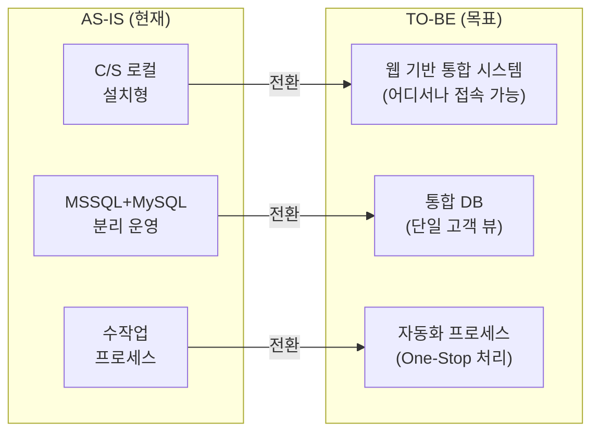
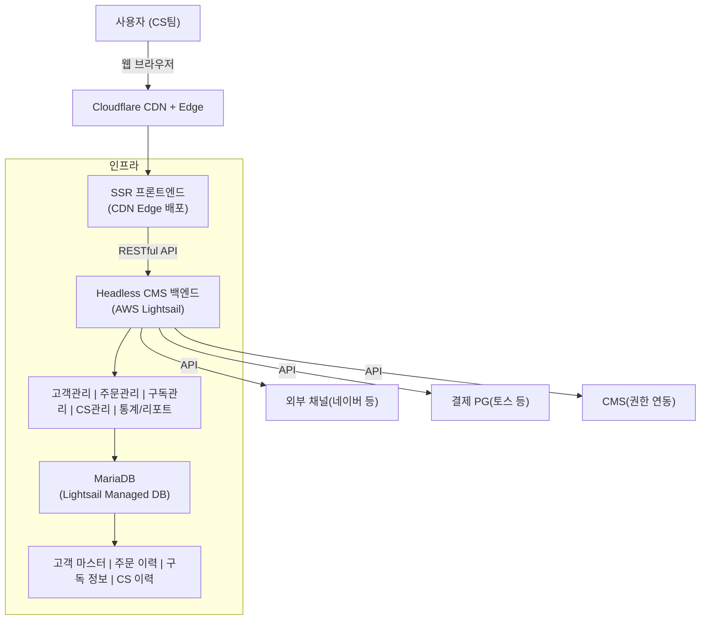

# 목표 모델 설계 (TO-BE Design)

ISP 2단계(4\~6주)에서 수행하는 목표 모델 설계 문서입니다.

---

## 아키텍처 목표

### 전환 목표

### 3대 핵심 목표

| 목표 | AS-IS 문제 | TO-BE 해결 방안 | 기대 효과 |
|------|------------|-----------------|----------|
| **1. C/S → Web 전환** | 로컬 PC에 설치된 XPlatform 기반 시스템 | 클라우드 기반 웹 Admin 시스템 구축 | 장소 제약 없이 업무 가능, 유지보수 용이 |
| **2. 데이터 통합** | MSSQL + MySQL 분리, 채널별 데이터 파편화 | 통합 DB 구축, 단일 고객 마스터 | 360° 고객 뷰, 실시간 데이터 공유 |
| **3. 프로세스 자동화** | 주문→입력→권한부여 수작업 처리 | API 연동 기반 One-Stop 자동화 | 처리 시간 단축, 오류 최소화 |

### 목표 아키텍처 개요

### 목표별 실현 방안

#### 1. C/S → Web 전환

| 항목 | 실현 방안 |
|------|----------|
| **프론트엔드** | SSR 프레임워크 + 경량 UI 프레임워크 + 유틸리티 CSS 웹 Admin 구축 |
| **백엔드** | Headless CMS (RESTful API + 커스텀 비즈니스 모듈) |
| **인프라** | AWS Lightsail (서버) + Cloudflare (CDN/Edge/R2) |
| **접근성** | HTTPS (TLS 1.3), OAuth2 인증 |

#### 2. 데이터 통합

| 항목 | 실현 방안 |
|------|----------|
| **통합 DB** | MariaDB / MySQL (오픈소스, Lightsail Managed DB) |
| **고객 마스터** | 채널별 고객 데이터 통합, 중복 제거 |
| **데이터 마이그레이션** | MSSQL 데이터 → MariaDB 이관 |
| **데이터 동기화** | 레거시 병행 운영 시 실시간 동기화 |

#### 3. 프로세스 자동화

| 항목 | 실현 방안 |
|------|----------|
| **주문 수집** | 외부 채널 API 직접 연동 (Playauto 대체) |
| **자동 입력** | 수집된 주문 데이터 자동 DB 저장 |
| **CMS 권한** | 결제 완료 시 CMS API 호출하여 자동 권한 부여 |
| **배송 연동** | 배송 정보 자동 생성 및 송장 연동 |

---

## 설계 방법론

### [아키텍처 설계 방법론](./architecture-methodology)
SW 아키텍처 설계 프로세스 및 품질 속성 기반 설계 가이드

- ASR (Architecturally Significant Requirement) 도출
- 품질 속성 정의 및 시나리오
- ADD (Attribute-Driven Design) Method
- ATAM 아키텍처 평가

### [품질 속성 시나리오](./quality-scenarios)
좋은생각 웹 시스템의 품질 속성별 구체적인 시나리오 정의

- 가용성, 성능, 보안, 변경용이성, 사용성, 운영성 시나리오
- 시나리오 우선순위 정의

### [Utility Tree](./utility-tree)
품질 속성 우선순위 분석 및 아키텍처 드라이버 식별

- 품질 속성 우선순위 매트릭스
- 아키텍처 드라이버 도출
- 품질 속성별 전략 및 Tradeoff 분석

---

## 설계 영역

### [Web 시스템 아키텍처](./web-architecture)
클라우드 기반의 웹 관리자(Admin) 시스템 구조 및 보안 정책 수립

- 시스템 아키텍처
- 기술 스택 선정
- 보안 정책

### [데이터 통합 모델](./data-integration)
외부 채널 데이터를 포용하는 통합 DB 스키마(ERD) 설계

- TO-BE ERD
- 데이터 표준화
- 마스터 데이터 관리

### [자동화 프로세스 (BPR)](./process-automation)
[주문수집 → 자동입력 → CMS권한부여 → 배송]의 One-Stop 자동화 흐름 설계

- 프로세스 재설계
- 자동화 포인트
- 예외 처리 흐름

---

## 핵심 산출물

| 산출물 | 설명 | 상태 |
|--------|------|:----:|
| TO-BE ERD (통합모델) | 통합 데이터 모델 | ⬜ |
| 요구기능정의서 (상세) | 상세 기능 명세 | ⬜ |
| 웹 어드민 화면 설계 | Wireframe | ⬜ |
| 시스템 아키텍처 설계서 | 기술 아키텍처 문서 | ⬜ |
| BPR 설계서 | 개선 프로세스 정의 | ⬜ |

---

## 설계 원칙

### 1. 확장성 (Scalability)
- CMS 모듈 기반 설계
- CDN Edge 배포로 글로벌 확장

### 2. 유연성 (Flexibility)
- RESTful API 기반 Headless 아키텍처
- 커스텀 모듈로 비즈니스 로직 분리

### 3. 보안성 (Security)
- 개인정보 보호 기준 준수 (필드 암호화)
- CMS Role/Permission + Cloudflare WAF

### 4. 사용성 (Usability)
- 경량 인터랙티브 UI + 유틸리티 CSS
- CMS 기본 Admin UI 병행 활용

---

## 일정

| 주차 | 활동 | 담당 |
|:---:|------|------|
| 4주 | 아키텍처 설계, 기술 스택 확정 | - |
| 5주 | ERD 설계, 데이터 표준화 | - |
| 6주 | BPR 설계, 화면 설계, 기능 명세 | - |
