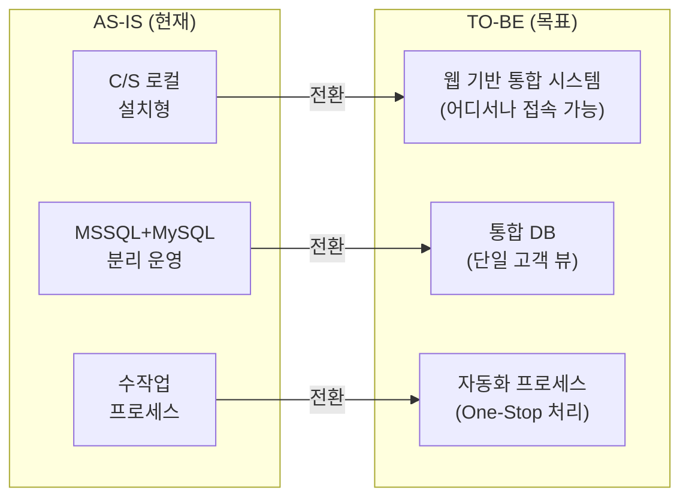
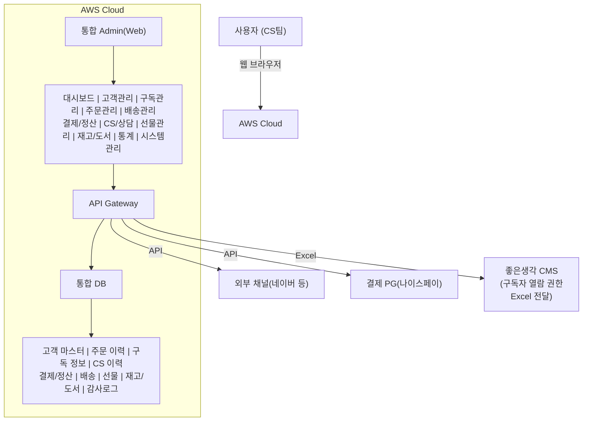

# 목표 모델 설계 (TO-BE Design)

ISP 2단계(4\~6주)에서 수행하는 목표 모델 설계 문서입니다.

---

## 아키텍처 목표

### 전환 목표

### 3대 핵심 목표

| 목표 | AS-IS 문제 | TO-BE 해결 방안 | 기대 효과 |
|------|------------|-----------------|----------|
| **1. C/S → Web 전환** | 로컬 PC에 설치된 XPlatform 기반 시스템 | 클라우드 기반 웹 Admin 시스템 구축 | 장소 제약 없이 업무 가능, 유지보수 용이 |
| **2. 데이터 통합** | MSSQL + MySQL 분리, 채널별 데이터 파편화 | MSSQL 통합 DB 구축 (AWS RDS), 단일 고객 마스터 | 360° 고객 뷰, 실시간 데이터 공유 |
| **3. 프로세스 자동화** | 주문→입력→권한부여 수작업 처리 | API 연동(현행 유지) + Excel 템플릿 간소화 | 처리 시간 단축, 오류 최소화 |

### 목표 아키텍처 개요

### 목표별 실현 방안

#### 1. C/S → Web 전환

| 항목 | 실현 방안 |
|------|----------|
| **프론트엔드** | React + Ant Design 기반 SPA로 웹 Admin 구축 |
| **백엔드** | NestJS 모놀리식 모듈 기반 API 서버 |
| **인프라** | AWS 클라우드 (기존 인프라 활용) |
| **접근성** | HTTPS 기반 보안 접속, SSO 연동 |

#### 2. 데이터 통합

| 항목 | 실현 방안 |
|------|----------|
| **통합 DB** | MSSQL 유지 (AWS RDS for SQL Server), 이관 리스크 최소화 |
| **고객 마스터** | 채널별 고객 데이터 통합, 중복 제거 |
| **데이터 마이그레이션** | On-Prem MSSQL + AWS MySQL → AWS RDS MSSQL 통합 이관 |
| **데이터 동기화** | 레거시 병행 운영 시 실시간 동기화 |

#### 3. 프로세스 자동화

| 항목 | 실현 방안 |
|------|----------|
| **주문 수집** | Playauto 경유 외부몰 API 자동 수집 (현행 유지) + Excel 업로드 |
| **자동 입력** | 수집된 주문 데이터 자동 DB 저장, Excel 업로드 파싱 |
| **CMS 권한** | 결제 완료 시 CMS 구독자 열람 권한 대상 Excel 내보내기 → 좋은생각 CMS 일괄 처리 |
| **배송 연동** | 택배사 API 자동 연동 (계약 기반, 현행 유지) |
| **ERP 연동** | 위하고 업로드용 Excel 자동 생성 (API 미제공) |

---

## 설계 방법론

### [아키텍처 설계 방법론](./architecture-methodology)
SW 아키텍처 설계 프로세스 및 품질 속성 기반 설계 가이드

- ASR (Architecturally Significant Requirement) 도출
- 품질 속성 정의 및 시나리오
- ADD (Attribute-Driven Design) Method
- ATAM 아키텍처 평가

### [품질 속성 시나리오](./quality-scenarios)
좋은생각 웹 시스템의 품질 속성별 구체적인 시나리오 정의

- 가용성, 성능, 보안, 변경용이성, 사용성, 운영성 시나리오
- 시나리오 우선순위 정의

### [Utility Tree](./utility-tree)
품질 속성 우선순위 분석 및 아키텍처 드라이버 식별

- 품질 속성 우선순위 매트릭스
- 아키텍처 드라이버 도출
- 품질 속성별 전략 및 Tradeoff 분석

---

## 설계 영역

### [Web 시스템 아키텍처](./web-architecture)
클라우드 기반의 웹 관리자(Admin) 시스템 구조 및 보안 정책 수립

- 시스템 아키텍처
- 기술 스택 선정
- 보안 정책

### [데이터 통합 모델](./data-integration)
외부 채널 데이터를 포용하는 통합 DB 스키마(ERD) 설계

- TO-BE ERD
- 데이터 표준화
- 마스터 데이터 관리

### [자동화 프로세스 (BPR)](./process-automation)
[주문수집 → 자동입력 → CMS권한부여 → 배송]의 One-Stop 자동화 흐름 설계

- 프로세스 재설계
- 자동화 포인트
- 예외 처리 흐름

---

## 핵심 산출물

| 산출물 | 설명 | 상태 |
|--------|------|:----:|
| TO-BE ERD (통합모델) | 통합 데이터 모델 | 미착수 |
| 요구기능정의서 (상세) | 상세 기능 명세 | 미착수 |
| 웹 어드민 화면 설계 | Wireframe | 미착수 |
| 시스템 아키텍처 설계서 | 기술 아키텍처 문서 | 미착수 |
| BPR 설계서 | 개선 프로세스 정의 | 미착수 |

---

## 설계 원칙

### 1. 확장성 (Scalability)
- NestJS 모듈 기반 모놀리식 설계 (점진적 MSA 분리 가능)
- 수평적 확장 가능한 구조 (ECS Fargate)

### 2. 유연성 (Flexibility)
- 모듈화된 컴포넌트
- API 기반 연동

### 3. 보안성 (Security)
- 개인정보 보호 기준 준수
- 접근 통제 및 감사 로그

### 4. 사용성 (Usability)
- 직관적인 UI/UX
- 업무 효율성 중심 설계

---

## 일정

| 주차 | 활동 | 담당 |
|:---:|------|------|
| 4주 | 아키텍처 설계, 기술 스택 확정 | - |
| 5주 | ERD 설계, 데이터 표준화 | - |
| 6주 | BPR 설계, 화면 설계, 기능 명세 | - |
