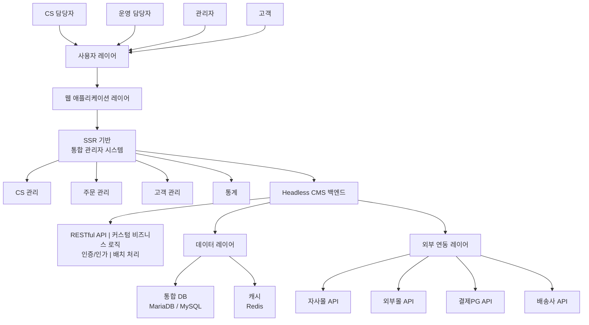
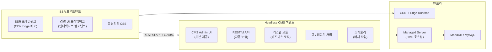
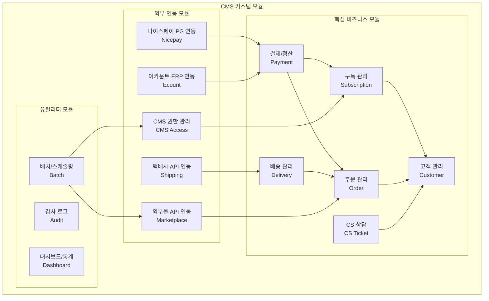
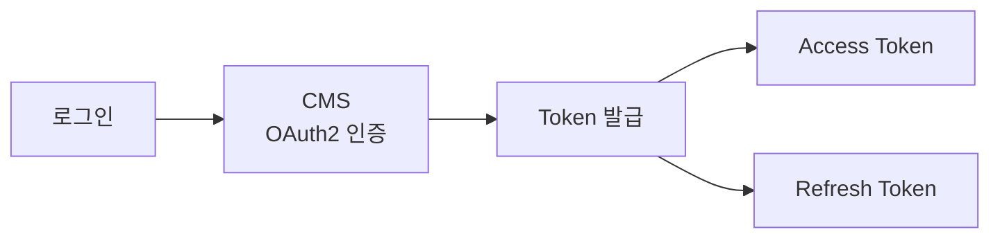
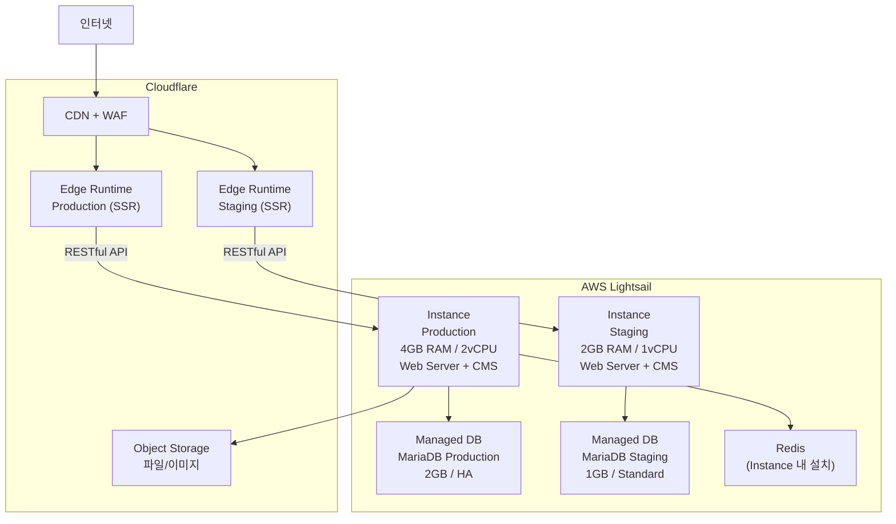

# Web 시스템 아키텍처

Headless CMS 백엔드 + SSR 프론트엔드 기반의 통합 관리자(Admin) 시스템 구조 및 보안 정책 수립

---

## 아키텍처 개요

### TO-BE 시스템 구성도



### Headless CMS 아키텍처 패턴

백엔드를 Headless CMS로 구성하여 **Admin UI, 인증/인가, RESTful API, 배치 스케줄링** 등 공통 기능을 CMS 프레임워크에서 제공받고, 비즈니스 로직은 커스텀 모듈로 구현합니다. 프론트엔드는 SSR 프레임워크로 분리하여 CDN 엣지에서 서빙합니다.



### 패턴 선정 근거

| 기준 | Headless CMS 패턴 | Full Custom 개발 |
|------|-------------------|----------------|
| **Admin UI** | CMS 기본 제공 — 즉시 사용 가능 | Admin UI 전체 개발 필요 |
| **API** | Entity 기반 CRUD API 자동 노출 | 모든 API endpoint 수동 구현 |
| **인증/인가** | OAuth2 + Role/Permission 내장 | JWT + RBAC 직접 구현 |
| **감사 로그** | 이벤트 시스템으로 자동 기록 | Interceptor/Middleware 직접 구현 |
| **배치 처리** | Queue API + Cron 스케줄러 내장 | 별도 큐 시스템(BullMQ 등) 구성 |
| **유지보수** | 보안 업데이트 자동 알림, 패키지 매니저 | 의존성 수동 관리 |
| **개발 기간** | 공통 기능 제공으로 비즈니스 로직에 집중 | 인프라 코드부터 작성 |

---

## 기술 스택 (권장)

### Frontend

| 구분 | 권장 기술 | 비고 |
|------|----------|------|
| SSR Framework | Astro, Next.js 등 | CDN Edge 배포 가능한 SSR 프레임워크 |
| Interactive UI | Svelte, React, Vue 등 | 경량 컴포넌트 기반 UI 프레임워크 |
| CSS | Tailwind CSS 등 유틸리티 CSS | 일관된 디자인 시스템 |
| Build Tool | Vite | 빠른 빌드, HMR |

### Backend (Headless CMS)

| 구분 | 권장 기술 | 비고 |
|------|----------|------|
| CMS 플랫폼 | Headless CMS (Drupal, Strapi, WordPress 등) | RESTful API 자동 노출, Admin UI 기본 제공 |
| API | RESTful API (JSON:API 또는 REST) | OpenAPI 문서화, CRUD 자동 생성 |
| Authentication | OAuth2 + JWT Bearer Token | |
| 비즈니스 로직 | CMS 커스텀 모듈 / 플러그인 | 구독관리, PG연동, CMS권한, 배치 처리 |
| 배치 스케줄링 | CMS 내장 Cron + Queue 시스템 | 외부몰 주문 수집, 정산, CMS 권한 등 |

### Database

| 구분 | 권장 기술 | 비고 |
|------|----------|------|
| Primary DB | **MariaDB / MySQL** (오픈소스) | MSSQL에서 전환 — 라이선스 비용 제거 |
| Cache | **Redis** | 세션, 캐시 백엔드, 페이지 캐시 |
| Search | CMS 내장 검색 또는 DB 백엔드 | 15명 규모에 Elasticsearch 불필요 |

### Infrastructure

| 구분 | 권장 기술 | 비고 |
|------|----------|------|
| CMS Server | **AWS Lightsail** | Managed Instance, 고정 월 비용 |
| Frontend Hosting | **CDN Edge** (Cloudflare Workers 등) | SSR 배포, 글로벌 엣지 |
| CDN / WAF | **Cloudflare** | 정적 자산 캐시, DDoS 방어, WAF |
| 파일 스토리지 | **Cloudflare R2** / AWS S3 | 첨부파일, 이미지 |
| CI/CD | **GitHub Actions** | 자동 배포 |

---

## 백엔드 모듈 구조

### 커스텀 모듈 설계

좋은생각 비즈니스 로직을 CMS 커스텀 모듈로 구현합니다. 현행 MSSQL의 49개 DB 객체(SP 20개 + Function 14개 + Trigger 15개)를 애플리케이션 서비스 레이어로 전환합니다.



### 엔터티 구조

기존 MSSQL 테이블을 CMS Entity Type 또는 커스텀 테이블로 전환합니다.

| 현행 (MSSQL) | TO-BE Entity / 테이블 | 비고 |
|--------------|----------------------|------|
| PT_Customer (48컬럼) | Customer | 고객 마스터 |
| PT_Subscribe | Subscription | 구독 정보 |
| PTM_Orders | Order | 주문 통합 |
| PT_Finance | Payment | 결제/입금 |
| PT_Councel_History | CS Ticket | 상담 이력 |
| PT_SendHistory | Shipment | 배송 이력 |
| PT_Stock | Stock | 재고 관리 |
| PT_Auth / PT_MENU_authority | CMS User Role + Permission | CMS 내장 권한 시스템 활용 |

### API Endpoint 설계

CMS의 RESTful API 자동 노출 기능을 활용하여 CRUD는 자동 생성하고, 복잡한 비즈니스 로직만 커스텀 엔드포인트로 구현합니다.

```
# CRUD API (CMS 자동 생성)
GET    /api/customers
GET    /api/customers/{id}
POST   /api/customers
PATCH  /api/customers/{id}
DELETE /api/customers/{id}

GET    /api/subscriptions?filter[customer_id]={id}
GET    /api/orders?filter[channel]=NAVER&sort=-created

# 커스텀 API (비즈니스 로직)
POST   /api/v1/subscriptions/{id}/activate    # 구독 활성화 + CMS 권한 부여
POST   /api/v1/payments/nicepay-webhook        # 나이스페이 PG Webhook 수신
POST   /api/v1/marketplace/collect              # 외부몰 주문 수동 수집 트리거
```

---

## 보안 정책

### 1. 인증 (Authentication)



| 항목 | 정책 |
|------|------|
| 인증 방식 | OAuth2 + JWT Bearer Token |
| 토큰 만료 | Access: 1시간, Refresh: 7일 |
| 2FA | 관리자 계정 필수 (선택) |
| 비밀번호 | 8자 이상, 복잡도 규칙 적용 |

### 2. 인가 (Authorization)

CMS 내장 Role + Permission 시스템을 활용합니다.

| 역할 | 권한 |
|------|------|
| 최고관리자 | 전체 기능 |
| 관리자 | 설정 외 전체 |
| CS담당자 | CS, 고객 조회 |
| 운영담당자 | 주문, 배송 관리 |
| 외부콜센터 | 고객 조회 (마스킹), CS 등록 |

### 3. 데이터 보안

| 항목 | 정책 |
|------|------|
| 전송 암호화 | HTTPS (TLS 1.3) |
| 저장 암호화 | 개인정보 필드 AES 암호화 |
| 접근 통제 | IP 화이트리스트 + Zero Trust (선택) |
| 로그 | 모든 접근/변경 기록 (감사 로그 모듈) |
| WAF | Cloudflare WAF (OWASP Core Ruleset) |

### 4. 감사 로그

CMS 이벤트 시스템을 활용하여 모든 Entity CRUD 작업을 자동 기록합니다.

```sql
-- 감사 로그 예시 구조
audit_log (
  id,
  user_id,
  action,         -- CREATE, READ, UPDATE, DELETE
  resource,       -- 대상 테이블/기능
  resource_id,    -- 대상 레코드 ID
  old_value,      -- 변경 전 (JSON)
  new_value,      -- 변경 후 (JSON)
  ip_address,
  user_agent,
  created_at
)
```

---

## 인프라 비용 산정

> **기준**: AWS Lightsail (서울 리전) + Cloudflare, 2025년 4월 기준  
> **시스템 규모**: 내부 관리자 시스템, 동시접속 15~20명, SLA 99.5%  
> **DB**: MariaDB (MSSQL에서 전환 — 라이선스 비용 제거)  
> **환경**: Production + Staging 2환경 운영

### 시스템 규모 산정 근거

| 항목 | 수치 | 근거 |
|------|------|------|
| 동시접속자 | 15~20명 | 내부 10명 + 외부 콜센터 4명 + 버퍼 |
| DB 테이블 | 151개 | 고객관리 75t + 홈페이지 63t + CMS 13t |
| 비즈니스 로직 | 49개 | SP 20 + Function 14 + Trigger 15 → 애플리케이션 코드로 전환 |
| 월 구독 발송 | ~50,000건 | 월간 정기구독 잡지 발송 |
| 일 주문 | 50~100건 | 외부몰 연동 포함 |
| 월 API 호출 | ~100만 건 | 관리자 CRUD + 외부몰 연동 추정 |

### 네트워크/보안 아키텍처



### 환경별 상세 비용

#### Production 환경 (운영)

| 서비스 | 스펙 | 월 비용 (USD) | 비고 |
|--------|------|-------------:|------|
| **Lightsail Instance** | 4GB RAM, 2vCPU, 80GB SSD | $20 | Web Server + CMS 백엔드 |
| **Lightsail DB (MariaDB)** | 2GB RAM, HA (Multi-AZ) | $60 | 자동 백업 7일, 자동 페일오버 |
| **Cloudflare Workers** | SSR, Paid Plan | ~$5 | 월 1,000만 요청 포함 |
| **Cloudflare R2** | 10GB 스토리지 | ~$2 | 이미지, 첨부파일 |
| **Cloudflare CDN + WAF** | Pro Plan | $20 | WAF, 고급 캐시, 이미지 최적화 |
| **Redis** | Instance 내 설치 | $0 | 동일 인스턴스 (15명 규모에 충분) |
| | | | |
| **Production 소계** | | **~$107** | |

#### Staging 환경 (테스트/검증)

| 서비스 | 스펙 | 월 비용 (USD) | 비고 |
|--------|------|-------------:|------|
| **Lightsail Instance** | 2GB RAM, 1vCPU, 60GB SSD | $10 | 최소 스펙 |
| **Lightsail DB (MariaDB)** | 1GB RAM, Standard (Single-AZ) | $15 | 테스트용 |
| **Cloudflare Workers** | Staging 배포 | $0 | Workers Paid 내 포함 |
| | | | |
| **Staging 소계** | | **~$25** | |

#### 공용 인프라

| 서비스 | 스펙 | 월 비용 (USD) | 비고 |
|--------|------|-------------:|------|
| **Cloudflare** (기본) | DNS, SSL, 기본 CDN | $0 | Free Plan (Pro Plan은 Production에 포함) |
| **GitHub Actions** | CI/CD | $0 | Private 2,000분/월 |
| **도메인** | 1개 | ~$1 | 연 $12 환산 |
| | | | |
| **공용 소계** | | **~$1** | |

### 월간 비용 종합

| 환경 | 월 비용 (USD) | 월 비용 (KRW) | 비고 |
|------|-------------:|-------------:|------|
| Production | ~$107 | ~14만원 | Lightsail + Cloudflare Pro |
| Staging | ~$25 | ~3만원 | Lightsail 최소 구성 |
| 공용 | ~$1 | ~0.1만원 | |
| | | | |
| **합계** | **~$133/월** | **~18만원/월** | |

### MSSQL 대비 DB 비용 절감 효과

| 구성 | MSSQL (RDS SE LI) | MariaDB (Lightsail DB) | 절감액 | 절감률 |
|------|-------------------:|-----------------------:|-------:|:------:|
| Production (HA) | ~$780/월 | ~$60/월 | **$720/월** | **92%** |
| Staging (Standard) | ~$266/월 | ~$15/월 | **$251/월** | **94%** |
| **DB 합계** | **~$1,046/월** | **~$75/월** | **$971/월** | **93%** |

> MSSQL 라이선스 비용이 DB 비용의 대부분을 차지. MariaDB(오픈소스) + Lightsail(고정비용) 조합으로 연간 **~$11,652 (~1,573만원)** 절감.

### 전환 기간 이중 운영 비용 (6~8개월)

구축 기간 동안 **기존 온프레미스 MSSQL**과 **신규 클라우드 인프라**가 동시에 운영됩니다.


#### 전환 기간 월별 비용 추이

| 구간 | 기간 | 기존 (온프레미스) | 신규 인프라 | 월 합계 | 비고 |
|------|:----:|------------------:|----------:|--------:|------|
| **1단계: 개발** | 1~3개월 | 기존 유지비 | ~$25 (Staging만) | 기존 + $25 | Staging에서 개발/테스트 |
| **2단계: 통합 테스트** | 4~5개월 | 기존 유지비 | ~$133 (전체) | 기존 + $133 | Production 환경 추가 |
| **3단계: 이관/병행** | 6~8개월 | 기존 유지비 | ~$133 (전체) | 기존 + $133 | 데이터 이관 + 병행 운영 |
| **4단계: 전환 완료** | 이후 | **$0** (폐기) | ~$133 | $133 | 온프레미스 폐기 |

#### 전환 기간 누적 비용

| 시나리오 | 기간 | 누적 비용 | 비고 |
|----------|:----:|--------:|------|
| **최소 6개월** | | | |
| └ 1~3개월 (Staging) | 3개월 | $75 | $25/월 × 3 |
| └ 4~6개월 (전체) | 3개월 | $399 | $133/월 × 3 |
| **소계** | 6개월 | **$474** (~64만원) | |
| | | | |
| **최대 8개월** | | | |
| └ 1~3개월 (Staging) | 3개월 | $75 | |
| └ 4~8개월 (전체) | 5개월 | $665 | $133/월 × 5 |
| **소계** | 8개월 | **$740** (~100만원) | |

### 추가 절감 가능 항목

| 방안 | 예상 절감 | 적용 조건 |
|------|----------|----------|
| Staging 야간 중지 (Instance stop) | ~$5/월 | 스케줄 기반 start/stop |
| Cloudflare Free Plan 유지 | $20/월 | WAF 미적용 시 (내부 시스템 특성 고려) |
| Lightsail 3개월/1년 예약 | ~15~40% | 장기 약정 할인 |

### 비용 산정 요약

#### 운영 안정화 후 (월간)

| 구성 | 월 비용 | 연 비용 | 비고 |
|------|--------:|--------:|------|
| 전체 On-Demand | ~$133 (~18만원) | ~$1,596 (~215만원) | Prod + Staging + 공용 |
| **Lightsail 1년 예약** | **~$93 (~13만원)** | **~$1,116 (~151만원)** | **권장** (~30% 할인) |

#### 전환 기간 포함 1차년도 총비용 (인프라만)

| 시나리오 | 전환 기간 | 운영 기간 | 1차년도 합계 | 비고 |
|----------|--------:|--------:|----------:|------|
| 6개월 전환 + 6개월 운영 (On-Demand) | $474 | $798 | **$1,272** (~172만원) | |
| **8개월 전환 + 4개월 운영 (예약)** | **$740** | **$372** | **$1,112** (~150만원) | **권장 산정 기준** |

> **참고**: 위 비용에는 구축 비용(인건비)이 포함되지 않습니다. 구축 비용은 RFP 발주 지원 문서를 참조하세요.  
> **환율**: USD 1 = KRW 1,350 기준 (실제 결제 시 변동)

---

## 화면 설계 (Wireframe)

### 주요 화면 목록

| No | 화면 | 설명 | 상태 |
|----|------|------|:----:|
| 1 | 대시보드 | 핵심 지표 요약 (차트, 통계) | ⬜ |
| 2 | 고객 목록 | 통합 고객 조회, 검색, 필터 | ⬜ |
| 3 | 고객 상세 | 고객 정보 + 구독/결제/CS 탭 | ⬜ |
| 4 | 주문 목록 | 다채널 주문 통합 조회 | ⬜ |
| 5 | 주문 상세 | 주문 처리 및 이력 | ⬜ |
| 6 | CS 목록 | 문의 접수 및 처리 | ⬜ |
| 7 | 설정 | 시스템 설정 | ⬜ |

> **CMS Admin UI 활용**: 위 화면 외에 데이터 관리, 사용자 관리, 권한 설정 등은 CMS 기본 제공 Admin UI를 활용하여 개발 공수를 절감합니다.

---

## 작성 이력

| 날짜 | 작성자 | 변경 내용 |
|------|--------|----------|
| YYYY-MM-DD | - | 초안 작성 |
| 2026-04-20 | 김명직 | DB를 PostgreSQL로 확정 (MSSQL 전환), 기술 스택 확정, AWS 인프라 월간 비용 산정 추가 |
| 2026-04-23 | 김명직 | 아키텍처 전면 개편: Headless CMS + SSR 프론트엔드 + Managed Cloud 패턴 적용. DB: MariaDB (오픈소스, Lightsail DB 호환). 인프라: AWS Lightsail + Cloudflare. |
