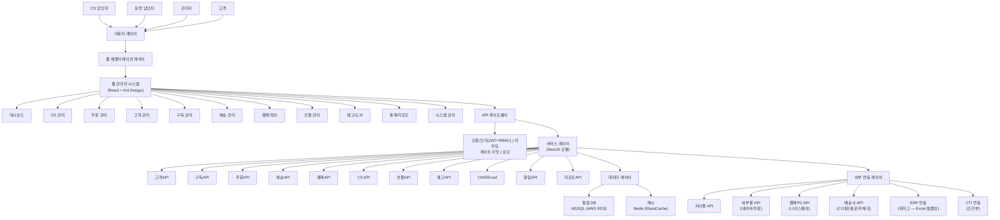
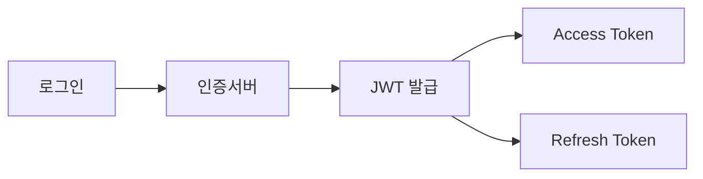
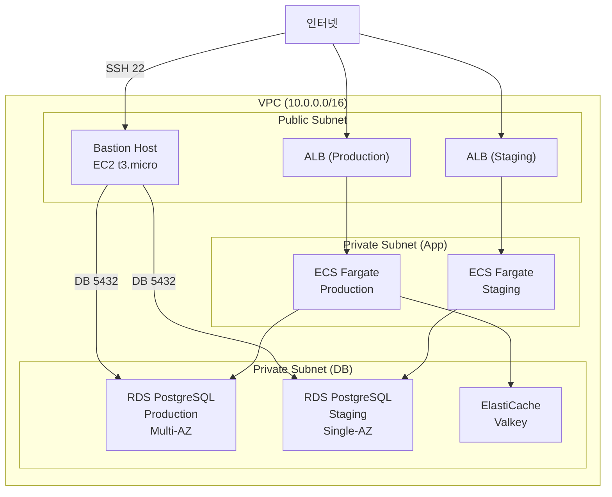
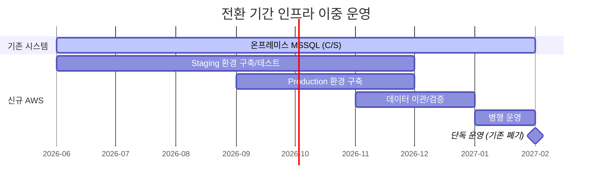

# Web 시스템 아키텍처

클라우드 기반의 웹 관리자(Admin) 시스템 구조 및 보안 정책 수립

---

## 아키텍처 개요

### TO-BE 시스템 구성도



---

## 기술 스택

### Frontend

| 구분 | 기술 | 비고 |
|------|------|------|
| Framework | React 18 | SPA 기반 관리자 시스템 |
| UI Library | Ant Design 5 | 관리자 UI에 최적화된 컴포넌트 |
| State Management | React Query + Zustand | 서버 상태 + 클라이언트 상태 분리 |
| Build Tool | Vite | |

### Backend

| 구분 | 기술 | 비고 |
|------|------|------|
| Framework | NestJS | 모듈 기반 모놀리식 아키텍처 |
| API | RESTful API | OpenAPI(Swagger) 문서화 |
| Authentication | JWT + RBAC | 역할 기반 접근 제어 |
| ORM | TypeORM | MSSQL 네이티브 지원 |
| Queue | BullMQ | 비동기 배치 처리 (주문 수집, 배송 추적) |

### Database

| 구분 | 기술 | 비고 |
|------|------|------|
| Primary DB | MSSQL (AWS RDS for SQL Server) | 현행 MSSQL 유지, 이관 리스크 최소화 |
| Cache | Redis (ElastiCache) | 세션, 캐시, 큐 |
| Search | Elasticsearch | 검색 기능 (선택, 2단계) |

### Infrastructure

| 구분 | 기술 | 비고 |
|------|------|------|
| Cloud | AWS | 현행 AWS 인프라 활용 |
| Container | Docker | |
| Orchestration | ECS Fargate 또는 EC2 | K8s 대비 운영 비용/복잡도 절감 |
| CI/CD | GitHub Actions | |
| Monitoring | CloudWatch + Sentry | 인프라 + 애플리케이션 모니터링 |

---

## 보안 정책

### 1. 인증 (Authentication)



| 항목 | 정책 |
|------|------|
| 인증 방식 | ID/Password + JWT |
| 토큰 만료 | Access: 1시간, Refresh: 7일 |
| 2FA | 관리자 계정 필수 (선택) |
| 비밀번호 | 8자 이상, 복잡도 규칙 적용 |

### 2. 인가 (Authorization)

| 역할 | 권한 |
|------|------|
| 최고관리자 | 전체 기능 |
| 관리자 | 설정 외 전체 |
| CS담당자 | CS, 고객 조회 |
| 운영담당자 | 주문, 배송 관리 |

### 3. 데이터 보안

| 항목 | 정책 |
|------|------|
| 전송 암호화 | HTTPS (TLS 1.3) |
| 저장 암호화 | 개인정보 필드 AES 암호화 |
| 접근 통제 | IP 화이트리스트 (선택) |
| 로그 | 모든 접근/변경 기록 |

### 4. 감사 로그

```sql
-- 감사 로그 예시 구조
audit_log (
  id,
  user_id,
  action,        -- CREATE, READ, UPDATE, DELETE
  resource,      -- 대상 테이블/기능
  resource_id,   -- 대상 레코드 ID
  old_value,     -- 변경 전 (JSON)
  new_value,     -- 변경 후 (JSON)
  ip_address,
  user_agent,
  created_at
)
```

---

## AWS 인프라 월간 비용 산정

> **기준**: AWS 서울 리전 (ap-northeast-2), 2025년 4월 기준 On-Demand 가격  
> **시스템 규모**: 내부 관리자 시스템, 동시접속 15~20명, SLA 99.5%  
> **DB**: PostgreSQL (MSSQL에서 전환 — 라이선스 비용 제거)  
> **환경**: Production + Staging 2환경 운영, Bastion Host 경유 접근

### 시스템 규모 산정 근거

| 항목 | 수치 | 근거 |
|------|------|------|
| 동시접속자 | 15~20명 | 내부 10명 + 외부 콜센터 4명 + 버퍼 |
| DB 테이블 | 151개 | 고객관리 75t + 홈페이지 63t + CMS 13t |
| 비즈니스 로직 | 49개 | SP 20 + Function 14 + Trigger 15 → 애플리케이션 코드 전환 |
| 월 구독 발송 | ~50,000건 | 월간 정기구독 잡지 발송 |
| 일 주문 | 50~100건 | 외부몰 연동 포함 |
| 월 API 호출 | ~100만 건 | 관리자 CRUD + 외부몰 연동 추정 |

### 네트워크/보안 아키텍처



### 환경별 상세 비용

#### Production 환경 (운영)

비기능 요구사항(SLA 99.5%, RTO 4h, RPO 1h)을 충족하는 구성입니다.

| 서비스 | 스펙 | 월 비용 (USD) | 비고 |
|--------|------|-------------:|------|
| **ECS Fargate** | 2 Task × 1vCPU / 2GB, 24/7 | ~$102 | HA 구성, AZ 분산 |
| **RDS PostgreSQL** | db.r5.large, Multi-AZ, 100GB gp3 | ~$292 | $0.200/h × 730h × 2 (Multi-AZ) |
| **ElastiCache (Valkey)** | cache.t3.small, 1노드 | ~$25 | $0.034/h × 730h |
| **ALB** | 1 ALB | ~$22 | 고정 $16.43 + LCU ~$5 |
| **S3** | 50GB Standard + 버전관리 | ~$2 | |
| **WAF** | 1 WebACL + 5 Rules | ~$11 | $5 + $1×5 + 요청비 |
| **CloudWatch** | 상세 모니터링 + 알람 5개 | ~$15 | 커스텀 메트릭, 로그 수집 |
| | | | |
| **Production 소계** | | **~$469** | |

#### Staging 환경 (테스트/검증)

배포 전 검증용. Production 대비 축소 구성, Multi-AZ 미적용.

| 서비스 | 스펙 | 월 비용 (USD) | 비고 |
|--------|------|-------------:|------|
| **ECS Fargate** | 1 Task × 0.5vCPU / 1GB, 24/7 | ~$18 | 단일 Task, 최소 스펙 |
| **RDS PostgreSQL** | db.t3.medium, Single-AZ, 30GB gp3 | ~$68 | $0.093/h × 730h |
| **ElastiCache (Valkey)** | cache.t3.micro, 1노드 | ~$13 | Production과 동일 구조 검증 |
| **ALB** | 1 ALB | ~$22 | Staging 전용 (Production과 분리) |
| **CloudWatch** | 기본 모니터링 | ~$5 | |
| | | | |
| **Staging 소계** | | **~$126** | |

#### 공용 인프라

Production/Staging 공통으로 사용하는 인프라입니다.

| 서비스 | 스펙 | 월 비용 (USD) | 비고 |
|--------|------|-------------:|------|
| **Bastion Host** | EC2 t3.micro, 24/7 | ~$11 | SSH 터널링으로 DB 접근, 보안 감사 로그 |
| **NAT Gateway** | 1 AZ | ~$37 | Private Subnet 아웃바운드 ($0.051/h + $0.059/GB) |
| **Route 53** | 2 Hosted Zone (prod + staging) | ~$1 | $0.50/zone |
| **ACM** | SSL 인증서 2개 | $0 | 무료 |
| **S3 (공용)** | CI/CD 아티팩트, 로그 저장 | ~$1 | |
| **Data Transfer** | ~30GB/월 | ~$3 | |
| | | | |
| **공용 소계** | | **~$53** | |

### 월간 비용 종합

| 환경 | 월 비용 (USD) | 월 비용 (KRW) | 비고 |
|------|-------------:|-------------:|------|
| Production | ~$469 | ~63만원 | Multi-AZ, HA |
| Staging | ~$126 | ~17만원 | Single-AZ, 축소 구성 |
| 공용 (Bastion, NAT, Route53 등) | ~$53 | ~7만원 | |
| | | | |
| **합계 (On-Demand)** | **~$648/월** | **~87만원/월** | |

### MSSQL 대비 비용 절감 효과

| 구성 | MSSQL (RDS SE LI) | PostgreSQL (RDS) | 절감액 | 절감률 |
|------|-------------------:|------------------:|-------:|:------:|
| Production (db.r5.large, Multi-AZ) | ~$780/월 | ~$292/월 | **$488/월** | **63%** |
| Staging (db.t3.medium, Single-AZ) | ~$266/월 | ~$68/월 | **$198/월** | **74%** |
| **DB 합계** | **~$1,046/월** | **~$360/월** | **$686/월** | **66%** |

> SQL Server 라이선스 비용이 RDS 가격의 ~60%를 차지했으며, 2환경 모두 PostgreSQL 전환으로 연간 **~$8,232 (~1,111만원)** 절감.

### Reserved Instance / Savings Plan 적용 시 (1년 약정)

| 항목 | On-Demand (월) | 1년 RI/SP (월) | 절감률 |
|------|---------------:|---------------:|:------:|
| RDS Production (db.r5.large Multi-AZ) | $292 | ~$190 | ~35% |
| RDS Staging (db.t3.medium) | $68 | ~$44 | ~35% |
| ECS Fargate 전체 (Compute SP) | $120 | ~$64 | ~47% |
| ElastiCache 전체 | $38 | ~$25 | ~34% |
| | | | |
| **전체 합계** | ~$648/월 | **~$453/월** | **~30%** |
| **연간 비용** | ~$7,776/년 | **~$5,436/년** | |
| **원화 환산 (₩1,350/USD)** | ~1,050만원/년 | **~734만원/년** | |

### 전환 기간 이중 운영 비용 (6~8개월)

구축 기간 동안 **기존 온프레미스 MSSQL**과 **신규 AWS 인프라**가 동시에 운영됩니다.



#### 전환 기간 월별 비용 추이

| 구간 | 기간 | 기존 (온프레미스) | 신규 AWS | 월 합계 | 비고 |
|------|:----:|------------------:|---------:|--------:|------|
| **1단계: 개발** | 1~3개월 | 기존 유지비 | ~$126 (Staging만) + $53 (공용) = **$179** | 기존 + $179 | Staging에서 개발/테스트 |
| **2단계: 통합 테스트** | 4~5개월 | 기존 유지비 | ~$648 (전체) | 기존 + $648 | Production 환경 추가 |
| **3단계: 이관/병행** | 6~8개월 | 기존 유지비 | ~$648 (전체) | 기존 + $648 | 데이터 이관 + 병행 운영 |
| **4단계: 전환 완료** | 이후 | **$0** (폐기) | ~$648 | $648 | 온프레미스 폐기 |

#### 전환 기간 AWS 누적 비용

| 시나리오 | 기간 | AWS 누적 비용 (On-Demand) | AWS 누적 비용 (RI/SP) | 비고 |
|----------|:----:|-------------------------:|----------------------:|------|
| **최소 6개월** | | | | |
| └ 1~3개월 (Staging) | 3개월 | $537 | $376 | $179/월 × 3 |
| └ 4~6개월 (전체) | 3개월 | $1,944 | $1,359 | $648/월 × 3 |
| **소계** | 6개월 | **$2,481** (~335만원) | **$1,735** (~234만원) | |
| | | | | |
| **최대 8개월** | | | | |
| └ 1~3개월 (Staging) | 3개월 | $537 | $376 | |
| └ 4~8개월 (전체) | 5개월 | $3,240 | $2,265 | $648/월 × 5 |
| **소계** | 8개월 | **$3,777** (~510만원) | **$2,641** (~356만원) | |

> **기존 온프레미스 유지비**: 현재 C/S 시스템은 사내 서버에서 운영 중이므로 별도 클라우드 비용은 없으나, 서버 전기/공간/관리 비용이 발생합니다. 전환 완료 후 이 비용이 제거됩니다.  
> **AWS 홈페이지 MSSQL (기존)**: 홈페이지/CMS용 AWS MSSQL RDS가 이미 운영 중인 경우, PostgreSQL 전환 완료 시 해당 인스턴스도 폐기하여 추가 절감이 가능합니다.

### 추가 절감 가능 항목

| 방안 | 예상 절감 | 적용 조건 |
|------|----------|----------|
| Staging 야간 중지 (업무외 stop) | ~$60/월 | 스케줄 기반 start/stop — 12h 운영 시 ~50% 절감 |
| NAT Gateway → NAT Instance (t3.micro) | ~$26/월 | 트래픽 적을 때 NAT Instance로 대체 |
| Bastion → SSM Session Manager | ~$11/월 | EC2 없이 SSM으로 대체, 단 설정 복잡도 증가 |
| RDS db.t3.medium → db.r5.large 단계적 확장 | 초기 $220+/월 | 초기 데이터량 적을 때 Production도 t3.medium으로 시작 |
| ElastiCache 미사용 (초기) | ~$38/월 | 15명 규모에서 캐시 없이도 가능 |

### 비용 산정 요약

#### 운영 안정화 후 (월간)

| 구성 | 월 비용 | 연 비용 | 비고 |
|------|--------:|--------:|------|
| 전체 On-Demand | ~$648 (~87만원) | ~$7,776 (~1,050만원) | Prod + Staging + 공용 |
| **전체 1년 RI/SP** | **~$453 (~61만원)** | **~$5,436 (~734만원)** | **권장** |
| 절약 구성 (Staging 야간중지 + NAT Instance) | ~$367 (~50만원) | ~$4,404 (~594만원) | RI/SP + 추가 절감 |

#### 전환 기간 포함 1차년도 총비용 (AWS 인프라만)

| 시나리오 | 전환 기간 AWS | 운영 기간 AWS | 1차년도 합계 | 비고 |
|----------|-------------:|-------------:|------------:|------|
| 6개월 전환 + 6개월 운영 (On-Demand) | $2,481 | $3,888 | **$6,369** (~860만원) | |
| 6개월 전환 + 6개월 운영 (RI/SP) | $1,735 | $2,718 | **$4,453** (~601만원) | |
| **8개월 전환 + 4개월 운영 (RI/SP)** | **$2,641** | **$1,812** | **$4,453** (~601만원) | **권장 산정 기준** |

> **참고**: 위 비용에는 구축 비용(인건비)이 포함되지 않습니다. 구축 비용은 RFP 발주 지원 문서를 참조하세요.  
> **환율**: USD 1 = KRW 1,350 기준 (실제 결제 시 변동)  
> **PostgreSQL 전환 효과**: MSSQL 대비 DB 비용 63~74% 절감. 2환경 합산 연간 ~1,111만원 절감.

---

## 화면 설계 (Wireframe)

### 주요 화면 목록

| No | 화면 | 설명 | 관련 요건 | 상태 |
|----|------|------|-----------|:----:|
| 1 | 대시보드 | 핵심 지표 요약 (매출, 구독, CS, 배송) | DB-01~05 | ⬜ |
| 2 | 고객 목록 | 통합 고객 조회 (채널별 필터) | CM-01~09 | ⬜ |
| 3 | 고객 상세 | 고객 정보 + 구독/결제/CS/배송 이력 (탭) | CM-01, CM-02, CM-05 | ⬜ |
| 4 | 구독 관리 | 구독 접수/갱신/해지/CMS 권한 | SB-01~11 | ⬜ |
| 5 | 주문 목록 | 다채널 주문 통합 조회 | OM-01~05 | ⬜ |
| 6 | 주문 상세 | 주문 처리, 결제, 배송 연동 | OM-02, OM-03 | ⬜ |
| 7 | 배송 관리 | 송장 등록, 배송 추적, 정기발송 | DL-01~09 | ⬜ |
| 8 | 결제/정산 | 결제 확인, 환불, 정산 리포트, 이연수익 | FN-01~16 | ⬜ |
| 9 | CS/상담 | 문의 접수, 처리, CTI 연동, 상담 이력 | CS-01~10 | ⬜ |
| 10 | 선물 관리 | 선물 주문, 발송, 재고 | GF-01~04 | ⬜ |
| 11 | 재고/도서 | 도서 관리, 재고 현황, 입출고 | BK-01~03 | ⬜ |
| 12 | 통계/리포트 | 매출, 구독, CS 분석 리포트 | DB-01~05, FN-15~16 | ⬜ |
| 13 | 시스템 설정 | 사용자, 권한, 코드 관리, 감사로그 | AD-01~07 | ⬜ |

---

## 작성 이력

| 날짜 | 작성자 | 변경 내용 |
|------|--------|----------|
| YYYY-MM-DD | - | 초안 작성 |
| 2026-04-20 | ISP팀 | 3장 기능요건 정합성 반영: 기술스택 확정 (React/Ant Design + NestJS + MSSQL/AWS RDS + ECS Fargate), DB엔진 PostgreSQL→MSSQL 전면 수정, 서비스 레이어 5개→11개 모듈 확장, 화면 목록 7개→13개 확장 및 3장 요건번호 연결, 시스템 구성도 외부 연동 보강 (ERP/CTI 추가) |
| 2026-04-20 | ISP팀 | 외부 연동 현실성 반영: ERP API→Excel 템플릿 연동, CMS API→Excel 기반 처리, CTI 조건부 연동으로 수정 |
