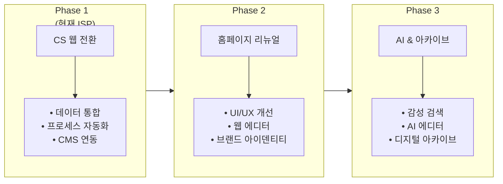
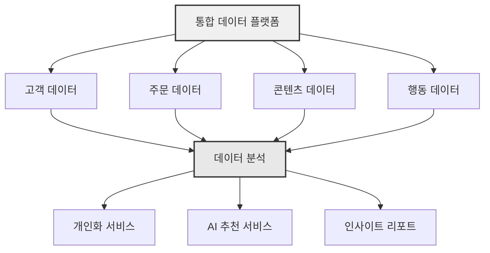

# 향후 확장 로드맵 (Future Service Proposal)

본 ISP를 통해 통합된 데이터를 기반으로 실현 가능한 미래 서비스 모델 제안

---

## 로드맵 개요

---

## 제안 서비스

| 구분 | 제안 내용 | 기대 가치 |
|:---|:---|:---|
| **1. 좋은생각 홈페이지 프론트엔드 디자인 및 기능 리뉴얼** | UI/UX 개선, 반응형 웹, 웹 에디터 강화 | 사용자 경험 향상, 콘텐츠 제작 효율화 |
| **2. 홈페이지 AI 기술 도입** | 감성 분석 검색, AI 에디터 | 텍스트 데이터 활용 극대화, 원고 검토 효율 개선 |
| **3. 좋은생각 디지털 아카이브** | 나만의 좋은생각, 주제별 큐레이션 | 헤리티지 축적, 플랫폼 체류 시간 증대 |

---

## 상세 제안

### [1. 프론트엔드 리뉴얼](./frontend-renewal)
좋은생각 UI/UX 개선 및 웹 에디터 기능 강화

### [2. AI 기술 도입](./ai-transformation)
감성 분석 검색 및 AI 에디터 도입

### [3. 디지털 아카이브](./digital-archive)
나만의 좋은생각 및 주제별 큐레이션 서비스

---

## 구현 우선순위

### 우선순위 평가 기준

| 기준 | 가중치 |
|------|:------:|
| 사업 가치 | 30% |
| 기술 실현 가능성 | 25% |
| 비용 효율성 | 25% |
| 고객 영향도 | 20% |

### 우선순위 결과

| 순위 | 서비스 | 점수 | 권장 시기 |
|:----:|--------|:----:|----------|
| 1 | 프론트엔드 리뉴얼 | ⭐⭐⭐⭐⭐ | Phase 2 (1차) |
| 2 | 디지털 아카이브 | ⭐⭐⭐⭐ | Phase 2 (2차) |
| 3 | AI 기술 도입 | ⭐⭐⭐ | Phase 3 |

---

## 예상 일정

| Phase | 기간 | 주요 내용 |
|:-----:|:----:|----------|
| Phase 1 | 현재\~6개월 | CS 웹 전환 (본 ISP) |
| Phase 2 | +6개월 | 홈페이지 리뉴얼 + 아카이브 |
| Phase 3 | +6개월 | AI 기술 도입 |

---

## 시너지 효과

---

## 작성 이력

| 날짜 | 작성자 | 변경 내용 |
|------|--------|----------|
| YYYY-MM-DD | - | 초안 작성 |
