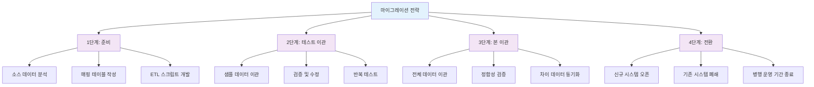
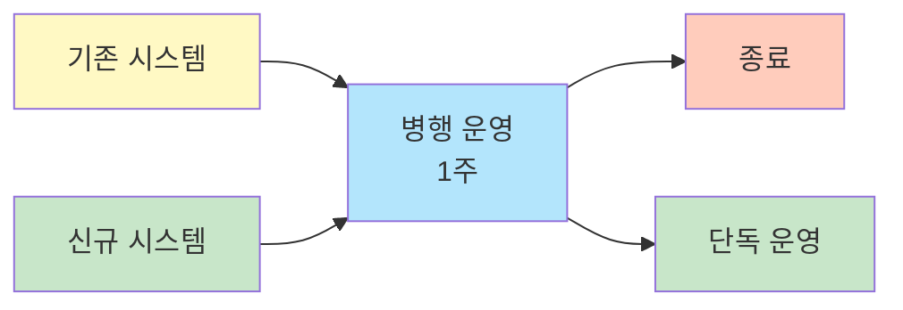

# 마이그레이션 계획

로컬 DB 데이터를 웹 기반 신규 DB로 구조 변경 및 이관하는 전략 수립

---

## 마이그레이션 개요

### 이관 대상

| 구분 | 원본 | 주요 테이블 | 대상 | 데이터량 (추정) |
|------|------|-----------|------|----------------|
| 고객 데이터 | C/S MSSQL (사내) | `PT_Customer` (48 cols), `PT_Company` (49 cols) | 통합 DB (클라우드) | 약 5~10만 건 (구독자+거래처, 33년 누적 추정) |
| 구독 데이터 | C/S MSSQL (사내) | `PT_Subscribe` (20 cols), `PT_Receiver` (43 cols), `PT_Giro` | 통합 DB (클라우드) | 약 10~30만 건 (구독 이력 누적 추정) |
| 결제/재무 | C/S MSSQL (사내) | `PT_Finance` (22 cols), `PT_Deposit`, `PT_DEFERINCOME_*` | 통합 DB (클라우드) | 약 20~50만 건 (연간 결제 건수 기반 추정) |
| 상품/재고 | C/S MSSQL (사내) | `PT_Book` (30 cols), `PT_BookPrice`, `PT_Stock` | 통합 DB (클라우드) | 약 1~3만 건 (출판물+아트상품 카탈로그) |
| CS 이력 | C/S MSSQL (사내) | `PT_Councel_History`, `PT_SendHistory` | 통합 DB (클라우드) | 약 10~30만 건 (상담·발송 이력 누적 추정) |
| 홈페이지 주문 | AWS MSSQL | `PTM_Orders`, `PTM_Order_Items`, `PTM_Regular_Orders` (63t) | 통합 DB (클라우드) | 약 5~15만 건 (자사몰 주문 누적 추정) |
| CMS 콘텐츠 | AWS MSSQL | `ptcms_contents` (33 cols), `ptcms_writer`, `ptcms_books` (13t) | 통합 DB (클라우드) | 약 1~5만 건 (월간지 33년분 콘텐츠 추정) |
| SP/Trigger 로직 | C/S MSSQL (사내) | 20 SPs + 14 Functions + 15 Triggers | 애플리케이션 코드로 전환 | 49개 객체 |

### 이관 전략



---

## 데이터 매핑

### 테이블 매핑

| AS-IS (MSSQL) | TO-BE (통합 DB) | 변환 규칙 |
|---------------|-------------------|----------|
| `PT_Customer` (48 cols) | customers | Customer_ID(decimal13)→customer_code, 연락처 정규화, 이름 공백제거 |
| `PT_Subscribe` (20 cols) | subscriptions | Customer_ID+Subscribe_SN 복합키 → 단일 PK, 상태코드 표준화 |
| `PT_Receiver` (43 cols) | delivery_addresses + order_items | 받는사람 정보 분리: 배송지 + 주문항목 |
| `PT_Finance` (22 cols) | payments | Finance_Type별 입금/환불 분리, 나이스페이 코드 매핑 |
| `PT_Company` (49 cols) | partners | Company_CD→partner_code |
| `PT_Book` + `PT_BookPrice` | products | 도서+가격 통합, Book_SQ→product_code |
| `PT_Stock` + `PT_GiftStock` | inventory | 일반재고+선물재고 통합 |
| `PT_Councel_History` | cs_tickets + cs_histories | 상담이력 → 티켓+처리이력 분리 |
| `PT_Giro` | payment_giro | 지로 결제 정보 이관 |
| `PT_GiftSend` | gift_orders | 선물발송 → 선물주문 |
| `PT_DEFERINCOME_INFO`/`MST`/`STAT` | deferred_revenues | 선수수익 3테이블 통합 |
| `PTM_Products` + `PTM_ProductOptions` | products (병합) | 홈페이지 상품 → C/S 도서와 통합 상품 테이블 |
| `PTM_Orders` + `PTM_Order_Items` | orders + order_items | 홈페이지 주문 이관 |
| `PTM_Regular_Orders` + `PTM_Regulars` | subscriptions (병합) | 웹 정기구독 → C/S 구독과 통합 |
| `PTM_Coupons` + `PTM_Coupon_*` | coupons + coupon_histories | 쿠폰 통합 |
| `ptcms_contents` + `ptcms_writer` | cms_contents + cms_writers | CMS 콘텐츠 이관 (33 cols 정리) |
| `ptcms_books` | products (카테고리 병합) | CMS 도서 → 상품 통합 |

### 필드 매핑 예시

| AS-IS 필드 | TO-BE 필드 | 타입 변환 | 데이터 변환 |
|-----------|-----------|----------|------------|
| Customer_ID (decimal 13) | customer_code | DECIMAL→VARCHAR | 문자열 변환, 앞 0 패딩 |
| Customer_NM | name | NVARCHAR→VARCHAR | 공백 제거, 특수문자 정리 |
| Tel_NO | phone | VARCHAR→VARCHAR | 숫자만 추출 (func_GetNumeric 참조) |
| Subscribe_DT | start_date | DATETIME→TIMESTAMP | UTC 변환 |
| Finance_SQ | payment_id | INT→BIGINT | 자동 증분 |
| Book_SQ | product_code | INT→VARCHAR | 상품코드 체계 변환 |
| Company_CD | partner_code | VARCHAR→VARCHAR | 코드 체계 통일 |

---

## ETL 프로세스

### 1. Extract (추출)

```sql
-- C/S MSSQL에서 고객 데이터 추출 예시
SELECT 
    Customer_ID,          -- decimal(13) PK
    Customer_NM,          -- nvarchar 고객명
    Tel_NO,               -- varchar 연락처
    HP_NO,                -- varchar 휴대폰
    Email,                -- varchar 이메일
    Reg_DT,               -- datetime 등록일
    Customer_Type,        -- 고객유형 코드
    Subscribe_YN          -- 구독여부
FROM PT_Customer
WHERE Del_YN = 'N'
  AND Customer_ID IS NOT NULL
```

### 2. Transform (변환)

```python
# 변환 로직 예시 (Python)
def transform_customer(row):
    return {
        'customer_code': str(int(row['Customer_ID'])).zfill(13),  # decimal(13) → 문자열 변환
        'name': row['Customer_NM'].strip() if row['Customer_NM'] else '',
        'phone': re.sub(r'\D', '', row['Tel_NO'] or ''),          # func_GetNumeric 참조
        'mobile': re.sub(r'\D', '', row['HP_NO'] or ''),
        'email': row['Email'].lower().strip() if row['Email'] else None,
        'customer_type': map_customer_type(row['Customer_Type']),  # 코드 변환
        'is_subscriber': row['Subscribe_YN'] == 'Y',
        'created_at': row['Reg_DT'].replace(tzinfo=timezone.utc)
    }

def map_customer_type(code):
    """PT_CodeDetail 기반 고객유형 코드 매핑"""
    TYPE_MAP = {
        '01': 'individual',    # 개인
        '02': 'corporate',     # 법인/단체
        '03': 'school',        # 학교/기관
    }
    return TYPE_MAP.get(code, 'unknown')
```

### 3. Load (적재)

```sql
-- TO-BE 통합 DB에 데이터 적재 (AWS RDS MSSQL)
MERGE INTO customers AS target
USING (VALUES (@customer_code, @name, @phone, @mobile, @email, 
               @customer_type, @is_subscriber, @created_at))
    AS source (customer_code, name, phone, mobile, email, 
               customer_type, is_subscriber, created_at)
ON target.customer_code = source.customer_code
WHEN MATCHED THEN UPDATE SET
    target.name = source.name,
    target.phone = source.phone,
    target.mobile = source.mobile,
    target.email = source.email,
    target.customer_type = source.customer_type,
    target.is_subscriber = source.is_subscriber,
    target.updated_at = GETDATE()
WHEN NOT MATCHED THEN INSERT (
    customer_code, name, phone, mobile, email,
    customer_type, is_subscriber, created_at
) VALUES (
    source.customer_code, source.name, source.phone, source.mobile, source.email,
    source.customer_type, source.is_subscriber, source.created_at
);
```

---

## 검증 방안

### 1. 건수 검증

| 테이블 | AS-IS 건수 | TO-BE 건수 | 차이 | 원인 |
|--------|-----------|-----------|------|------|
| 고객 | (이관 시 실측) | (이관 후 검증) | 0 허용 | 중복 통합 시 감소 가능 — 통합 건수 별도 기록 |
| 주문 | (이관 시 실측) | (이관 후 검증) | 0 허용 | 채널별 합산 일치 여부 확인 |
| CS | (이관 시 실측) | (이관 후 검증) | 0 허용 | 이력 누락 없음 확인 |

> **[참고]** AS-IS/TO-BE 건수는 VPN 접속 후 아래 검증 스크립트를 실행하여 채웁니다.

#### 건수 검증 스크립트 (AS-IS — C/S MSSQL)

```sql
-- 고객 건수
SELECT 'PT_Customer' AS tbl, COUNT(*) AS cnt FROM PT_Customer
UNION ALL
SELECT 'PT_Company', COUNT(*) FROM PT_Company;

-- 구독 건수
SELECT 'PT_Subscribe' AS tbl, COUNT(*) AS cnt FROM PT_Subscribe
UNION ALL
SELECT 'PT_Receiver', COUNT(*) FROM PT_Receiver;

-- 결제 건수
SELECT 'PT_Finance' AS tbl, COUNT(*) AS cnt FROM PT_Finance;

-- CS 이력 건수
SELECT 'PT_Councel_History' AS tbl, COUNT(*) AS cnt FROM PT_Councel_History
UNION ALL
SELECT 'PT_SendHistory', COUNT(*) FROM PT_SendHistory;

-- 상품 건수
SELECT 'PT_Book' AS tbl, COUNT(*) AS cnt FROM PT_Book;
```

### 2. 데이터 정합성 검증

```sql
-- 합계 검증 예시
-- AS-IS (C/S MSSQL)
SELECT COUNT(*) AS cnt, SUM(Finance_AMT) AS total_amt 
FROM PT_Finance 
WHERE YEAR(Finance_DT) = 2024 AND Finance_Type IN ('입금','카드');

-- TO-BE (통합 DB — AWS RDS MSSQL)
SELECT COUNT(*) AS cnt, SUM(amount) AS total_amt 
FROM payments 
WHERE YEAR(payment_date) = 2024 
  AND payment_type IN ('deposit', 'card');
```

### 3. 샘플 검증

- 무작위 샘플 100건 추출
- 원본-대상 1:1 대조
- 불일치 항목 분석

---

## 전환 시나리오

### 옵션 1: 빅뱅 전환


**장점:** 전환 기간 짧음, 단순함  
**단점:** 리스크 높음, 롤백 어려움

### 옵션 2: 단계적 전환 (권장)



**장점:** 리스크 분산, 롤백 가능  
**단점:** 병행 운영 부담

---

## 롤백 계획

### 롤백 트리거

| 상황 | 조치 |
|------|------|
| 데이터 정합성 90% 미만 | 이관 중단, 원인 분석 |
| 주요 기능 오류 | 기존 시스템 복귀 |
| 성능 기준 미달 | 기존 시스템 복귀 |

### 롤백 절차

1. 신규 시스템 접근 차단
2. 기존 시스템 재활성화
3. 변경 데이터 역이관 (Delta)
4. 원인 분석 및 재이관 계획

---

## 일정 계획

| 단계 | 기간 | 활동 |
|:---:|:---:|------|
| 준비 | 1주 | 매핑 테이블, ETL 개발 |
| 테스트 | 1주 | 샘플 이관, 검증, 수정 |
| 본 이관 | 1일 | 전체 데이터 이관 |
| 검증 | 2일 | 정합성 검증 |
| 전환 | 1일 | 시스템 전환 |
| 안정화 | 2주 | 병행 운영, 모니터링 |

---

## 작성 이력

| 날짜 | 작성자 | 변경 내용 |
|------|--------|----------|
| 2026-02-26 | - | 초안 작성 (템플릿) |
| 2026-03-03 | 김명직 | 이관 대상 8건 상세화, 테이블 매핑 17건, 필드 매핑 7건 추가 |
| 2026-03-03 | 김명직 | ETL 예시 실제 `PT_Customer` 필드명으로 수정, 검증 SQL 보강 |
