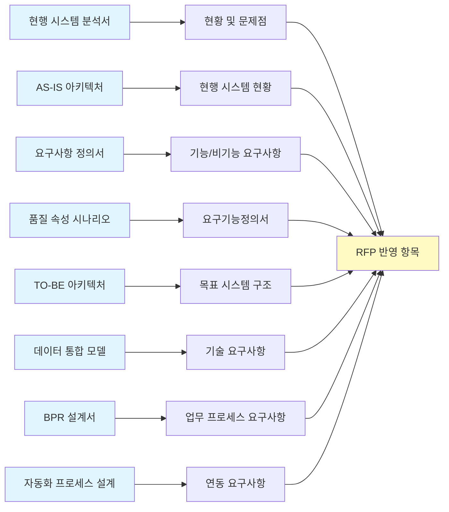

# 발주 지원 (RFP)

ISP 완료 후 구축 사업 발주를 위한 제안요청서(RFP) 작성 가이드입니다.

---

## ISP → RFP 연계

ISP 산출물이 RFP의 기반이 됩니다.



### RFP 작성 전 확인 사항

| 확인 항목 | ISP 산출물 | 상태 |
|----------|-----------|:----:|
| 현행 시스템 분석 완료 | 시스템 정밀진단, AS-IS 아키텍처 | ⬜ |
| 요구사항 정의 완료 | 요구사항 정의서, 품질 속성 시나리오 | ⬜ |
| 목표 아키텍처 정의 완료 | TO-BE 아키텍처, 데이터 모델 | ⬜ |
| 예산/일정 승인 완료 | 사업 계획서 | ⬜ |

---

## RFP 구성 (안)

### 목차

```
제안요청서 (RFP)

1. 사업 개요
   1.1 사업명
   1.2 사업 배경 및 목적
   1.3 사업 범위
   1.4 사업 기간 및 예산

2. 현황 및 요구사항
   2.1 현행 시스템 현황
   2.2 기능 요구사항
   2.3 비기능 요구사항
   2.4 데이터 이관 요구사항

3. 제안 요청 내용
   3.1 기술 제안
   3.2 관리 제안
   3.3 지원 제안

4. 제안서 작성 지침
   4.1 제출 서류
   4.2 제안서 구성
   4.3 제출 방법 및 일정

5. 평가 및 선정
   5.1 평가 기준
   5.2 평가 절차
   5.3 우선협상대상자 선정

6. 계약 조건
   6.1 계약 방식
   6.2 대금 지급 조건
   6.3 하자보수

부록
   A. 요구기능정의서
   B. 현행 시스템 자료
   C. 제안서 양식
```

---

## 사업 개요 (초안)

### 사업명
좋은생각 CS 시스템 웹 전환 및 데이터 통합 구축

### 사업 목적
- 로컬 설치형(C/S) CS 시스템의 웹 기반 전환
- 분산된 고객/주문 데이터의 통합
- 업무 프로세스 자동화 구현

### 사업 범위

| 구분 | 범위 |
|------|------|
| 시스템 개발 | 웹 기반 CS 관리 시스템 |
| 데이터 연동 | 자사몰, 외부몰, CMS 연동 |
| 데이터 이관 | 기존 MSSQL 데이터 이관 |
| 교육/운영 | 사용자 교육, 운영 매뉴얼 |

### 사업 기간
- 총 6개월 (착수 \~ 안정화)
- 개발: 4개월
- 테스트/이관: 1개월
- 안정화: 1개월

### 사업 예산 (추정)

#### 1. 인프라 운영 비용 (AWS 월간 — Prod + Staging + 공용)

| 구성 | 월 비용 | 연 비용 | 비고 |
|------|--------:|--------:|------|
| 전체 On-Demand | ~87만원 | ~1,050만원 | Prod + Staging + Bastion/NAT |
| **전체 1년 RI/SP** | **~61만원** | **~734만원** | **권장** |

> 상세 내역은 [Web 시스템 아키텍처 — AWS 인프라 월간 비용 산정](/goodthinking-isp/04-design/web-architecture/#aws-인프라-월간-비용-산정) 참조

#### 2. 구축 비용 (인건비)

| 항목 | 인원 | 기간 | 단가 (월/인) | 소계 |
|------|:----:|:----:|------------:|-----:|
| PM | 1명 | 6개월 | 1,200만원 | 7,200만원 |
| 시니어 개발자 | 2명 | 4개월 | 1,000만원 | 8,000만원 |
| 주니어 개발자 | 1명 | 4개월 | 700만원 | 2,800만원 |
| QA/테스터 | 1명 | 2개월 | 700만원 | 1,400만원 |
| | | | **합계** | **19,400만원** |

> 인건비 단가는 SW사업 대가산정 기준 참고 추정치이며, 제안사 견적에 따라 변동됩니다.

#### 3. 전환 기간 이중 운영 비용

구축 기간(6~8개월) 동안 기존 온프레미스와 신규 AWS가 동시 운영됩니다.

| 시나리오 | 전환 기간 AWS | 비고 |
|----------|-------------:|------|
| 최소 6개월 (RI/SP) | ~234만원 | Staging 3개월 + 전체 3개월 |
| 최대 8개월 (RI/SP) | ~356만원 | Staging 3개월 + 전체 5개월 |

#### 4. 총 예산 요약

| 구분 | 금액 | 비고 |
|------|-----:|------|
| 구축 비용 (인건비) | ~1.94억원 | 6개월 (개발4 + 테스트/이관1 + 안정화1) |
| 전환 기간 AWS 이중 운영 (6~8개월) | ~234~356만원 | RI/SP 기준, 기존 온프레미스 비용 별도 |
| **1차년도 합계** | **~2.01~2.02억원** | 구축 + 전환기간 AWS + 운영 잔여 기간 |
| **2차년도~ 연간 운영** | **~734만원** | Prod + Staging + 공용, RI/SP 기준 |

---

## 요구기능정의서 개요

### 기능 요구사항 요약

| 대분류 | 중분류 | 요구사항 수 |
|--------|--------|:-----------:|
| 고객 관리 | 고객 조회/등록/수정 | __ |
| | 고객 통합 관리 | __ |
| 주문 관리 | 다채널 주문 통합 | __ |
| | 주문 처리 | __ |
| CS 관리 | 문의 접수/처리 | __ |
| | CS 이력 관리 | __ |
| 연동 | CMS 연동 | __ |
| | 외부몰 연동 | __ |
| 관리 | 사용자/권한 관리 | __ |
| | 통계/리포트 | __ |

### 비기능 요구사항 요약

| 구분 | 요구사항 |
|------|----------|
| 성능 | 응답시간 3초 이내, 동시접속 __명 |
| 가용성 | 99.5% 이상 |
| 보안 | 개인정보보호법 준수, 접근통제 |
| 호환성 | 웹 표준 (Chrome, Edge, Safari) |

---

## 평가 기준 (안)

### 기술 평가 (70점)

| 평가 항목 | 배점 | 세부 내용 |
|----------|:----:|----------|
| 사업 이해도 | 10 | 현황 분석, 요구사항 이해 |
| 기술 방안 | 25 | 아키텍처, 기술 스택, 개발 방법론 |
| 기능 구현 방안 | 20 | 요구기능 구현 방안 |
| 품질 관리 | 10 | 테스트, 품질 보증 방안 |
| 수행 체계 | 5 | 조직, 일정, 리스크 관리 |

### 가격 평가 (30점)

| 평가 항목 | 배점 | 산정 방식 |
|----------|:----:|----------|
| 입찰 가격 | 30 | 최저가 대비 점수 |

### 총점 계산
- 기술점수 + 가격점수 = 총점
- 최고 득점자 우선협상대상자 선정

---

## 벤더 평가 세부 기준

### 필수 자격 요건

| 항목 | 기준 | 확인 방법 |
|------|------|----------|
| 사업자 등록 | 법인 사업자 | 사업자등록증 |
| 유사 사업 실적 | 최근 3년 내 유사 규모 프로젝트 1건 이상 | 계약서/완료 확인서 |
| 투입 인력 | PM 경력 5년 이상, 개발자 3년 이상 | 경력 증명서 |
| 재무 건전성 | 부채비율 200% 이하 또는 자본잠식 없음 | 재무제표 |

### 기술 평가 세부 항목

#### 1. 사업 이해도 (10점)

| 세부 항목 | 배점 | 평가 기준 |
|----------|:----:|----------|
| 현황 분석의 정확성 | 4 | 현행 시스템 문제점 이해도 |
| 요구사항 이해도 | 3 | 핵심 요구사항 파악 정도 |
| 사업 목표 이해 | 3 | 전환/통합/자동화 목표 이해 |

#### 2. 기술 방안 (25점)

| 세부 항목 | 배점 | 평가 기준 |
|----------|:----:|----------|
| 시스템 아키텍처 | 10 | 확장성, 유연성, 안정성 |
| 기술 스택 적정성 | 8 | 기술 선정 근거, 최신성 |
| 보안 방안 | 7 | 개인정보 보호, 접근 통제 |

#### 3. 기능 구현 방안 (20점)

| 세부 항목 | 배점 | 평가 기준 |
|----------|:----:|----------|
| 핵심 기능 구현 | 10 | 고객/주문/CS 관리 구현 방안 |
| 연동 방안 | 6 | CMS, 외부몰 연동 방안 |
| 데이터 이관 | 4 | MSSQL → 신규 DB 이관 방안 |

#### 4. 품질 관리 (10점)

| 세부 항목 | 배점 | 평가 기준 |
|----------|:----:|----------|
| 테스트 방안 | 5 | 테스트 전략, 자동화 |
| 품질 보증 | 3 | 코드 리뷰, QA 프로세스 |
| 성능 검증 | 2 | 성능 테스트 계획 |

#### 5. 수행 체계 (5점)

| 세부 항목 | 배점 | 평가 기준 |
|----------|:----:|----------|
| 투입 조직 | 2 | 조직 구성, 역할 분담 |
| 일정 계획 | 2 | 실현 가능성, 마일스톤 |
| 리스크 관리 | 1 | 리스크 식별 및 대응 |

### 평가 등급 기준

| 등급 | 점수 범위 | 기준 |
|:----:|:---------:|------|
| 최우수 | 90\~100% | 기대 이상의 우수한 제안 |
| 우수 | 70\~89% | 요구사항 충족, 우수한 제안 |
| 보통 | 50\~69% | 요구사항 기본 충족 |
| 미흡 | 30\~49% | 일부 요구사항 미충족 |
| 부적격 | 0\~29% | 요구사항 대부분 미충족 |

---

## 벤더 선정 시 주의사항

### 확인해야 할 사항

- 실적 검증
  - [ ] 제출된 실적이 실제 수행한 것인지 확인
  - [ ] 유사 규모/기술 프로젝트인지 확인
  - [ ] 레퍼런스 체크 (이전 고객사 연락)

- 인력 검증
  - [ ] 제안된 인력이 실제 투입 가능한지 확인
  - [ ] 투입률 확인 (다른 프로젝트 중복 여부)
  - [ ] 핵심 인력 이탈 시 대응 방안

- 기술 검증
  - [ ] 제안된 기술 스택 실제 사용 경험
  - [ ] 데모/PoC 요청 가능 여부
  - [ ] 오픈소스 라이선스 이슈 확인

- 계약 조건
  - [ ] 지적재산권 귀속 명확화
  - [ ] 하자보수 기간 및 범위
  - [ ] 유지보수 조건 (별도 계약 시)

### 주의해야 할 위험 신호 (Red Flags)

| 위험 신호 | 의미 | 대응 |
|----------|------|------|
| 지나치게 낮은 가격 | 품질 저하 또는 추가 비용 발생 가능 | 상세 견적 요청, 범위 재확인 |
| 과도한 일정 단축 제안 | 품질/안정성 저하 가능 | 일정 근거 확인 |
| 핵심 인력 투입률 낮음 | 실제 참여 제한적 | 투입 계획 상세 확인 |
| 유사 실적 부재 | 경험 부족으로 리스크 | 대안 기술/인력 확인 |
| 하도급 과다 | 품질 관리 어려움 | 직접 수행 비율 확인 |

---

## 제안서 제출 지침 (안)

### 제출 서류

| 서류 | 부수 | 비고 |
|------|:----:|------|
| 제안서 | 5부 | 인쇄본 + USB |
| 사업자등록증 | 1부 | 사본 |
| 실적 증명 | 1부 | 유사 프로젝트 |
| 참여인력 경력 | 1부 | 투입 예정 인력 |

### 제안서 작성 양식

```
제안서 구성

1. 일반 현황 (10p 이내)
   - 회사 소개
   - 조직 및 인력
   - 주요 실적

2. 기술 제안 (50p 이내)
   - 사업 이해 및 접근 방법
   - 시스템 아키텍처
   - 기능 구현 방안
   - 데이터 이관 방안
   - 연동 방안

3. 관리 제안 (20p 이내)
   - 수행 조직
   - 일정 계획
   - 품질/위험 관리

4. 지원 제안 (10p 이내)
   - 교육 계획
   - 유지보수 방안
```

---

## 일정 계획 (안)

| 단계 | 기간 | 활동 |
|:---:|:---:|------|
| RFP 공고 | D-day | 공고 게시 |
| 제안서 접수 | +2주 | 제안서 접수 마감 |
| 기술 평가 | +3일 | PT 평가 |
| 가격 평가 | +2일 | 입찰 가격 평가 |
| 우선협상대상자 선정 | +1일 | 결과 통보 |
| 계약 협상 | +1주 | 계약 조건 협의 |
| 계약 체결 | +2일 | 최종 계약 |

---

## 체크리스트

- [ ] 사업 범위 확정
- [ ] 예산 산정 완료
- [ ] 요구기능정의서 작성
- [ ] 평가 기준 확정
- [ ] RFP 문서 작성
- [ ] 내부 검토 완료
- [ ] 공고 준비 완료

---

## 작성 이력

| 날짜 | 작성자 | 변경 내용 |
|------|--------|----------|
| YYYY-MM-DD | - | 초안 작성 |
