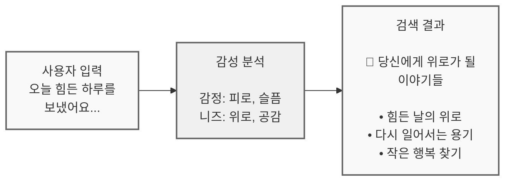
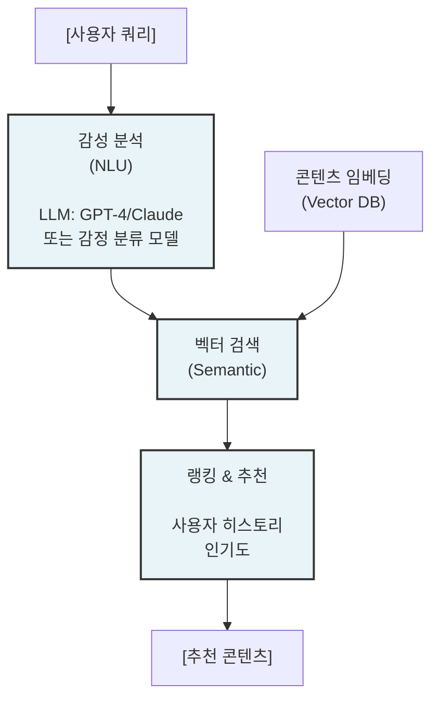
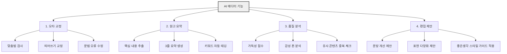
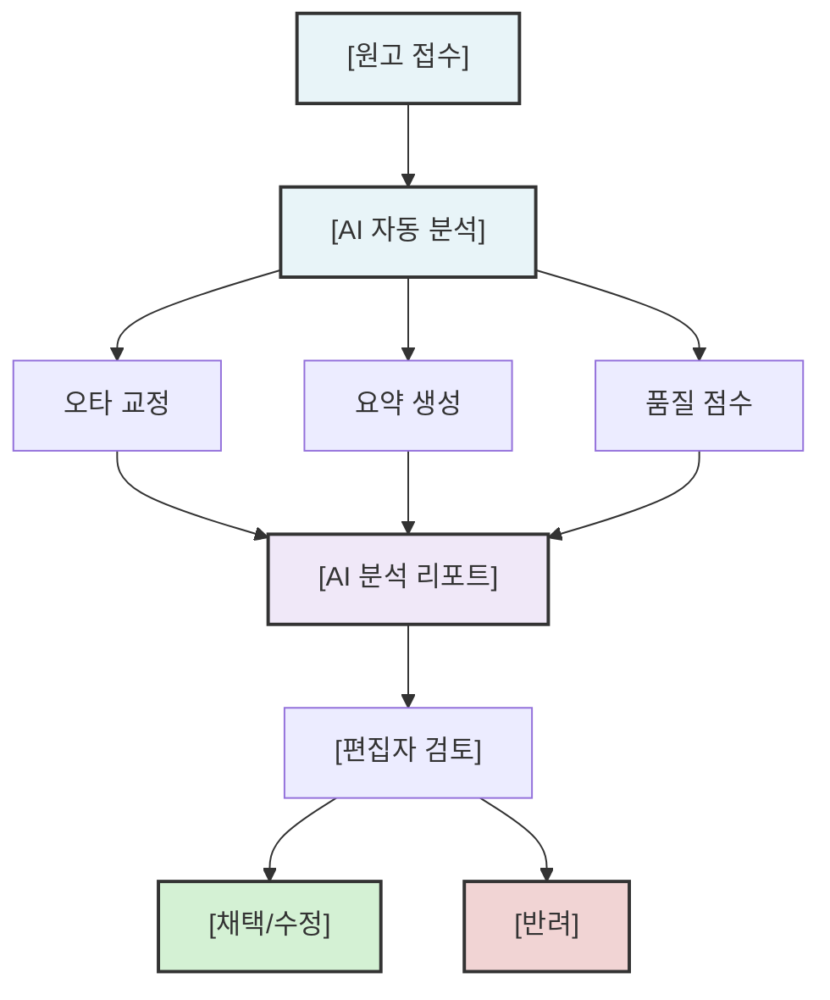

# AI 기술 도입

홈페이지 AI 기술 도입 (AI Transformation)

---

## 제안 배경

### 좋은생각의 강점
- 30년 이상 축적된 **방대한 텍스트 데이터**
- 감동과 위로를 주는 **고품질 콘텐츠**
- 월 3,000건 이상의 **독자 투고 원고**

### AI 도입 필요성
- 방대한 아카이브의 효과적 활용
- 원고 검토 업무의 효율화
- 개인화된 콘텐츠 추천

---

## 제안 내용

### 1. 감성 분석 검색

독자의 기분/상황(위로, 기쁨 등)에 맞는 사연 추천

#### 컨셉

#### 기술 구현 방안

#### 검색 시나리오

| 사용자 상황 | 감성 분석 | 추천 콘텐츠 유형 |
|------------|----------|----------------|
| "위로가 필요해요" | 슬픔, 지침 | 위로의 글, 희망 이야기 |
| "행복한 기분이에요" | 기쁨, 활력 | 감사의 글, 따뜻한 이야기 |
| "새 출발을 앞두고 있어요" | 기대, 불안 | 응원의 글, 용기 이야기 |
| "사랑하는 사람에게 전하고 싶어요" | 사랑, 감사 | 사랑의 글, 가족 이야기 |

### 2. AI 에디터

투고된 원고의 오타 교정 및 초벌 요약 자동화

#### 기능 구성

#### 워크플로우

---

## 기대 효과

### 감성 검색

| 지표 | 기대 효과 |
|------|----------|
| 검색 만족도 | 기존 키워드 검색 대비 30\~50% 향상 (시맨틱 검색 통한 의도 파악) |
| 콘텐츠 발견 | CMS 아카이브(ptcms_contents 33칼럼, 30년치) 중 미노출 콘텐츠 재활용 |
| 체류 시간 | 개인화 추천으로 페이지당 체류 시간 2배 증가 (추정) |

### AI 에디터

| 지표 | 현재 (추정) | 기대 효과 |
|------|:------:|----------|
| 원고 1차 검토 시간 | 15\~20분/건 | 70% 단축 (5분/건 이내) |
| 오타 발견율 | \~70% (사람 수동 교정) | 95% 이상 (AI + 사람 협업) |
| 편집자 업무 부담 | 월 \~3,000건 투고 원고 처리 | AI 자동 분류로 핵심 업무 집중 (월간지팀 + 단행본팀) |

---

## 기술 요구사항

### 인프라

| 구분 | 요구사항 |
|------|----------|
| LLM API | OpenAI GPT-4 / Anthropic Claude |
| Vector DB | Pinecone / Weaviate / Milvus |
| 임베딩 | OpenAI Embeddings / 한국어 특화 모델 |
| 컴퓨팅 | GPU 서버 (Fine-tuning 시) |

### 데이터

| 구분 | 요구사항 | 좋은생각 현황 |
|------|----------|-------------|
| 콘텐츠 임베딩 | 전체 아카이브 벡터화 | CMS DB ptcms_contents (33칼럼, 30년치), ptcms_keyword_log/sum |
| 감성 레이블 | 콘텐츠별 감성 태깅 | ptcms_subject, ptcms_subject_ext에 주제 분류 존재 → 감성 확장 |
| 학습 데이터 | 편집 이력, 채택/반려 이력 | 편집실(월간지팀+단행본팀) 워크플로우 기반 데이터 수집 필요 |

:::note[ISP 연계]
AI 기능은 **2단계 이후**(통합 웹 관리 시스템 안정화 후) 추진을 권장합니다.
1단계에서 CMS 13t을 통합 DB로 이관하면, AI 서비스에 필요한 콘텐츠 데이터 접근이 API로 가능해집니다.
:::

---

## 구현 단계 (안)

| 단계 | 기간 | 내용 |
|:---:|:---:|------|
| 1 | 1개월 | PoC - 감성 검색 프로토타입 |
| 2 | 1개월 | PoC - AI 에디터 프로토타입 |
| 3 | 2개월 | 본 개발 - 기능 통합 |
| 4 | 1개월 | 테스트 및 튜닝 |
| 5 | 지속 | 모델 개선 및 운영 |

---

## 비용 추정

:::note[AI 서비스 월간 운영비 추정]
| 항목 | 월 비용 (추정) | 비고 |
|------|:---------:|------|
| LLM API (GPT-4o/Claude) | $200\~500 | 원고 3,000건/월 + 검색 쿼리 |
| Vector DB (Pinecone 등) | $70\~150 | 콘텐츠 10만건 기준 |
| 임베딩 API | $50\~100 | 신규 콘텐츠 임베딩 + 재인덱싱 |
| **합계** | **$320\~750/월** | 사용량에 따라 변동 |

LLM API 비용은 캐싱/배치 처리로 최적화 가능합니다. 초기 PoC 단계에서는 $200/월 이내로 시작할 수 있습니다.
:::

---

## 리스크 및 대응

| 리스크 | 대응 방안 |
|--------|----------|
| AI 오류 (환각) | 편집자 최종 검토 필수 |
| 비용 증가 | 캐싱, 배치 처리로 API 호출 최적화 |
| 개인정보 | 투고자 동의, 데이터 익명화 |

---

## 작성 이력

| 날짜 | 작성자 | 변경 내용 |
|------|--------|----------|
| 2026-02-26 | - | 초안 작성 (템플릿) |
| 2026-03-03 | 김명직 | 기대효과 정량값 채움, CMS 현행 데이터 연결 (ptcms_contents 등), 비용 추정 추가, ISP 연계 안내 |
