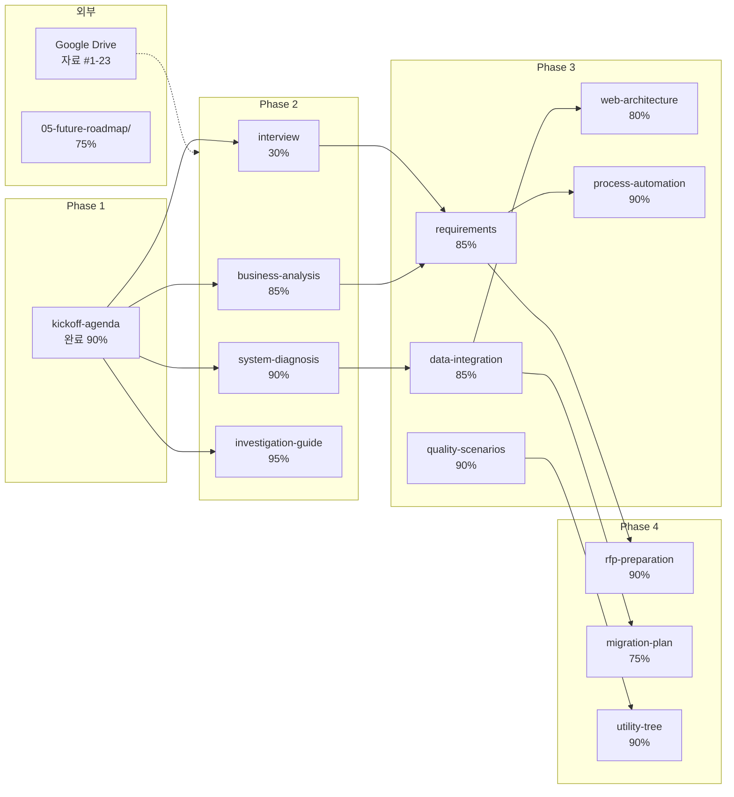

> **프로젝트**: 좋은생각사람들 정보화 전략 계획 (ISP)  
> **기간**: 2026-03-03 \~ 2026-05-01 (8주+α)  
> **수행사**: 스컹크웍스스튜디오 (김명직 CEO, 현승인 PM)  
> **고객사**: 좋은생각사람들 (정용철 대표, 정주안 대표)  
> **최종 산출물**: RFP (제안요청서)  
> **백로그 최종 수정일**: 2026-03-09 (Session 15)  

---

## 1. 프로젝트 개요

### 1.1 사업 배경
좋은생각은 33년 이상 운영된 월간 감성 에세이/이야기 출판사로, 정기구독 기반의 비즈니스 모델을 운영 중이다.

### 1.2 핵심 문제
- **레거시 C/S 시스템**: Tobesoft XPlatform 9.2.1/eGovFrame 3.2 데스크톱 앱 + MSSQL 2008 (온프레미스 `203.231.234.7`)
- **이원화된 인프라**: AWS 웹 시스템(Node.js Admin + MSSQL RDS + SPA Homepage + CMS)과 범용 API 연동 없음
- **데이터 사일로**: MSSQL 2008(온프레미스) ↔ MSSQL(AWS RDS) 간 수동 엑셀 데이터 이관 (단, 선수수익 반영에 한해 이벤트 기반 연동 존재)
- **외부 채널**: 네이버 스마트스토어, 쿠팡 → Playauto를 통한 주문 수집
- **과다 AWS 비용**: 노후 아키텍처로 인한 비효율적 서버 비용

### 1.3 프로젝트 목표
C/S 고객관리 시스템을 웹 기반 통합 시스템으로 전환하기 위한 **RFP 작성**
- C/S → Web 전환
- 데이터 통합 (MSSQL + MSSQL → 단일 DB)
- 프로세스 자동화 (수동 엑셀 작업 제거)

### 1.4 CEO 비전
디지털 효율화를 통해 직원들이 CS 수동 작업에서 벗어나 **아날로그 감성의 창작 활동에 집중**할 수 있도록 한다. AI 시대에도 좋은생각의 아날로그 미디어 정체성은 보존하되, 백오피스는 디지털화한다.

---

## 2. 조직 구조

| 역할 | 이름/팀 | 비고 |
|------|---------|------|
| 고객사 대표 | 정용철 | CEO |
| 고객사 연락 담당 | 정주안 대표 | |
| 정기구독팀 | - | 온라인 구독 관리 |
| 편집실 | - | 콘텐츠 제작 |
| 경영지원팀 | - | 백오피스 |
| 콘텐츠부문 | - | |
| 영업팀 | - | 총판, 다량, 특판, 오프라인 서점 |
| 외부 콜센터 | 더아이앤오 | \~4명, 아웃소싱 |
| 외부 개발자 | 김재옥 소장 | 전 사내 개발자, 현 외주 |

---

## 3. 문서 관리 현황

### 3.1 ISP 문서 (manual-book 사이트)

**경로**: `src/content/docs/goodthinking-isp/`  
**사이트**: https://manual.skunkworks.co.kr

| 섹션 | 파일 수 | 상태 | 비고 |
|------|---------|------|------|
| index.md + schedule.md | 2 | 템플릿 | 전체 개요 + 8주 일정 |
| 01-project-overview/ | 3 | 템플릿 | 사업개요, AS-IS/TO-BE |
| 02-analysis/ | 7 | 일부 작성 | 킥오프 미팅 내용 기록됨 |
| 03-design/ | 7 | 템플릿 | 아키텍처, ERD, BPR |
| 04-implementation/ | 3 | 템플릿 | 마이그레이션, RFP |
| 05-future-roadmap/ | 4 | 템플릿 | 프론트 리뉴얼, AI, 디지털 아카이브 |
| appendix/ | 4 | 템플릿 | 산출물 목록, 용어집, 백로그 |
| **합계** | **32** | | 18개 산출물 모두 미착수 |

### 3.2 Google Drive 공유폴더 (AS-IS 자료)

#### 파일 목록 (총 23개 파일)

| # | 분류 | 파일명 | 유형 | 최종수정 | ISP 관련도 |
|---|------|--------|------|----------|-----------|
| 1 | 시스템 | CS고객관리 프로그램 외부접속방법.xlsx | Excel | 2025-01 | 2/5 |
| | **DB 정의서 > 고객관리 프로그램 메뉴얼** | | | | |
| 2 | CRM | 고객관리 프로그램 발송업무 메뉴얼_16,06,15.pptx | PPT | 2016-06 | 1/5 |
| 3 | CRM | 관리자 매뉴얼_V1.1.hwp | HWP | 2015-12 | 2/5 |
| 4 | CRM | 사용자 매뉴얼_V2.3.hwp | HWP | 2015-12 | 2/5 |
| 5 | CRM | 사용자 매뉴얼_V2.4.hwp | HWP | 2017-06 | 2/5 |
| | **DB 정의서 > 신_고객관리 DB 정의서** | | | | |
| 6 | DB | 고객관리 프로그램 _TOTAL_ERD.pdf | PDF | 2016-01 | 3/5 |
| 7 | DB | 고객관리 프로그램 DB 테이블 정의서.docx | Word | 2016-09 | 2/5 |
| 8 | DB | 고객관리 프로그램 테이블목록 및 구조정의.xlsx | Excel | 2023-05 | 3/5 |
| 9 | DB | 고객관리 프로그램_DB_정의서.docx | Word | 2023-05 | 3/5 |
| | **DB 정의서 > 좋은생각 CMS** | | | | |
| 10 | DB | 테이블,프로시저 정의서.xlsx | Excel | 2019-06 | 2/5 |
| | **DB 정의서 > 좋은생각 홈페이지** | | | | |
| 11 | DB | 2017년02월 이전_테이블,프로시저 정의서.xlsx | Excel | 2017-01 | 1/5 |
| 12 | DB | 좋은생각 홈페이지 DB 테이블 정의서.xlsx | Excel | 2017-01 | 1/5 |
| 13 | DB | 테이블,프로시저 정의서_리뉴얼.xlsx | Excel | 2023-05 | 2/5 |
| 14 | DB | 테이블,프로시저 정의서.xlsx | Excel | 2022-01 | 1/5 |
| | **IT지원 기술서_매뉴얼** | | | | |
| 15 | IT운영 | 1. IT지원 업무흐름도_2020.xlsx | Excel | 2020-10 | 3/5 |
| 16 | IT운영 | 2. IT지원 운영 및 관리 매뉴얼.docx | Word | 2020-10 | 3/5 |
| 17 | IT운영 | 3. IT지원 고객관리 프로그램, 홈페이지 응급 매뉴얼.docx | Word | 2020-10 | 2/5 |
| | **업무매뉴얼 & 조직도** | | | | |
| 18 | 조직 | 260106 좋은생각사람들 조직도.pdf | PDF | 2025-02 | 3/5 |
| 19 | 업무 | 경영지원팀 업무플로우.pdf | PDF | 2025-02 | 3/5 |
| 20 | 업무 | 앵두 아트 프로젝트 업무 플로우 차트.pdf | PDF | 2025-02 | 3/5 |
| 21 | 업무 | 영업팀 (총판, 다량, 특판, 오프라인 서점) 업무플로우.pdf | PDF | 2025-02 | 3/5 |
| 22 | 업무 | 온라인_정기구독팀 업무플로우.pdf | PDF | 2025-02 | 3/5 |
| | **연락처** | | | | |
| 23 | 인사 | 김재옥 소장 (전 좋은생각사람들 개발자, 현 외주 개발자) | 텍스트 | 2025-02 | 1/5 |

---

## 4. ISP 단계별 백로그

### Phase 1: 프로젝트 착수 (Week 1-2) — 2026-03-03 \~ 2026-03-13

| ID | 작업 | 상태 | 우선순위 | 관련 문서 | 비고 |
|----|------|------|----------|-----------|------|
| P1-01 | 킥오프 미팅 수행 | 완료 | 높음 | kickoff-agenda.md | 2026-03-03/04 수행 완료 |
| P1-02 | AWS/VPN 접속 권한 획득 | 미착수 | 높음 | kickoff-agenda.md | 킥오프 시 요청함 |
| P1-03 | 공유 자료 수집 완료 확인 | 완료 | 높음 | Google Drive | 23개 파일 확인 및 전수 분석 완료 |
| P1-04 | 조직도 분석 | 완료 | 높음 | 조직도.pdf (#18) | CEO, 5개 부서, 외부콜센터 파악 완료 |
| P1-05 | 부서별 업무플로우 분석 | 완료 | 높음 | 업무플로우 PDF (#19-22) | 4개 부서 플로우 business-analysis.md 반영 |
| P1-06 | AS-IS 시스템 구조 분석 시작 | 완료 | 높음 | system-diagnosis.md | DB 정의서 기반 리버스 엔지니어링 완료 |
| P1-07 | 사용자 매뉴얼 V2.4 분석 | 완료 | 높음 | system-diagnosis.md | 74개 화면 전수 분석 (pdftotext 활용) |
| P1-08 | 관리자 매뉴얼 V1.1 분석 | 완료 | 높음 | system-diagnosis.md | 12개 화면 + 인프라 상세(IP/OS/WAS) 확인 |
| P1-09 | CS 프로그램 화면 목록 CSV 작성 | 완료 | 높음 | cs-program-menu-structure.csv | 86개 화면 (BS12+SS11+DP11+MP48+SD2+추가2) |

### Phase 2: 현행 분석 (Week 3-4) — 2026-03-16 \~ 2026-03-27

| ID | 작업 | 상태 | 우선순위 | 관련 문서 | 비고 |
|----|------|------|----------|-----------|------|
| P2-01 | CRM DB 분석 (MSSQL) | 완료 | 높음 | DB정의서 (#6-9) | 75t + 20SPs + 14Funcs + 15Triggers 전수 분석 |
| P2-02 | 홈페이지 DB 분석 (MSSQL) | 완료 | 높음 | 홈페이지 DB (#11-14) | 63t + 7 Procedures 분석 (MSSQL로 확인) |
| P2-03 | CMS DB 분석 | 완료 | 중간 | CMS DB (#10) | 13t 분석 완료 |
| P2-04 | IT 운영 현황 분석 | 진행중 | 높음 | IT지원 매뉴얼 (#15-17) | 문서 기반 분석 완료, VPN 접근 후 실물 확인 필요 |
| P2-05 | 사용자 인터뷰 (정기구독팀) | 미착수 | 높음 | interview.md | |
| P2-06 | 사용자 인터뷰 (경영지원팀) | 미착수 | 높음 | interview.md | |
| P2-07 | 사용자 인터뷰 (영업팀) | 미착수 | 높음 | interview.md | |
| P2-08 | 사용자 인터뷰 (편집실) | 미착수 | 중간 | interview.md | |
| P2-09 | 외부 개발자 인터뷰 (김재옥) | 미착수 | 높음 | interview.md | 협조 제한적 — 리스크 |
| P2-10 | CRM 프로그램 화면 워크스루 | 진행중 | 높음 | system-diagnosis.md | 매뉴얼 기반 86개 화면 분석 완료, VPN 접근 후 실물 검증 필요 |
| P2-11 | Playauto 연동 구조 파악 | 미착수 | 중간 | | 네이버/쿠팡 주문 채널 |
| P2-12 | 업무 병목 지점 식별 | 완료 | 높음 | business-analysis.md | 7건 식별 (주문→CS, CMS권한, ERP이중 등), 영향도 매트릭스 작성 |
| P2-13 | 수동 프로세스 목록화 | 완료 | 높음 | business-analysis.md | 12건 식별 (유형별 분류, 소요시간/빈도/오류위험 추정) |

### Phase 3: TO-BE 설계 (Week 5-6) — 2026-03-30 \~ 2026-04-10

| ID | 작업 | 상태 | 우선순위 | 관련 문서 | 비고 |
|----|------|------|----------|-----------|------|
| P3-01 | 요구사항 정의서 작성 | 진행중 | 높음 | requirements.md | 48건 기능 요구사항 (12모듈), 비기능 11건 수치 확정 완료. 인터뷰 후 우선순위 최종 검증 필요 |
| P3-02 | 품질 속성 시나리오 작성 | 진행중 | 중간 | quality-scenarios.md | 17개 시나리오 + 현행 분석 반영 완료, 인터뷰 후 검증 필요 |
| P3-03 | TO-BE 아키텍처 설계 | 진행중 | 높음 | web-architecture.md | 현행 분석 기반 전면 개편 완료 (12모듈, 19화면, 기술스택 권장안, 외부연동 7건) |
| P3-04 | TO-BE 데이터 통합 설계 (ERD) | 진행중 | 높음 | data-integration.md | 8개 도메인 23개 엔티티 확장, 13개 테이블 MSSQL 정의 완료, 요구사항 48건 교차 검증 매트릭스, 동기화 방안 구체화. 인터뷰 후 검증 필요 |
| P3-05 | 프로세스 자동화 설계 (BPR) | 진행중 | 높음 | process-automation.md | 수작업 12건↔자동화 매핑, 병목 7건↔우선순위 교차 매핑, 팀별 기대 효과, 구현 로드맵 Phase 1/2. 인터뷰 후 AS-IS 정량 확정 필요 |
| P3-06 | 유틸리티 트리 / 트레이드오프 | 진행중 | 중간 | utility-tree.md | 현행 분석 반영, Tradeoff 비용 추정 포함, 인터뷰 후 검증 필요 |
| P3-07 | 와이어프레임 작성 | 제외 | - | - | 구축 단계로 이관 (ISP 범위 외) |

### Phase 4: 구현계획 및 RFP (Week 7-8+α) — 2026-04-13 \~ 2026-05-01

| ID | 작업 | 상태 | 우선순위 | 관련 문서 | 비고 |
|----|------|------|----------|-----------|------|
| P4-01 | 데이터 마이그레이션 계획 | 진행중 | 높음 | migration-plan.md | ETL 설계 + 테이블/필드 매핑 완료, 데이터량 확인 필요 |
| P4-02 | RFP 문서 작성 | 진행중 | 최고 | rfp-preparation.md | 90% 완료: 기능 48건, 비기능 11건, 비즈니스 로직 56건 반영, §2.4 업무 프로세스 요구사항 신설, 예산 FP 955\~2,095 재계산. 인터뷰 후 보정 필요 |
| P4-03 | 평가 기준 수립 | 진행중 | 높음 | rfp-preparation.md | 기술70+가격30 상세 항목 완료, 좋은생각 맥락 반영 |
| P4-04 | 미래 로드맵 정리 | 진행중 | 중간 | 05-future-roadmap/ | 3종 업데이트 완료 (frontend 75%, ai 75%, archive 75%), ISP 연계 안내 추가 |
| P4-05 | 산출물 18종 최종 검수 | 미착수 | 높음 | deliverables.md | |
| P4-06 | 최종 보고회 | 미착수 | 높음 | | |

---

## 5. 산출물 현황 (18종)

| ID | 산출물명 | 상태 | Phase |
|----|---------|------|-------|
| A-01 | 프로젝트 착수 보고서 | 미착수 | 1 |
| A-02 | 프로젝트 관리 계획서 | 미착수 | 1 |
| A-03 | WBS / 일정표 | 미착수 | 1 |
| A-04 | 회의록 | 미착수 | 전체 |
| A-05 | 주간 보고서 | 미착수 | 전체 |
| A-06 | 이슈/리스크 관리대장 | 미착수 | 전체 |
| D-01 | 현행 시스템 분석서 | 미착수 | 2 |
| D-02 | 현행 업무 분석서 | 미착수 | 2 |
| D-03 | 인터뷰/설문 결과 보고서 | 미착수 | 2 |
| D-04 | 요구사항 정의서 | 미착수 | 2-3 |
| D-05 | TO-BE 시스템 아키텍처 설계서 | 미착수 | 3 |
| D-06 | TO-BE 데이터 통합 설계서 | 미착수 | 3 |
| D-07 | TO-BE 프로세스 설계서 (BPR) | 미착수 | 3 |
| P-01 | 데이터 마이그레이션 계획서 | 미착수 | 4 |
| P-02 | 시스템 구축 RFP | 미착수 | 4 |
| P-03 | 사업자 평가 기준서 | 미착수 | 4 |
| P-04 | 미래 로드맵 보고서 | 미착수 | 4 |
| P-05 | 최종 보고서 | 별도 PPT | 4 |

---

## 6. 리스크 관리

| ID | 리스크 | 심각도 | 발생확률 | 대응 전략 |
|----|--------|--------|----------|-----------|
| R-01 | 외부 개발자 협조 제한 | 높음 | 높음 | 리버스 엔지니어링 + 사용자 인터뷰 중심 분석 |
| R-02 | MSSQL 접근 제한 | 높음 | 중간 | VPN 접속 요청 완료, 대안: DB 덤프 요청 |
| R-03 | 레거시 문서 노후화 | 중간 | 높음 | 2015-2017 문서 ↔ 현행 시스템 갭 검증 필요 |
| R-04 | 8주+α 일정 내 18개 산출물 | 높음 | 중간 | 우선순위 기반 순차 진행, 템플릿 활용 |
| R-05 | 이해관계자 일정 조율 | 중간 | 중간 | 인터뷰 사전 예약, 서면 설문 병행 |

---

## 7. Google Drive ↔ ISP 문서 매핑

AS-IS 자료(Google Drive)가 ISP 문서(manual-book)의 어느 섹션에 활용되는지 매핑한다.

| Google Drive 자료 | 활용 대상 ISP 문서 | 활용 방법 |
|---|---|---|
| 조직도.pdf (#18) | 01-project-overview/business-overview.md | 조직 구조 AS-IS 기술 |
| 업무플로우 PDF (#19-22) | 02-analysis/business-analysis.md | AS-IS 업무 프로세스 분석 기초 자료 |
| TOTAL_ERD.pdf (#6) | 02-analysis/system-diagnosis.md | AS-IS 데이터 아키텍처 |
| DB 정의서/테이블 구조 (#7-9) | 02-analysis/system-diagnosis.md, 03-design/data-integration.md | AS-IS DB 구조 → TO-BE ERD 설계 기초 |
| 홈페이지 DB (#11-14) | 02-analysis/system-diagnosis.md | 웹 시스템 DB 현황 |
| CMS DB (#10) | 02-analysis/system-diagnosis.md | CMS 데이터 구조 |
| IT지원 업무흐름도 (#15) | 02-analysis/system-diagnosis.md | IT 운영 AS-IS |
| IT지원 운영 매뉴얼 (#16) | 02-analysis/system-diagnosis.md | 시스템 운영 현황 |
| IT지원 응급 매뉴얼 (#17) | 02-analysis/system-diagnosis.md | 장애 대응 현황 |
| CRM 사용자 매뉴얼 (#4-5) | 02-analysis/business-analysis.md, interview.md | 화면 워크스루 참조 |
| 외부접속방법.xlsx (#1) | 02-analysis/investigation-guide.md | 시스템 접근 방법 |
| 김재옥 연락처 (#23) | 02-analysis/interview.md | 외부 개발자 인터뷰 |

---

## 8. 전체 문서 심층 분석

> 2026-03-03 기준, 32개 ISP 문서 전수 검토 결과

### 8.1 문서별 완성도 분석

#### Phase 1: 프로젝트 개요 (5개 파일)

| 파일 | 라인 | 완성도 | 품질 | 핵심 갭 |
|------|:----:|:------:|:----:|---------|
| `index.md` | 41 | 90% | 4/5 | 문서 구조 맵 역할, 거의 완성 |
| `schedule.md` | 245 | 85% | 5/5 | 8주+α 일정 상세, 역할별 주간 과업 명시. 담당자명 공란만 채우면 됨 |
| `01-project-overview/index.md` | 51 | 80% | 4/5 | 섹션 인덱스, 거의 완성 |
| `business-overview.md` | \~160 | 80% | 4/5 | 조직 구조, CEO 비전, 부서별 업무/인원, 판매 채널 추가 완료. **기대 효과 정량 지표가 `TBD%` 플레이스홀더** |
| `as-is-to-be.md` | \~210 | 85% | 5/5 | AS-IS 아키텍처 상세화, 인프라 IP/OS/WAS 반영, 외부 연동 7종, 웹연동 로그 발견사항 반영. **AS-IS 상세 수치(처리시간)가 일부 비어있음** |

#### Phase 2: 현행 분석 (8개 파일) — **가장 중요한 단계**

| 파일 | 라인 | 완성도 | 품질 | 핵심 갭 |
|------|:----:|:------:|:----:|---------|
| `02-analysis/index.md` | 126 | 85% | 4/5 | 방법론 다이어그램 우수, 섹션 인덱스 역할 충실 |
| `investigation-guide.md` | \~380 | 95% | 5/5 | **가장 실전적 문서**. 리버스 엔지니어링 전략, 리스크 대응, 인터뷰 전략, 체크리스트 매우 상세. 역공학 수행 결과(151t 분류, 56 로직, 6건 리스크), Phase 3 체크리스트 갱신 (수작업 12건/병목 7건 식별 결과 반영, 요구사항 48건). **VPN 접근 후 실물 검증 필요** |
| `system-diagnosis.md` | 566 | 90% | 5/5 | 매뉴얼 V2.4/V1.1 기반 전면 개편: 인프라 상세(IP/OS/WAS/DB), 86개 화면 분석, 추정 ERD(10 엔티티), 결제4종/선수수익 연동/로그 구조, 외부연동 7종, 시스템 문제점 구체화(MySQL→MSSQL 수정), TO-BE 구체 수치. **VPN 접근 후 실물 검증 필요** |
| `business-analysis.md` | \~350 | 85% | 4/5 | 수작업 12건 식별 (유형별 분류: 시스템간 이관 4건, 외부 채널 4건, 수동 검증 3건, 물류 1건), 병목 7건 (영향도 매트릭스), 일일 수작업 6.5\~9시간 추정, 자동화 75\~80% 절감 기대. **워크쉐도잉 미수행, 인터뷰 후 정량 확정 필요** |
| `interview.md` | 692 | 30% | 3/5 | 인터뷰 대상 10명 실명/역할 확정, 팀명 실제 조직 반영. **모든 결과 섹션 비어있음 (인터뷰 미수행)** |
| `requirements.md` | \~400 | 85% | 5/5 | 기능 요구사항 48건(12모듈), 비기능 11건 수치 확정 (동시접속 20명, 응답 3초, 가용성 99.5%), 우선순위 매트릭스 (Must 23/Should 13/Nice 12), 추적 매트릭스 신설. **인터뷰 후 우선순위 최종 검증 필요** |
| `meeting-notes/index.md` | \~50 | 50% | 3/5 | 인터뷰/미팅 로그 구조 수립됨, 실제 기록은 킥오프만 |
| `meeting-notes/kickoff-agenda.md` | 239 | 90% | 5/5 | **가장 완성도 높은 문서**. CEO 발언, 조직도(mermaid), 공유문서 목록, AWS/VPN 요청, 후속과제 — 실제 킥오프 내용 기록 |

#### Phase 3: 목표 모델 설계 (7개 파일)

| 파일 | 라인 | 완성도 | 품질 | 핵심 갭 |
|------|:----:|:------:|:----:|---------|
| `03-design/index.md` | 205 | 75% | 4/5 | TO-BE 전환 목표, 목표 아키텍처 다이어그램 우수. **산출물 5종 모두 미착수**, 일정에 담당 비어있음 |
| `architecture-methodology.md` | 380 | 85% | 5/5 | SEI 기반 방법론(QAW, ADD, ATAM, LAE) 교과서 수준 + **좋은생각 ISP 적용 결과 반영**: QAW 8단계, Utility Tree 6속성/17항목, ADD 7체크리스트, LAE Tradeoff 4건, 일정 실적. **인터뷰 미수행 상태 명시** |
| `quality-scenarios.md` | 300 | 90% | 5/5 | 6개 품질 속성 × 17개 시나리오 — 현행 시스템 구성요소 반영 (실제 팀명, 시스템명, 테이블명). **인터뷰 후 응답 측정치 최종 검증 필요** |
| `utility-tree.md` | 260 | 90% | 5/5 | Utility Tree, 아키텍처 드라이버, 전략 도출 현행 분석 반영. Tradeoff에 AWS 비용 추정, MSSQL vs PostgreSQL 분석 포함. **인터뷰 후 우선순위 최종 확정 필요** |
| `web-architecture.md` | 400 | 80% | 5/5 | **전면 개편 완료**. AS-IS→TO-BE 전환 경로, 기술 스택 권장안(NestJS+React+MSSQL), DB 트레이드오프, 12개 모듈 매핑, 19개 화면, 외부 연동 7건, 비즈니스 로직 전환 전략(49개), 보안 현행 매핑, 배포 구성. **와이어프레임은 구축 단계에서 수행** |
| `data-integration.md` | 550 | 85% | 5/5 | 8개 도메인 23개 엔티티 TO-BE ERD, 13개 테이블 MSSQL 컬럼 정의, 요구사항 48건 교차 검증 매트릭스 (누락 0건), 데이터 동기화 방안 구체화 (외부몰 수집, CMS 자동 부여 30초, 구독 만료 스케줄러, ERP 연동). **인터뷰 후 검증 필요** |
| `process-automation.md` | 395 | 90% | 5/5 | 수작업 12건↔자동화 매핑 (건별 잔여 수작업률), 병목 7건↔우선순위↔요구사항 교차 매핑, 팀별 기대효과 (정기구독 75%, 영업추진 80%, 경영지원 85% 절감), 자동화 우선순위 8건, 구현 로드맵 Phase 1/2. **인터뷰 후 AS-IS 정량 수치 확정 필요** |

#### Phase 4: 이행 계획 (3개 파일)

| 파일 | 라인 | 완성도 | 품질 | 핵심 갭 |
|------|:----:|:------:|:----:|---------|
| `04-implementation/index.md` | 73 | 70% | 3/5 | 구축 로드맵 다이어그램 있음, 단계별 일정 초안. **비용 미산정, 담당 비어있음** |
| `migration-plan.md` | 224 | 75% | 5/5 | 이관 대상 8건, 테이블 매핑 17건, 필드 매핑 7건, ETL 예시(실제 필드명) 완료. **이관 대상 데이터량 `TBD만 건` 미확인 (VPN 필요)** |
| `rfp-preparation.md` | 700 | 90% | 5/5 | **핵심 산출물 문서**. RFP 대규모 보강: 사업 배경 5대 문제점, 사업 범위(12모듈+이관+연동), 기능 48건/비기능 11건, 비즈니스 로직 56건 (홈페이지 7 SP 포함), §2.4 업무 프로세스 요구사항 신설 (수작업 12건, 병목 3건 Critical, BPR 우선순위 8건), **예산 FP 955\~2,095 (2.5\~5억)**, 평가 기준 상세화. **인터뷰 후 보정 6건 필요** |

#### Phase 5: 향후 확장 로드맵 (4개 파일)

| 파일 | 라인 | 완성도 | 품질 | 핵심 갭 |
|------|:----:|:------:|:----:|---------|
| `05-future-roadmap/index.md` | 123 | 75% | 4/5 | 3단계 로드맵(CS웹전환→홈페이지리뉴얼→AI/아카이브), 우선순위 평가 기준 |
| `frontend-renewal.md` | 200 | 75% | 4/5 | 정량적 효과 추정값 채움 (로딩 4\~6초→2초, 모바일 40%→60%), 기술 스택 ISP 반영 (Next.js+Tailwind+NestJS API), CMS 연동 현행 분석, ISP 연계 안내. **디자인 시스템 상세화 필요** |
| `ai-transformation.md` | 260 | 75% | 4/5 | 감성 검색 기대효과 정량화, AI 에디터 수치 채움 (15\~20분→5분/건), CMS 현행 데이터 연결, **비용 추정 추가 ($320\~750/월)**, ISP 연계 안내 (2단계 이후 추진 권장). **PoC 실행 후 검증 필요** |
| `digital-archive.md` | 265 | 75% | 4/5 | ISP 연계 안내 추가 (통합 DB 이관 후 아카이브 가능), CMS 현행 데이터 11테이블 연결, 콘텐츠 준비 체크리스트 구체화. **콘텐츠 태깅/분류 기준 미수립** |

#### 부록 (3개 파일)

| 파일 | 라인 | 완성도 | 품질 | 핵심 갭 |
|------|:----:|:------:|:----:|---------|
| `appendix/index.md` | 31 | 90% | 3/5 | 문서 목록 인덱스 |
| `appendix/deliverables.md` | (미확인) | - | - | 산출물 18종 목록/양식 |
| `appendix/glossary.md` | 155 | 95% | 5/5 | 6개 카테고리, 약어 모음까지. 거의 완성, 프로젝트 진행 중 용어 추가만 하면 됨 |

### 8.2 완성도 요약

| 구분 | 파일 수 | 평균 완성도 | 가장 큰 갭 |
|------|:-------:|:----------:|-----------|
| Phase 1 (프로젝트 개요) | 5 | **84%** | 기대 효과 정량 지표 플레이스홀더, as-is-to-be 인프라 보강 완료 |
| Phase 2 (현행 분석) | 8 | **80%** | 매뉴얼 분석 완료, 인터뷰 미수행, VPN 접근 후 실물 검증 |
| Phase 3 (목표 설계) | 7 | **87%** | 인터뷰 후 검증 필요 |
| Phase 4 (이행 계획) | 3 | **80%** | 인터뷰 후 RFP 보정, 데이터량 확인 필요 |
| Phase 5 (미래 로드맵) | 4 | **75%** | ISP 1단계 완료 후 추진, 정량 효과 검증 |
| 부록 | 3 | **90%** | - |
| **전체** | **30** | **\~86%** | **인터뷰 수행 + VPN 접근이 병목** |

### 8.3 핵심 발견 사항

#### 강점 (잘 된 것)
1. **문서 구조 설계**: 32개 문서의 계층 구조, 상호 참조, ID 체계가 체계적
2. **방법론 프레임워크**: SEI SW 아키텍처 방법론(QAW, ADD, ATAM)이 교과서 수준으로 정리됨
3. **템플릿 완성도**: 인터뷰 3종, 품질 속성 시나리오 15개, 평가 기준 등 양식이 즉시 사용 가능
4. **킥오프 기록**: CEO 발언, 조직 구조, 공유 자료 현황이 가장 충실하게 기록됨
5. **TO-BE 비전**: 아키텍처 다이어그램, 자동화 흐름, ERD 개념 모델이 구체적

#### 약점 (보완 필요)
1. **Phase 2 인터뷰 공백**: 인터뷰 결과 전무 — interview.md(30%)가 전체 프로젝트 최대 병목
2. **정량 데이터 일부 부재**: 워크쉐도잉 미수행으로 수작업 시간/오류율은 추정치 상태
3. **VPN/AWS 미접근**: 라이브 DB 검증 불가, 레코드 수 미확인
4. **AS-IS 상세 수치**: 처리시간, 오류율 등 일부 플레이스홀더 잔존 (인터뷰 의존)
5. **예산 범위**: RFP 예산 프레임워크(2.5\~5억) 수립 완료했으나 정밀 산정은 요구사항 확정 후

#### 긴급 갭 (Blocking Issues)
> 이것들이 해결되지 않으면 후속 문서를 작성할 수 없음

| 갭 | 의존하는 문서 | 해결 방법 |
|----|-------------|-----------|
| AWS/VPN 접속 미확보 | system-diagnosis.md, 전체 Phase 2 | 고객사에 재요청 |
| MSSQL 직접 접근 불가 | system-diagnosis.md (ERD), data-integration.md | DB 덤프 또는 VPN |
| 인터뷰 미수행 | interview.md, business-analysis.md, requirements.md | 즉시 일정 수립 |
| AS-IS 업무플로우 미분석 | business-analysis.md, process-automation.md | Google Drive #19-22 분석 |

---

## 9. 참여자별 가이드

### 9.1 역할별 문서 담당

#### 업무분석가 (현승인 PM) — 주 담당 문서

> 고객 접점, 업무 프로세스, 인터뷰, 요구사항 중심

| 우선순위 | 문서 | 주요 작업 | 관련 AS-IS 자료 | 예상 소요 |
|:--------:|------|----------|----------------|:---------:|
| **1** | `kickoff-agenda.md` | 후속 과제 추적, 미결 사항 해소 | - | 완료 |
| **2** | `business-analysis.md` | 4개 부서 업무 워크쉐도잉, 수동 프로세스 목록화, 병목 식별 | #19-22 업무플로우 PDF | 1주 |
| **3** | `interview.md` | 5개 인터뷰 수행 및 결과 기록 (정기구독팀, 경영지원팀, 영업팀, 편집실, 더아이앤오) | #4-5 CRM 매뉴얼 | 2주 |
| **4** | `requirements.md` | 인터뷰 결과 기반 FR/NFR 요구사항 확정, 우선순위 배정 | interview.md 결과 | 3일 |
| **5** | `business-overview.md` | 기대 효과 정량 지표 채우기 (업무 시간 절감, 오류율 등) | 인터뷰 결과 | 1일 |
| **6** | `process-automation.md` | AS-IS 수치(주문→권한부여 시간, 수작업 시간/일, 오류율) 측정 | 워크쉐도잉 결과 | 1일 |
| **7** | `meeting-notes/` | 모든 미팅/인터뷰 기록 관리 | - | 지속 |

#### IT컨설턴트 (김명직 CEO) — 주 담당 문서

> 시스템 아키텍처, DB 분석, 기술 설계, RFP 중심

| 우선순위 | 문서 | 주요 작업 | 관련 AS-IS 자료 | 예상 소요 |
|:--------:|------|----------|----------------|:---------:|
| **1** | `system-diagnosis.md` | AS-IS 시스템 리버스 엔지니어링, ERD 역공학, 문제점 도출 | #6-9 DB정의서, #15-17 IT매뉴얼 | 1주 |
| **2** | `investigation-guide.md` | 리버스 엔지니어링 실행, 결과 기록, 체크리스트 확인 | #1 외부접속, #6 ERD | 병행 |
| **3** | `data-integration.md` | AS-IS→TO-BE 테이블 매핑, TO-BE ERD 상세화 (6개 핵심 엔터티) | #6-9 DB정의서, #10 CMS DB | 3일 |
| **4** | `web-architecture.md` | 기술 스택 확정 (프론트/백/DB/인프라), 보안 정책 구체화, 와이어프레임 | system-diagnosis.md 결과 | 3일 |
| **5** | `quality-scenarios.md` | 이해관계자 검증 후 시나리오 보정, 응답 측정치 현실화 | 인터뷰 결과 | 1일 |
| **6** | `utility-tree.md` | QAW 결과 반영, 아키텍처 드라이버 확정 | quality-scenarios.md | 1일 |
| **7** | `migration-plan.md` | 이관 대상 데이터량 확인, 테이블 매핑 완성, ETL 설계 확정 | #6-9 DB정의서 | 2일 |
| **8** | `rfp-preparation.md` | 사업 예산 산정, 요구기능 수량 확정, 최종 RFP 작성 | 전체 산출물 | 1주 |

#### 공동 담당

| 문서 | 업무분석가 역할 | IT컨설턴트 역할 |
|------|---------------|----------------|
| `as-is-to-be.md` | AS-IS 업무 프로세스 기술 | AS-IS 시스템 아키텍처 기술 |
| `requirements.md` | FR/UI/UX 요구사항 | NFR 요구사항 |
| `process-automation.md` | AS-IS 수동 프로세스 정의 | TO-BE 자동화 기술 설계 |
| `05-future-roadmap/*` | 사업적 가치 평가 | 기술 실현 가능성 평가 |
| `rfp-preparation.md` | 업무 요구사항 반영 확인 | 기술 요구사항 및 평가 기준 |

### 9.2 이해관계자별 참여 가이드

#### 정용철 대표 (CEO)

| 참여 유형 | 대상 문서 | 필요한 인풋 | 시기 |
|----------|----------|------------|------|
| **검토/승인** | `business-overview.md` | 사업 비전/방향성 확인 | Phase 1 |
| **인터뷰** | `interview.md` (경영진) | 디지털 전환 목표, 예산 범위, 우선순위 | Phase 2 초 |
| **검토/승인** | `rfp-preparation.md` | 사업 예산, 벤더 선정 기준 승인 | Phase 4 |
| **검토/승인** | 최종 보고서 | 전체 ISP 결과 승인 | Phase 4 말 |

#### 정황규 (정기구독팀)

| 참여 유형 | 대상 문서 | 필요한 인풋 | 시기 |
|----------|----------|------------|------|
| **인터뷰** | `interview.md` (실사용자 템플릿) | 일일 업무 흐름, 시스템 사용 패턴, 불편사항 | Phase 2 |
| **워크쉐도잉** | `business-analysis.md` | 실제 업무 관찰 허용 | Phase 2 |
| **화면 워크스루** | `interview.md` (화면 워크스루) | CRM 프로그램 주요 화면 시연 | Phase 2 |
| **검증** | `requirements.md` | 요구사항 우선순위 확인 | Phase 3 |
| **검증** | `process-automation.md` | TO-BE 자동화 흐름 현실성 검증 | Phase 3 |

#### 어은진 (경영지원팀)

| 참여 유형 | 대상 문서 | 필요한 인풋 | 시기 |
|----------|----------|------------|------|
| **인터뷰** | `interview.md` (실사용자 템플릿) | 경영지원 업무 흐름, 엑셀 수작업 실태 | Phase 2 |
| **워크쉐도잉** | `business-analysis.md` | 정산/회계 관련 수동 프로세스 | Phase 2 |
| **검증** | `requirements.md` | 경영지원 관련 요구사항 확인 | Phase 3 |

#### 이민애 (영업팀)

| 참여 유형 | 대상 문서 | 필요한 인풋 | 시기 |
|----------|----------|------------|------|
| **인터뷰** | `interview.md` (실사용자 템플릿) | 총판/다량/특판 업무 흐름, 주문 처리 과정 | Phase 2 |
| **검증** | `requirements.md` | 영업 관련 요구사항 확인 | Phase 3 |

#### 김혜원 (편집실)

| 참여 유형 | 대상 문서 | 필요한 인풋 | 시기 |
|----------|----------|------------|------|
| **인터뷰** | `interview.md` (실사용자 템플릿) | 콘텐츠 제작/관리 워크플로우, CMS 사용 현황 | Phase 2 |
| **검증** | `frontend-renewal.md` | 웹 에디터 요구사항 검증 | Phase 3-4 |
| **검증** | `ai-transformation.md` | AI 에디터 기능 현실성 확인 | Phase 4 |

#### 더아이앤오 (외부 콜센터)

| 참여 유형 | 대상 문서 | 필요한 인풋 | 시기 |
|----------|----------|------------|------|
| **인터뷰** | `interview.md` (실사용자 템플릿) | CS 업무 흐름, 시스템 사용 빈도, 고객 문의 유형 | Phase 2 |
| **검증** | `web-architecture.md` | 외부 콜센터 접근성 요구사항 | Phase 3 |

#### 김재옥 소장 (외부 개발자) — [주의] 리스크 R-01

| 참여 유형 | 대상 문서 | 필요한 인풋 | 시기 |
|----------|----------|------------|------|
| **인터뷰** | `interview.md` (외부 개발자 템플릿) | MSSQL 스키마, SP 로직, XPlatform 구조, 데이터 흐름 | Phase 2 |
| **자료 제공** | `system-diagnosis.md` | 최신 DB 스키마, 시스템 구성도, 배치 작업 목록 | Phase 2 |
| **검증** | `migration-plan.md` | 데이터 이관 시 주의사항, 숨겨진 로직 확인 | Phase 4 |

> **대응 전략**: 협조가 제한적일 경우 `investigation-guide.md`의 리버스 엔지니어링 전략 실행. DB 덤프 확보 후 독자 분석.

### 9.3 주차별 참여 스케줄

```mermaid
graph TD
    subgraph W12["Week 1-2 · Phase 1: 착수"]
        W12A["업무분석가<br/>킥오프 후속 처리<br/>업무플로우 PDF 분석 시작"]
        W12B["IT컨설턴트<br/>AWS/VPN 접근 확보<br/>DB 정의서 예비 분석"]
        W12C["고객사<br/>접근 권한 제공<br/>인터뷰 일정 조율"]
    end

    subgraph W34["Week 3-4 · Phase 2: 현행 분석 ← 가장 바쁜 기간"]
        W34A["업무분석가<br/>인터뷰 5건 수행<br/>워크쉐도잉<br/>수동 프로세스 목록화"]
        W34B["IT컨설턴트<br/>MSSQL 직접 분석<br/>ERD 역공학<br/>시스템 진단"]
        W34C["정황규: 인터뷰 + 화면 워크스루<br/>1-2시간 × 2회"]
        W34D["어은진: 인터뷰 1시간"]
        W34E["이민애: 인터뷰 1시간"]
        W34F["김혜원: 인터뷰 1시간"]
        W34G["더아이앤오: 인터뷰 1시간<br/>원격 가능"]
        W34H["김재옥: 인터뷰 요청<br/>1-2시간, 원격"]
    end

    subgraph W56["Week 5-6 · Phase 3: TO-BE 설계"]
        W56A["업무분석가<br/>요구사항 정의서 작성<br/>BPR AS-IS 파트"]
        W56B["IT컨설턴트<br/>아키텍처 설계<br/>ERD 설계<br/>기술 스택 확정"]
        W56C["정황규<br/>요구사항/자동화 프로세스 검증<br/>30분"]
        W56D["정용철 대표<br/>중간 보고 검토 · 선택"]
    end

    subgraph W78["Week 7-8 · Phase 4: RFP"]
        W78A["업무분석가<br/>RFP 업무 요구사항 파트<br/>산출물 검수"]
        W78B["IT컨설턴트<br/>RFP 기술 파트<br/>예산 산정<br/>평가 기준"]
        W78C["정용철 대표<br/>최종 보고 승인<br/>예산 확인"]
        W78D["김재옥<br/>마이그레이션 계획 검증 · 선택"]
    end

    W12 --> W34 --> W56 --> W78
```

---

## 10. 문서 의존성 맵

> 화살표 방향 = "이 문서가 완성되어야 다음 문서를 작성할 수 있음"

### 크리티컬 패스 (Critical Path)

**킥오프 → 인터뷰 + 시스템진단 → 요구사항 + 데이터통합 → RFP**

이 경로상의 문서가 지연되면 최종 RFP 납기에 직접 영향을 미침.

---

## 11. 작업 이력 (Changelog)

| 날짜 | 작업 내용 | 담당 |
|------|----------|------|
| 2026-03-03 | 킥오프 미팅 수행 (1차: 3/3, 2차: 3/4) | 현승인 PM |
| 2026-02-26 | 백로그 문서 초기 생성, 자료 탐색 완료 | 김명직 |
| 2026-02-26 | 전체 32개 문서 심층 분석, 참여자별 가이드 추가 | 김명직 |
| 2026-03-03 | Google Drive 23개 AS-IS 파일 전수 파싱 (조직도, 업무플로우 4개, DB 정의서 3개, IT운영 문서 등) | 김명직 |
| 2026-03-03 | system-diagnosis.md 대규모 업데이트 — AS-IS 아키텍처, ERD, 151t 전수 목록, 49개 비즈니스 로직, MSSQL 수정 | 김명직 |
| 2026-03-03 | business-analysis.md — 4개 팀 업무 플로우 상세 추가 | 현승인 |
| 2026-03-03 | data-integration.md — AS-IS→TO-BE 전환 다이어그램, 17건 매핑 테이블 | 김명직 |
| 2026-03-03 | migration-plan.md — 이관 대상 8건, 테이블/필드 매핑, ETL 예시 실제 필드명 | 김명직 |
| 2026-03-03 | requirements.md — 22건 기능 요구사항 "현행 지원" DB 분석 기반 채움 | 현승인 |
| 2026-03-03 | interview.md — 인터뷰 대상 10명 실명/역할, 팀명 실제 조직 반영 | 현승인 |
| 2026-03-03 | as-is-to-be.md — 아키텍처 다이어그램 상세화, 데이터 현황 5채널 151t 보강 | 김명직 |
| 2026-03-03 | business-overview.md — 고객사 소개, 조직 구조, 부서별 업무, 판매 채널 추가 | 현승인 |
| 2026-03-03 | backlog.md — 전체 진행 결과 반영, 완성도 67%→73% 업데이트 | 김명직 |
| 2026-03-03 | investigation-guide.md — 역공학 수행 결과 요약 신설, 체크리스트 갱신, 리스크 6건 | 김명직 |
| 2026-03-03 | process-automation.md — 4팀 자동화 매핑 24단계, DB로직 전환 14건, KPI 추정값 | 현승인 |
| 2026-03-03 | web-architecture.md — 전면 개편: 12모듈, 19화면, 기술스택 권장안, 외부연동 7건, 로직 전환 49건 | 김명직 |
| 2026-03-03 | quality-scenarios.md — 17개 시나리오 현행 분석 반영, 팀명/시스템명 구체화 | 김명직 |
| 2026-03-03 | utility-tree.md — 아키텍처 전략 구체화, Tradeoff 비용 추정, MSSQL vs PostgreSQL | 김명직 |
| 2026-03-03 | backlog.md — Phase 3 백로그 갱신, 문서별 완성도 73%→78% | 김명직 |
| 2026-03-03 | rfp-preparation.md — RFP 초안 대규모 보강: 기능 48건, 예산 프레임워크 2.5\~5억, 연동 7건, 이관 3DB, 기술 요구사항, 평가 기준 상세화 | 김명직 |
| 2026-03-03 | architecture-methodology.md — QAW/ADD/LAE 적용 결과 반영, Tradeoff 4건, 일정 실적, 인터뷰 미수행 명시 | 김명직 |
| 2026-03-03 | frontend-renewal.md — 정량 효과 추정 (로딩 2초, 모바일 60%), ISP 기술스택 반영 (Next.js+NestJS) | 김명직 |
| 2026-03-03 | ai-transformation.md — 기대효과 수치, 비용 추정 $320\~750/월, CMS 데이터 연결, ISP 연계 안내 | 김명직 |
| 2026-03-03 | digital-archive.md — ISP 연계 안내, CMS 현행 데이터 11테이블 연결, 콘텐츠 준비 구체화 | 김명직 |
| 2026-03-03 | backlog.md — Session 6 전체 반영, 문서별 완성도 78%→82% | 김명직 |
| 2026-03-03 | 계약 기간 변경 (2/23\~4/17 → 3/3\~5/1), 전체 문서 일정 재조정, 8주+α 체계 적용 | 현승인 |
| 2026-03-03 | business-analysis.md (55%→85%): 수작업 12건 식별, 병목 7건, 일일 6.5\~9시간 추정, 자동화 기대효과 | 현승인 |
| 2026-03-03 | investigation-guide.md (90%→95%): Phase 3 체크리스트 갱신, 수작업/병목 결과 반영 | 김명직 |
| 2026-03-03 | requirements.md (60%→85%): 기능 요구사항 22건→48건 확대 (12모듈), 비기능 수치 확정, 추적 매트릭스 | 현승인 |
| 2026-03-03 | backlog.md — Phase 2 완성도 68%→78% 반영, 백로그 상태 갱신, 전체 \~83% | 김명직 |
| 2026-03-03 | system-diagnosis.md (80%→90%): 수작업 아키텍처 매핑 12건→시스템 연결, Cross-DB 관계도 신설, 도메인별 로직 분류 (5개 도메인), IT 성숙도 평가 프레임워크 | 김명직 |
| 2026-03-03 | data-integration.md (70%→85%): TO-BE ERD 8개 도메인 23개 엔티티 확장, 13개 테이블 MSSQL 컬럼 정의, 요구사항 48건 교차 검증 매트릭스 (누락 0건), 데이터 동기화 방안 구체화 (외부몰/CMS/구독만료/ERP) | 김명직 |
| 2026-03-03 | process-automation.md (85%→90%): 수작업 12건↔자동화 매핑 테이블 신설, 병목 7건↔우선순위↔요구사항 교차 매핑, KPI 근거 추가 및 6.5\~9h/일 동기화, 팀별 기대효과 (75\~85% 절감), 자동화 우선순위 8건, 구현 로드맵 Phase 1/2 | 현승인 |
| 2026-03-03 | rfp-preparation.md (85%→90%): 확인 사항 테이블 갱신, 목차 48건 수정, 비즈니스 로직 49건→56건 (홈페이지 7 SP), FP 합계 955\~2,095 재계산, §2.4 업무 프로세스 요구사항 신설, 제안서 구성 56건 반영 | 김명직 |
| 2026-03-03 | backlog.md — Session 10+11 완성도 반영, 전체 83%→85%, Phase 3 87%, Phase 4 80% | 김명직 |
| 2026-03-09 | as-is-to-be.md — AS-IS 아키텍처 전면 개편: cs.positive.co.kr/ActiveX 구조, 웹 환경 3개 분리, Playauto 미연동 다이어그램 | 김명직 |
| 2026-03-09 | 사용자 매뉴얼 V2.4 pdftotext 추출 및 전문 분석 — 74개 화면 식별 | 김명직 |
| 2026-03-09 | 관리자 매뉴얼 V1.1 pdftotext 추출 및 전문 분석 — 12개 화면 + 인프라 상세(IP/OS/WAS/DB) 확인 | 김명직 |
| 2026-03-09 | cs-program-menu-structure.csv 신규 작성 — 86개 화면 (사용자 74 + 관리자 12), 대분류/화면ID/핵심기능/CRUD/외부연동 | 김명직 |
| 2026-03-09 | system-diagnosis.md — 매뉴얼 V2.4/V1.1 기반 전면 개편: 인프라 상세, 86개 화면 분석, 추정 ERD(10 엔티티), 결제4종·선수수익 연동·로그 구조, 외부연동 7종, MySQL→MSSQL 오류 전수 수정, TO-BE 구체 수치 | 김명직 |
| 2026-03-09 | as-is-to-be.md — 인프라 IP/OS/WAS 보강, 외부 연동 7종 다이어그램 추가, CS DB 위치 온프레미스 수정, 웹연동 로그 발견사항 반영 | 김명직 |
| 2026-03-09 | backlog.md — Session 14\~15 전체 반영, 매뉴얼 분석 결과·화면 86개·인프라 정보 갱신 | 김명직 |

---

## 12. 다음 단계 (Immediate Next Actions)

### 이번 주 (Week 1: 3/3\~3/6)

1. **[긴급]** AWS/VPN 접속 권한 확보 → C/S 프로그램 및 MSSQL 직접 확인
2. **[긴급]** 인터뷰 일정 수립 → 정황규, 어은진, 이민애, 김혜원, 더아이앤오 5건 우선
3. **[높음]** 조직도(#18) 및 업무플로우 PDF(#19-22) 상세 분석 → AS-IS 업무 프로세스 문서화

### 다음 주 (Week 2)

4. **[높음]** DB 정의서(#6-9) 분석 → 현행 데이터 모델 역공학
5. **[높음]** IT 운영 매뉴얼(#15-17) 분석 → 현행 시스템 운영 구조 파악
6. **[높음]** 외부 개발자(김재옥) 인터뷰 시도 → 실패 시 리버스 엔지니어링 전환
7. **[중간]** CRM 사용자 매뉴얼(#4-5) 리뷰 → 화면 워크스루 준비

### 산출물 우선순위

| 순위 | 문서 | 현재 완성도 | 목표 완성도 | 기한 |
|:----:|------|:----------:|:----------:|------|
| 1 | interview.md | 30% | 80% | Week 4 |
| 2 | system-diagnosis.md | 90% | 95% | Week 4 (VPN 접근 후) |
| 3 | data-integration.md | 85% | 95% | Week 5 (인터뷰 후) |
| 4 | business-analysis.md | 85% | 95% | Week 4 (인터뷰 후) |
| 5 | requirements.md | 85% | 95% | Week 5 (인터뷰 후) |
| 6 | rfp-preparation.md | 90% | 100% | Week 8 |
