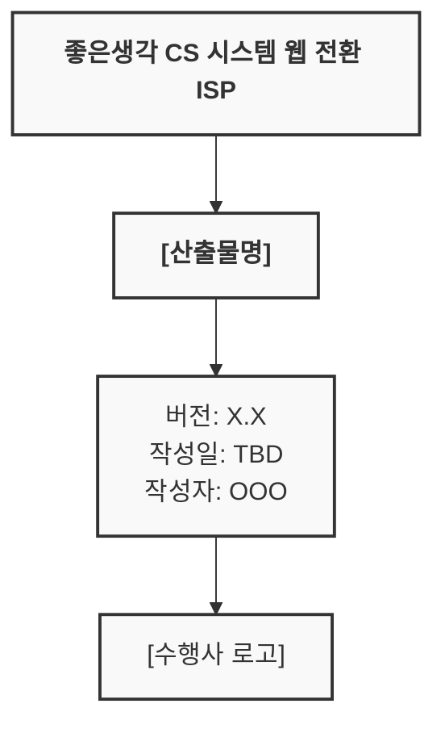

# 산출물 목록

## 산출물 현황

### 1단계: 분석 (1\~4주, 3/3 \~ 3/27)

| No | 산출물명 | 설명 | 담당 | 확정 예정 | 상태 |
|:--:|----------|------|:----:|:---------:|:----:|
| A-01 | 착수 보고서 | 프로젝트 착수 보고 | 공동 | 3/3 | 미착수 |
| A-02 | 현행 업무흐름도 | AS-IS 업무 프로세스 | 업무분석가 | 3/27 | 미착수 |
| A-03 | AS-IS ERD | 현행 DB 구조 역공학 결과 | IT컨설턴트 | 3/27 | 미착수 |
| A-04 | 인터뷰 기록 | 실무자 인터뷰 결과 | 업무분석가 | 3주차 | 미착수 |
| A-05 | 시스템 구조적 문제 진단서 | 현행 시스템 문제점 분석 | IT컨설턴트 | 3/27 | 미착수 |
| A-06 | 요구사항 목록 (초안) | 현업 요구사항 수집 결과 | 업무분석가 | 3/27 | 미착수 |

### 2단계: 설계 (5\~6주, 3/30 \~ 4/10)

| No | 산출물명 | 설명 | 담당 | 확정 예정 | 상태 |
|:--:|----------|------|:----:|:---------:|:----:|
| D-01 | 시스템 아키텍처 설계서 | TO-BE 시스템 구조 | IT컨설턴트 | 4/10 | 미착수 |
| D-02 | TO-BE ERD | 통합 데이터 모델 | IT컨설턴트 | 4/10 | 미착수 |
| D-03 | 데이터 표준 정의서 (코드 정의서) | 코드, 도메인 정의 | IT컨설턴트 | 4/10 | 미착수 |
| D-04 | 인터페이스 정의서 | 시스템 연동 설계 | IT컨설턴트 | 4/10 | 미착수 |
| D-05 | BPR 설계서 | 자동화 프로세스 설계 | 업무분석가 | 4/10 | 미착수 |
| D-06 | 화면 설계서 (Wireframe) | 웹 어드민 화면 설계 | 업무분석가 | 4/10 | 미착수 |
| D-07 | 요구기능정의서 (상세) | 상세 기능 명세 | 업무분석가 | 4/10 | 미착수 |

### 3단계: 계획 (7\~8주, 4/13 \~ 4/30)

| No | 산출물명 | 설명 | 담당 | 확정 예정 | 상태 |
|:--:|----------|------|:----:|:---------:|:----:|
| P-01 | 데이터 이관 계획서 | 마이그레이션 상세 계획 | IT컨설턴트 | 4/24 | 미착수 |
| P-02 | 구축 이행 계획서 | 구축 단계별 계획 | IT컨설턴트 | 4/24 | 미착수 |
| P-03 | 비용 산정서 | 구축 비용 산출 | IT컨설턴트 | 4/24 | 미착수 |
| P-04 | 제안요청서 (RFP) | 입찰용 RFP 문서 | 공동 | 4/30 | 미착수 |
| P-05 | 최종 보고서 | ISP 최종 결과 보고 | 공동 | 5/1 | 미착수 |

---

## 산출물 상태 범례

| 상태 | 의미 |
|:----:|------|
| 미착수 | 미착수 |
| 작성 중 | 작성 중 |
| 검토 중 | 검토 중 |
| 완료 | 완료 |

---

## 산출물 양식

### 문서 작성 표준

#### 표지 구성



#### 문서 이력

| 버전 | 날짜 | 작성자 | 변경 내용 |
|------|------|--------|----------|
| 0.1 | | | 초안 작성 |
| 0.9 | | | 검토 반영 |
| 1.0 | | | 최종 승인 |

#### 문서 구조

```
1. 개요
   1.1 목적
   1.2 범위
   1.3 참조 문서
   1.4 용어 정의

2. 본문
   ...

3. 부록
   ...
```

---

## 검토 기준

### 검토 체크리스트

#### 분석 산출물

| 항목 | 상태 |
|------|------|
| 현행 시스템의 전체 범위가 포함되었는가? | 미완료 |
| 역공학 결과가 실제와 일치하는가? | 미완료 |
| 요구사항이 누락 없이 수집되었는가? | 미완료 |
| 문제점이 객관적으로 분석되었는가? | 미완료 |

#### 설계 산출물

| 항목 | 상태 |
|------|------|
| 요구사항이 모두 반영되었는가? | 미완료 |
| 기술적 실현 가능성이 검토되었는가? | 미완료 |
| 보안 요구사항이 반영되었는가? | 미완료 |
| 설계 간 일관성이 유지되는가? | 미완료 |

#### 계획 산출물

| 항목 | 상태 |
|------|------|
| 일정이 현실적인가? | 미완료 |
| 비용 산정 근거가 명확한가? | 미완료 |
| 리스크가 식별되고 대응 방안이 있는가? | 미완료 |
| RFP가 요구사항을 명확히 기술하는가? | 미완료 |

---

## 산출물 관리

### 버전 관리

- 주요 버전: 승인 시 증가 (1.0 → 2.0)
- 부 버전: 수정 시 증가 (1.0 → 1.1)
- 초안: 0.x 버전

### 파일 명명 규칙

```
[프로젝트코드]_[산출물코드]_[산출물명]_v[버전].[확장자]

예시:
GT-ISP_A-03_AS-IS_ERD_v1.0.pdf
GT-ISP_D-07_요구기능정의서_v0.9.xlsx
```

### 저장 위치

```
/좋은생각_ISP/
├── 01_분석/
│   ├── A-01_착수보고서/
│   ├── A-02_업무흐름도/
│   └── ...
├── 02_설계/
│   ├── D-01_아키텍처설계서/
│   └── ...
├── 03_계획/
│   ├── P-01_이관계획서/
│   └── ...
└── 99_참고자료/
```

---

## 작성 이력

| 날짜 | 작성자 | 변경 내용 |
|------|--------|----------|
| 2026-02-10 | - | 초안 작성 |
