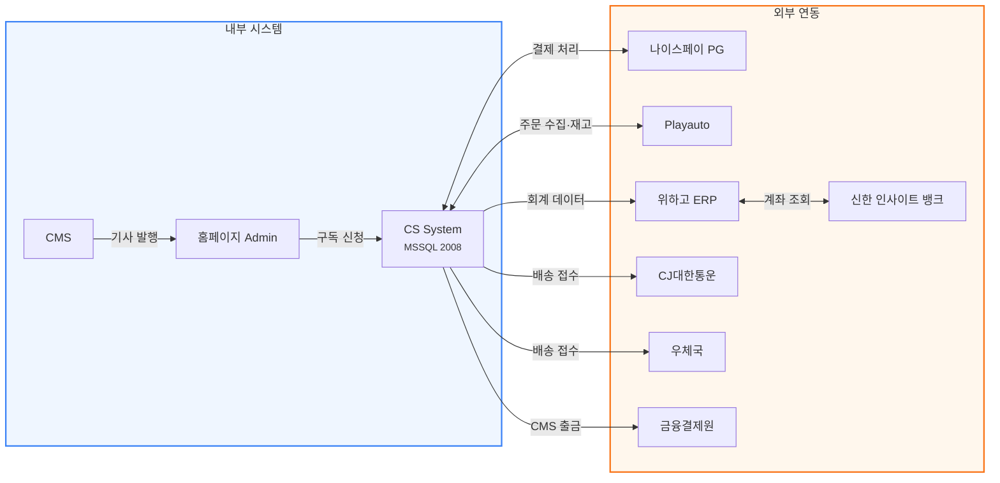
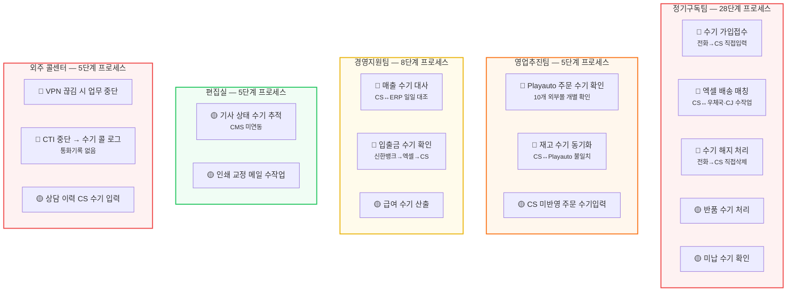
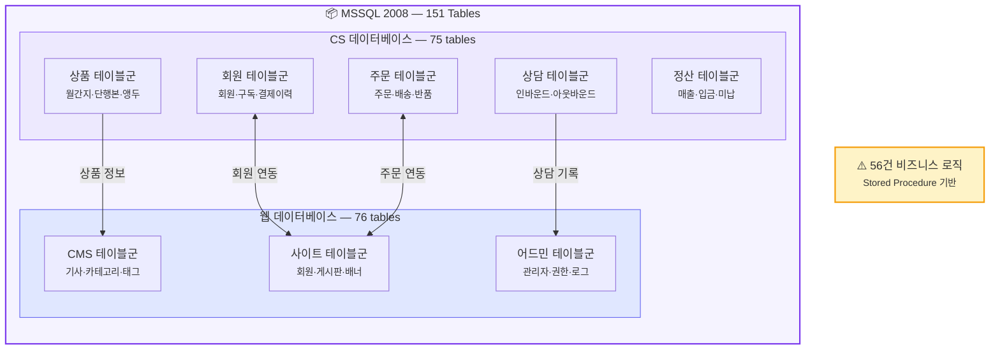

# 엔티티 관계도 (Entity Relationship Map)

좋은생각의 **조직(Organization) → 시스템(System) → 업무(Process)** 간 연계를 한눈에 파악할 수 있도록 구성한 전체 관계도입니다.

---

## 1. 전체 조감도

조직이 어떤 시스템을 사용하고, 어떤 업무를 수행하는지 3개 레이어로 조망합니다.

```mermaid
flowchart TB
    %% ── 조직 레이어 ──
    subgraph ORG["🏢 조직 (Organization)"]
        direction LR
        SUB["정기구독팀<br/><small>정황규 · 어은진</small>"]
        SALES["영업추진팀<br/><small>이성수 · 권지은</small>"]
        MGMT["경영지원팀<br/><small>송윤경 · 김나현</small>"]
        EDIT_M["월간지팀<br/><small>이민애 편집장 外</small>"]
        EDIT_B["단행본팀<br/><small>강시현</small>"]
        CHERRY["앵두아트프로젝트"]
        CALL["외주 콜센터<br/><small>더아이앤오 ~4명</small>"]
    end

    %% ── 시스템 레이어 ──
    subgraph SYS["💻 시스템 (System)"]
        direction LR
        CS["CS System<br/><small>XPlatform / MSSQL 2008<br/>86화면</small>"]
        CMS["CMS<br/><small>기사관리 시스템</small>"]
        ADMIN["홈페이지 Admin<br/><small>Node.js</small>"]
        PLAY["Playauto<br/><small>외부몰 연동</small>"]
        NICE["나이스페이 PG<br/><small>4~5 계정</small>"]
        ERP["위하고 ERP"]
        CJ["CJ대한통운"]
        POST["우체국"]
        NAS["NAS"]
        BANK["신한 인사이트 뱅크"]
        CTI["서울정보시스템 CTI<br/><small>⚠️ 중단</small>"]
    end

    %% ── 업무 레이어 ──
    subgraph PROC["📋 업무 프로세스 (Process)"]
        direction LR
        P_SUB["정기구독 관리<br/><small>신규가입·해지·배송</small>"]
        P_SALES["외부몰 판매<br/><small>주문수집·재고·CS</small>"]
        P_MGMT["경영관리<br/><small>회계·인사·입출금</small>"]
        P_EDIT["콘텐츠 제작<br/><small>기사작성·편집·인쇄</small>"]
        P_CHERRY["앵두 제품관리<br/><small>상품등록·배송</small>"]
        P_CALL["인바운드 CS<br/><small>수신·상담·처리</small>"]
    end

    %% ── 조직 → 시스템 연결 ──
    SUB -->|"주력"| CS
    SUB --> NICE
    SUB --> POST
    SUB --> CJ

    SALES -->|"주력"| CS
    SALES --> PLAY
    SALES --> CJ

    MGMT -->|"주력"| CS
    MGMT --> ERP
    MGMT --> BANK

    EDIT_M --> CMS
    EDIT_M --> NAS
    EDIT_B --> CMS
    EDIT_B --> NAS

    CHERRY --> ADMIN
    CHERRY --> PLAY
    CHERRY --> CJ

    CALL -->|"VPN 접속"| CS
    CALL --> CTI

    %% ── 조직 → 업무 연결 ──
    SUB -.->|"수행"| P_SUB
    SALES -.->|"수행"| P_SALES
    MGMT -.->|"수행"| P_MGMT
    EDIT_M -.->|"수행"| P_EDIT
    EDIT_B -.->|"수행"| P_EDIT
    CHERRY -.->|"수행"| P_CHERRY
    CALL -.->|"수행"| P_CALL

    %% ── 스타일 ──
    style ORG fill:#dbeafe,stroke:#3b82f6,stroke-width:2px
    style SYS fill:#fef3c7,stroke:#f59e0b,stroke-width:2px
    style PROC fill:#d1fae5,stroke:#10b981,stroke-width:2px
    style CTI fill:#fee2e2,stroke:#ef4444,stroke-width:2px,stroke-dasharray: 5 5
```

---

## 2. 시스템 간 연동 관계

내부 시스템과 외부 시스템 간의 데이터 흐름을 보여줍니다.

---

## 3. 수작업 병목 지도

현행 업무에서 식별된 **49건의 수작업** 중 핵심 병목 20건을 팀별로 표시합니다.
빨간색 항목이 개선 우선순위가 높은 병목 구간입니다.

---

## 4. 데이터베이스 구조 개요

CS System의 MSSQL 2008 데이터베이스 151개 테이블 구성을 보여줍니다.

---

## 범례

| 기호 | 의미 |
|------|------|
| 🔴 | 높은 우선순위 병목 (업무 지연·오류 발생) |
| 🟡 | 중간 우선순위 (비효율적이나 운영 가능) |
| `실선 →` | 시스템 사용 / 데이터 흐름 |
| `점선 -.->` | 업무 수행 관계 |
| ⚠️ | 서비스 중단 또는 주의 필요 |

---

> **다음 단계**: 인터랙티브 네트워크 그래프(D3.js / vis.js)로 전환하여 클릭·필터·줌 기능을 추가할 예정입니다.
