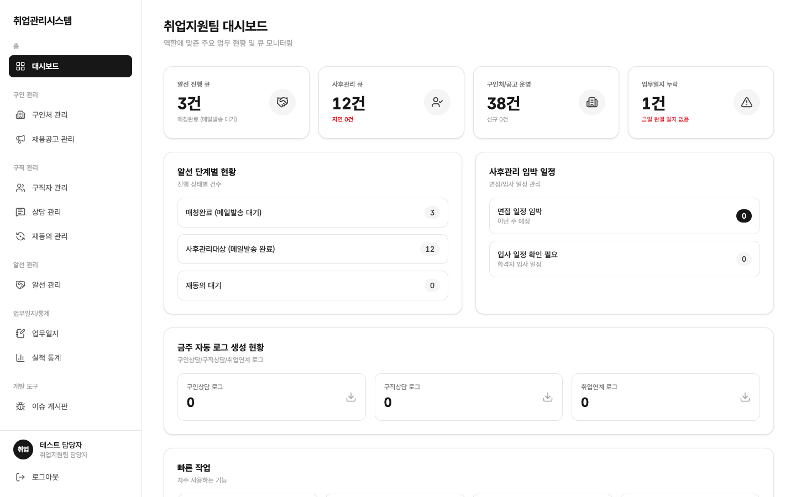

# 2.2 취업지원팀 담당자

취업 연계 실무의 중심입니다. 구인처·공고 등록을 독점하고, 알선과 재동의 문자발송, 통계까지 센터 전체 흐름을 운영합니다. 처음 테스트할 때는 이 계정을 권장합니다.

## 하루 일과

1. **대시보드 확인**: [화면 · 대시보드](../screens/02-dashboard/)에서 알선 진행 큐·사후관리 큐·구인처/공고 운영·업무일지 누락·재동의 긴급 알림을 봅니다
2. **구인처·공고 운영**: [화면 · 구인처 관리](../screens/03-companies/) · [화면 · 채용공고 관리](../screens/04-offers/)에서 신규 등록·수정·공고 상태 변경(모집중 ⇄ 마감)을 합니다
3. **상담 예약 관리**: [화면 · 상담 관리](../screens/06-supports/)에서 전체 예약을 등록하고(담당 상담사 자유 지정), 필요시 담당자 변경·취소를 제어합니다
4. **알선 진행**: [화면 · 알선 관리](../screens/07-referrals/)에서 신규 알선을 만들고 단계를 전환하며, 면접·입사·결과를 확정합니다
5. **재동의 문자발송**: [화면 · 재동의 관리](../screens/08-consent/)에서 대상자에게 문자를 발송하고, 상담사의 유선 결과를 확인합니다. 유선 결과 대리 기록도 가능합니다
6. **업무일지 검토·통계**: [화면 · 업무일지](../screens/09-worklogs/)에서 상담사가 제출한 일지를 검토하고, [화면 · 실적 통계](../screens/10-statistics/)에서 센터 전체 실적을 봅니다

## 할 수 있는 일 / 없는 일

- ○ 구인처·공고 등록·수정·마감·삭제 (독점), 전체 구직자·예약·알선·재동의 처리
- ○ 재동의 문자 발송, 유선 결과 대리 기록
- ○ 목록 엑셀 다운로드, 전체 통계 조회, 4종 로그 요약 확인
- ✕ 계정 생성·삭제예정 복구·파기 (관리자·마스터 권한, 호출해도 차단)
- ✕ 시스템 관리 화면 접근

## 주의점

- 공고 취소는 되돌릴 수 없습니다 (종단). 마감과 취소를 구분해서 사용하세요
- 알선 합격 확정 후에는 결과를 바꿀 수 없습니다. 확정 전 면접·입사 정보를 최종 확인하세요
- 4종 실적 보고 엑셀 다운로드는 제공 범위 밖으로 보류 중입니다
