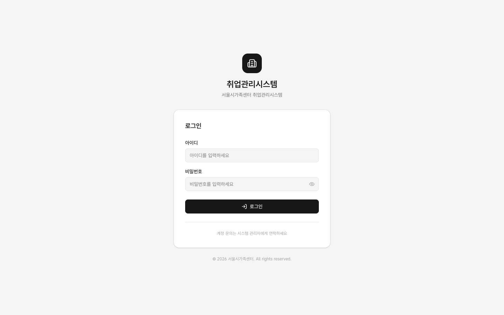

# 1.1 로그인

개발서버 URL로 접속하면 로그인 화면이 나타납니다. 테스트 계정과 비밀번호(`test1234`)를 입력하고 로그인 버튼을 누릅니다 (Enter 키도 동일하게 동작).

- 아이디: 역할별 테스트 계정 (예: `staff@test.local`, 처음에는 staff 권장)
- 비밀번호: 공통 `test1234`
- 로그인 성공 시 대시보드(`/`)로 이동하고, 좌측 하단에 이름·역할이 표시됩니다

## 알아두면 좋은 로그인 보안 동작

- **실패 메시지 미구분**: 존재하지 않는 계정이든 틀린 비밀번호든 동일하게 "이메일 또는 비밀번호가 올바르지 않습니다"로 표시됩니다. 계정 존재 여부를 유추할 수 없게 하려는 정상 동작입니다.
- **반복 실패 시 계정 잠금**: 비밀번호를 5회 연속 틀리면 계정이 잠기고, 정상 비밀번호로도 로그인이 거부됩니다. 잠금 해제는 관리자에게 요청하세요 ([부록 · 운영 안내](../reference/test-operations/) 참조).
- **비활성화 계정**: 퇴사·보직 변경으로 비활성화된 계정은 로그인할 수 없습니다.
- **로그아웃 후 주의**: 로그아웃한 뒤 브라우저 뒤로가기로 이전 화면이 보일 수 있으나 세션은 파기된 상태라 아무 동작도 되지 않습니다. 공용 PC에서는 로그아웃 후 브라우저를 닫아주세요.

## 역할별 첫 화면

로그인 직후 보이는 대시보드는 역할마다 다릅니다. 자세한 구성은 [화면 · 대시보드](./02-dashboard/)에서 확인하세요.
