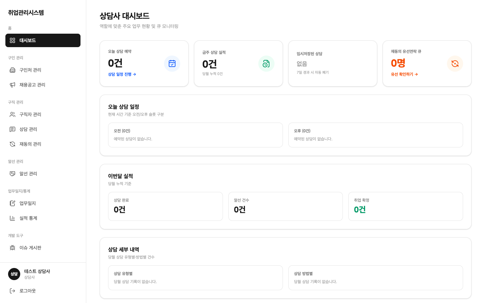
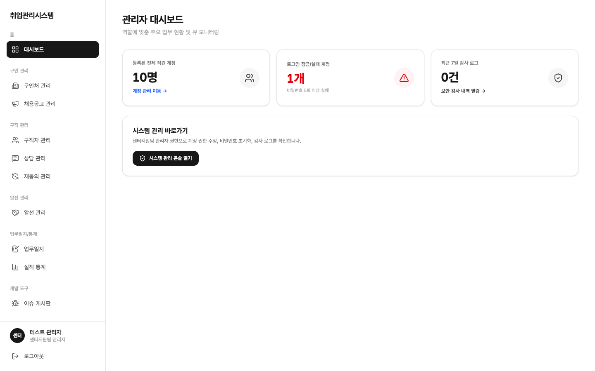
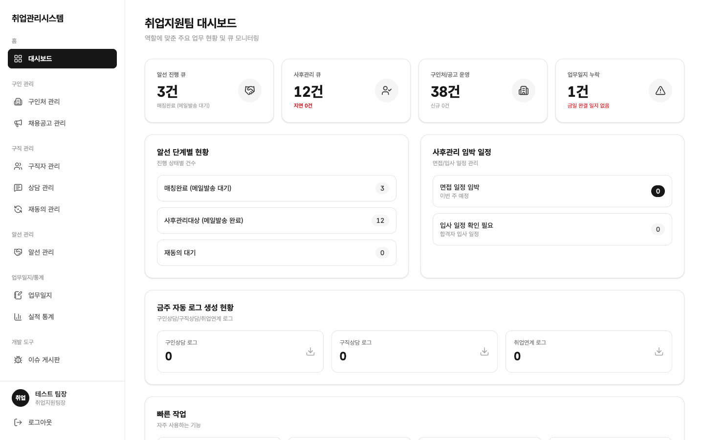

# 1.2 대시보드

같은 주소(`/`)라도 로그인한 역할마다 구성이 다른 첫 화면입니다.

## 취업지원팀 담당자 (staff)

센터 전체 실무 흐름을 모니터링하는 화면입니다.

- **알선 진행 큐 / 사후관리 큐**: 단계별 건수, 클릭 시 해당 단계 필터로 이동합니다
- **구인처/공고 운영**: 변경·신규 건수
- **업무일지 누락**: 금일 완결 일지 미작성 경고
- **금주 자동 로그 현황**: 구인상담·구직상담·취업연계 로그 요약
- **재동의 긴급 알림**: 문자 미기록 14일 / 유선 30일 경과 건 경고

## 상담사 (counselor)

본인 담당 데이터 중심으로 표시됩니다. 팀 전체 통계·엑셀 다운로드는 보이지 않습니다.

- **오늘 상담 예약**: 본인 담당 예약 요약, 클릭 시 상담 일정으로 이동
- **금주 상담 실적 / 이번달 실적**: 본인이 완료한 상담 건수, 상담 완료·알선 건수·취업 확정 개인 KPI
- **재동의 유선확인 큐**: 본인 담당 구직자 중 연락이 필요한 인원, 클릭 시 유선 확인하기로 이동
- 타 상담사의 데이터는 카드·목록 어디에도 섞이지 않습니다

## 센터지원팀 관리자 (admin)

시스템 관점의 모니터링 화면입니다.

- 최근 7일 사용자 계정 변경 이력, 감사 로그 이상 징후 요약, 접근 실패·계정 잠금 현황
- 개인정보 보호 원칙에 따라 **실적통계 화면에는 접근할 수 없습니다** (접근 시 차단 메시지 표시, 정상 동작)

## 시스템 마스터 (master)

시스템 전체를 조회하는 관점의 대시보드입니다.

- 전체 조회는 가능하지만 재동의 일괄 변경 같은 실무 데이터 수정은 읽기 전용으로 차단됩니다 (최고 권한 남용 방지)
- 파기(하드딜리트) 실행 권한은 master에게만 있습니다

## 취업지원팀장 (chief)

팀장 전용 화면은 제외된 역할입니다. 로그인은 가능하며 읽기 권한만 선행 부여되어 있습니다.

- 팀장이 봐야 할 자료는 담당자·관리자가 공유·보고하는 방식으로 대체합니다
