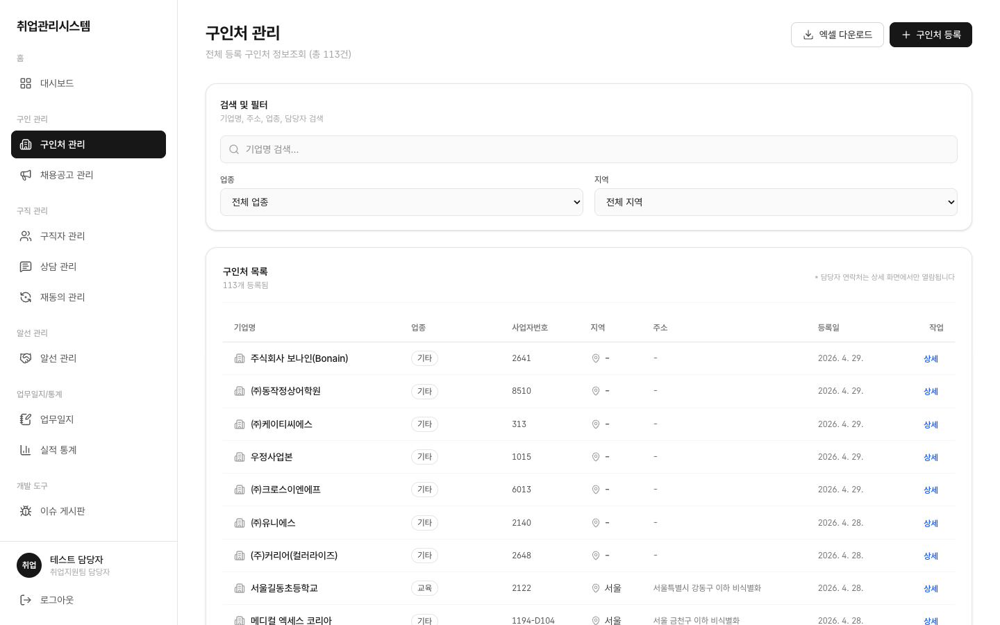
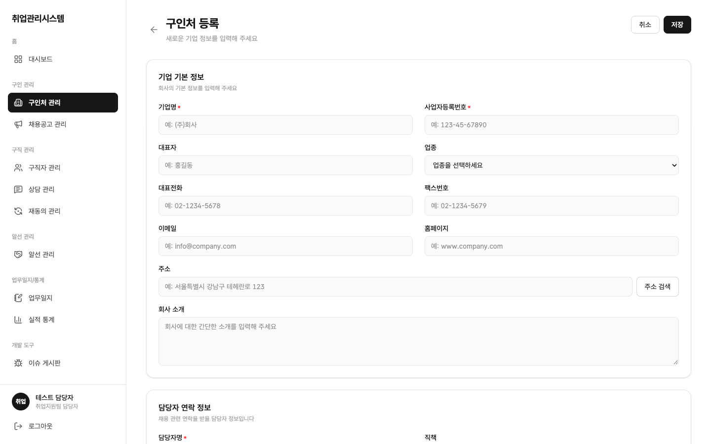
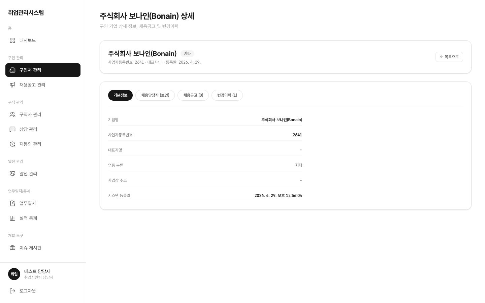

# 1.3 구인처 관리

## 이 화면에서 할 수 있는 일 (역할별)

| 행위 | 상담사 | 담당자(staff) | 관리자(admin) | 마스터 |
|:---|:---:|:---:|:---:|:---:|
| 목록 조회 | ○ | ○ | 제한적 | ○ |
| 등록·수정 | ✕ (등록 페이지 접근 차단) | ○ (독점) | ✕ | ○ |
| 목록 엑셀 다운로드 | ✕ | ○ | ○ | ○ |

- 상담사 계정으로 `/companies/create`에 직접 접근해도 차단됩니다 (화면 가림이 아니라 실제 차단)
- 엑셀에는 담당자/연락처/이메일 컬럼이 포함되지 않습니다 (개인정보 보호, 빠진 것이 정상)

## 목록

좌측 메뉴 **구인처 관리**를 클릭합니다. 검색카드(업종·지역 필터, 주소 검색)와 목록 테이블이 표시됩니다.

- 기업명 검색 + 업종·지역 필터로 목록을 좁힐 수 있습니다 (업종은 표준 14종 카테고리 기준)
- 업종 칩에 마우스를 올리면 이관 원문 툴팁이 표시됩니다
- 지역 컬럼: 주소에서 파생된 시/구 축약 표시
- 헤더 우측 **엑셀 다운로드**(staff/admin/master), **구인처 등록**(staff) 버튼
- ※ 담당자 연락처는 목록에 노출되지 않고 상세 화면에서만 열람됩니다

## 등록 (staff)

**구인처 등록** 버튼을 클릭하면 전용 등록 페이지가 열립니다. 기업 기본정보와 담당자 연락정보를 입력합니다.

- 사업자번호는 숫자만 입력해도 하이픈이 자동 적용됩니다 (`000-00-00000`)
- 주소는 **주소검색 팝업**으로 입력합니다
- 담당자 연락처·이메일은 암호화 저장되며, 변경 시 변경이력이 남습니다
- 회사 소개 등 확장 정보는 함께 저장됩니다

## 상세

목록에서 **상세**를 클릭하면 구인처 정보와 담당자 연락처·이메일, 하단에 연결된 채용공고가 표시됩니다.

- 담당자 연락처·이메일이 표시되는지 확인해 보세요 (목록에서는 안 보이고 상세에서만 보이면 정상)
- 하단 공고 목록에서 해당 구인처의 공고가 바로 보입니다
