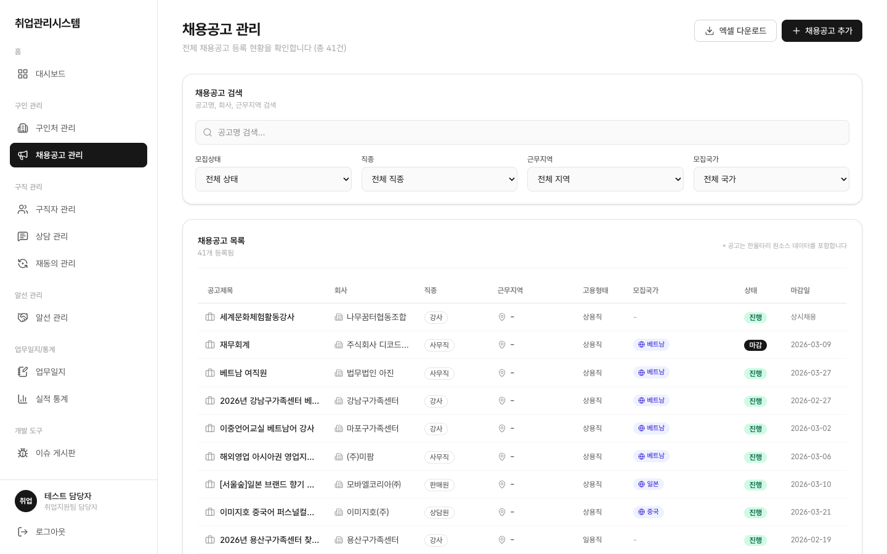
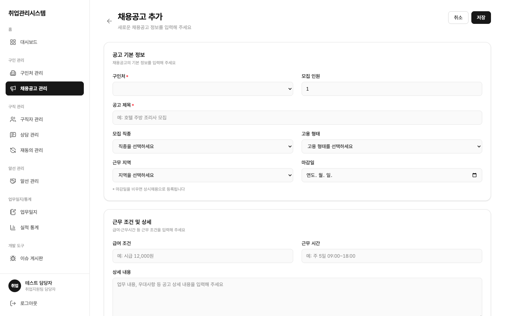
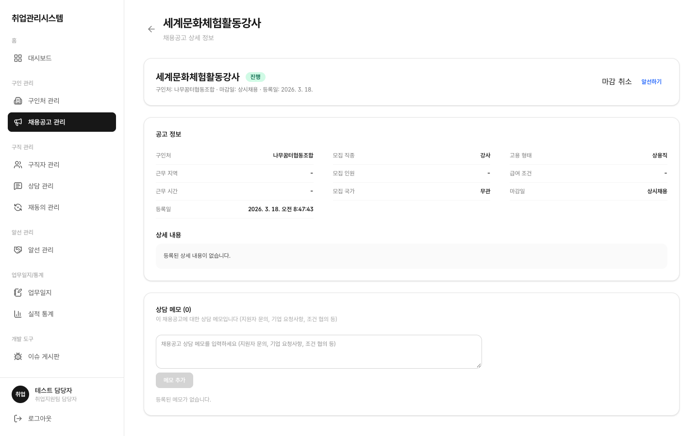

# 1.4 채용공고 관리

## 이 화면에서 할 수 있는 일 (역할별)

| 행위 | 상담사 | 담당자(staff) | 관리자(admin) | 마스터 |
|:---|:---:|:---:|:---:|:---:|
| 목록 조회 | ○ | ○ | 제한적 | ○ |
| 등록·수정·마감·삭제 | ✕ (등록 페이지 접근 차단) | ○ (독점) | ✕ | ○ |
| 목록 엑셀 다운로드 | ✕ | ○ | ○ | ○ |

## 목록

좌측 메뉴 **채용공고 관리**를 클릭합니다. 모집상태·직종·근무지역·모집국가 필터와 목록 테이블이 표시됩니다.

- 모집국가 2개 초과 시 "외 N" 축약 표시, 회사명은 길면 잘림(110px) 처리됩니다
- 상태 배지: 진행(초록) / 마감(검정)으로 한눈에 구분됩니다

## 등록 (staff)

**공고 등록** 버튼 → 구인처를 선택해 공고를 저장합니다.

## 상세 · 상태 변경 (staff)

공고 제목을 클릭하면 상세 페이지가 열립니다. 요약 헤더 + 전체 필드 + 상세내용 + 상담 메모로 구성됩니다.

- 상태 변경: 모집중 ⇄ 마감, 취소는 종단(되돌릴 수 없음)이며, DB가 강제하므로 화면에서 우회할 수 없습니다
- 마감된 공고에는 신규 알선이 만들어지지 않습니다 (알선 등록 시 공고 목록에서 제외되면 정상)
- **상담 메모**: 공고 단위 메모(지원자 문의, 기업 요청사항, 조건 협의 등)를 남길 수 있습니다. 구직자 댓글과 달리 공고에 귀속됩니다
