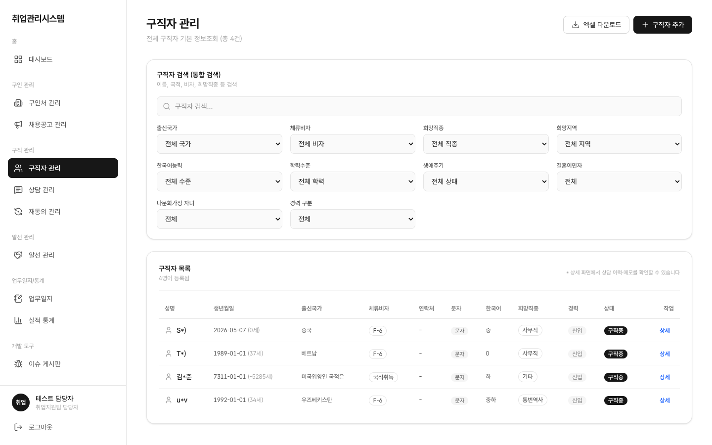
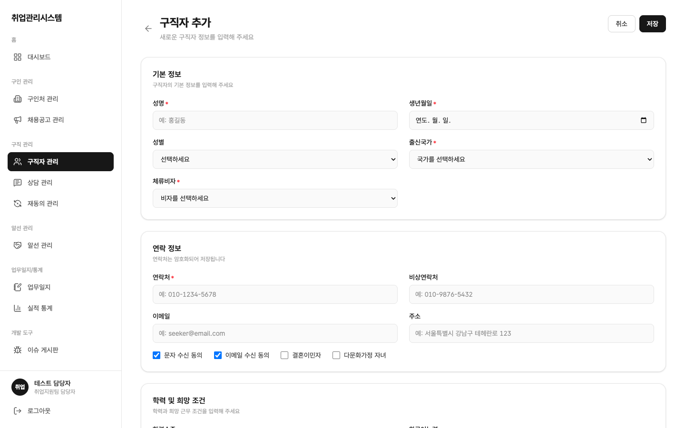
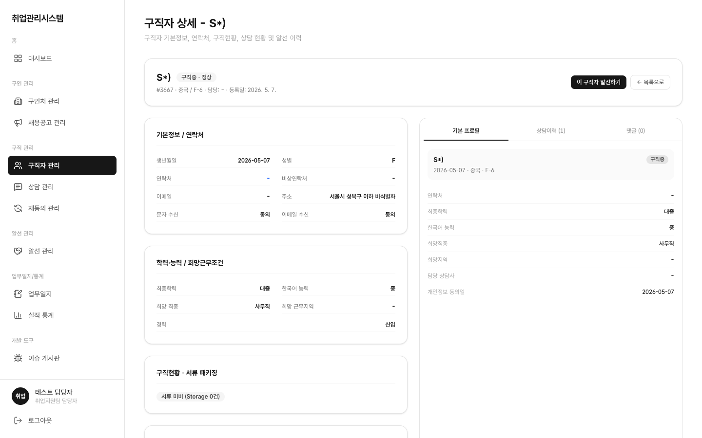

# 1.5 구직자 관리

## 이 화면에서 할 수 있는 일 (역할별)

| 행위 | 상담사 | 담당자(staff) | 관리자(admin) | 마스터 |
|:---|:---:|:---:|:---:|:---:|
| 목록 조회 | 본인 담당 위주 | 전체 | 제한적 (PII 열람 금지) | 전체 |
| 등록 | ○ (담당은 본인으로) | ○ | ✕ | ○ |
| 상세 열람 | 본인 담당만 (타 담당 접근 차단) | 전체 | 상담 내용·연락처 차단 | 전체 |
| 댓글(협업메모) 작성 | ○ | ○ | ✕ | ○ |
| 목록 엑셀 다운로드 | ✕ | ○ | ✕ | ○ |

- 상담사가 타인 담당 구직자 상세 URL을 직접 입력해도 데이터가 노출되지 않습니다 (API/DB 계층에서 차단)
- 관리자는 계정·감사 담당이므로 상담 내용과 연락처를 열어볼 수 없습니다

## 목록

좌측 메뉴 **구직자 관리**를 클릭합니다. 출신국가·체류비자·구직상태·희망직종·한국어능력·최종학력·거주지역·경력구분(신입/경력) 필터가 제공됩니다.

- 경력 배지: 신입(회색)/경력(파랑). 마우스 올리면 원문이 툴팁으로 표시됩니다
- 상담사 계정으로는 본인 담당 위주로만 보입니다

## 등록

**구직자 등록** 버튼으로 신규 구직자를 저장합니다. 연락처는 암호화 저장됩니다.

- 상담사가 등록할 때는 담당 상담사가 본인으로 설정되어야 합니다 (빈 담당자로는 저장되지 않음)
- 개인정보 수집 동의일이 함께 기록되며, 이 날짜가 6개월 지나면 재동의 대상으로 자동 선정됩니다 ([화면 · 재동의 관리](./08-consent/))

## 상세

기본정보·연락처, 학력·능력·희망근무조건, 경력, 상담이력, 알선이력이 한 화면에 표시됩니다.

- **기본 프로필 / 상담이력 / 댓글 탭**: 우측 패널 탭으로 전환하며 확인합니다
- **댓글 피드(협업메모)**: 담당자 간 공유 메모입니다. 역할 배지(상담사=초록/지원팀=파랑)와 함께 표시되고, 새로고침 후에도 유지됩니다. 작성이 겹쳐도 내용이 유실되지 않습니다
- **서류 패키지**: 이력서·자격증 등 첨부 파일 현황 (교체 시 삭제 후 재업로드, 덮어쓰기 없음)
- 연락처는 권한에 따라 마스킹 표시됩니다
