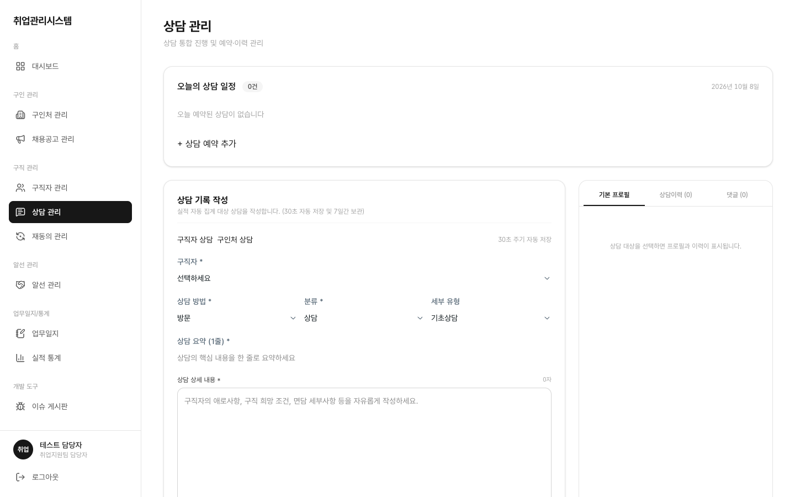

# 1.6 상담 관리

## 이 화면에서 할 수 있는 일 (역할별)

| 행위 | 상담사 | 담당자(staff) | 관리자(admin) | 마스터 |
|:---|:---:|:---:|:---:|:---:|
| 예약 등록·수정·완료·취소 | 본인 담당만 | 전체 (담당자 변경·취소 제어) | ✕ (화면 접근 차단) | ○ |

좌측 메뉴 **상담 관리**를 클릭합니다. 오늘의 상담 예약 목록과 상담 기록 화면이 표시됩니다.

## ① 예약 등록

구직자를 선택하고 담당 상담사와 일시를 지정합니다. 오전/오후 구분으로 일정이 정리됩니다.

- staff는 담당 상담사를 자유 지정할 수 있고, 예약 상세에서 담당자를 임의 변경·취소할 수 있습니다
- 상담사는 본인 담당 예약만 등록·수정할 수 있고, 타인 담당 예약은 수정할 수 없습니다

## ② 상담 기록·완료

예약 상세에서 상담 내용을 작성 후 저장·완료 처리합니다.

- **구직자 상담 / 구인처 상담 중 하나만 선택**: 구직자 상담이면 구직자를, 구인처 상담이면 구인처(공고)를 채웁니다. 둘 다 선택하면 저장되지 않습니다 (화면 검증 + DB 제약 이중 차단)
- **30초 자동 임시저장**: 작성 중 30초마다 "자동 저장됨" 토스트가 표시됩니다. 저장 전 브라우저를 새로고침(F5)해도 "작성 중이던 내용 불러오기"로 복원됩니다
- 유선 재동의 연락 결과를 기록하면 상담 실적 1건(사후상담 유형)으로 자동 반영됩니다

## ③ 업무일지 반영 확인

당일 상담 건수가 업무일지에 자동 반영됩니다. 상담 완료 후 대시보드 "금일 상담" 수치가 +1 되는지, [화면 · 업무일지](./09-worklogs/)의 당일 집계에 잡히는지 확인해 보세요.
