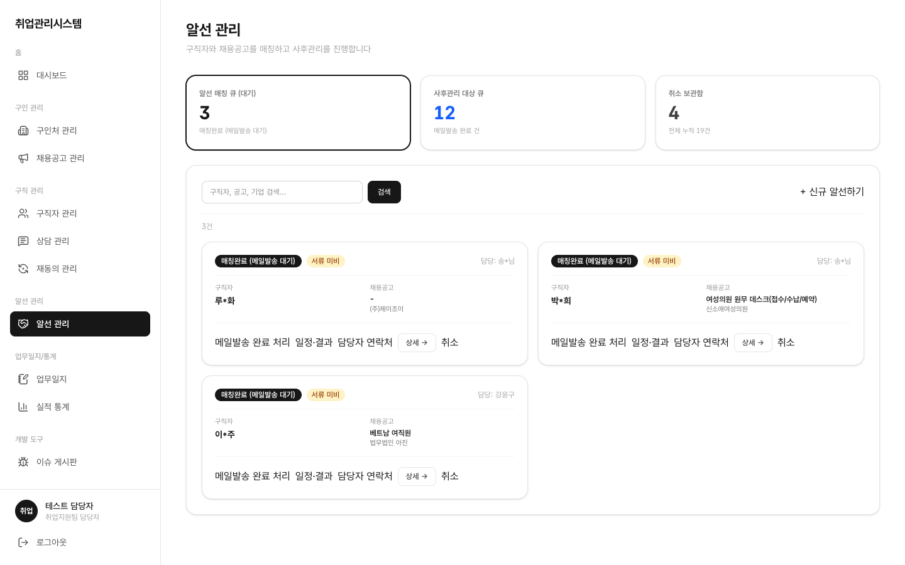
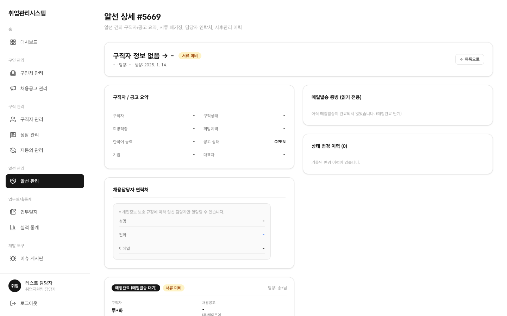

# 1.7 알선 관리

구직자와 채용공고를 매칭해 취업으로 연결하는 핵심 업무입니다. 자동 매칭·AI 추천은 없고 상담사가 수동으로 알선합니다.

## 이 화면에서 할 수 있는 일 (역할별)

| 행위 | 상담사 | 담당자(staff) | 관리자(admin) | 마스터 |
|:---|:---:|:---:|:---:|:---:|
| 목록 조회 | 담당 건 | 전체 | 제한적 | 전체 |
| 신규 생성·단계 전환 | ✕ | ○ | ✕ | ○ |
| 면접·입사·결과 입력 | ✕ | ○ | ✕ | ○ |
| 취소 | ✕ | ○ (사유 기록) | ✕ | ○ |

좌측 메뉴 **알선 관리**를 클릭합니다. 상단 카운트 카드 + 단계 탭 + 키워드 검색 + 카드형 알선 목록이 표시됩니다.

## 신규 알선

**신규 알선** 버튼 → 2단계 검색 모달에서 구직자 1명과 채용공고 1건을 선택해 생성합니다. 마감된 공고는 선택 목록에 나오지 않습니다.

## 단계 전환과 상태 규칙

알선 카드에서 단계를 전환합니다: **알선전 → 발송 → 접수 → 사후관리** (취소는 어느 단계에서든 가능하며 종단).

- **알선전→접수 직접 접수 허용**: 발송을 거치지 않고 바로 접수 단계로 만들 수 있습니다
- 면접일·입사일·결과(합격/불합격)는 모달로 입력하며 카드에 반영됩니다
- 결과 **합격 확정 후에는 다시 변경할 수 없습니다** (재변경 금지, DB가 강제). 합격으로 확정한 뒤 결과가 바뀌지 않는지 확인해 보세요
- 합격 확정 시 해당 구직자 상태가 취업확정으로 바뀝니다 (구직자 상세에서 확인)
- 알선 단계 카드를 클릭하면 해당 단계 필터로 이동합니다
- 취소 시 취소 사유가 기록되고 취소 보관함에서 전체 누적 건수를 볼 수 있습니다

## 상세

카드의 **상세**를 클릭하면 알선 진행 내역이 표시됩니다.

