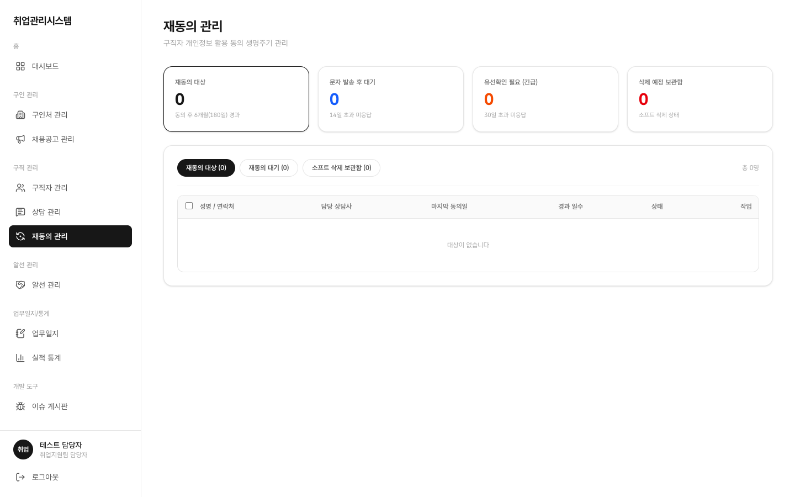

# 1.8 재동의 관리

개인정보 수집 동의 6개월 경과자를 대상으로 문자→유선 순서로 재동의를 받습니다. 응답이 없으면 목록에서 숨김(소프트 삭제) 처리되고, 30일이 지나면 완전 삭제(파기)됩니다.

## 이 화면에서 할 수 있는 일 (역할별)

| 행위 | 상담사 | 담당자(staff) | 팀장(chief) | 관리자(admin) | 마스터 |
|:---|:---:|:---:|:---:|:---:|:---:|
| 전체 목록·전체 상태 조회·처리 | ✕ | ○ | 조회 전용 | ✕ | 읽기 전용 |
| 본인 담당 '유선확인 필요' 조회·처리 | ○ | ○ | 해당 없음 | ✕ | 해당 없음 |
| 문자 발송 | ✕ (호출 시 차단) | ○ | ✕ | ✕ | ✕ |
| 유선 결과 대리 기록 | ✕ | ○ | ✕ | ✕ | ✕ |
| 삭제예정 복구 (30일 이내) | ✕ | ✕ | ✕ | ○ (유일) | ○ |
| 완전 삭제(파기) | ✕ | ✕ | ✕ | ✕ (호출 시 차단) | ○ (유일) |

좌측 메뉴 **재동의 관리**를 클릭합니다. 상태 카드 4종 + 긴급 배너 + 탭 3개로 구성됩니다.

1. **상태 카드 4종 + 긴급 배너**: 문자 미기록 14일 / 유선 30일 경과 시 경고 배너가 표시됩니다
2. **탭 3개**: 재동의 대상 / 대기 / 소프트 삭제 보관함을 전환하며 확인합니다
3. **문자 발송** (staff): 대상자를 선택해 문자 발송 처리합니다. 상담사 계정으로는 문자 발송이 차단됩니다
4. **유선 확인** (counselor): 본인 담당 구직자 중 "유선확인 필요" 건만 보입니다. 타인 담당 대상은 보이지 않습니다. 연락 결과를 기록하면 상담 실적 1건으로 자동 반영됩니다
5. 처리 완료된 건은 staff 화면에서 완료 상태로 바뀝니다
6. **삭제예정 복구** (admin): 미응답으로 숨김 처리된 구직자를 30일 이내에 정상 상태로 되돌릴 수 있는 유일한 권한입니다
7. **파기** (master): 소프트 삭제 후 30일이 지난 건을 완전히 삭제합니다. 통계 데이터는 비식별 형태로 보존됩니다
