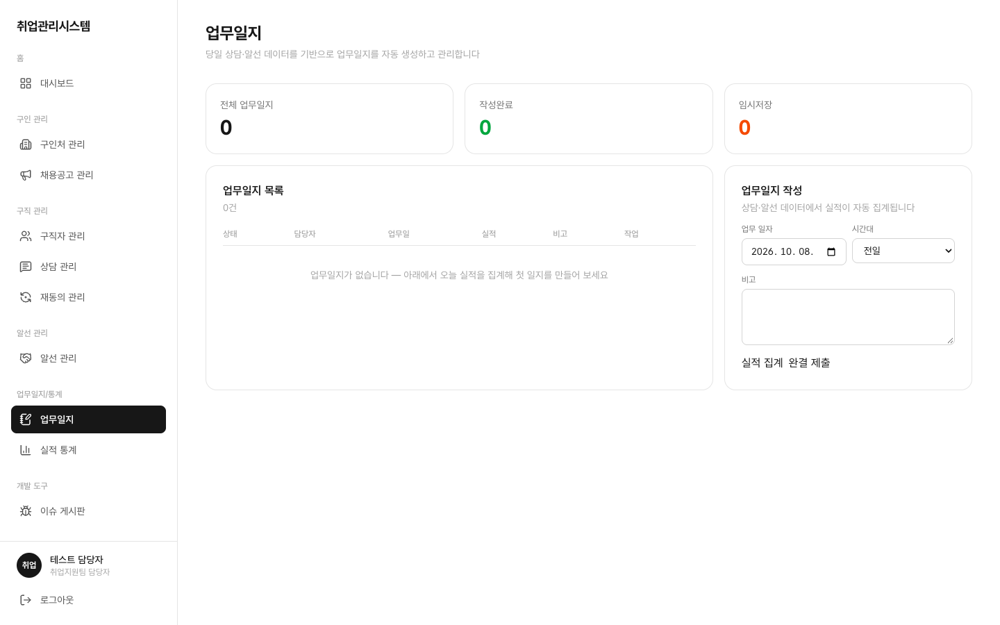

# 1.9 업무일지

하루의 상담·알선 실적을 정리해 제출하는 화면입니다. 상담사와 담당자가 작성하고, 담당자가 검토합니다.

## 이 화면에서 할 수 있는 일 (역할별)

| 행위 | 상담사 | 담당자(staff) | 관리자(admin) |
|:---|:---:|:---:|:---:|
| 작성·완결 제출·인쇄 | ○ | ○ (검토) | ✕ (화면 접근 차단) |

좌측 메뉴 **업무일지**를 클릭합니다. 시간대(전일/오전/오후)를 선택하고 비고를 작성한 뒤 완결 제출합니다.

- **시간대 슬롯**: 전일/오전/오후 중 선택합니다. 실적 자동 집계도 슬롯별 시간 범위(오전 ~11:59 / 오후 12:00~)로 필터링됩니다
- **실적 자동 집계**: 당일 상담·알선 건수가 자동으로 집계됩니다. [화면 · 상담 관리](./06-supports/)에서 완료 처리한 건이 여기 숫자에 반영되는지 확인해 보세요
- **완결 제출**: 제출 후에는 수정이 제한되므로 비고를 최종 확인하고 제출합니다
- **브라우저 인쇄**: 완결된 일지는 브라우저 인쇄(Ctrl/Cmd + P)로 출력합니다 (PDF 전용 저장은 제공 범위 밖)
