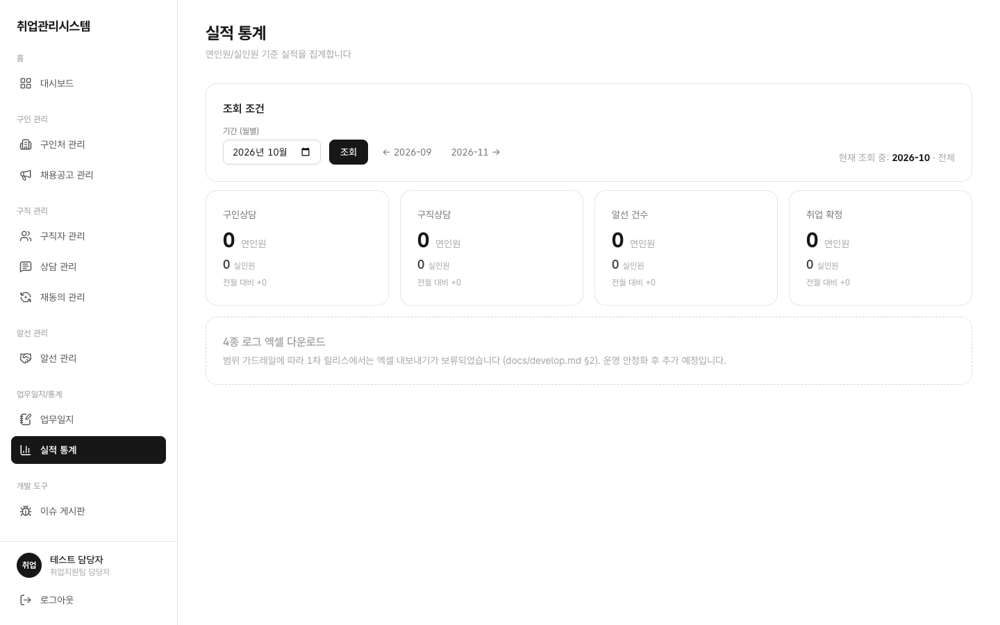

# 1.10 실적 통계

센터 전체 실적을 월 단위로 조회하는 화면입니다.

## 이 화면에서 할 수 있는 일 (역할별)

| 행위 | 상담사 | 담당자(staff) | 관리자(admin) | 마스터 |
|:---|:---:|:---:|:---:|:---:|
| 조회 | 본인 실적만 | 전체 | ✕ (전면 차단) | ○ |

좌측 메뉴 **실적 통계**를 클릭합니다. 월 이동 조회, 4개 KPI 카드, 담당자별 상세 테이블이 표시됩니다.

- **4개 KPI 카드**: 연인원/실인원/전월 대비 등 핵심 지표
- **월 이동 조회**: 이전·다음 달로 이동하며 월별 누계를 확인합니다 (일별 집계에서 합산)
- **담당자별 상세 테이블**: 담당자별 실적 내역
- 상담사 계정으로는 본인 실적만 필터링되어 보이고 타인 데이터는 차단됩니다
- 관리자(admin) 계정으로 접근하면 차단 메시지가 표시됩니다 (개인정보 보호 원칙, 정상 동작이니 놀라지 마세요)
- 4종 실적 보고 엑셀(구인상담·구직상담·취업연계·누계실적 로그) 다운로드는 제공 범위 밖으로 보류 중입니다
