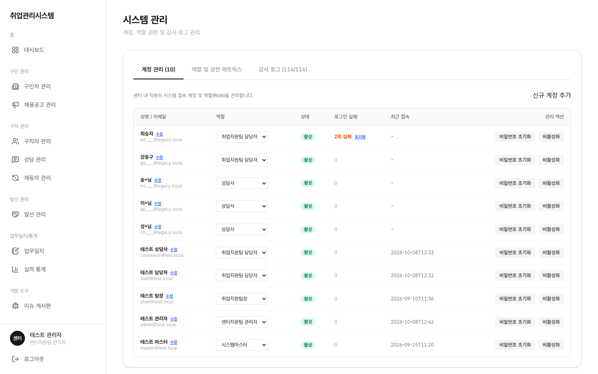

# 1.11 시스템 관리

계정·역할·감사 로그를 다루는 관리자 전용 화면입니다. 사이드바 **시스템 관리** 메뉴는 admin·master에게만 보이고, 나머지 역할은 메뉴 자체가 없고 `/system` 직접 접근도 차단됩니다.

## 이 화면에서 할 수 있는 일 (역할별)

| 행위 | 상담사·담당자·팀장 | 관리자(admin) | 마스터 |
|:---|:---:|:---:|:---:|
| 화면 접근 | ✕ (메뉴 숨김 + 직접 접근 차단) | ○ | ○ |
| 계정 생성·수정·비활성화 | ✕ | ○ | ✕ (마스터는 계정 관리 안 함) |
| 비밀번호 초기화·잠금 해제 | ✕ | ○ | ✕ |
| 감사 로그 조회 | ✕ | ○ | ○ |
| 완전 삭제(파기) 실행 | ✕ | ✕ | ○ (유일) |

## 계정 관리 탭

센터 내 직원의 시스템 접속 계정과 역할을 관리합니다. 이름/역할/상태/로그인실패/최근로그인이 표시됩니다.

- **신규 계정 추가**: 우측 상단 버튼으로 계정을 생성하고 역할을 부여합니다
- **역할 변경**: 목록에서 직접 역할을 바꿀 수 있고, 변경 시 감사 로그에 기록됩니다
- **비밀번호 초기화·비활성화**: 퇴사·보직 변경 시 비활성화하고, 분실 시 초기화합니다
- **잠금 해제**: 5회 실패로 잠긴 계정은 여기서 해제합니다 (해제 후 카운터 초기화)
- :::caution[알려진 제약]
  현재 개발서버에서는 계정 생성과 비밀번호 초기화가 실패합니다 (`Admin endpoints require the service_role key`). 서버 키 설정 후 해소 예정이니, 신규 계정이 필요하면 문의처로 요청해 주세요.
  :::

## 역할 및 권한 매트릭스 탭

[부록 · 권한 매트릭스](../reference/permissions/)와 동일한 내용이 화면에 읽기 전용으로 표시됩니다. 본인 권한이 궁금할 때 여기서 확인하세요.

## 감사 로그 탭

민감정보 열람·대량 다운로드·권한 변경 같은 주요 이벤트를 추적합니다. 다운로드 자체도 감사 대상입니다.
