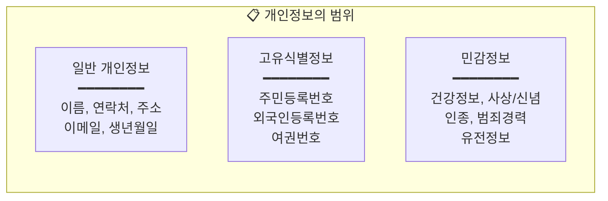
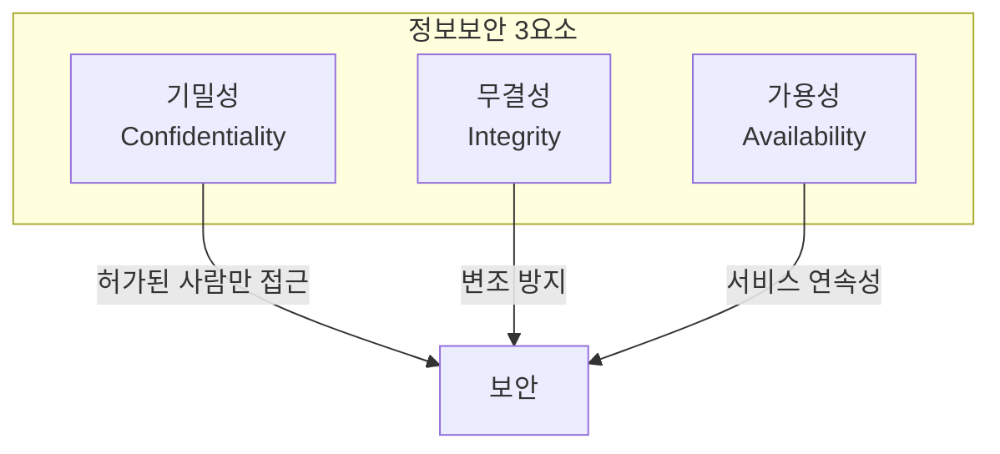
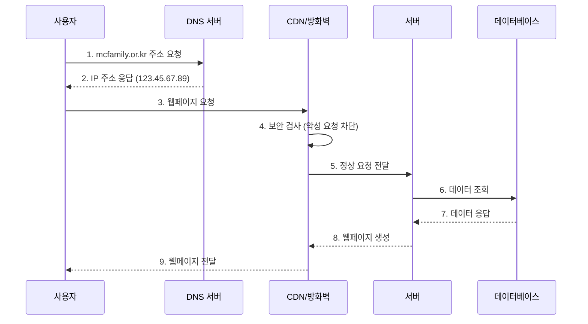
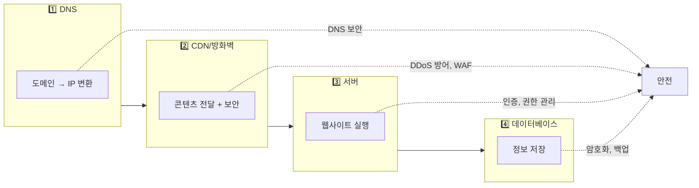
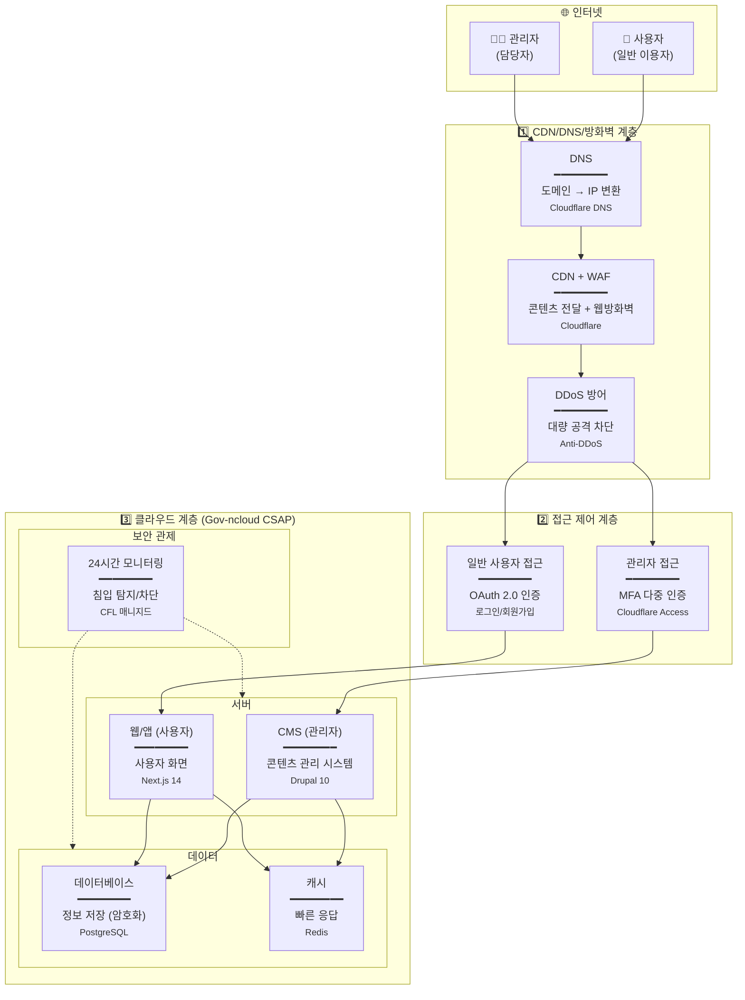
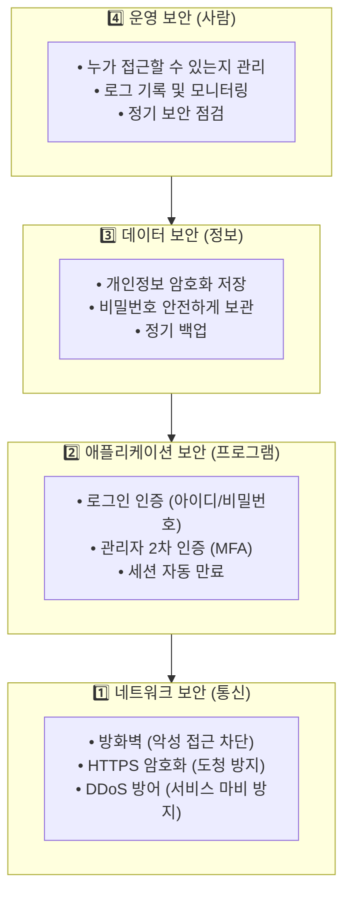
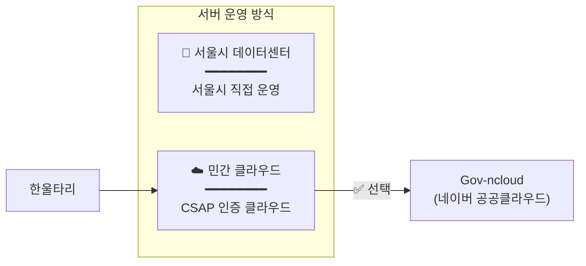
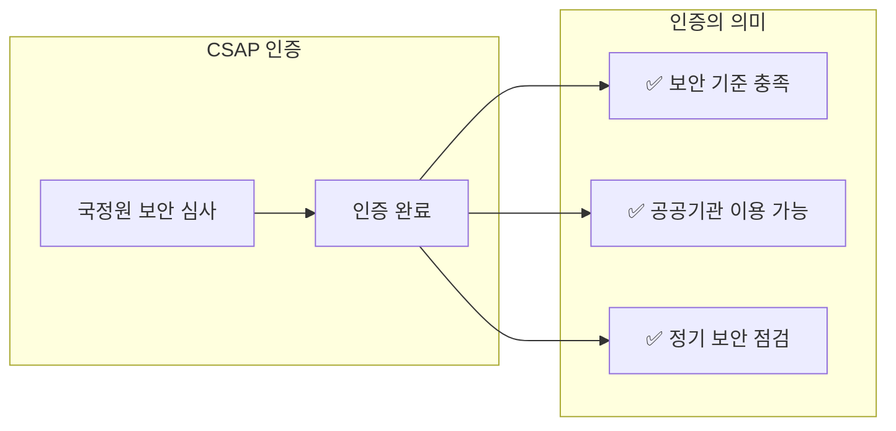
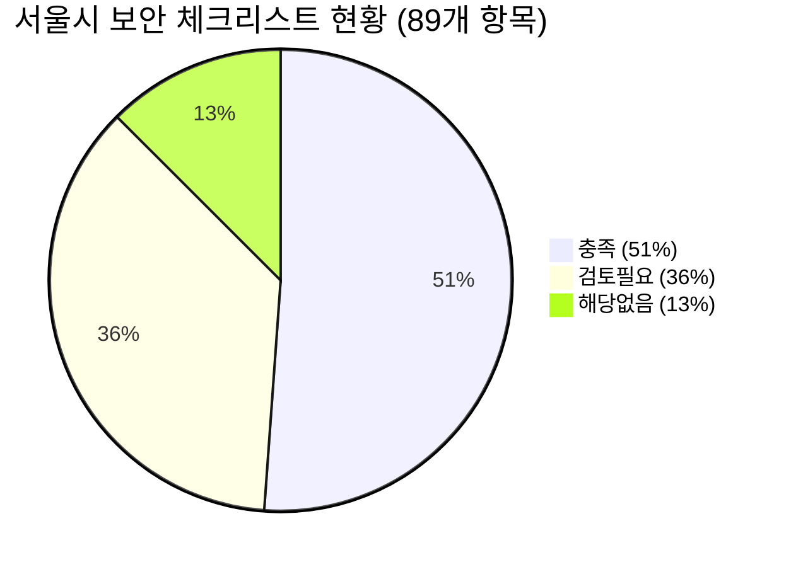

> **소요시간**: 20분 (14:05~14:25)  
> **목표**: 웹서비스 보안의 기본 개념을 이해하고, 한울타리 시스템에 어떻게 적용되어 있는지 파악

---

## 1.1 개인정보 보안이란 무엇인가?

### 개인정보란?

> **살아 있는 개인을 식별할 수 있는 정보** (개인정보보호법 제2조)



| 분류 | 예시 | 보호 수준 |
|------|------|-----------|
| **일반 개인정보** | 이름, 연락처, 주소, 이메일 | 기본 보호 |
| **고유식별정보** | 주민등록번호, 외국인등록번호 | 암호화 필수 |
| **민감정보** | 국적, 체류자격, 건강정보 | 최고 수준 보호 |

### 한울타리가 다루는 개인정보

**한울타리**는 다문화가족의 **개인정보**를 다루는 공공 서비스입니다.

```
👤 이용자 정보
├── 이름, 연락처, 주소 (일반 개인정보)
├── 국적, 체류자격 (민감정보)
├── 프로그램 신청 이력
└── 상담 내용
```

### 개인정보 보안이란?

> **개인정보를 보호하기 위한 기술적·관리적·물리적 조치**

| 구분 | 내용 | 예시 |
|------|------|------|
| **보호 대상** | 개인정보 (위 정보들) | 이용자의 이름, 연락처, 국적 등 |
| **보호 방법** | 기술적 + 관리적 조치 | 암호화, 접근통제, 정책 수립 |
| **보호 목적** | 유출·변조·훼손 방지 | 안전한 서비스 제공 |

### 왜 개인정보 보안이 중요한가?

이 정보가 유출되거나 변조되면:
- 이용자 피해 (개인정보 악용)
- 서울시 신뢰도 하락
- 법적 제재 (과징금 최대 매출액 10%)

### 정보보안의 3요소 (CIA)

> 모든 보안 활동은 이 3가지를 지키기 위한 것입니다.

| 요소 | 영어 | 의미 | 예시 |
|------|------|------|------|
| **기밀성** | Confidentiality | 허가된 사람만 정보 열람 | 회원정보는 담당자만 볼 수 있음 |
| **무결성** | Integrity | 정보가 변조되지 않음 | 콘텐츠가 해커에 의해 수정되지 않음 |
| **가용성** | Availability | 필요할 때 서비스 이용 가능 | 사이트가 항상 정상 작동 |



---

## 1.2 웹서비스 기본 구조 이해

### 사용자가 웹사이트에 접속하는 과정

> "mcfamily.or.kr을 입력하면 무슨 일이 일어날까요?"



### 주요 용어 설명

| 용어 | 쉬운 설명 | 비유 |
|------|-----------|------|
| **DNS** | 도메인 이름을 IP 주소로 변환 | 전화번호부 (이름 → 번호) |
| **IP 주소** | 인터넷에서 컴퓨터의 고유 주소 | 집 주소 |
| **CDN** | 전 세계에 분산된 서버로 빠르게 콘텐츠 전달 | 전국 배송센터 |
| **방화벽** | 악성 접근을 차단하는 보안 장치 | 건물 출입문 보안요원 |
| **서버** | 웹사이트를 실행하는 컴퓨터 | 가게 직원 |
| **데이터베이스** | 정보를 저장하는 창고 | 서류 보관함 |
| **CMS** | 콘텐츠를 쉽게 관리하는 시스템 | 워드프로세서 (글쓰기 도구) |
| **클라우드** | 인터넷을 통해 빌려 쓰는 컴퓨터 | 렌터카 (필요할 때 빌려 씀) |

### 각 단계에서의 보안



---

## 1.3 한울타리 시스템 구조

### 개념 → 실제 적용

| 개념 | 역할 | 한울타리 적용 |
|------|------|---------------|
| **DNS** | 도메인 → IP 변환 | Cloudflare DNS |
| **CDN** | 콘텐츠 빠른 전달 | Cloudflare CDN |
| **방화벽** | 악성 접근 차단 | Cloudflare WAF + Gov-ncloud FW |
| **접근 제어** | 관리자 인증 강화 | Cloudflare Access (MFA) |
| **클라우드** | 서버 인프라 | Gov-ncloud (정부 승인) |
| **CMS** | 콘텐츠 관리 | Drupal 10 |
| **앱/웹** | 사용자 화면 | Next.js 14 |
| **데이터베이스** | 정보 저장 | PostgreSQL |
| **캐시** | 빠른 응답 | Redis |
| **보안 관제** | 24시간 모니터링 | CFL 매니지드 |

### 적용 솔루션 상세 설명

#### 🌐 Cloudflare (클라우드플레어)

> 전 세계 320개 이상 데이터센터를 보유한 CDN·보안 서비스 기업

| 서비스 | 한울타리 적용 | 효과 |
|--------|--------------|------|
| **Cloudflare DNS** | mcfamily.or.kr 도메인 관리 | 빠른 DNS 응답 + DDoS 방어 |
| **Cloudflare CDN** | 정적 콘텐츠 배포 | 전 세계 빠른 접속 |
| **Cloudflare WAF** | 웹 방화벽 | SQL Injection, XSS 등 해킹 차단 |
| **Cloudflare Access** | 관리자 페이지 보호 | 이메일 OTP 인증 (MFA) |

> **왜 Cloudflare인가?**  
> 무료~저비용으로 기업급 보안 제공, 국내외 공공기관 다수 사용

#### ☁️ Gov-ncloud (네이버클라우드 공공 전용)

> 국정원 CSAP 인증을 받은 **정부·공공기관 전용** 클라우드

| 항목 | 내용 |
|------|------|
| **운영사** | 네이버클라우드 (NCloud) |
| **인증** | ✅ CSAP (클라우드 보안인증) |
| **데이터 위치** | 대한민국 국내만 |
| **환경** | 공공기관 전용 독립 환경 |
| **보안관제** | 24시간 CFL 매니지드 |
| **SLA** | 99.9% 가용성 보장 |

> **왜 Gov-ncloud인가?**  
> 공공기관이 민간 클라우드를 이용하려면 CSAP 인증 필수. 국내 데이터 저장 보장.

#### 📝 Drupal 10 (드루팔)

> 전 세계 정부·기업에서 사용하는 **오픈소스 CMS(콘텐츠 관리 시스템)**

| 항목 | 내용 |
|------|------|
| **버전** | Drupal 10.5.1 (2024년 최신) |
| **언어** | PHP 8.3 |
| **특징** | 다국어 지원, 역할 기반 권한, 번역 워크플로우 |
| **사용 기관** | 미국 백악관, NASA, 영국 정부, 서울시 등 |

> **왜 Drupal인가?**  
> 5개 언어 지원, 복잡한 권한 관리, 공공기관 보안 요건 충족

#### ⚡ Next.js 14 (넥스트JS)

> Vercel이 개발한 **React 기반 웹 프레임워크**

| 항목 | 내용 |
|------|------|
| **버전** | Next.js 14 |
| **언어** | TypeScript |
| **특징** | 서버 사이드 렌더링, 빠른 페이지 로딩 |
| **역할** | 사용자가 보는 화면 (프론트엔드) |

#### 🗄️ PostgreSQL + Redis

| 솔루션 | 역할 | 특징 |
|--------|------|------|
| **PostgreSQL** | 데이터베이스 | 암호화 저장, 대용량 처리, 오픈소스 |
| **Redis** | 캐시 | 빠른 응답, 세션 관리, 메모리 기반 |

### 전체 시스템 구성도



### 한울타리 서비스 정보

| 구분 | 내용 |
|------|------|
| **서비스명** | 한울타리 (다문화가족 통합 정보 플랫폼) |
| **운영 주체** | 서울시 다문화담당관 → 서울시가족센터 위탁 |
| **개발/운영** | 스컹크웍스스튜디오 |
| **이용자** | 다문화가족, 외국인 주민 |
| **지원 언어** | 한국어, 영어, 중국어, 일본어, 베트남어 (5개) |
| **주요 기능** | 정보 제공, 프로그램 신청, 한국어 교육, 취업 지원 |

---

## 1.4 보안 계층별 이해

### 보안은 여러 겹으로 보호합니다

> 마치 집을 보호하는 것처럼, 여러 단계의 보안이 필요합니다.



### 계층별 상세 설명

#### 1️⃣ 네트워크 보안 - "통신을 보호"

| 보안 기술 | 쉬운 설명 | 한울타리 적용 |
|-----------|-----------|---------------|
| **방화벽 (Firewall)** | 허가되지 않은 접근 차단 | Gov-ncloud 방화벽 |
| **WAF** | 웹 공격(해킹) 시도 차단 | Cloudflare WAF |
| **HTTPS/SSL** | 통신 내용 암호화 (도청 방지) | 전 구간 적용 |
| **DDoS 방어** | 대량 접속 공격 방어 | Cloudflare Anti-DDoS |

> **HTTPS란?** 🔒  
> 브라우저 주소창에 자물쇠가 표시되면 HTTPS가 적용된 것입니다.  
> 사용자와 서버 사이의 모든 통신이 암호화되어 제3자가 볼 수 없습니다.

#### 2️⃣ 애플리케이션 보안 - "로그인을 보호"

| 보안 기술 | 쉬운 설명 | 한울타리 적용 |
|-----------|-----------|---------------|
| **아이디/비밀번호 인증** | 기본 로그인 | OAuth 2.0 |
| **MFA (다중 인증)** | 비밀번호 + 추가 인증 | 관리자 필수 적용 |
| **세션 타임아웃** | 미사용 시 자동 로그아웃 | 10분 설정 |
| **로그인 실패 제한** | 연속 실패 시 계정 잠금 | 5회 실패 시 잠금 |

> **MFA(다중요소 인증)란?** 🔐  
> 비밀번호만으로는 부족! 추가로 휴대폰 인증코드나 이메일 확인이 필요합니다.  
> 비밀번호가 유출되어도 추가 인증 없이는 접근 불가능합니다.

#### 3️⃣ 데이터 보안 - "정보를 보호"

| 보안 기술 | 쉬운 설명 | 한울타리 적용 |
|-----------|-----------|---------------|
| **암호화 저장** | 정보를 알아볼 수 없게 저장 | PostgreSQL 암호화 |
| **비밀번호 해시** | 비밀번호를 복원 불가능하게 저장 | SHA-256 해시 |
| **백업** | 정기적으로 복사본 저장 | 일일 백업 |

> **해시(Hash)란?** 🔢  
> 비밀번호 "MyPass123"을 저장할 때:  
> ❌ 그대로 저장 → 유출 시 즉시 노출  
> ✅ 해시 저장 → "a7f3b2c1..." 형태로 변환, 원본 복원 불가

#### 4️⃣ 운영 보안 - "사람을 관리"

| 보안 기술 | 쉬운 설명 | 한울타리 적용 |
|-----------|-----------|---------------|
| **권한 관리** | 업무에 필요한 권한만 부여 | 역할별 권한 분리 |
| **로그 기록** | 누가 무엇을 했는지 기록 | 접속/작업 로그 |
| **보안 관제** | 24시간 이상 징후 모니터링 | CFL 매니지드 |
| **정기 점검** | 취약점 발견 및 개선 | 연 1회 이상 |

---

## 1.5 클라우드와 정부 인증

### 클라우드란?

> 직접 서버를 사지 않고, 인터넷으로 빌려 쓰는 컴퓨터 자원

| 구분 | 직접 구축 | 클라우드 |
|------|-----------|----------|
| 비용 | 초기 비용 높음 | 사용한 만큼 지불 |
| 관리 | 직접 관리 | 전문 업체가 관리 |
| 확장 | 새 장비 구매 필요 | 클릭 몇 번으로 확장 |
| 보안 | 직접 구축 | 전문 보안 서비스 제공 |

### 서버 운영 방식 비교

> "한울타리 서버를 어디에 둘 것인가?"



| 구분 | 서울시 데이터센터 | 민간 클라우드 (Gov-ncloud) |
|------|-------------------|---------------------------|
| **운영 주체** | 서울시 직접 운영 | 네이버클라우드 + CSAP 인증 |
| **물리적 위치** | 서울시 데이터센터 | 국내 데이터센터 (법적 동일) |
| **보안 인증** | 서울시 자체 기준 | ✅ 국정원 CSAP 인증 |
| **비용 구조** | 고정 비용 (장비 구매) | 종량제 (사용량 기반) |
| **확장성** | 장비 추가 구매 필요 | 즉시 확장 가능 |
| **보안관제** | 서울시 자체 관제 | ✅ 24시간 CFL 매니지드 |
| **장애 대응** | 서울시 인력 대응 | 전문 인력 즉시 대응 |
| **이관 난이도** | - | 별도 이관 프로젝트 필요 |

#### 왜 민간 클라우드(Gov-ncloud)를 선택했나?

| 이유 | 설명 |
|------|------|
| **CSAP 인증** | 국정원 보안 심사 통과, 법적 요건 충족 |
| **비용 효율** | 초기 투자 없이 사용량 기반 과금 |
| **전문 보안관제** | 24시간 CFL 매니지드 (IPS, WAF, Anti-DDoS) |
| **빠른 확장** | 트래픽 증가 시 즉시 서버 확장 |
| **국내 데이터 보관** | 대한민국 내 데이터센터만 사용 |

> **참고**: 서울시 데이터센터 이관 시 별도 프로젝트 수행 필요 (스컹크웍스는 이관 경험 없음)

### CSAP (클라우드 보안인증)란?

> **Cloud Security Assurance Program**  
> 국가정보원이 운영하는 클라우드 보안 인증 제도



### 한울타리의 클라우드 현황

| 항목 | 내용 |
|------|------|
| **사용 클라우드** | Gov-ncloud (네이버클라우드 공공 전용) |
| **인증 상태** | ✅ CSAP 인증 완료 |
| **데이터 위치** | 대한민국 국내 데이터센터만 사용 |
| **환경 분리** | 공공기관 전용 독립 환경 |
| **가용성 보장** | SLA 99.9% |
| **보안 관제** | 24시간 전문 관제 서비스 |

---

## 1.6 현재 보안 적용 현황

### ✅ 적용 완료된 보안 조치

| 보안 영역 | 적용 기술 | 설명 |
|-----------|-----------|------|
| **클라우드 인증** | Gov-ncloud (CSAP) | 정부 승인 클라우드 |
| **관리자 인증** | MFA (다중 인증) | 비밀번호 + 추가 인증 |
| **사용자 인증** | OAuth 2.0 | 표준 로그인 프로토콜 |
| **통신 암호화** | HTTPS/TLS | 모든 통신 암호화 |
| **웹 방화벽** | WAF | 웹 해킹 시도 차단 |
| **DDoS 방어** | Anti-DDoS | 대량 공격 방어 |
| **침입 방지** | IPS | 침입 시도 탐지/차단 |
| **보안 관제** | CFL 매니지드 | 24시간 모니터링 |

### 🔄 진행 중인 보안 조치

| 항목 | 현재 상태 | 목표 |
|------|-----------|------|
| 로그 보관 정책 | 기본 설정 | 1년 보관 정책 수립 |
| 내부관리계획 | 작성 중 | 문서화 완료 |

---

## 1.7 서울시 보안 체크리스트 현황

### 전체 현황

서울시에서 제시한 **89개 보안 점검 항목** 분석 결과:



| 구분 | 항목 수 | 비율 | 설명 |
|------|---------|------|------|
| 🟢 **충족** | 45개 | 51% | 현재 기준 충족 |
| ⚠️ **검토필요** | 32개 | 36% | 문서화/정책 수립 필요 |
| ➖ **해당없음** | 11개 | 13% | 서비스 특성상 해당 없음 |

### 영역별 현황

| 영역 | 충족률 | 상태 |
|------|--------|------|
| 클라우드 인프라 (설비) | 100% | ✅ 완료 |
| 클라우드 인프라 (하드웨어) | 90% | ✅ 대부분 완료 |
| 가상환경 보안 | 80% | ⚠️ 일부 문서화 필요 |
| 정책적 측면 | 50% | 🔴 문서화 필요 |
| 인적 관리 | 40% | 🔴 교육/절차 수립 필요 |
| 감사자료 관리 | 30% | 🔴 로그 보관 정책 필요 |

### 우선 개선 영역

| 우선순위 | 필요 문서 |
|----------|-----------|
| 🔴 **즉시** | 계정/권한 관리 절차서, 침해사고 대응 절차서 |
| 🟡 **1개월** | 감사 로그 관리 정책, 취약점 점검 계획서 |
| 🟢 **3개월** | 데이터 분류 체계, 표준운영절차(SOP) |

---

## 1.8 개인정보보호법 준수 현황

### ✅ 충족 항목

| 항목 | 현황 | 관련 법 조항 |
|------|------|--------------|
| 기술적 보호조치 | ✅ 완료 | 제29조 |
| 접근통제 (MFA) | ✅ 관리자 적용 | 시행령 제30조 |
| 통신 암호화 (HTTPS) | ✅ 전 구간 | 제29조 |
| 비밀번호 암호화 | ✅ SHA-256 | 시행령 제30조 |
| 개인정보 처리방침 | ✅ 웹사이트 공개 | 제30조 |
| 위탁 계약 | ✅ 체결 완료 | 제26조 |

### ⚠️ 검토 필요 항목

| 항목 | 필요 조치 |
|------|-----------|
| 내부관리계획 | 보안 조직·역할·절차 문서화 |
| 접근권한 이력 | 3년간 보관 정책 명문화 |
| 접속기록 보관 | 1~2년 보관 정책 수립 |
| 침해사고 대응 | 72시간 내 신고 절차 문서화 |

### 🔴 2026년 개정 주요 변경사항 (8월 시행)

| 변경 사항 | 영향 |
|-----------|------|
| 유출 "가능성" 단계부터 통지 의무 | 조기 대응 필요 |
| 과징금 최대 10%로 상향 | 제재 강화 |
| 랜섬웨어 피해도 통지 대상 | 범위 확대 |
| CEO 최종책임 명시 | 책임 강화 |

---

## 1.9 핵심 요약

### 🎯 오늘 기억해야 할 것

1. **보안의 목적**: 기밀성, 무결성, 가용성 보호
2. **다층 보안**: 네트워크 → 애플리케이션 → 데이터 → 운영, 여러 겹으로 보호
3. **클라우드 인증**: Gov-ncloud CSAP 인증으로 정부 보안 기준 충족
4. **현재 상태**: 89개 체크리스트 중 51% 충족, 36%는 문서화 작업 중
5. **관리자 인증**: MFA(다중 인증)로 보안 강화됨

### 📚 용어 정리

| 용어 | 의미 |
|------|------|
| DNS | 도메인을 IP 주소로 변환 (전화번호부) |
| CDN | 콘텐츠를 빠르게 전달 (전국 배송센터) |
| 방화벽 | 악성 접근 차단 (건물 보안요원) |
| WAF | 웹 해킹 공격 차단 (웹 전문 방화벽) |
| MFA | 비밀번호 + 추가 인증 (이중 잠금) |
| HTTPS | 통신 암호화 (자물쇠 표시) |
| 클라우드 | 빌려 쓰는 서버 (렌터카) |
| CSAP | 정부 클라우드 보안 인증 |

### ❓ Q&A 예상 질문

**Q: 왜 관리자만 MFA가 적용되어 있나요?**  
A: 관리자는 더 많은 정보에 접근할 수 있어 추가 보안이 필요합니다. 일반 사용자는 OAuth 2.0 기반 인증으로 안전하게 보호됩니다.

**Q: 개인정보는 어디에 저장되나요?**  
A: 대한민국 국내 데이터센터(Gov-ncloud)에만 저장되며, 암호화되어 보관됩니다.

**Q: 해킹당하면 어떻게 되나요?**  
A: 3부에서 자세히 설명하지만, 24시간 보안 관제로 이상 징후를 탐지하고, 침해사고 대응 절차에 따라 조치합니다.

---

*다음: [2부: 서울시 보안 요구사항 해설](../education/part2-operations/)*
