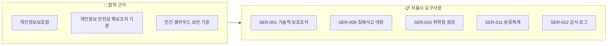
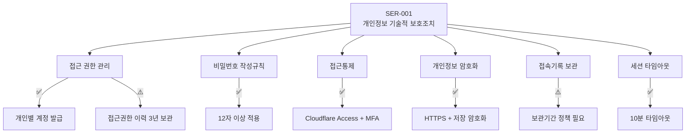
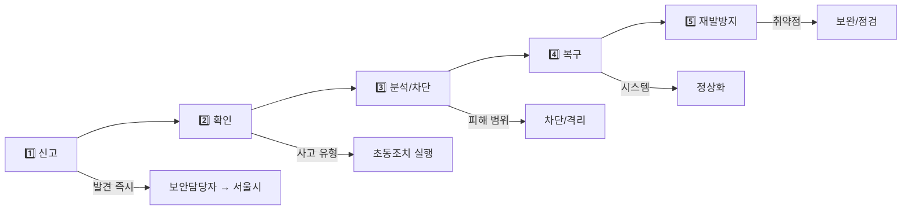
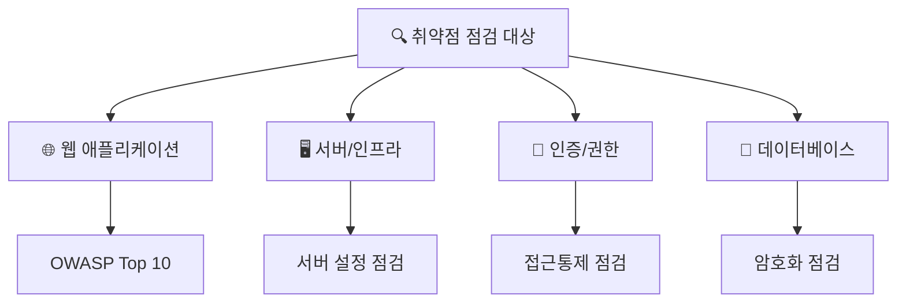
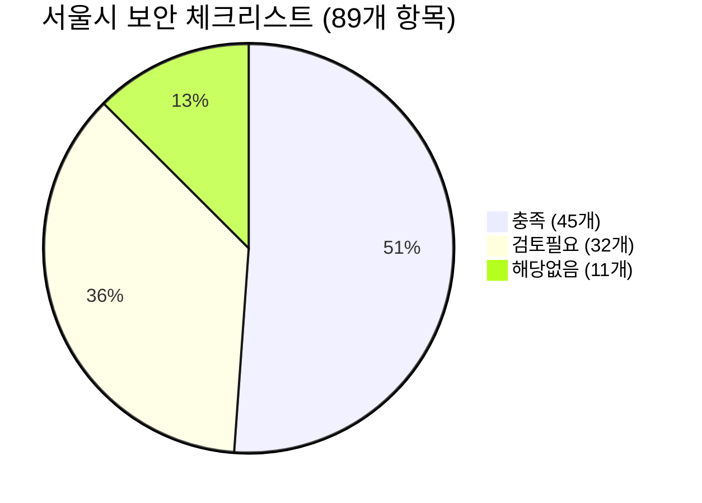
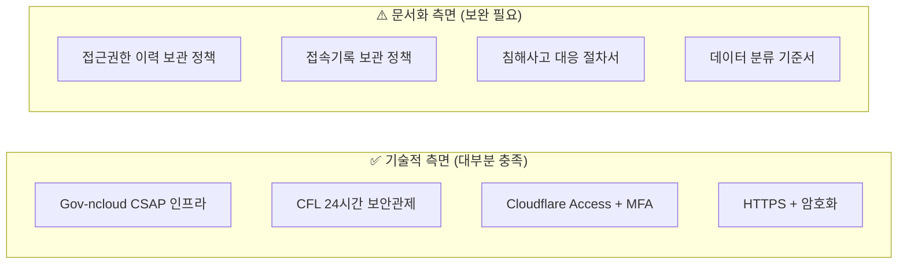

> **소요시간**: 20분 (14:25~14:45)  
> **목표**: 서울시에서 요청한 보안 요구사항(SER)의 의미와 한울타리 충족 현황 이해

---

## 2.1 서울시 보안 요구사항 개요

### 요구사항 배경

서울시는 한울타리 시스템 운영에 대해 **5가지 보안 요구사항(SER)**을 제시했습니다.  
이 요구사항들은 **개인정보보호법**과 **민간 클라우드 컴퓨팅 보안 기준**을 근거로 합니다.

### 요구사항 요약표

| 번호 | 요구사항명 | 핵심 내용 | 현황 |
|------|-----------|-----------|------|
| **SER-001** | 개인정보 기술적 보호조치 | 암호화, 접근통제, 세션관리 | ✅ 대부분 충족 |
| **SER-009** | 침해사고 대응절차 | 5단계 대응절차, 신고체계 | ⚠️ 절차서 필요 |
| **SER-010** | 정기 취약점 점검 | 연 1회 점검 및 조치 | ⚠️ 계획 필요 |
| **SER-011** | 시스템·데이터 분류체계 | 등급분류, 보안기준 | ⚠️ 문서화 필요 |
| **SER-012** | 감사 로그 체계 | 로그 보관, 제공절차 | ⚠️ 정책 필요 |

> **참고**: 1부에서 설명한 기술 아키텍처(Gov-ncloud, Cloudflare, 암호화 등)가 이 요구사항들을 어떻게 충족하는지 해설합니다.

---

## 2.2 SER-001: 개인정보 기술적 보호조치

### 요구사항 원문 요약

> **정의**: 개인정보의 안전성 확보를 위한 기술적 조치사항  
> **근거**: 개인정보보호법, 개인정보 안전성 확보조치 기준

### 세부 요구사항과 충족 현황

#### 1) 접근 권한 관리

| 요구사항 | 한울타리 현황 | 상태 |
|----------|---------------|------|
| 개인별 사용자 계정 발급 | Drupal 사용자 시스템으로 개인별 계정 발급 | ✅ 충족 |
| 역할별 권한 차등 부여 | RBAC 적용 (관리자/지역담당자/번역담당자/작성자) | ✅ 충족 |
| 접근권한 이력 **3년 보관** | 시스템 로그는 존재하나 **보관정책 미수립** | ⚠️ 문서화 필요 |

> **해설**: 역할 기반 접근 통제(RBAC)는 1부 1.4에서 설명한 대로 구현되어 있습니다.  
> **과제**: 접근권한 부여/변경/삭제 이력을 3년간 보관한다는 **정책 문서**가 필요합니다.

#### 2) 비밀번호 작성규칙

| 요구사항 | 한울타리 현황 | 상태 |
|----------|---------------|------|
| 8자리 이상 (2종류 조합) 또는 10자리 이상 (1종류) | **12자리 이상** 적용 | ✅ 초과충족 |
| 추측 어려운 비밀번호 | 연속문자, 생일 등 제한 | ✅ 충족 |
| SHA-256 이상 해시 저장 | SHA-256 해시 적용 | ✅ 충족 |

> **해설**: 서울시 기준(8자리)보다 강화된 12자리 이상을 적용하고 있습니다.

#### 3) 접근통제

| 요구사항 | 한울타리 현황 | 상태 |
|----------|---------------|------|
| 외부 접속 시 안전한 접속수단(SSL) | 전 구간 **HTTPS/TLS 1.2+** 적용 | ✅ 충족 |
| 관리자 접근 통제 | **Cloudflare Access + MFA** (1부 1.4 참조) | ✅ 충족 |

> **해설**: 1부에서 설명한 Cloudflare Access와 MFA가 이 요구사항을 충족합니다.

#### 4) 개인정보 암호화

| 요구사항 | 한울타리 현황 | 상태 |
|----------|---------------|------|
| 전송 시 암호화 (SSL/TLS) | 전 구간 **HTTPS** 적용 | ✅ 충족 |
| 비밀번호 일방향 암호화 | **SHA-256** 해시 저장 | ✅ 충족 |
| 고유식별정보 암호화 저장 | PostgreSQL 암호화 적용 | ✅ 충족 |

> **해설**: 1부 1.3에서 설명한 PostgreSQL 암호화와 HTTPS가 이 요구사항을 충족합니다.

#### 5) 접속기록 보관

| 요구사항 | 한울타리 현황 | 상태 |
|----------|---------------|------|
| 접속 ID, 일시, 처리 정보 기록 | 시스템 로그로 기록 중 | ✅ 충족 |
| **5만명 미만**: 1년 보관 | 한울타리는 **2만명 이하** → **1년 보관** 적용 | ⚠️ 정책 문서 필요 |
| **5만명 이상**: 2년 보관 | (해당 없음) | - |

> **중요**: 한울타리는 **2만명 이하** 회원이므로 **1년 보관**이 법적 최소 요건입니다.  
> **과제**: 접속기록 1년 보관 정책을 **문서화**해야 합니다.

#### 6) 세션 타임아웃

| 요구사항 | 한울타리 현황 | 상태 |
|----------|---------------|------|
| 30분 이상 미사용 시 자동 차단 | **10분** 타임아웃 적용 | ✅ 초과충족 |

> **해설**: 서울시 권고(30분)보다 강화된 10분 타임아웃을 적용하고 있습니다.

### SER-001 충족 요약

| 항목 | 상태 | 비고 |
|------|------|------|
| 접근권한 관리 | ⚠️ | 3년 보관 **정책 문서화** 필요 |
| 비밀번호 규칙 | ✅ | 초과충족 |
| 접근통제 | ✅ | Cloudflare Access + MFA |
| 암호화 | ✅ | HTTPS + DB 암호화 |
| 접속기록 | ⚠️ | 1년 보관 **정책 문서화** 필요 |
| 세션 타임아웃 | ✅ | 초과충족 |

---

## 2.3 SER-009: 침해사고 대응절차

### 요구사항 원문 요약

> **정의**: 침해사고 발생 시 신속하고 일관되게 대응 절차 수행  
> **산출물**: 침해사고 대응 매뉴얼(절차서), 사고보고서

### 요구되는 5단계 대응절차

### 세부 요구사항과 충족 현황

| 요구사항 | 한울타리 현황 | 상태 |
|----------|---------------|------|
| 5단계 대응절차 문서화 | 기본 체계는 있으나 **절차서 미작성** | ⚠️ 절차서 필요 |
| 단계별 책임자, 연락체계 | CFL 보안관제 + 개발팀 연락망 존재 | ⚠️ 문서화 필요 |
| 사고 유형별 초동조치 체크리스트 | **미작성** | ⚠️ 작성 필요 |
| 발주기관(서울시) 보고 기준 | **미수립** | ⚠️ 수립 필요 |
| 악성코드 대응체계 | CFL 보안관제로 탐지/차단 운영 중 | ✅ 충족 |

### 한울타리의 현재 대응 역량

| 단계 | 현재 역량 | 담당 |
|------|-----------|------|
| **신고** | 모니터링 알림 수신 가능 | CFL 보안관제 |
| **확인/분석** | 24시간 위협 분석 | CFL 보안관제 |
| **차단/격리** | IPS, WAF, Anti-DDoS | CFL + Cloudflare |
| **복구** | 백업 체계 운영 | Gov-ncloud |
| **재발방지** | 보안 패치 적용 체계 | 개발팀 |

> **해설**: 기술적 대응 역량(CFL 보안관제)은 확보되어 있습니다.  
> **과제**: **절차를 문서화**하고 **서울시 보고 체계**를 수립해야 합니다.

### SER-009 충족을 위한 과제

1. **침해사고 대응 절차서** 작성
   - 5단계 절차 정의
   - 단계별 책임자 지정
   - 연락체계 명시

2. **서울시 보고 체계** 수립
   - 72시간 내 신고 의무 (개인정보 유출 시)
   - 보고 담당자 지정

---

## 2.4 SER-010: 정기 취약점 점검

### 요구사항 원문 요약

> **정의**: 연 1회 취약점 점검 후 개선 대책 실행  
> **산출물**: 취약점 점검 계획서, 점검 결과보고서, 조치 내역서

### 세부 요구사항과 충족 현황

| 요구사항 | 한울타리 현황 | 상태 |
|----------|---------------|------|
| 연 1회 이상 정기 취약점 점검 | **계획 미수립** | ⚠️ 계획 필요 |
| 점검 항목 및 범위 명시 | - | ⚠️ |
| 취약점 조치 내역서 제출 | - | ⚠️ |
| 재점검 결과 보고서 제출 | - | ⚠️ |

### 취약점 점검 대상 영역

> **해설**: 취약점 점검은 **외부 전문기관**에 의뢰하는 것이 객관성 확보에 유리합니다.  
> **과제**: **연 1회 점검 계획**을 수립하고 **점검 기관을 선정**해야 합니다.

---

## 2.5 SER-011: 시스템·데이터 분류체계

### 요구사항 원문 요약

> **정의**: 분류 기준과 보안기준을 문서로 확정  
> **산출물**: 분류 기준서, 등급별 보안기준서, 점검 결과

### 세부 요구사항과 충족 현황

| 요구사항 | 한울타리 현황 | 상태 |
|----------|---------------|------|
| 시스템 중요도 분류 | 실질적으로 운영되나 **문서화 없음** | ⚠️ 문서화 필요 |
| 데이터 등급 분류 | 개인정보/일반정보 구분 운영 중 | ⚠️ 문서화 필요 |
| 등급별 보안기준 | 암호화, 접근통제 등 적용 중 | ⚠️ 문서화 필요 |
| 연 1회 기준 적정성 점검 | **미시행** | ⚠️ 계획 필요 |

### 한울타리 데이터 분류 현황 (실제 운영)

| 등급 | 데이터 유형 | 예시 | 보안 조치 |
|------|-------------|------|-----------|
| **1등급 (기밀)** | 고유식별정보 | 주민등록번호 | 암호화 저장, 접근제한 |
| **2등급 (민감)** | 개인정보 | 이름, 연락처 | 암호화 전송, 권한 통제 |
| **3등급 (내부)** | 운영 데이터 | 콘텐츠, 설정 | 접근 통제 |
| **4등급 (공개)** | 공개 정보 | 공지사항 | 일반 관리 |

> **해설**: 실제로는 데이터 분류에 따른 보안 조치가 적용되어 있습니다.  
> **과제**: 이 분류 체계를 **공식 문서로 정리**해야 합니다.

---

## 2.6 SER-012: 감사 로그 체계

### 요구사항 원문 요약

> **정의**: 감사로그 운영기준을 구현 및 준수  
> **산출물**: 로그 운영 문서, 로그 제공 이력

### 세부 요구사항과 충족 현황

| 요구사항 | 한울타리 현황 | 상태 |
|----------|---------------|------|
| 로그 유형별 보관기간 정의 | 시스템 기본값 사용 중 | ⚠️ 정책 필요 |
| 위변조 방지, 접근통제 | 서버 보안으로 보호 중 | ✅ 충족 |
| 로그 요청/열람/제공 절차 | **절차 미수립** | ⚠️ 절차 필요 |
| 연 1회 적정성 점검 | **미시행** | ⚠️ 계획 필요 |

### 한울타리 로그 현황

| 로그 유형 | 현재 보관 | 권장 보관기간 | 비고 |
|-----------|----------|---------------|------|
| **접속기록** | 시스템 기본값 | **1년** | 2만명 이하 기준 |
| **접근권한 이력** | 시스템 기본값 | **3년** | 개인정보보호법 |
| **시스템 로그** | 시스템 기본값 | 1년 | 서울시 기준 |
| **보안 이벤트** | CFL 보관 | 2년 | CFL 관제 |

> **과제**: 로그 보관기간 **정책을 수립**하고 **문서화**해야 합니다.

---

## 2.7 서울시 보안 체크리스트 현황

### 전체 현황 (89개 항목)

1부에서 설명한 기술 아키텍처가 서울시 보안 체크리스트를 어떻게 충족하는지 요약합니다.

| 구분 | 항목수 | 비율 | 의미 |
|------|--------|------|------|
| 🟢 **충족** | 45개 | 51% | 기술적으로 구현 완료 |
| ⚠️ **검토필요** | 32개 | 36% | 기능은 있으나 **문서화 필요** |
| ➖ **해당없음** | 11개 | 13% | 한울타리에 적용되지 않음 |

### 영역별 현황

| 영역 | 충족 | 검토필요 | 준수율 | 핵심 과제 |
|------|------|----------|--------|-----------|
| **클라우드 인프라** | 11개 | 0개 | 100% | ✅ 완료 |
| **악성코드 방지** | 2개 | 0개 | 100% | ✅ 완료 |
| **데이터 관리** | 7개 | 1개 | 88% | 🟢 양호 |
| **접근 통제** | 4개 | 2개 | 67% | 🟢 양호 |
| **정책적 측면** | 12개 | 5개 | 63% | 🟡 문서화 필요 |
| **개발·운영 환경** | 5개 | 4개 | 56% | 🟡 문서화 필요 |
| **인적 관리** | 0개 | 2개 | 0% | 🔴 **절차서 필요** |
| **감사로그 관리** | 0개 | 3개 | 0% | 🔴 **정책 필요** |
| **인증 및 권한** | 0개 | 3개 | 0% | 🔴 **문서화 필요** |
| **사고·장애 대응** | 1개 | 4개 | 20% | 🔴 **절차서 필요** |

> **핵심 포인트**: 준수율 0%인 영역도 **기능은 구현**되어 있습니다.  
> **절차를 문서로 정리**하면 충족됩니다.

---

## 2.8 SER 요구사항과 체크리스트 연결

### 요구사항별 관련 체크리스트 항목

| SER | 관련 체크리스트 번호 | 현황 |
|-----|---------------------|------|
| **SER-001** (기술적 보호) | 21, 63, 82, 83, 84번 | 대부분 충족, 일부 문서화 필요 |
| **SER-009** (침해사고 대응) | 85, 86, 87번 | 절차서 문서화 필요 |
| **SER-010** (취약점 점검) | 20, 48번 | 점검 계획 수립 필요 |
| **SER-011** (분류체계) | 68번 | 분류 기준서 작성 필요 |
| **SER-012** (감사 로그) | 23, 24, 25번 | 보관정책 수립 필요 |

---

## 2.9 핵심 요약

### 기술 vs 문서화

### 🎯 기억해야 할 포인트

1. **SER-001**: 기술적 보호조치는 **대부분 충족**, 이력 보관 **정책 문서화** 필요
2. **SER-009**: 대응 역량 확보, **절차서 문서화** 필요
3. **SER-010**: **연 1회 취약점 점검 계획** 수립 필요
4. **SER-011**: 실제 운영 중인 분류체계를 **문서화** 필요
5. **SER-012**: 로그 보관기간 **정책 수립** 필요

### ❓ Q&A 포인트

- "체크리스트 51%만 충족인데 괜찮은가요?"
  → 나머지 36%는 **기능은 있고 문서화만 필요**한 상태입니다.

- "SER 요구사항 5개 중 충족된 건 몇 개인가요?"
  → **SER-001은 대부분 충족**, 나머지 4개는 **문서화/계획 수립** 필요합니다.

- "문서화가 왜 중요한가요?"
  → 기능이 있어도 **절차가 문서화되지 않으면** 서울시 체크리스트 충족 불가입니다.

---

*이전: [1부: 시스템 보안 아키텍처 이해](../education/part1-architecture/)*  
*다음: [3부: 기관 결정사항 및 문서화 과제](../education/part3-incident/)*
