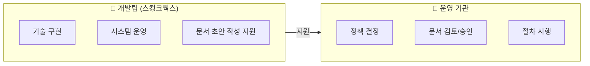
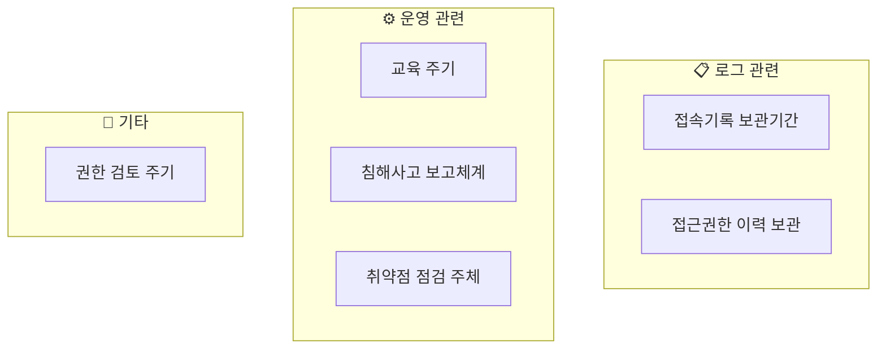
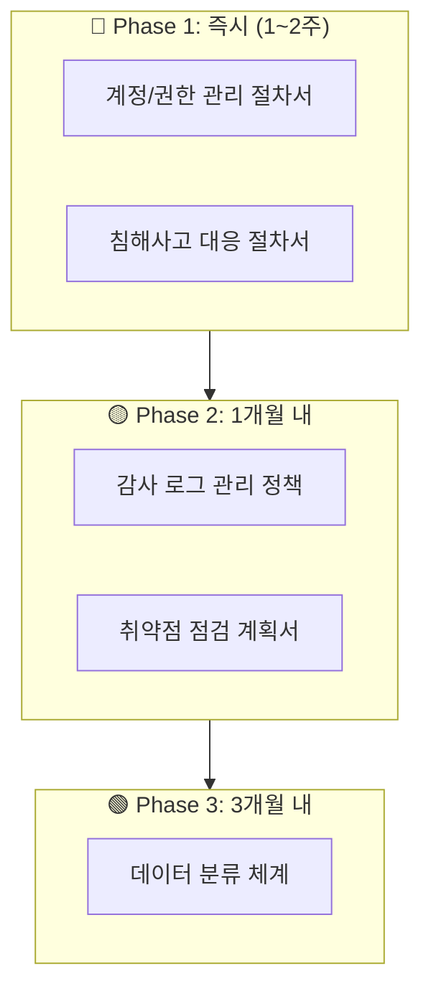
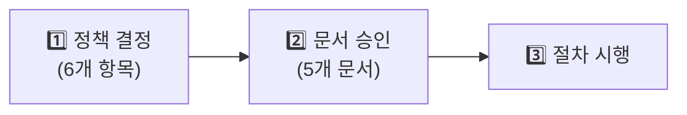

> **소요시간**: 10분 (14:45~14:55)  
> **목표**: 서울시가족센터가 결정하고 문서화해야 할 사항 이해

---

## 3.1 왜 기관의 결정이 필요한가?

### 현재 상황

한울타리 시스템의 **기술적 보안 기능은 대부분 구현**되어 있습니다.  
하지만 보안 **정책과 절차**는 **운영 기관이 결정하고 문서화**해야 합니다.



> **핵심**: 개발팀은 기술 지원을 하고, **정책 수립과 문서 승인의 주체는 운영 기관**입니다.

---

## 3.2 기관이 결정해야 할 사항

### 결정이 필요한 6가지 항목



### 결정 항목 상세 (2만명 이하 기준)

| 번호 | 결정 사항 | 선택지 | **권장안** | 근거 |
|------|-----------|--------|------------|------|
| **1** | 접속기록 보관 기간 | 1년 / 2년 | **1년** | 2만명 이하 (법적 최소) |
| **2** | 접근권한 이력 보관 | 1년 / 3년 | **3년** | 개인정보보호법 시행령 |
| **3** | 개인정보취급자 교육 주기 | 반기 / 연 1회 | **연 1회** | 법적 최소 요건 |
| **4** | 침해사고 보고 담당부서 | (지정 필요) | **센터지원팀** | 72시간 내 신고 대응 |
| **5** | 취약점 점검 주체 | 내부 / 외부 | **외부 전문기관** | 객관성 확보 |
| **6** | 권한 검토 주기 | 반기 / 분기 | **분기 1회** | 퇴직/전보 대응 |

### 각 결정 사항 설명

#### 1. 접속기록 보관 기간

| 회원 규모 | 법적 요건 | 한울타리 적용 |
|-----------|-----------|---------------|
| **5만명 미만** | **1년 이상** | ✅ 해당 |
| 5만명 이상 | 2년 이상 | - |

> **한울타리 현황**: **2만명 이하** 회원 → **1년 보관**이 법적 최소 요건입니다.

#### 2. 접근권한 이력 보관

| 기간 | 근거 |
|------|------|
| **3년** | 개인정보보호법 시행령 제30조 |

> **필수사항**: 권한 부여/변경/삭제 이력을 **3년간 보관** 필요

#### 3. 침해사고 보고 담당부서

> **법적 요건**: 개인정보 유출 시 **72시간 내** 신고 의무  
> **결정 필요**: 누가 서울시/KISA에 신고할 것인가?

---

## 3.3 문서화가 필요한 사항

### 기관이 작성/승인해야 할 문서

서울시 보안 체크리스트와 SER 요구사항 충족을 위해 **5개 문서**가 필요합니다.



---

## 3.4 문서별 상세 안내

### 📋 문서 1: 계정/권한 관리 절차서

| 항목 | 내용 |
|------|------|
| **문서명** | 한울타리 계정 및 권한 관리 절차서 |
| **작성 주체** | 운영 기관 (개발팀 초안 지원) |
| **승인 주체** | 기관장 |
| **관련 요구사항** | SER-001, 체크리스트 21, 63, 82, 83번 |

**주요 내용**:
- 계정 신청 절차 (누가, 어떻게 신청)
- 승인 권한자 지정
- 역할별 권한 범위
- 정기 권한 검토 주기 (권장: 분기 1회)
- 퇴직/전보 시 권한 말소 절차
- 접근권한 이력 3년 보관

**기관이 결정해야 할 사항**:
- [ ] 계정 신청 승인권자는 누구인가?
- [ ] 권한 검토는 얼마나 자주 할 것인가?
- [ ] 퇴직/전보 시 누가 권한 말소를 요청하는가?

---

### 📋 문서 2: 침해사고 대응 절차서

| 항목 | 내용 |
|------|------|
| **문서명** | 한울타리 침해사고 대응 절차서 |
| **작성 주체** | 운영 기관 (개발팀 초안 지원) |
| **승인 주체** | 기관장 |
| **관련 요구사항** | SER-009, 체크리스트 85번 |

**주요 내용**:
- 5단계 대응절차 (신고→확인→분석/차단→복구→재발방지)
- 단계별 책임자 지정
- 긴급 연락망
- 사고 등급 분류 기준 (경미/보통/중대)
- 서울시 보고 기준 (언제, 누가)
- 개인정보 유출 시 72시간 내 신고 절차

**기관이 결정해야 할 사항**:
- [ ] 1차/2차/3차 대응자는 누구인가?
- [ ] 서울시 보고 담당자는 누구인가?
- [ ] 사고 등급별 에스컬레이션 기준은?

#### 침해사고 대응 절차서 양식 예시

```
━━━━━━━━━━━━━━━━━━━━━━━━━━━━━━━━━━━━━━━━━━━━━━━
한울타리 침해사고 대응 절차서
━━━━━━━━━━━━━━━━━━━━━━━━━━━━━━━━━━━━━━━━━━━━━━━

1. 목적
   본 절차서는 한울타리 시스템에서 발생하는 보안 침해사고에 
   신속하고 일관되게 대응하기 위한 절차를 정의한다.

2. 적용 범위
   - 한울타리 웹사이트 (mcfamily.or.kr)
   - 한울타리 관리자 시스템 (admin.mcfamily.or.kr)
   - 마이서울 앱 연동 시스템

3. 책임과 역할
   ┌──────────────┬────────────────┬──────────────────┐
   │ 역할         │ 담당자         │ 연락처            │
   ├──────────────┼────────────────┼──────────────────┤
   │ 1차 대응     │ (기관 지정)    │ (연락처)          │
   │ 2차 대응     │ (기관 지정)    │ (연락처)          │
   │ 3차 대응     │ (기관 지정)    │ (연락처)          │
   │ 개발팀       │ 스컹크웍스     │ (연락처)          │
   │ 보안관제     │ CFL            │ (연락처)          │
   └──────────────┴────────────────┴──────────────────┘

4. 사고 등급 분류
   - 경미: 시스템 영향 없음, 내부 처리
   - 보통: 일부 서비스 영향, 당일 복구 가능
   - 중대: 개인정보 유출, 서비스 중단, 서울시 보고 필요

5. 대응 절차
   [1단계: 신고] → [2단계: 확인] → [3단계: 분석/차단] 
   → [4단계: 복구] → [5단계: 재발방지]

6. 개인정보 유출 시 신고
   - 신고 기한: 72시간 이내
   - 신고 기관: 개인정보보호위원회, 서울시
   - 신고 담당: (기관 지정)

7. 문서 이력
   ┌──────────┬─────────┬────────────────────────┐
   │ 버전     │ 일자     │ 변경 내용              │
   ├──────────┼─────────┼────────────────────────┤
   │ 1.0      │ 2026.03 │ 최초 작성              │
   └──────────┴─────────┴────────────────────────┘

━━━━━━━━━━━━━━━━━━━━━━━━━━━━━━━━━━━━━━━━━━━━━━━
```

---

### 📋 문서 3: 감사 로그 관리 정책

| 항목 | 내용 |
|------|------|
| **문서명** | 한울타리 감사 로그 관리 정책 |
| **작성 주체** | 운영 기관 |
| **승인 주체** | 기관장 |
| **관련 요구사항** | SER-012, 체크리스트 23, 24, 25번 |

**주요 내용**:
- 로그 유형별 보관기간
- 로그 요청/열람/제공 절차
- 연 1회 적정성 점검 계획

| 로그 유형 | 보관기간 | 비고 |
|-----------|----------|------|
| 접속기록 | **1년** | 2만명 이하 기준 |
| 접근권한 이력 | **3년** | 개인정보보호법 |
| 시스템 로그 | 1년 | 서울시 기준 |
| 보안 이벤트 | 2년 | CFL 관제 |

**기관이 결정해야 할 사항**:
- [ ] 로그 열람 요청 승인권자는 누구인가?
- [ ] 로그 제공 시 기록 담당자는 누구인가?

---

### 📋 문서 4: 취약점 점검 계획서

| 항목 | 내용 |
|------|------|
| **문서명** | 한울타리 취약점 점검 계획서 (2026) |
| **작성 주체** | 운영 기관 |
| **승인 주체** | 기관장 |
| **관련 요구사항** | SER-010, 체크리스트 20, 48번 |

**주요 내용**:
- 점검 주기: 연 1회 이상
- 점검 범위: 웹 애플리케이션, 서버, 인증, DB
- 점검 수행 기관
- 점검 후 조치 절차

**기관이 결정해야 할 사항**:
- [ ] 점검 수행 기관은 어디로 할 것인가? (외부 전문기관 권장)
- [ ] 점검 시기는 언제로 할 것인가?
- [ ] 점검 예산은 얼마인가?

---

### 📋 문서 5: 데이터 분류 체계

| 항목 | 내용 |
|------|------|
| **문서명** | 한울타리 데이터 분류 및 보안기준서 |
| **작성 주체** | 운영 기관 (개발팀 초안 지원) |
| **승인 주체** | 기관장 |
| **관련 요구사항** | SER-011, 체크리스트 68번 |

**주요 내용**:
- 데이터 등급 분류 기준
- 등급별 보안 조치
- 연 1회 적정성 점검

| 등급 | 데이터 유형 | 보안 조치 |
|------|-------------|-----------|
| 1등급 (기밀) | 고유식별정보 | 암호화 저장, 최소 접근 |
| 2등급 (민감) | 개인정보 | 암호화 전송, 권한 통제 |
| 3등급 (내부) | 운영 데이터 | 접근 통제 |
| 4등급 (공개) | 공개 정보 | 일반 관리 |

**기관이 결정해야 할 사항**:
- [ ] 분류 기준 승인
- [ ] 연간 점검 시기

---

## 3.5 실무 체크리스트

### 오늘 결정해야 할 것

- [ ] 접속기록 보관 기간: **1년** (2만명 이하 기준)
- [ ] 침해사고 보고 담당자 지정: _____________
- [ ] 계정 승인권자 지정: _____________

### 1~2주 내 해야 할 것

- [ ] 계정/권한 관리 절차서 검토 및 승인
- [ ] 침해사고 대응 절차서 검토 및 승인
- [ ] 긴급 연락망 확정

### 1개월 내 해야 할 것

- [ ] 감사 로그 보관 정책 확정
- [ ] 취약점 점검 계획 수립
- [ ] 점검 수행 기관 선정

---

## 3.6 핵심 요약

### 기관의 역할



### 🎯 기억해야 할 포인트

1. **문서화 주체**: 운영 기관 (개발팀은 초안 작성 지원)
2. **한울타리 기준**: **2만명 이하** → 접속기록 **1년 보관**
3. **즉시 필요**: 계정/권한 절차서, 침해사고 대응 절차서
4. **연 1회 점검**: 취약점 점검 (외부 전문기관 권장)

### ❓ Q&A 포인트

- "문서화는 누가 하나요?"
  → **운영 기관**이 주체입니다. 개발팀은 초안 작성을 **지원**합니다.

- "외부 취약점 점검은 꼭 해야 하나요?"
  → 서울시 요구사항(SER-010)으로 **연 1회 이상 점검 필수**입니다.

- "접속기록 2년 보관 안 해도 되나요?"
  → 한울타리는 **2만명 이하**이므로 **1년이 법적 최소** 요건입니다.

---

## 3.7 교육 후 조치사항

### 운영 기관

| 항목 | 기한 | 담당 |
|------|------|------|
| 정책 결정 6가지 확정 | 3월 중 | 기관 |
| Phase 1 문서 검토/승인 | 3월 말 | 기관장 |
| 취약점 점검 기관 선정 | 5월 | 기관 |

### 개발팀 (스컹크웍스)

| 항목 | 기한 | 담당 |
|------|------|------|
| Phase 1 문서 초안 작성 | 3월 2주차 | 개발팀 |
| Phase 2 문서 초안 작성 | 4월 1주차 | 개발팀 |
| 기술 지원 | 상시 | 개발팀 |

---

*이전: [2부: 서울시 보안 요구사항 해설](../education/part2-operations/)*  
*목차: [한울타리 개요](/mcfamily/)*
