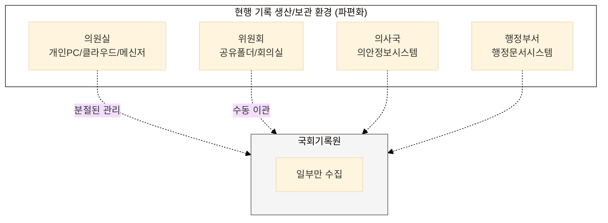
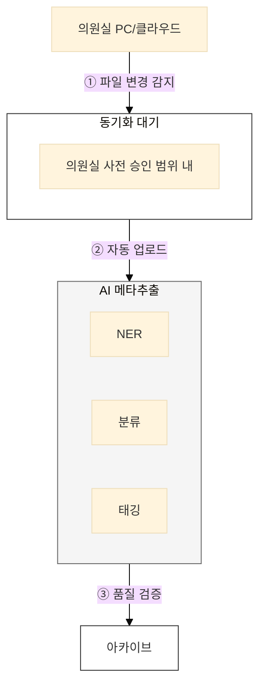
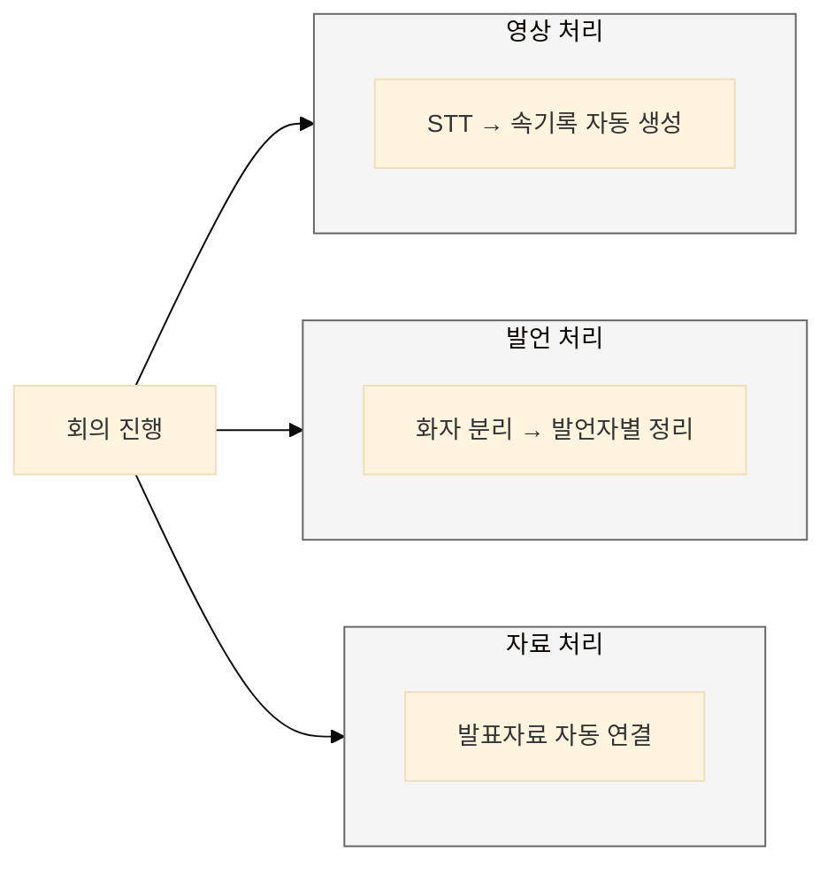

> **"의원실의 업무 부담 없이 기록이 자연스럽게 아카이브로 흘러들어오는 체계"**

---

## 국회기록원의 특성

### 입법부 기록의 고유성

국회기록은 다른 공공기록과 구별되는 특성을 가진다:

| 특성 | 내용 | 수집 시 고려사항 |
|------|------|-----------------|
| **법적 효력** | 입법 과정의 공식 증거 | 원본성·진본성 확보 필수 |
| **정치적 민감성** | 정파 간 이해관계 반영 | 중립적 수집 원칙 |
| **실시간 생산** | 회의·표결 등 즉시 발생 | 실시간 수집 체계 필요 |
| **다중 포맷** | 문서, 영상, 음성, 이미지 | 멀티미디어 처리 역량 |

### 기록 생산 환경의 파편화

현재 국회 기록은 여러 시스템에 분산되어 있으며, 이는 관계자들이 가장 큰 불편을 겪는 지점입니다.

### 현행 수집 프로세스의 근본적 한계

현재 국회 기록 수집 방식은 여러 구조적 문제를 안고 있으며, 이는 기록의 완전성과 활용성을 저해하는 주요 원인입니다.

| 한계 유형 | 문제점 | AI 도입의 필요성 |
|-----------|--------|------------------|
| **데이터 사일로** | 기록물이 국회기록원, 의안정보시스템, 회의록 등 여러 곳에 분산되어 통합적 관리와 검색이 불가능합니다. | 여러 시스템에 흩어진 데이터를 AI 에이전트가 자동으로 수집하고 통합합니다. |
| **수동 이관 의존** | 의원실의 협조에 의존하는 수동 이관 방식으로 인해, 중요 기록이 누락되거나 적시 수집이 어렵습니다. | 사람의 개입을 최소화하고, 파일 생성/변경 시점에 자동으로 기록을 동기화하여 완전성을 확보합니다. |
| **부실한 메타데이터** | 수작업으로 메타데이터를 입력하여 내용이 부실하거나 오류가 많고, 이는 검색 품질 저하로 직결됩니다. | AI가 문서 내용을 분석해 핵심 키워드, 관련 인물/기관 등 풍부한 메타데이터를 자동으로 추출하고 생성합니다. |
| **비정형 데이터 처리 미흡** | 영상, 음성 회의록이나 이미지 형태의 보고서 등 비정형 데이터가 텍스트로 전환되지 않아 검색과 활용이 제한됩니다. | STT(Speech-to-Text), OCR(Optical Character Recognition) 기술로 모든 형태의 기록을 텍스트로 변환하여 분석 가능한 자산으로 만듭니다. |
| **사후 수집으로 인한 맥락 상실** | 대부분의 기록이 임기 종료 후 등 사후에 수집되어, 기록이 생산된 당시의 생생한 맥락(회의, 이슈 등)이 유실됩니다. | 기록 생산 시점에 실시간으로 컨텍스트 정보와 함께 수집하여, 나중에 기록을 볼 때도 당시 상황을 이해할 수 있게 합니다. |

---

## 관계자 요구 기능

실제 의원 보좌진 등 관계자 인터뷰 결과, 이들은 현재의 수동적 자료 제출 방식을 넘어, 업무 부담을 줄여주는 실무적 도구와 자동화된 기록 관리 시스템을 강력히 요구하고 있습니다.

| 요구 기능 | 주요 내용 (현장의 목소리) | AI 플랫폼 역할 |
|---|---|---|
| **클라우드 기반 기록 시스템** | "외장하드, 개인 메일, 카카오톡에 흩어진 자료를 안전하게 저장하고 공유하며, 인수인계가 쉬운 클라우드 저장소가 필요하다." | 의원실별 클라우드 워크스페이스를 제공하여 업무 효율을 높이고, 해당 공간의 자료를 자동으로 아카이브와 동기화합니다. |
| **AI 기반 자동화 도구** | "기록의 정리, 분류, 설명을 AI가 자동으로 처리해 주어 보좌진의 단순 반복 업무를 줄여달라." | 수집된 문서의 내용을 AI가 분석하여 자동으로 분류하고, 핵심 내용을 담은 설명(description)까지 초안을 작성합니다. |
| **원스톱(One-stop) 수집/기증** | "기증 절차가 복잡하여 업무가 가중된다. 시스템에서 간편하게 제출하는 원스톱 서비스가 필요하다." | 복잡한 절차 없이, 클라우드 시스템 내에서 버튼 클릭만으로 지정된 기록을 아카이브에 정식 기증할 수 있는 간편한 인터페이스를 제공합니다. |
| **다양한 기록 포괄** | "공식 문서 외에 사진, 영상, 구술 기록까지 모든 의정활동 기록을 포괄적으로 수집해야 한다." | 문서뿐만 아니라 이미지, 영상, 음성 등 모든 형태의 비정형 데이터를 수집하고, AI로 분석 가능한 데이터로 변환합니다. |

### 역할 매트릭스

| 참여자 | 현행 역할 | To-Be 역할 | AI 지원 |
|--------|-----------|------------|---------|
| **의원실** | 기록 생산, 협조 요청 시 제출 | 자동 동기화 승인만 | 자동 수집 에이전트 |
| **위원회** | 회의 운영, 자료 관리 | 회의 기록 자동 연계 | 회의 자동 기록화 |
| **국회기록원** | 수동 수집·접수 | 수집 허브, 품질 관리 | AI 기반 품질 검증 |
| **국민** | (수집 단계 참여 없음) | 기증 자료 제출 | 자동 분류·검증 |
| **연구자/언론** | (수집 단계 참여 없음) | 외부 자료 제보 | 관련성 자동 판단 |
| **정부부처** | 요청 시 자료 제출 | 자동 연계 이관 | 메타데이터 자동 매핑 |
| **시민단체** | (수집 단계 참여 없음) | 모니터링 자료 기증 | 검증·연결 |

### 참여자별 수집 시나리오

**의원실 자동 수집:**

**위원회 회의 자동 수집:**

---

## 핵심 메시지

> **"수집의 혁신은 기록 생산자의 부담을 제로로 만드는 것이다."**

자동 수집 체계를 통해 의원실은 별도의 작업 없이도 기록이 자연스럽게 아카이브로 흘러들어온다.

**관련 문서:**
- [기록 유형별 수집 전략](/nanet-platform/01-collection/02-record-types/) - 5대 기록 유형의 수집 방법
- [AI 활용 및 플랫폼 설계](/nanet-platform/01-collection/03-ai-platform/) - 자동 수집 에이전트, 메타추출, 아키텍처
