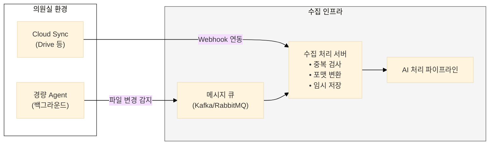
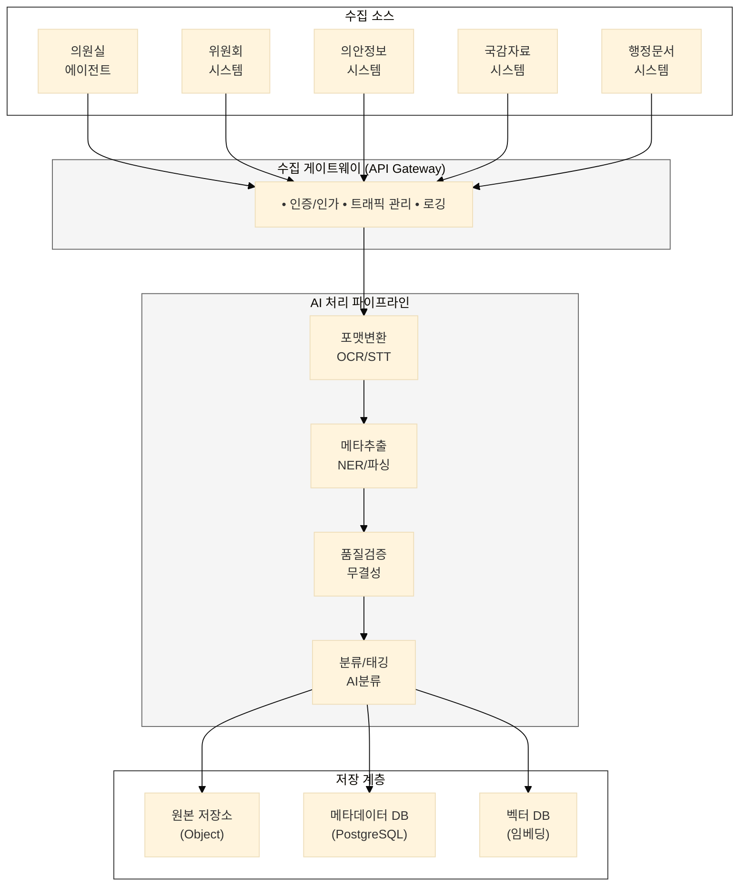

## AI 활용 방안

---

### 1. 자동 수집 에이전트

**기능:**
- 의원실 PC/클라우드의 파일 변경 실시간 감지
- 사전 승인 범위 내 자동 업로드
- 네트워크 장애 시 오프라인 큐잉

**아키텍처:**



---

### 2. 메타데이터 자동 추출

**NER (Named Entity Recognition):**
```
원문: "홍길동 의원이 2024년 3월 15일 산업통상자원위원회에서 
       반도체특별법 제5조 관련 질의를 진행했다."

추출 결과:
├── 의원명: 홍길동
├── 일시: 2024-03-15
├── 위원회: 산업통상자원위원회
├── 법안명: 반도체특별법
├── 조문: 제5조
└── 활동유형: 질의
```

**OCR + 문서 구조 분석:**
- 스캔 문서의 텍스트 추출
- 표, 그래프 인식 및 데이터 추출
- 문서 레이아웃 기반 섹션 분리

**STT (Speech-to-Text):**
- 회의 음성의 실시간 텍스트 변환
- 화자 분리 (Speaker Diarization)
- 전문 용어 인식 (법률, 정책 도메인)

---

### 3. 품질 검증 및 누락 탐지

**검증 항목:**
| 검증 유형 | 방법 | 조치 |
|-----------|------|------|
| **필수 메타데이터** | 작성자, 일시 등 존재 확인 | 누락 시 AI 추정값 제안 |
| **파일 무결성** | 체크섬, 포맷 검증 | 손상 파일 재요청 |
| **중복 탐지** | 해시 + 의미 유사도 | 중복 시 병합/버전 관리 |
| **누락 탐지** | 예상 기록 vs 실제 수집 비교 | 누락 알림 발송 |

**누락 탐지 예시:**
```
[AI 누락 탐지 알림]

감지: 산업통상자원위원회 제5차 회의 (2024.03.15)
      회의록은 수집됨, 그러나:
      
      ⚠ 발표자료 3건 미수집 (회의록 언급 기준)
      ⚠ 정부 서면답변 1건 미수집
      
      조치: 위원회 담당자에게 자동 요청 발송
```

---

## 플랫폼 설계 방향

---

### 1. 수집 아키텍처 개요



---

### 2. 데이터 흐름 설계

**입수 → 처리 → 저장 흐름:**

| 단계 | 처리 내용 | 소요 시간 |
|------|-----------|-----------|
| 1. 접수 | 파일 수신, 중복 체크 | < 1초 |
| 2. 변환 | 포맷 통일, OCR/STT | 10초~5분 |
| 3. 추출 | NER, 메타데이터 추출 | 5~30초 |
| 4. 검증 | 품질 검사, 보완 요청 | < 5초 |
| 5. 분류 | AI 기반 분류/태깅 | < 5초 |
| 6. 저장 | 원본+메타+벡터 저장 | < 3초 |
| 7. 색인 | 검색 색인 업데이트 | < 10초 |

---

### 3. API 연동 설계

**주요 연동 인터페이스:**

```yaml
# 의안정보시스템 연동
GET /api/v1/bills
  - 신규 법안 목록 조회 (polling)
  - Webhook 기반 실시간 알림

# 회의 시스템 연동
POST /api/v1/meetings/{id}/recording
  - 회의 영상/음성 업로드
  - STT 처리 트리거

# 의원실 에이전트 연동
POST /api/v1/collect/upload
  - 파일 청크 업로드
  - 메타데이터 첨부

# 기증 자료 연동
POST /api/v1/donation/submit
  - 기증 자료 제출
  - 검증 상태 조회
```

---

### 4. 보안 및 권한 설계

| 보안 영역 | 적용 방안 |
|-----------|-----------|
| **전송 보안** | TLS 1.3, 파일 암호화 전송 |
| **저장 보안** | AES-256 암호화, 접근 로그 |
| **접근 제어** | 역할 기반 권한 (RBAC), 의원실별 격리 |
| **감사 추적** | 모든 수집 행위 로깅, 변경 이력 관리 |

---

## 핵심 요약

| 구분 | 현행 | To-Be |
|------|------|-------|
| **수집 방식** | 수동 이관, 요청 기반 | 자동 동기화, 자동 수집 |
| **메타데이터** | 수작업 입력 | AI 자동 추출 |
| **멀티미디어** | 원본만 보관 | STT/OCR 텍스트화 |
| **품질 관리** | 사후 검수 | 실시간 AI 검증 |
| **참여자 부담** | 의원실 협조 필수 | 최소 승인만 필요 |

> **"AI가 보이지 않는 곳에서 기록을 수집하고, 정리하고, 검증한다."**
