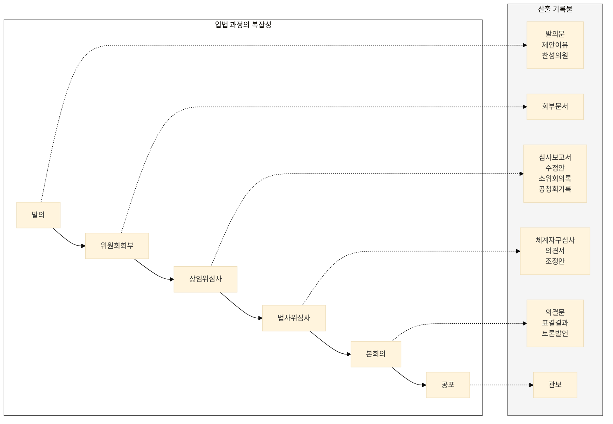
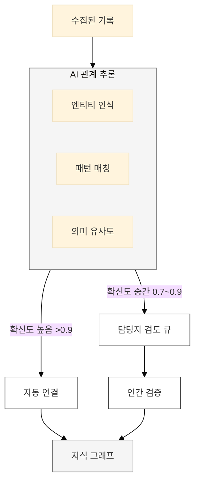

> **"산재된 기록을 연결하여 입법 과정의 전모를 파악할 수 있는 지식 체계 구축"**

---

## 국회기록원의 특성

### 입법 과정의 복잡성

국회 기록은 **복잡한 입법 과정**을 반영한다. 하나의 법안이 제정되기까지 수많은 기록이 생산되고, 이들은 서로 연결되어 있다.

※ 하나의 법안에 10~50개의 관련 기록이 생산됨

### 기록 간 관계의 중요성

개별 기록은 **맥락 없이는 의미가 불완전**하다:

| 단독 기록 | 연결된 맥락 |
|-----------|-------------|
| "김OO 의원 발언" | → 어떤 법안에 대해? 찬성/반대? 결과는? |
| "반도체특별법안" | → 누가 발의? 쟁점은? 수정 경과는? |
| "2024 국감 질의" | → 전년 대비 변화? 시정 이행 여부? |

### 현행 연결 방식의 근본적 한계

기록이 수집되더라도, 개별 기록들이 의미적으로 연결되지 않으면 단순한 파일 더미에 불과합니다. 현재 시스템은 기록 간의 맥락을 파악하는 데 명백한 한계를 보입니다.

| 한계 유형 | 문제점 | AI 도입의 필요성 |
|-----------|--------|------------------|
| **단절된 맥락** | 법률안, 관련 회의록, 보도자료, 국정감사 기록이 모두 별도로 존재하여, 하나의 이슈가 어떻게 논의되고 변화했는지 전체 과정을 파악하기 어렵습니다. | AI가 각 기록의 내용과 메타데이터를 분석하여 '법안-회의록-의원-이슈' 등을 자동으로 연결, 복잡한 맥락을 한눈에 파악할 수 있는 지식 네트워크를 구축합니다. |
| **키워드 검색의 한계** | 사용자가 정확한 법안명이나 인물명을 모르면 관련 기록을 찾기 어렵고, 키워드가 같아도 맥락이 다른 문서들이 함께 검색되어 효율이 떨어집니다. | 의미 기반 검색(Semantic Search)을 통해 사용자가 부정확한 키워드로 검색해도, AI가 의도를 파악하여 가장 관련성 높은 기록을 찾아 제시합니다. |
| **암묵적 지식의 부재** | 법안의 '찬성/반대' 입장, '주요 쟁점', '핵심 발언자' 등 기록의 표면에 드러나지 않는 암묵적 관계들은 전혀 관리되지 않습니다. | 관계 추출(Relation Extraction) AI 모델이 텍스트를 분석하여 법안-의원-입장, 의원-발언-주제 등 숨겨진 관계를 자동으로 식별하고 구조화합니다. |
| **수동 연결의 비효율** | 극히 일부 기록만 담당자가 수동으로 연결하고 있어, 정보의 양이 늘어날수록 연결 작업의 일관성이 떨어지고 최신성을 유지하기 어렵습니다. | AI가 24/7 자동으로 새로운 기록과 기존 기록 간의 관계를 발견하고 연결하여, 지식 그래프를 항상 최신 상태로 유지합니다. |

---

## 관계자 요구 기능

관계자들은 파편화된 시스템에서 자료를 찾기 위해 고군분투하는 현재의 비효율을 지적하며, 한 곳에서 모든것을 찾고 연결해주는 강력한 통합 플랫폼을 요구했습니다.

| 요구 기능 | 주요 내용 (현장의 목소리) | AI 플랫폼 역할 |
|---|---|---|
| **통합 검색 및 소장처 확인** | "자료가 어디 있는지 몰라 담당자의 기억에 의존해 여러 저장매체를 뒤져야 한다. 원문 접근이 안 되더라도, 자료의 존재 여부와 위치(소장처)라도 한 번에 검색하고 싶다." | 분산된 모든 기록 시스템을 연동하여, 플랫폼 한 곳에서 모든 자료의 소장처 정보까지 포함된 통합 검색 결과를 제공합니다. |
| **데이터 개방과 연계** | "국회 내부 기록뿐 아니라 정부, 유관기관 기록까지 연결하고, 연구자들이 활용할 수 있도록 기계가독형(Machine-readable) 데이터를 제공해야 한다." | 국회 내외부의 데이터를 지식 그래프로 연결하고, 연구자들이 직접 데이터를 분석하고 활용할 수 있도록 Open API 형태로 데이터를 개방합니다. |

### 참여자별 생성/활용 관계

| 참여자 | 생성하는 관계 | 활용하는 관계 |
|--------|---------------|---------------|
| **의원실** | 발의-의원, 발언-회의, 공동발의 관계 | 자신의 활동 이력, 관련 법안 추적 |
| **위원회** | 회부-심사, 법안-회의록 관계 | 법안 심사 현황, 의원 참여도 |
| **국회기록원** | 기록 간 공식 연결 관리 | 아카이브 정합성, 누락 탐지 |
| **국민** | (직접 생성 없음) | 법안 경과, 의원 활동 조회 |
| **연구자/언론** | 분석 기반 새 관계 발견 | 심층 분석, 팩트체크 |
| **정부부처** | 법안-정책, 답변-질의 관계 | 입법 동향, 국감 대응 |
| **시민단체** | 이슈-법안 연결, 감시 기록 | 정책 모니터링, 캠페인 |

### 연결 생성 시나리오

**AI 자동 연결 + 인간 검증:**

---

## 핵심 메시지

> **"연결의 가치는 개별 기록의 합보다 크다."**

AI가 숨겨진 관계를 발견하고, 입법 과정의 전모를 드러낸다.

**관련 문서:**
- [기록 유형별 연결 전략](/nanet-platform/02-connection/02-record-types/) - 법안, 인물, 시간, 주제 중심 연결
- [AI 활용 및 플랫폼 설계](/nanet-platform/02-connection/03-ai-platform/) - 지식 그래프, 관계 추론, 온톨로지
