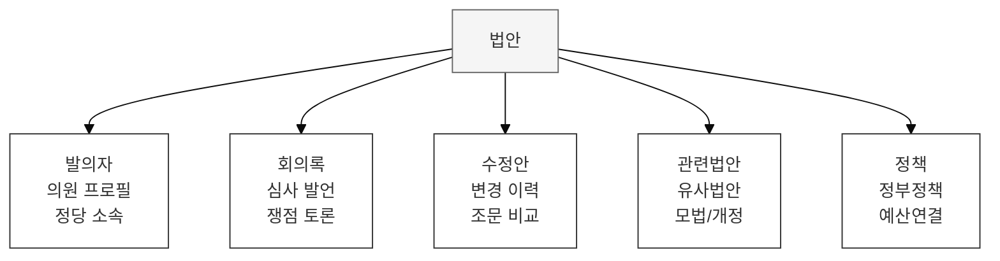
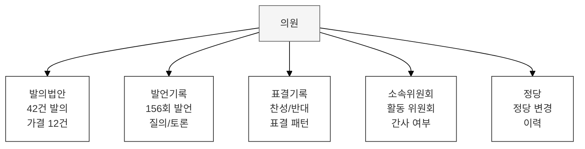

## 5대 기록 유형의 연결 전략

각 기록 유형별로 연결 관계와 전략을 정의한다.

---

## 법안 중심 연결

법안은 **연결의 허브**이다. 대부분의 국회 기록이 법안과 직간접적으로 연결된다.



**연결 관계:**
| 관계 유형 | From | To | 설명 |
|-----------|------|-----|------|
| 발의 | 의원 | 법안 | 대표/공동 발의 구분 |
| 심사 | 위원회 | 법안 | 소관위, 회부일 포함 |
| 수정 | 법안(원안) | 법안(수정안) | 수정 사유, 변경점 |
| 참조 | 법안 | 법안 | 유사 법안, 대안 관계 |
| 근거 | 법안 | 회의록 | 심사 논의 기록 |

---

## 인물 중심 연결

의원을 중심으로 의정활동 전체를 연결한다.



**AI 분석 예시:**
```
[의원 활동 프로필 - AI 자동 생성]

김OO 의원 (제21대, OO당, 서울 OO구)

활동 분야 (발의+발언 기반 분석):
├── 반도체/과학기술: 45%
├── 환경/에너지: 30%
└── 중소기업: 25%

핵심 법안 관여:
├── 반도체특별법 (대표발의, 가결)
├── 탄소중립기본법 개정안 (공동발의, 심사중)
└── 중소기업R&D지원법 (대표발의, 심사중)

위원회 활동:
├── 산업통상자원위원회 (소속, 출석률 94%)
└── 예산결산특별위원회 (위원)
```

---

## 시간 중심 연결

입법 과정을 **타임라인**으로 연결한다.

```
[반도체특별법 타임라인]

2023.01.15 ──── 법안 발의 (김OO 의원 외 32인)
     │
2023.02.01 ──── 산업위 회부
     │
2023.03.10 ──── 제1차 상임위 심사
     │              └── 쟁점: 세제 지원 범위
     │
2023.04.05 ──── 공청회 개최
     │              └── 전문가 의견 6건
     │
2023.05.20 ──── 법안소위 심사
     │              └── 수정안 마련
     │
2023.06.15 ──── 상임위 의결 (수정가결)
     │
2023.07.01 ──── 법사위 체계자구 심사
     │
2023.07.20 ──── 본회의 의결 (가결)
     │
2023.08.01 ──── 정부 이송 → 공포
```

---

## 주제 중심 연결

정책 영역별로 관련 기록을 연결한다.

**정책 온톨로지:**
```
정책 분야
├── 경제/산업
│   ├── 반도체
│   ├── 자동차
│   └── 에너지
├── 환경
│   ├── 탄소중립
│   └── 환경보전
├── 복지/노동
│   ├── 연금
│   └── 고용
└── ...
```

**주제 연결 예시:**
```
[정책: 탄소중립]

관련 법안: 15건
├── 탄소중립기본법 (모법)
├── 배출권거래법 개정안
├── 재생에너지특별법안
└── ...

관련 회의록: 45건
├── 환노위 심사 회의록 23건
├── 본회의 토론 3건
└── ...

관련 국정감사: 8건
├── 환경부 국감 (2022~2024)
└── 산업부 국감 (2023~2024)
```

---

## 연결 유형 요약

| 연결 중심 | 허브 엔티티 | 연결 대상 | 활용 |
|-----------|------------|-----------|------|
| **법안** | 법안 | 발의자, 회의록, 수정안, 관련법안 | 입법 과정 추적 |
| **인물** | 의원 | 발의, 발언, 표결, 위원회 | 활동 분석 |
| **시간** | 이벤트 | 법안, 회의, 표결 | 타임라인 시각화 |
| **주제** | 정책 분야 | 법안, 회의록, 국감 | 정책 분석 |
