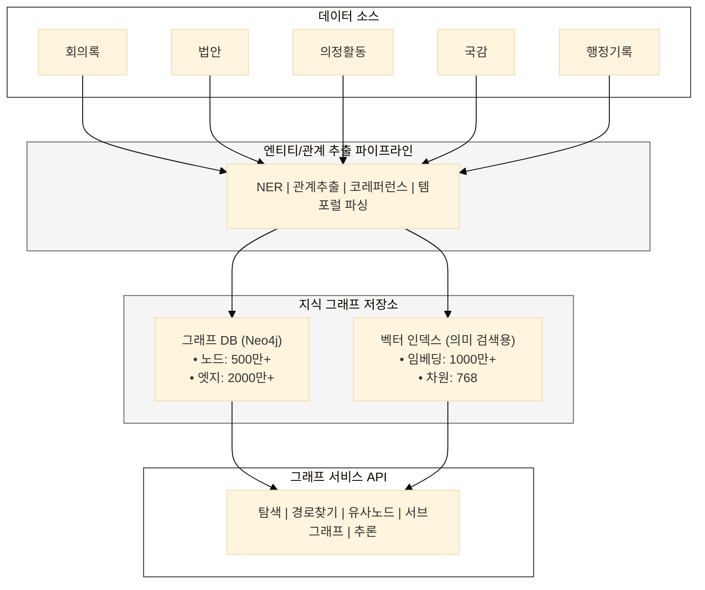
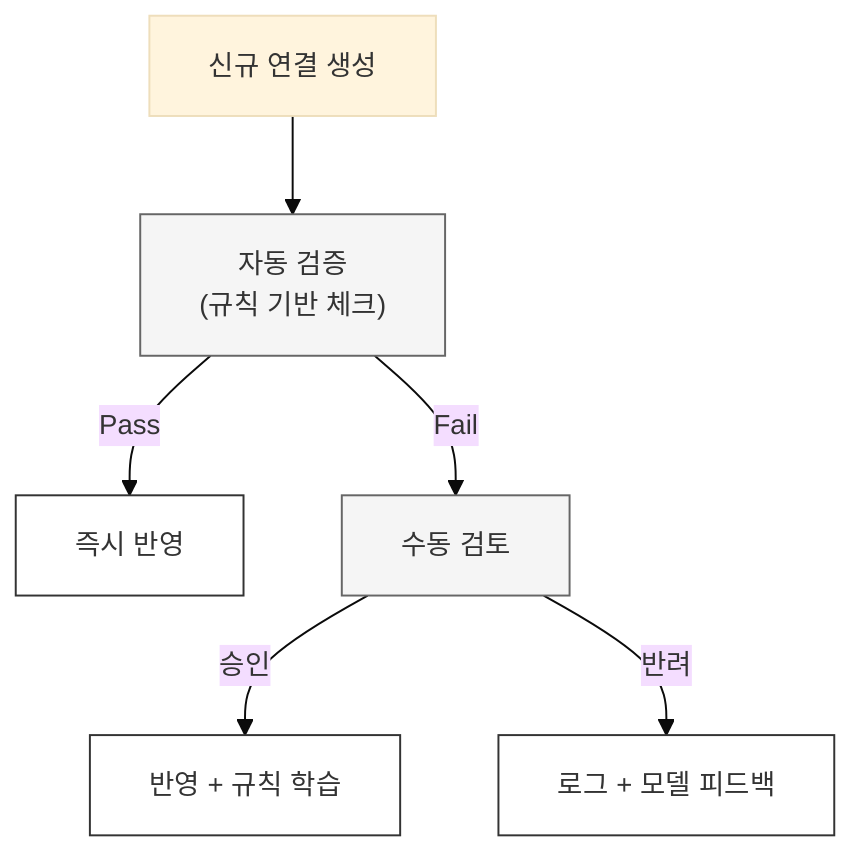

## AI 활용 방안

---

### 1. 지식 그래프 자동 구축

**노드 (엔티티) 유형:**
```yaml
nodes:
  - Person: 의원, 장관, 증인, 전문가
  - Organization: 정당, 위원회, 정부부처, 기관
  - Document: 법안, 회의록, 보고서
  - Event: 회의, 표결, 공청회
  - Topic: 정책 분야, 이슈
```

**엣지 (관계) 유형:**
```yaml
edges:
  - 발의: Person → Document (법안)
  - 소속: Person → Organization
  - 심사: Organization → Document
  - 발언: Person → Event (회의)
  - 참조: Document → Document
  - 관련: Document → Topic
```

**그래프 DB 스키마:**
```cypher
// Neo4j 예시

// 노드 생성
CREATE (m:Member {name: "김OO", party: "OO당", district: "서울 OO구"})
CREATE (b:Bill {id: "2100001", title: "반도체특별법안", status: "가결"})
CREATE (c:Committee {name: "산업통상자원위원회"})

// 관계 생성
CREATE (m)-[:PROPOSED {date: "2023-01-15", role: "대표발의"}]->(b)
CREATE (c)-[:REVIEWED {result: "수정가결"}]->(b)
CREATE (m)-[:MEMBER_OF]->(c)
```

---

### 2. 관계 추론

**명시적 관계 추출:**
- 법안 메타데이터에서 발의자-법안 관계
- 회의록에서 발언자-회의 관계
- 표결 기록에서 의원-법안-입장 관계

**암묵적 관계 추론:**
```
[AI 관계 추론 예시]

입력: 김OO 의원의 회의 발언
      "지난 회기에 제가 발의한 반도체 관련 법안과 연계하여..."

추론:
├── 발언 ←연관→ 반도체특별법안 (언급 기반)
├── 발언 ←연관→ 제20대 국회 법안 (시간 추론)
└── 발언 ←입장→ 찬성 (맥락 분석)
```

**유사도 기반 연결:**
- 법안 제안이유 텍스트 유사도 → 유사 법안 탐지
- 발언 내용 클러스터링 → 쟁점별 그룹핑
- 정책 키워드 매칭 → 주제 분류

---

### 3. 데이터 정제

**동명이인 식별:**
```
[문제] "김영수 의원"이 3명 존재

[해결]
├── 컨텍스트 분석: 소속 위원회, 발언 시점
├── 엔티티 연결: 의원 DB와 매칭
└── 신뢰도 표시: "김영수(OO당, 부산OO)" 형태로 명확화
```

**법안명 표준화:**
```
입력: 
- "반도체특별법안"
- "반도체 산업 경쟁력 강화를 위한 특별조치법안"
- "반도체특별법"

표준화:
→ 정식명칭: "반도체 산업 경쟁력 강화를 위한 특별조치법안"
→ 약칭: "반도체특별법"
→ 의안번호: 2100001
```

---

### 4. 시계열 분석

**법안 변천사 추적:**
```
[탄소중립 법제 계보]

2010 ─── 저탄소녹색성장기본법 (제정)
           │
2020 ─── 탄소중립기본법 (전부개정)
           │
           ├── 2021 개정안 (감축목표 상향)
           ├── 2022 개정안 (이행수단 강화)
           └── 2023 개정안 (탄소예산제 도입)
```

**의원 활동 패턴:**
```
[의원 활동 시계열]

2020 ───── 초선, 환노위 배정
             │
2021 ───── 환경 분야 법안 5건 발의
             │
2022 ───── 탄소중립 전문가 포지셔닝
             │  국감 환경부 집중 질의
             │
2023 ───── 환노위 간사
             │  기후변화 관련 발언 급증
```

---

## 플랫폼 설계 방향

---

### 1. 지식 그래프 아키텍처



---

### 2. 입법 온톨로지 설계

**핵심 클래스:**
```yaml
Ontology: NationalAssemblyRecord

classes:
  Actor:
    - Member (의원)
    - Minister (장관)
    - Witness (증인)
    - Expert (전문가)
    
  Organization:
    - Party (정당)
    - Committee (위원회)
    - Ministry (부처)
    
  Document:
    - Bill (법안)
    - Minutes (회의록)
    - Report (보고서)
    - Petition (청원)
    
  Event:
    - Session (회의)
    - Vote (표결)
    - Hearing (공청회)
    - Audit (국정감사)
    
  Process:
    - LegislativeProcess (입법과정)
    - ReviewProcess (심사과정)
```

**관계 정의:**
```yaml
relations:
  # 문서-사람 관계
  proposes: Member → Bill
  speaks_at: Member → Session
  votes_on: Member → Bill
  
  # 문서-조직 관계
  referred_to: Bill → Committee
  held_by: Session → Committee
  
  # 문서-문서 관계
  amends: Bill → Bill
  supersedes: Bill → Bill
  references: Document → Document
  
  # 시간 관계
  precedes: Event → Event
  during: Document → Event
```

---

### 3. 연결 품질 관리

**품질 지표:**
| 지표 | 정의 | 목표 |
|------|------|------|
| 정확도 | 올바른 연결 비율 | > 95% |
| 완전성 | 발견된 연결 / 실제 연결 | > 85% |
| 일관성 | 동일 기준 적용 비율 | > 99% |
| 최신성 | 신규 기록 연결 지연 | < 1시간 |

**품질 관리 프로세스:**


---

## 핵심 요약

| 구분 | 현행 | To-Be |
|------|------|-------|
| **연결 방식** | 수동 태깅, 명시적 링크 | AI 자동 추론, 지식 그래프 |
| **관계 범위** | 단순 참조 (법안번호) | 다층 관계 (발의, 심사, 발언, 입장...) |
| **탐색 방식** | 키워드 검색 의존 | 그래프 탐색, 경로 추천 |
| **분석 수준** | 개별 기록 | 맥락 전체, 패턴 발견 |

> **"AI가 숨겨진 관계를 발견하고, 입법 과정의 전모를 드러낸다."**
