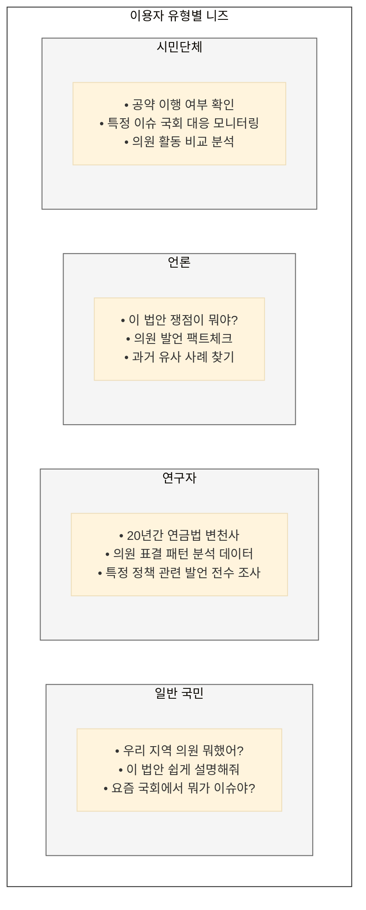
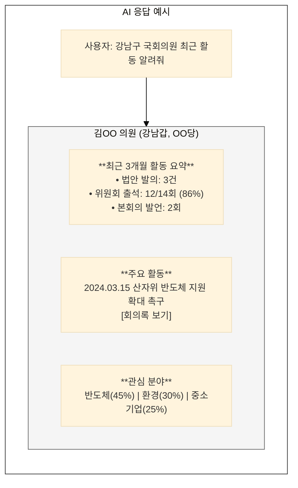

> **"복잡한 입법 과정을 누구나 이해할 수 있도록, AI가 맞춤형 정보를 제공한다"**

---

## 국회기록원의 특성

### 국민 알권리와 민주주의 기록

국회기록은 **민주주의의 근간**이다. 국민이 이 기록에 쉽게 접근하고 이해할 수 있어야 한다.

| 서비스 원칙 | 내용 |
|-------------|------|
| **접근성** | 누구나, 언제, 어디서나 |
| **이해가능성** | 전문 지식 없이도 파악 가능 |
| **신뢰성** | 정확한 정보, 출처 명시 |
| **중립성** | 정파적 편향 없는 정보 제공 |

### 이용자 유형별 니즈

국회기록 서비스의 이용자는 다양하며, 각각 다른 니즈를 가진다:

### 현행 서비스 방식의 근본적 한계

현재 국회 기록 서비스는 정보를 '제공'하는 데 그치고, 사용자가 그 의미를 '이해'하고 '활용'하도록 돕는 데에는 한계가 명확합니다.

| 한계 유형 | 문제점 | AI 도입의 필요성 |
|-----------|--------|------------------|
| **전문가용 인터페이스** | 의안정보시스템, 회의록 시스템 등은 법률 용어와 절차에 익숙한 전문가를 위한 구조로, 일반 국민이 사용하기에는 너무 복잡하고 어렵습니다. | '챗GPT'처럼 누구나 쉽게 쓸 수 있는 대화형 인터페이스를 제공하여, 전문 용어를 몰라도 자연스러운 질문을 통해 원하는 정보를 얻게 합니다. |
| **정보의 홍수, 이해의 부재** | 방대한 원문 기록이 제공되지만, 수백 페이지에 달하는 회의록이나 법안 검토 보고서의 핵심 내용을 파악하기는 거의 불가능합니다. | LLM을 활용한 자동 요약 기능을 통해 긴 문서의 핵심을 몇 줄로 파악하고, 주요 쟁점과 찬반 의견을 즉시 비교할 수 있게 합니다. |
| **단방향 정보 전달** | 사용자는 시스템이 정해놓은 방식대로만 정보를 찾아야 하며, 자신의 관심사에 맞는 정보를 추천받거나 구독하는 개인화 기능이 전무합니다. | 사용자의 검색 기록, 관심 분야를 AI가 학습하여 관련성 높은 새로운 법안이나 의원 활동을 먼저 추천해주는 개인화 서비스를 제공합니다. |
| **분석 및 재가공의 어려움** | 시스템이 제공하는 정보를 그대로 볼 수만 있을 뿐, 데이터를 다운로드하여 독자적으로 분석하거나 다른 데이터와 융합하여 새로운 가치를 창출하기 어렵습니다. | 단순 열람을 넘어, AI가 법안 통과 가능성을 예측하거나, 특정 의원의 활동 패턴을 시각적으로 분석해주는 등 데이터 기반의 통찰을 제공합니다. |

---

## 관계자 요구 기능

단순한 정보 제공을 넘어, 축적된 데이터를 분석하고 가공하여 의정활동에 실질적인 인사이트를 주는 '컨설팅' 수준의 고차원적 서비스를 요구했습니다.

| 요구 기능 | 주요 내용 (현장의 목소리) | AI 플랫폼 역할 |
|---|---|---|
| **의정활동 분석 서비스** | "수집된 기록을 분석해 의원의 입법 활동 강·약점, 정책 선호도, 인물 관계 등을 제공하는 빅데이터 분석 서비스가 필요하다." | 의원의 발언, 발의 법안, 표결 이력 등을 AI로 분석하여 활동 패턴, 관심 분야, 주요 키워드 등을 시각화된 대시보드로 제공합니다. |
| **맞춤형 기록 정리 보고서** | "기증된 기록을 정리하여 목록과 결과보고서를 제공함으로써, 의정보고서나 자서전 집필, 선거 활동에 활용할 수 있게 해달라." | AI가 기증된 기록을 주제별, 시기별로 자동 분류하고 요약하여, 의정활동 보고서의 초안을 자동으로 생성해줍니다. |
| **참고 자료 지원** | "축사, 메시지, 정책 자료 등 의정활동에 즉시 참고할 수 있는 레퍼런스 자료를 데이터베이스화하여 제공해달라." | 과거 우수 발언, 축사, 정책 보고서 등을 AI가 분석하여 DB로 구축하고, 키워드 검색만으로 관련 참고자료를 즉시 찾아주는 '의정활동 비서' 기능을 제공합니다. |
| **시기별 맞춤 컨설팅 및 교육** | "의원 임기 시작부터 기록 관리 방법을 체계적으로 교육하고 컨설팅해주면 좋겠다." | 플랫폼 사용법 및 기록 관리 노하우에 대한 온보딩 가이드, 튜토리얼을 제공하고, AI 챗봇을 통해 언제든 관련 질문에 답변해주는 상시 지원 체계를 마련합니다. |
| **접근성 제한 해소** | "하루 10건 열람 제한 같은 행정 편의적 통제를 풀어야 한다." | 디지털화된 기록에 대해 열람 건수 제한을 없애고, AI 기반 검색 및 요약 기능으로 사용자가 원하는 정보에 더 빨리 도달하게 하여 정보 접근성을 극대화합니다. |

### 참여자별 서비스 니즈

| 참여자 | 주요 서비스 니즈 | 핵심 기능 |
|--------|------------------|-----------|
| **의원실** | 입법 동향, 유사 법안, 상대방 분석 | 법안 비교, 의원 활동 분석 |
| **위원회** | 심사 현황, 쟁점 정리, 전문가 의견 | 심사 대시보드, 이슈 트래킹 |
| **국회기록원** | 아카이브 현황, 이용 통계 | 관리 대시보드, 품질 모니터링 |
| **국민** | 쉬운 설명, 의원 활동, 법안 현황 | AI 요약, 대화형 QA, 타임라인 |
| **연구자/언론** | 심층 검색, 데이터 다운로드, 분석 | 고급 검색, API, 분석 도구 |
| **정부부처** | 입법 동향, 국감 대비, 정책 연계 | 알림 서비스, 분석 리포트 |
| **시민단체** | 모니터링, 비교 분석, 공약 추적 | 의원 평가, 이슈 대시보드 |

### 서비스 페르소나 시나리오

**일반 국민 - "우리 동네 의원 뭐하나?"**

---

## 핵심 메시지

> **"서비스의 목표는 국민이 5분 안에 원하는 정보를 이해하는 것이다."**

AI가 복잡한 입법 과정을 쉽게 풀어주고, 숨겨진 정보를 찾아준다.

**관련 문서:**
- [기록 유형별 서비스 전략](/nanet-platform/03-service/02-record-types/) - 회의록, 법안, 의정활동, 국감 서비스
- [AI 활용 및 플랫폼 설계](/nanet-platform/03-service/03-ai-platform/) - 의미 검색, RAG QA, 요약, 추천
