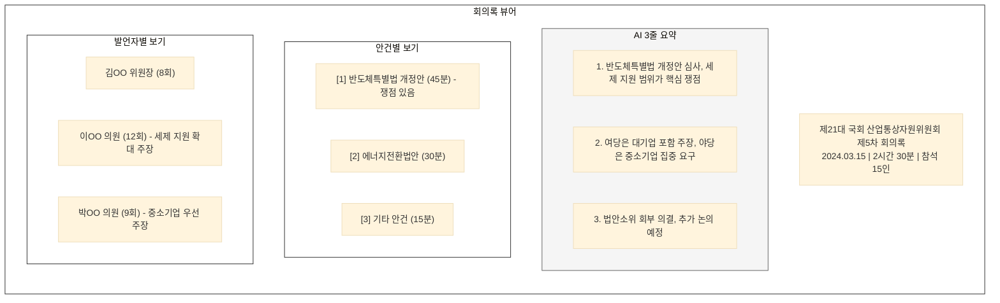
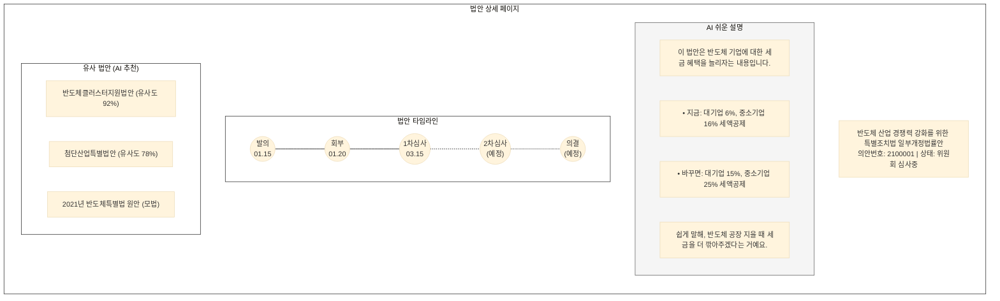
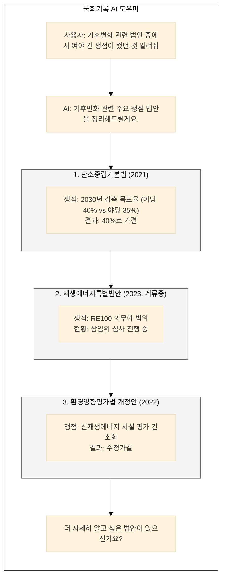

## 5대 기록 유형의 서비스 전략

각 기록 유형별로 서비스 기능과 UI를 정의한다.

---

## 회의록/속기록 서비스

**핵심 기능:**
| 기능 | 설명 | AI 적용 |
|------|------|---------|
| **쟁점 요약** | 회의의 핵심 논점 자동 추출 | 토픽 모델링, 요약 |
| **발언 검색** | 특정 주제/의원 발언 찾기 | 의미 검색, 필터링 |
| **감성 분석** | 찬반 입장, 논쟁 구간 표시 | 감성 분석, 하이라이트 |
| **타임라인** | 회의 흐름 시각화 | 구간 분리, 안건별 정리 |

**UI 예시:**

---

## 법안/의안 서비스

**핵심 기능:**
| 기능 | 설명 | AI 적용 |
|------|------|---------|
| **타임라인 뷰어** | 발의→심사→의결 과정 시각화 | 이벤트 추출, 연결 |
| **쉬운 설명** | 법안 내용을 일반인 언어로 | LLM 요약, 용어 설명 |
| **유사 법안** | 관련/유사 법안 자동 추천 | 벡터 유사도 검색 |
| **조문 비교** | 신구조문 자동 대비 | 텍스트 diff, 시각화 |

**UI 예시:**

---

## 의정활동 서비스

**핵심 기능:**
| 기능 | 설명 | AI 적용 |
|------|------|---------|
| **의원 프로필** | 활동 요약, 관심 분야 | 패턴 분석, 자동 생성 |
| **활동 비교** | 의원 간 활동 비교 | 통계 분석, 시각화 |
| **발언 하이라이트** | 주요 발언 자동 추출 | 중요도 판단, 요약 |

---

## 국정감사 서비스

**핵심 기능:**
| 기능 | 설명 | AI 적용 |
|------|------|---------|
| **QA 검색** | 질의-답변 쌍 검색 | QA 추출, 의미 검색 |
| **이행 추적** | 시정요구 이행 현황 | 상태 추적, 알림 |
| **연도별 비교** | 동일 기관 연도별 쟁점 | 트렌드 분석 |

---

## 통합 검색/QA 서비스

**대화형 QA 예시:**

---

## 서비스 요약

| 기록 유형 | 핵심 서비스 | AI 기능 |
|-----------|------------|---------|
| 회의록/속기록 | 쟁점 요약, 발언 검색 | 요약, 의미 검색 |
| 법안/의안 | 타임라인, 쉬운 설명 | LLM 요약, 유사도 검색 |
| 의정활동 | 의원 프로필, 비교 | 패턴 분석 |
| 국정감사 | QA 검색, 이행 추적 | QA 추출 |
| 통합 | 대화형 QA | RAG |
