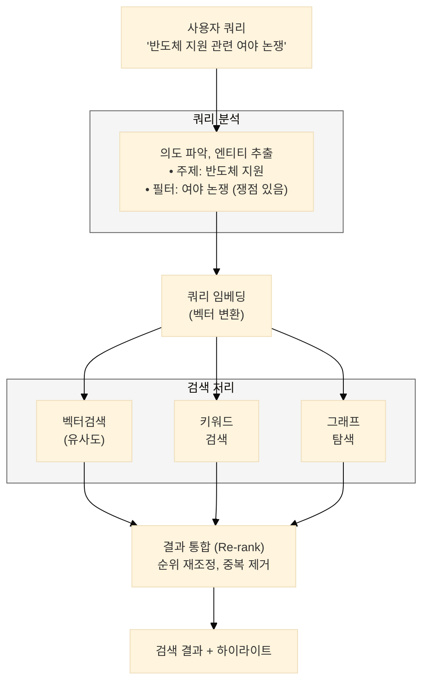
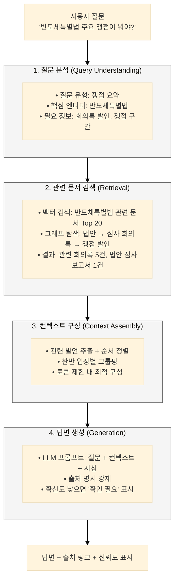
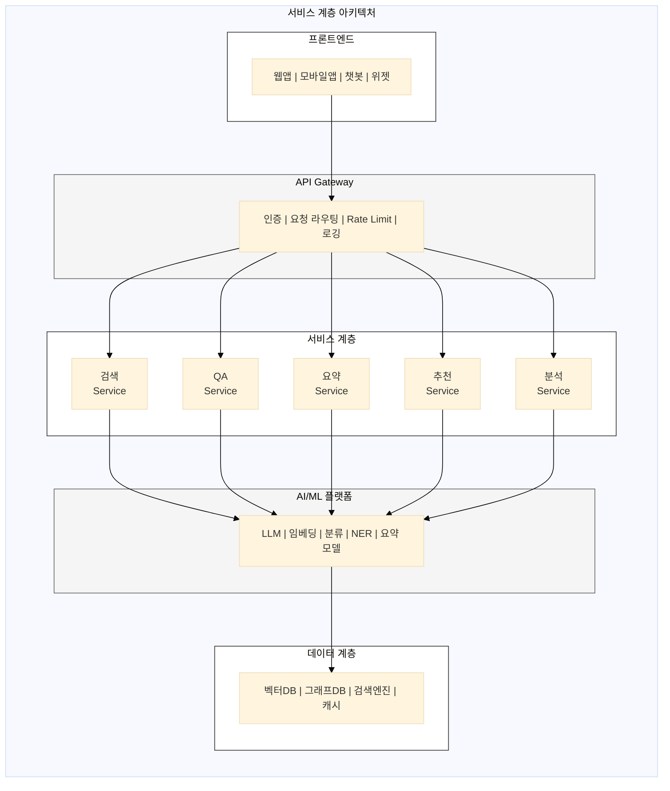
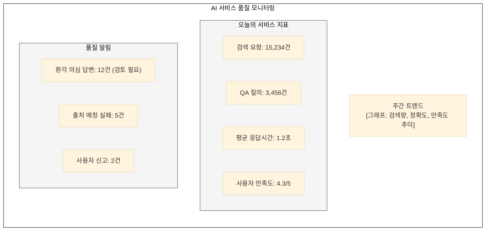

## AI 활용 방안

---

### 1. 의미 기반 검색 (Semantic Search)

**아키텍처:**


**검색 유형:**
| 유형 | 방식 | 적합한 쿼리 |
|------|------|-------------|
| 벡터 검색 | 임베딩 유사도 | "탄소중립 정책 방향" |
| 키워드 검색 | BM25, 형태소 | "제21대 국회 2100001" |
| 하이브리드 | 벡터 + 키워드 | 대부분의 쿼리 |
| 그래프 탐색 | 관계 기반 | "김OO 의원 발의 법안" |

---

### 2. 대화형 QA (RAG)

**RAG 파이프라인:**


---

### 3. 자동 요약

**요약 유형:**
| 유형 | 입력 | 출력 | 용도 |
|------|------|------|------|
| 3줄 요약 | 회의록/법안 | 3문장 핵심 | 빠른 파악 |
| 쟁점 요약 | 회의록 | 찬반 정리 | 논쟁 이해 |
| 경과 요약 | 법안 이력 | 타임라인 | 진행 상황 |
| 비교 요약 | 복수 법안 | 차이점 | 법안 비교 |

**요약 품질 관리:**
```yaml
요약 품질 체크리스트:
  - 사실 정확성: 원문과 불일치 없음
  - 핵심 포함: 주요 내용 누락 없음
  - 균형성: 특정 입장 편향 없음
  - 출처 명시: 모든 주장에 근거 링크
  - 용어 정확: 법률/정책 용어 오용 없음
```

---

### 4. 맞춤 추천

**추천 시나리오:**
```
[사용자: 환경 분야 연구자]

관심 기록 추천:
├── 이번 주 환경 관련 새 회의록 3건
├── 환노위 계류 법안 업데이트 2건
├── "탄소중립" 키워드 새 발언 15건
└── 2024 환경부 국감 자료 공개

[개인화 설정]
• 관심 분야: 환경, 에너지
• 알림 키워드: 탄소중립, RE100, 그린뉴딜
• 팔로우 의원: 환노위 소속 의원 15명
```

---

## 플랫폼 설계 방향

---

### 1. 서비스 아키텍처



---

### 2. AI 서비스 API 설계

```yaml
# 검색 API
POST /api/v1/search
  body:
    query: "반도체 지원 정책"
    filters:
      type: ["bill", "minutes"]
      date_range: ["2023-01-01", "2024-12-31"]
    mode: "hybrid"  # vector, keyword, hybrid
    limit: 20

# QA API
POST /api/v1/qa
  body:
    question: "반도체특별법 주요 쟁점은?"
    context_limit: 5000
    include_sources: true

# 요약 API
POST /api/v1/summarize
  body:
    document_id: "minutes_2024_001"
    type: "brief"  # brief, issues, timeline
    max_length: 500

# 추천 API
GET /api/v1/recommend
  params:
    user_id: "user_123"
    type: "related"  # related, trending, personalized
```

---

### 3. 품질 관리 (환각 방지)

**환각 방지 전략:**
| 전략 | 구현 방법 |
|------|-----------|
| **근거 필수** | 모든 답변에 출처 문서 링크 필수 |
| **신뢰도 표시** | 답변 확신도 % 표시 |
| **사실 검증** | 생성 답변과 원문 자동 대조 |
| **범위 제한** | 아카이브 내 정보만 답변 |
| **불확실성 인정** | "확인 필요" 표시 적극 활용 |

**모니터링 대시보드:**


---

## 핵심 요약

| 구분 | 현행 | To-Be |
|------|------|-------|
| **검색** | 키워드 검색 | 의미 기반 + 대화형 QA |
| **이해** | 원문 직접 읽기 | AI 요약, 쉬운 설명 |
| **탐색** | 수동 링크 이동 | 지식 그래프 기반 추천 |
| **개인화** | 동일 화면 | 관심사 기반 맞춤 서비스 |
| **신뢰** | 출처 확인 어려움 | 모든 답변에 근거 명시 |

> **"AI가 복잡한 입법 과정을 쉽게 풀어주고, 숨겨진 정보를 찾아준다."**
