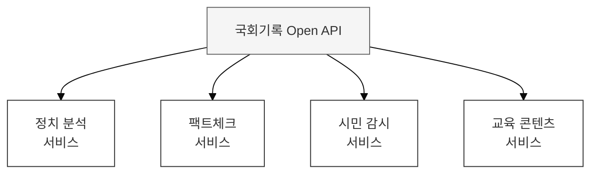
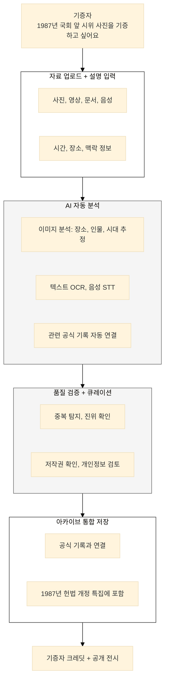

> **"국회 기록이 외부와 연결되고, 국민이 함께 만들어가는 살아있는 아카이브"**

---

## 국회기록원의 특성

### 공공재로서의 국회기록

국회기록은 **민주주의의 공공재**이다. 이 자산의 가치는 활용될 때 비로소 실현된다.

| 공공재 특성 | 내용 | 확장 방향 |
|-------------|------|-----------|
| **비배제성** | 누구나 접근 가능해야 | Open Data, Open API |
| **비경합성** | 사용해도 줄지 않음 | 무제한 활용 허용 |
| **외부효과** | 활용이 사회 가치 창출 | 민간 서비스 연동 지원 |
| **세대간 전승** | 미래 세대를 위한 보존 | 지속가능한 아카이빙 |

### 민간 활용의 가능성

국회기록의 민간 활용은 **새로운 가치**를 창출한다:

**예시:**
- 의원 활동 분석 앱
- 정치인 발언 검증 서비스
- 공약 이행 추적 플랫폼
- 입법 과정 교육 콘텐츠

### 현행 개방 및 확장성의 근본적 한계

현재 국회 기록 데이터는 대부분 국회 내부 시스템에 갇혀 있어, 외부에서의 자유로운 활용과 이를 통한 가치 창출이 거의 불가능한 '닫힌 생태계'에 가깝습니다.

| 한계 유형 | 문제점 | AI 도입의 필요성 |
|-----------|--------|------------------|
| **폐쇄적인 시스템** | Open API가 거의 제공되지 않거나 기능이 제한적이어서, 외부 개발자나 연구자들이 국회 데이터를 활용한 새로운 서비스를 만드는 것이 원천적으로 차단되어 있습니다. | 검색, 분석, 요약 등 AI 플랫폼의 핵심 기능을 API 형태로 전면 개방하여, 민간 기업, 연구자, 시민들이 혁신적인 서비스를 만들 수 있는 기반을 제공합니다. |
| **단순 열람 위주의 활용** | 데이터가 내부 시스템에 갇혀 있고 다운로드나 재가공이 어려워, 대부분의 활용이 단순 정보 확인 수준에 머무르며 심층적인 분석이나 융합 연구로 나아가지 못합니다. | AI 분석 모델(법안 통과 예측, 의원 성향 분석 등) 자체를 API로 제공하여, 외부 기관들이 고도의 분석 기능을 자사 서비스에 내장할 수 있도록 지원합니다. |
| **일방적인 정보 제공** | 국회가 생산한 기록을 국민에게 일방적으로 전달할 뿐, 국민이 소유한 귀중한 역사 기록(시위 사진, 집회 영상 등)을 아카이브에 기증하거나, 기록의 오류를 정정하는 등 참여할 수 있는 통로가 없습니다. | 국민이 직접 기록을 기증하고, AI가 기증된 기록의 시점과 내용을 분석하여 공식 기록과 자동으로 연결해주는 '참여형 아카이빙' 플랫폼을 구축합니다. |
| **정적인 아카이브** | 한번 구축된 데이터는 거의 변화 없이 고정되어 있으며, 외부의 새로운 데이터(뉴스, 소셜미디어 등)와 연결되어 살아 움직이는 '리빙 아카이브'로 발전하지 못합니다. | 외부 데이터 소스를 지속적으로 수집하고 AI가 국회 기록과의 관련성을 분석하여 자동으로 연결함으로써, 아카이브가 항상 최신성을 유지하며 스스로 성장하게 만듭니다. |

---

## 7대 참여자의 역할

### 참여자별 기여/활용 매트릭스

| 참여자 | 기여 방식 | 활용 방식 | AI 지원 |
|--------|-----------|-----------|---------|
| **의원실** | 의정활동 기록 공개 확대 | 유권자 소통 도구 | 활동 리포트 자동 생성 |
| **위원회** | 심사 과정 실시간 공개 | 전문가 의견 수렴 | 공청회 의견 분석 |
| **국회기록원** | Open API 운영, 품질 관리 | 활용 현황 모니터링 | API 사용 패턴 분석 |
| **국민** | 기록 기증, 오류 신고, 피드백 | 정보 활용, 모니터링 | 기증 자료 자동 분류 |
| **연구자/언론** | 분석 결과 공유, 데이터 품질 검증 | 연구용 데이터셋, 분석 API | 연구 지원 도구 |
| **정부부처** | 관련 데이터 연계 제공 | 정책 수립 참고 | 정책-입법 연결 분석 |
| **시민단체** | 모니터링 결과 공유, 이슈 제기 | 감시 활동 도구 | 이슈 추적 자동화 |

### 참여 아카이빙 시나리오

**국민 기록 기증:**

---

## 핵심 메시지

> **"확장의 가치는 벽을 허무는 것이다."**

국회기록이 사회와 연결되고, 국민이 참여하고, 민간이 활용할 때 민주주의 기록으로서의 가치가 완성된다.

**관련 문서:**
- [기록 유형별 확장 전략](/nanet-platform/04-expansion/02-record-types/) - Open API, 데이터셋, 소셜 아카이빙
- [AI 활용 및 플랫폼 설계](/nanet-platform/04-expansion/03-ai-platform/) - API 아키텍처, 참여 플랫폼, 거버넌스
