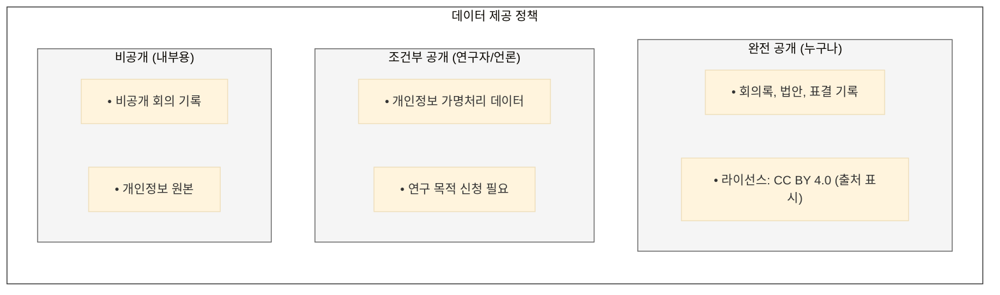
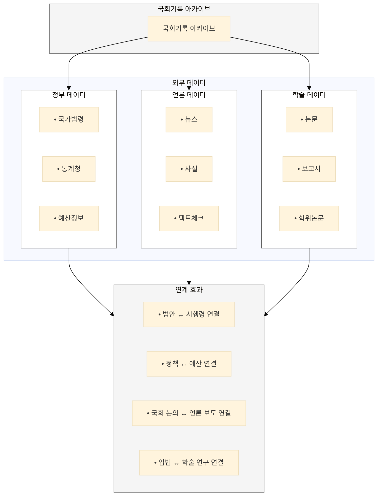

## 5대 기록 유형의 확장 전략

각 기록 유형별로 개방 및 확장 전략을 정의한다.

---

## Open API 제공

**기록 유형별 API:**

| 기록 유형 | API 엔드포인트 | 제공 기능 |
|-----------|---------------|-----------|
| **회의록** | `/api/v1/minutes` | 검색, 요약, 발언 추출 |
| **법안** | `/api/v1/bills` | 검색, 비교, 타임라인 |
| **의정활동** | `/api/v1/activities` | 의원별 활동, 통계 |
| **국정감사** | `/api/v1/audits` | QA 검색, 이행 추적 |
| **행정기록** | `/api/v1/admin` | 정보공개 자료 |

**통합 AI API:**
```yaml
# 검색 API (모든 기록 유형 통합)
POST /api/v1/search
  - 의미 기반 검색
  - 필터: 기록유형, 기간, 의원, 위원회 등
  - 하이브리드 검색 모드

# QA API (대화형 질의응답)
POST /api/v1/qa
  - RAG 기반 답변
  - 출처 명시
  - 다국어 지원

# 요약 API
POST /api/v1/summarize
  - 3줄 요약, 쟁점 요약, 비교 요약
  - 커스텀 길이/스타일

# 분석 API
POST /api/v1/analyze
  - 의원 활동 분석
  - 법안 영향 분석
  - 트렌드 분석
```

---

## 데이터셋 공개

**연구용 데이터셋:**
| 데이터셋 | 내용 | 형식 | 용도 |
|----------|------|------|------|
| 회의록 코퍼스 | 전체 회의록 텍스트 | JSON, Parquet | NLP 연구 |
| 법안 데이터셋 | 법안 메타+본문 | JSON | 법률 AI |
| 표결 데이터 | 의원별 표결 기록 | CSV | 정치학 연구 |
| 발언 데이터셋 | 발언자-발언 쌍 | JSON | 화자 분석 |

**데이터 제공 정책:**


---

## 소셜 아카이빙

**국민 참여 유형:**
| 참여 유형 | 내용 | AI 지원 |
|-----------|------|---------|
| **기록 기증** | 개인 소장 자료 기증 | 자동 분류, 연결, 검증 |
| **오류 신고** | 데이터 오류/누락 제보 | 신고 분류, 우선순위 |
| **태그 추가** | 커뮤니티 태깅 | 태그 검증, 통합 |
| **평가/댓글** | 콘텐츠 피드백 | 스팸 필터, 감성 분석 |

**시민단체 모니터링 연계:**
```
[시민단체: 환경연합]

모니터링 활동:
├── 환경부 국감 실시간 트래킹
├── 환경 관련 법안 심사 현황 추적
└── 의원 환경 관련 발언 수집

Open API 활용:
├── /api/v1/search → 환경 키워드 모니터링
├── /api/v1/alert → 신규 법안 알림
└── /api/v1/qa → 법안 쟁점 자동 분석

기여:
├── 분석 리포트 공유 (CC 라이선스)
└── 데이터 오류 신고
```

---

## 외부 데이터 연계

**연계 대상:**


---

## 확장 전략 요약

| 확장 유형 | 대상 | 핵심 기능 | 효과 |
|-----------|------|-----------|------|
| **Open API** | 개발자, 기관 | AI 기능 포함 API | 민간 서비스 생태계 |
| **데이터셋** | 연구자 | 구조화된 데이터 | 학술 연구 활성화 |
| **소셜 아카이빙** | 국민 | 기증, 피드백 | 리빙 아카이브 |
| **외부 연계** | 정부, 언론, 학술 | 데이터 연결 | 맥락 확장 |
