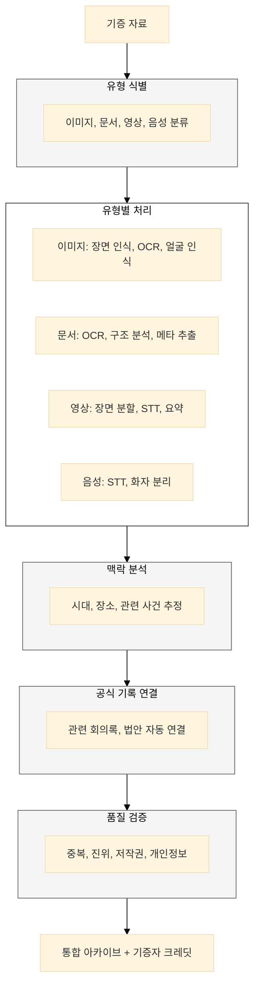
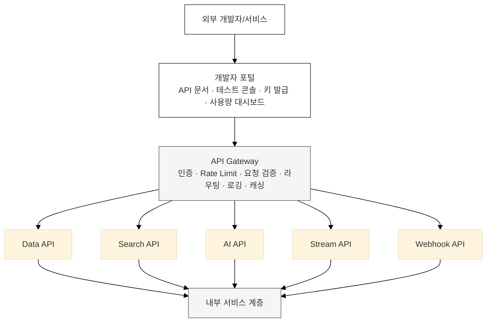
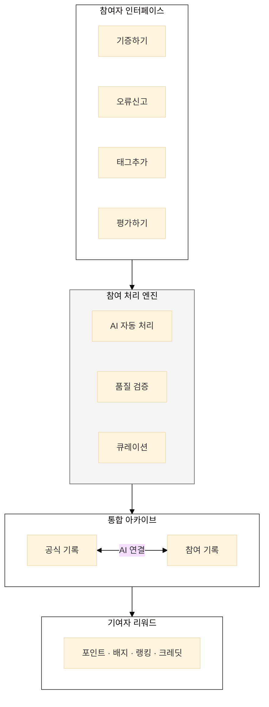
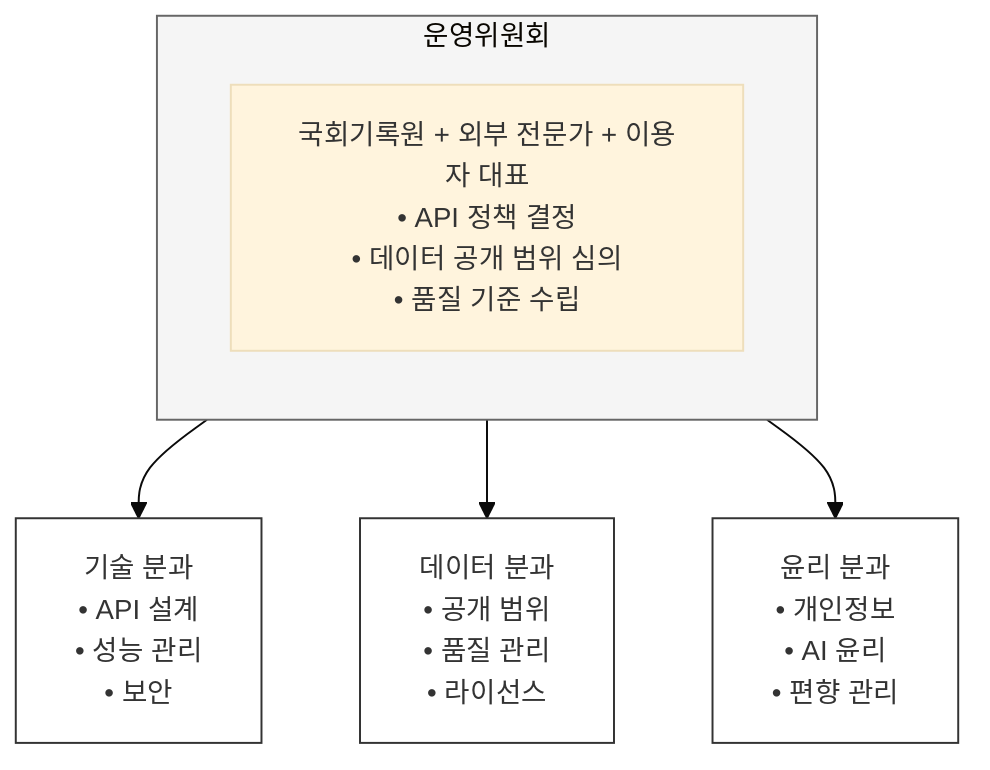

## AI 활용 방안

---

### 1. Open API AI 기능

**AI 기반 API 서비스:**
```yaml
# 의미 검색 API
POST /api/v1/ai/search
  body:
    query: "기후변화 대응 정책"
    mode: "semantic"  # semantic, keyword, hybrid
    include_analysis: true
  response:
    results: [...]
    analysis:
      main_topics: ["탄소중립", "재생에너지"]
      key_bills: [...]
      trend: "2020년 이후 급증"

# 대화형 QA API
POST /api/v1/ai/qa
  body:
    question: "반도체특별법 여야 입장 차이는?"
    conversation_id: "conv_123"  # 대화 이어가기
  response:
    answer: "..."
    sources: [...]
    confidence: 0.92
    follow_up_questions: ["세부 쟁점은?", "표결 결과는?"]

# 요약 API
POST /api/v1/ai/summarize
  body:
    document_ids: ["bill_123", "minutes_456"]
    style: "comparison"  # brief, detailed, comparison
    language: "ko"
  response:
    summary: "..."
    key_points: [...]
    differences: [...]  # comparison 모드 시

# 분석 API
POST /api/v1/ai/analyze
  body:
    target: "member"
    member_id: "member_001"
    metrics: ["activity", "focus_area", "voting_pattern"]
  response:
    profile: {...}
    activity_summary: {...}
    focus_areas: [...]
    voting_analysis: {...}
```

---

### 2. 기증 자료 자동 처리

**AI 처리 파이프라인:**



---

### 3. 품질 관리

**품질 검증 체계:**
| 검증 항목 | AI 방법 | 인간 검토 |
|-----------|---------|-----------|
| **중복 탐지** | 해시 + 의미 유사도 | 최종 판단 |
| **진위 확인** | 메타데이터 일관성 | 전문가 검증 |
| **저작권** | 이미지 역검색, 패턴 매칭 | 법적 검토 |
| **개인정보** | 얼굴/이름/번호 탐지 | 비식별화 확인 |
| **품질 점수** | 해상도, 명확성, 완전성 | 큐레이션 |

---

### 4. 소셜 데이터 분석

**여론 연계 분석:**

| 분석 항목 | 내용 |
|-----------|------|
| **언론 보도** | 긍정 45% (산업 경쟁력) · 중립 35% · 부정 20% (대기업 특혜) |
| **SNS 반응** | 키워드: #반도체지원 #대기업특혜 / 감성: 긍정 52%, 부정 31% |
| **관련 청원** | 반도체 지원 확대 촉구 (10,234명), 중소기업 우선 지원 요청 (3,456명) |
| **시계열** | 법안 발의 → 언론 보도 → SNS 확산 추이 |

---

## 플랫폼 설계 방향

---

### 1. Open API 아키텍처



**API 사용 정책:**
| 등급 | 대상 | 일일 한도 | AI 기능 | 비용 |
|------|------|-----------|---------|------|
| Basic | 누구나 | 1,000건 | 제한적 | 무료 |
| Standard | 인증 개발자 | 10,000건 | 전체 | 무료 |
| Pro | 기관/기업 | 100,000건 | 전체+우선 | 협의 |
| Research | 연구기관 | 무제한 | 전체 | 무료 |

---

### 2. 참여 아카이빙 플랫폼

**플랫폼 구조:**



---

### 3. 거버넌스 및 품질 정책

**거버넌스 구조:**



**품질 정책:**
| 항목 | 정책 |
|------|------|
| **데이터 정확성** | 원본 데이터 99.9% 정확도 목표 |
| **API 가용성** | 99.5% 이상 가동률 보장 |
| **응답 시간** | 95% 요청 2초 이내 응답 |
| **AI 품질** | 검색 관련성 90%+, QA 정확도 85%+ |
| **버전 관리** | 구버전 12개월 지원, 사전 공지 |
| **변경 공지** | 중대 변경 30일 전 공지 |

---

## 핵심 요약

| 구분 | 현행 | To-Be |
|------|------|-------|
| **데이터 공개** | PDF, 웹 검색 | Open API, 데이터셋 |
| **AI 기능** | 미제공 | 검색/QA/요약/분석 API |
| **국민 참여** | 청원만 | 기증, 태깅, 피드백 |
| **외부 연계** | 없음 | 정부/언론/학술 데이터 |
| **거버넌스** | 내부 운영 | 외부 참여 운영위 |

> **"국회기록이 사회와 연결되고, 국민이 참여하고, 민간이 활용할 때 민주주의 기록으로서의 가치가 완성된다."**
