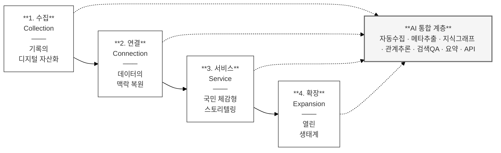
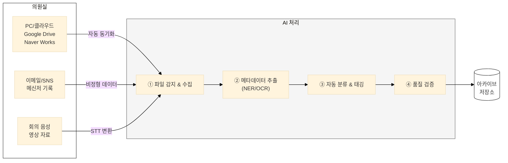
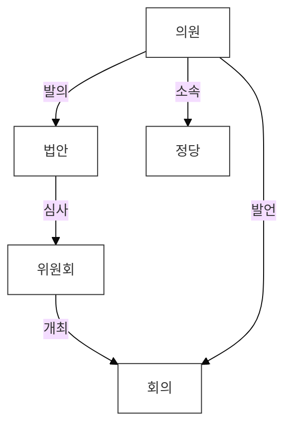
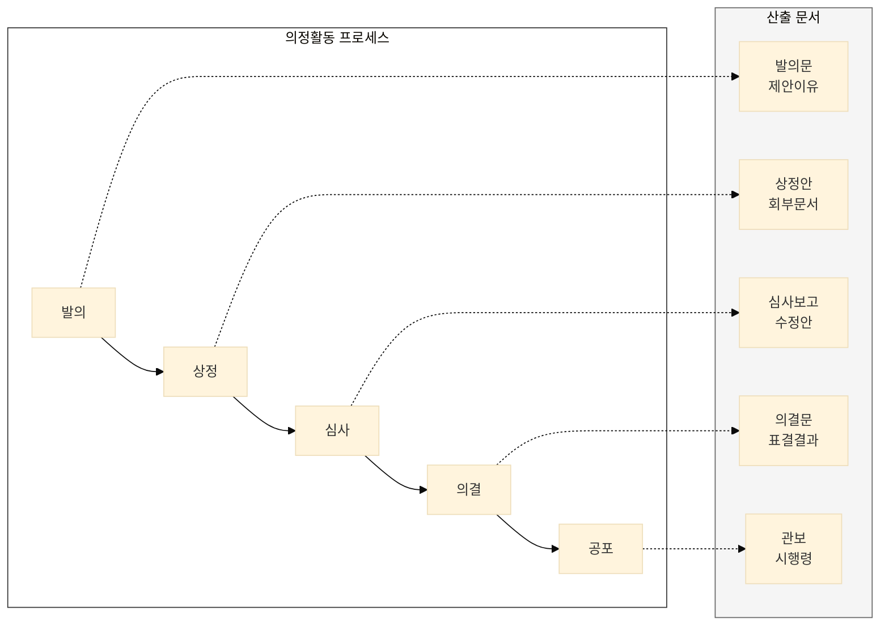
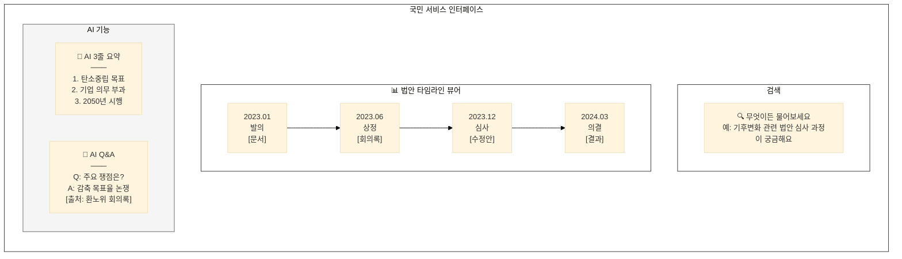
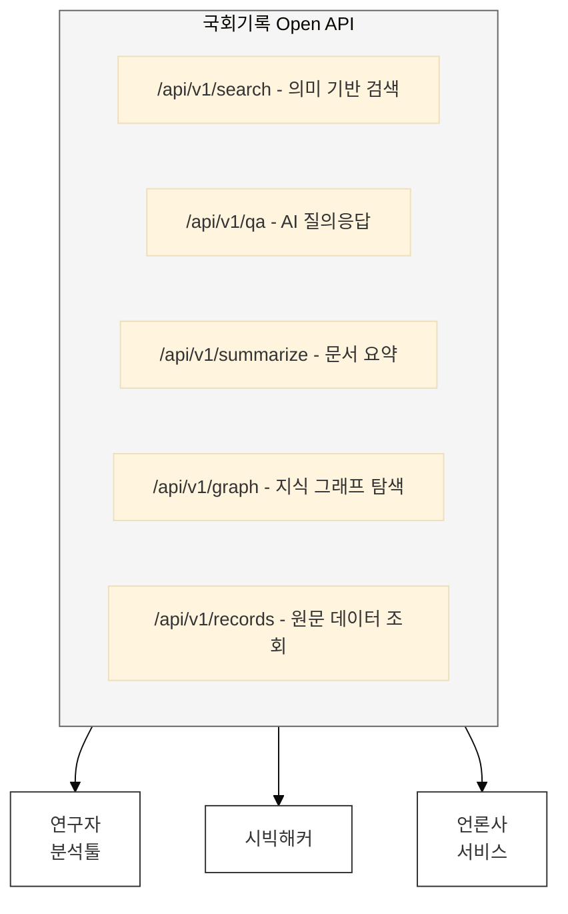
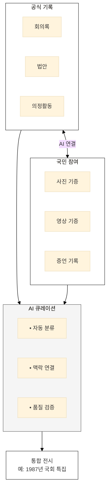

## 연구 목적

**국회기록원 디지털 아카이브에 AI를 통합하여, 다양한 국회기록의 수집·보존·활용을 혁신한다.**

이 연구는 단순한 시스템 구축 계획이 아니라, AI 기술이 아카이브의 모든 기능에 어떻게 통합될 수 있는지를 탐구하는 **모형 설계 연구**이다.

---

## 핵심 원칙

### 1. AI 통합이 최우선이다

AI는 보조 도구가 아니다. 아카이브 설계의 **중심축**이다.

| 전통적 접근 | AI 통합 접근 |
|------------|-------------|
| 시스템 구축 후 AI 기능 추가 | **AI를 중심으로 시스템 설계** |
| 메타데이터 수작업 입력 | AI 자동 추출 및 생성 |
| 키워드 기반 검색 | 의미 기반 검색 + 대화형 QA |
| 정적 기록 보존 | 동적 지식 연결 |

### 2. 국회기록원의 본질에 충실하다

국회기록원은 **입법부의 기록을 체계적으로 보존하고 활용**하는 기관이다.

- 회의록, 법안, 의정활동 등 **다양한 국회기록**을 다룬다
- 입법 과정의 **맥락과 관계**를 보존한다
- 국민의 **알 권리**와 **민주주의 기록화**에 기여한다

---

## 4단계 발전 프레임워크

국회기록 아카이브는 **수집 → 연결 → 서비스 → 확장**의 4단계로 발전하며, 각 단계는 AI 통합 계층에 의해 유기적으로 연결되고 지능화됩니다.

---

## 1단계: 수집 (Collection)

> **"기록의 디지털 자산화"** — 의원실의 업무 부담 없는 자동(Automatic) 수집

### 목표
의원실이 별도의 작업 없이도 기록이 자연스럽게 아카이브로 흘러들어오는 체계

### AI 핵심 역할

| 기능 | AI 활용 | 효과 |
|------|---------|------|
| **자동 수집 에이전트** | 파일 변경 감지, 자동 동기화 | 의원실 업무 부담 제로 |
| **메타데이터 자동 추출** | NLP/OCR로 작성자, 법안, 키워드 자동 태깅 | 수작업 90% 절감 |
| **멀티미디어 처리** | STT(음성→텍스트), 영상 분석 | 비정형 데이터 아카이빙 |
| **품질 검증** | 누락/오류 자동 탐지 | 데이터 완전성 확보 |

### 주요 과제

---

## 2단계: 연결 (Connection)

> **"데이터의 맥락(Context) 복원"** — 산재된 문서를 연결하여 입법 과정의 전모 파악

### 목표
개별 기록이 아닌, 입법 과정 전체의 맥락을 이해할 수 있는 지식 체계 구축

### AI 핵심 역할

| 기능 | AI 활용 | 효과 |
|------|---------|------|
| **지식 그래프 자동 구축** | 관계 추론, 엔티티 연결 | 의원-법안-위원회 관계망 |
| **데이터 정제** | 동명이인 식별, 법안명 표준화 | 데이터 품질 향상 |
| **맥락 추론** | 관련 이슈, 배경 자동 연결 | 숨은 관계 발견 |
| **시계열 분석** | 법안 변천사, 정책 흐름 | 역사적 맥락 파악 |

### 지식 그래프 구조

**AI가 자동으로:**
- 의원 A가 법안 X를 발의 → 위원회 B에서 심사 → 회의 C에서 논의
- 법안 X와 법안 Y의 유사성 발견 → 관련 법안으로 연결
- 의원 A의 발언에서 언급된 정책 → 해당 정책 관련 기록 연결

### 입법 온톨로지 (Ontology)

---

## 3단계: 서비스 (Service)

> **"국민 체감형 스토리텔링"** — 일반 국민이 쉽게 이해하고 탐험할 수 있는 서비스

### 목표
복잡한 입법 과정을 누구나 이해할 수 있도록 시각화하고, AI가 맞춤형 정보 제공

### AI 핵심 역할

| 기능 | AI 활용 | 효과 |
|------|---------|------|
| **의미 기반 검색** | 벡터 검색, 하이브리드 검색 | 자연어로 원하는 정보 발견 |
| **대화형 QA** | RAG 기반 질의응답 | "우리 지역구 의원 법안은?" |
| **3줄 요약 봇** | LLM 기반 요약 | 복잡한 법안을 쉽게 이해 |
| **맞춤 추천** | 관심사 기반 추천 | 개인화된 정보 제공 |

### 서비스 UI 구상

### AI Q&A 예시

| 질문 | AI 답변 |
|------|---------|
| "우리 지역구 의원이 발의한 법안은?" | [지역구 기반 의원 식별 → 발의 법안 검색 → 목록 제공] |
| "반도체 특별법 쟁점이 뭐야?" | [관련 회의록 검색 → 찬반 발언 추출 → 요약] |
| "이 법안 비슷한 거 또 있어?" | [벡터 유사도 검색 → 유사 법안 추천] |

---

## 4단계: 확장 (Expansion)

> **"열린 생태계와 참여"** — 국민의 참여로 완성되는 리빙 아카이브

### 목표
국회 기록이 외부와 연결되고, 국민이 함께 만들어가는 살아있는 아카이브

### AI 핵심 역할

| 기능 | AI 활용 | 효과 |
|------|---------|------|
| **Open API** | AI 기능 API 제공 | 민간 서비스 연동 |
| **소셜 아카이빙** | SNS 데이터 분석, 여론 연결 | 사회적 맥락 보강 |
| **기증 자료 처리** | 자동 분류, 메타데이터 생성 | 국민 참여 아카이브 |
| **품질 관리** | 기증 자료 검증, 중복 탐지 | 아카이브 무결성 유지 |

### Open API 구조

### 리빙 아카이브 (Living Archive)

---

## 4단계 × AI 통합 요약

| 단계 | 목표 | AI 핵심 기능 | 핵심 가치 |
|------|------|-------------|-----------|
| **1. 수집** | 자동 수집 | 자동 수집, 메타추출, STT | 의원실 부담 제로 |
| **2. 연결** | 맥락 복원 | 지식 그래프, 관계 추론 | 입법 과정 전모 파악 |
| **3. 서비스** | 국민 체감 | 검색 QA, 요약, 시각화 | 누구나 쉽게 이해 |
| **4. 확장** | 열린 생태계 | Open API, 소셜 아카이빙 | 국민 참여 아카이브 |

---

## 5대 국회기록 유형

4단계 프레임워크가 다루는 기록 유형:

| 유형 | 내용 | AI 적용 예시 |
|------|------|-------------|
| **회의록/속기록** | 본회의, 위원회 회의 기록 | 화자 분리, 요약, 쟁점 추출 |
| **법안/의안** | 발의 법안, 심사 과정 | 유사 법안 탐지, 조문 비교 |
| **의정활동 기록** | 의원 활동, 질의/답변 | 활동 패턴 분석, 관계 연결 |
| **국정감사 기록** | 감사 자료, 시정 요구 | QA 추출, 이행 추적 |
| **행정기록** | 국회 운영 문서 | 문서 분류, 개인정보 탐지 |

각 단계별 상세 내용은 아래 문서 구조를 참조한다.

---

## 문서 구조

| 장 | 제목 | 내용 |
|---|------|------|
| 1 | [수집 (Collection)](/nanet-platform/01-collection/) | 자동 수집, 7대 참여자 역할, 5대 기록 유형별 수집 전략, AI 자동화 |
| 2 | [연결 (Connection)](/nanet-platform/02-connection/) | 지식 그래프, 맥락 복원, 관계 추론, 입법 온톨로지 |
| 3 | [서비스 (Service)](/nanet-platform/03-service/) | 국민 체감형 서비스, 의미 검색, RAG QA, 자동 요약 |
| 4 | [확장 (Expansion)](/nanet-platform/04-expansion/) | Open API, 리빙 아카이브, 국민 참여, 거버넌스 |
| - | [부록](/nanet-platform/appendix/) | 기술 스택, 용어집, OAIS 참조 모형 |

---

## 핵심 메시지

> **"수집 → 연결 → 서비스 → 확장, 모든 단계에서 AI가 핵심이다."**

국회기록원 디지털 아카이브는 4단계 발전 프레임워크를 따르되, 각 단계에서 AI가 중심 역할을 수행함으로써 **국민 누구나 입법 과정을 이해하고 참여할 수 있는 민주주의의 기록**이 된다.
