## 1.1.1 SP100주년 뮤지엄 웹사이트 소개

SP100주년 뮤지엄은 삼화페인트 창립 100주년을 기념하여 제작된 웹사이트입니다. 이벤트 운영, 당첨자 발표, 갤러리 관리 등의 기능을 제공합니다.

### 웹사이트 구성

| 기능 | 설명 |
|------|------|
| **이벤트** | 100주년 기념 이벤트 안내 및 참여 |
| **당첨자 발표** | 이벤트 수상작/당첨자 공개 |
| **갤러리** | 이미지 갤러리 |
| **이벤트 댓글** | 이벤트 참여 댓글 |

### 멀티사이트 구조

SP100주년 뮤지엄은 삼화페인트 WordPress 멀티사이트의 일부로 운영됩니다.

| blog_id | 경로 | 설명 |
|---------|------|------|
| 1 | `/` | 국문 메인 사이트 |
| 2 | `/en/` | 영문 사이트 |
| **3** | `/museum/` | **뮤지엄 사이트 (현재)** |

---

## 1.1.2 WordPress 관리자 접속

### 접속 URL

| 환경 | 관리자 URL |
|------|------------|
| **운영** | https://spsamhwa.com/museum/samwha-admin/ |
| **개발** | https://samhwa.sknkwoxs.com/museum/wp-admin/ |

### 로그인 방법

1. 관리자 URL 접속
2. 사용자명과 비밀번호 입력
3. "로그인" 버튼 클릭

> **참고**: 로그인 계정은 내부 관리자에게 문의하세요.

---

## 1.1.3 관리자 화면 구성

### 대시보드

로그인 후 WordPress 관리자 대시보드가 표시됩니다. 좌측 메뉴에서 각 기능에 접근할 수 있습니다.

### 주요 메뉴

| 구분 | 메뉴 | 용도 |
|------|------|------|
| **이벤트 관련** | 이벤트 관리 | 이벤트 등록/수정/삭제 |
| | 당첨자 발표 | 이벤트 당첨자(수상작) 등록/관리 |
| | 댓글 | 이벤트 참여 댓글 승인/삭제 |
| **아카이브 관련** | 아카이브 관리 | 아카이브 이미지 등록/관리 |

---

## 1.1.4 기술 스택 요약

### 핵심 스택

| 구성 요소 | 기술 | 버전 |
|----------|------|------|
| CMS | WordPress (Multisite) | 6.x |
| 템플릿 | Timber + Twig | 2.x |
| 필드 관리 | ACF Pro | 6.x |
| CSS | Custom + Tailwind | - |
| JS | Vanilla + GSAP | 3.x |
| 스크롤 | Lenis | 1.x |

### 테마 구조

---

## 1.1.5 보안 유의사항

| 주의사항 | 설명 |
|----------|------|
| **비밀번호 관리** | 강력한 비밀번호 사용, 주기적 변경 권장 |
| **로그아웃** | 공용 PC 사용 시 반드시 로그아웃 |
| **계정 공유 금지** | 관리자 계정은 개인별로 발급받아 사용 |

---

## 1.1.6 문의 및 지원

| 구분 | 담당 | 연락처 |
|------|------|--------|
| **개발** | 스컹크웍스 | admin@skunkworks.co.kr |
| **서버** | (내부 담당자) | - |
