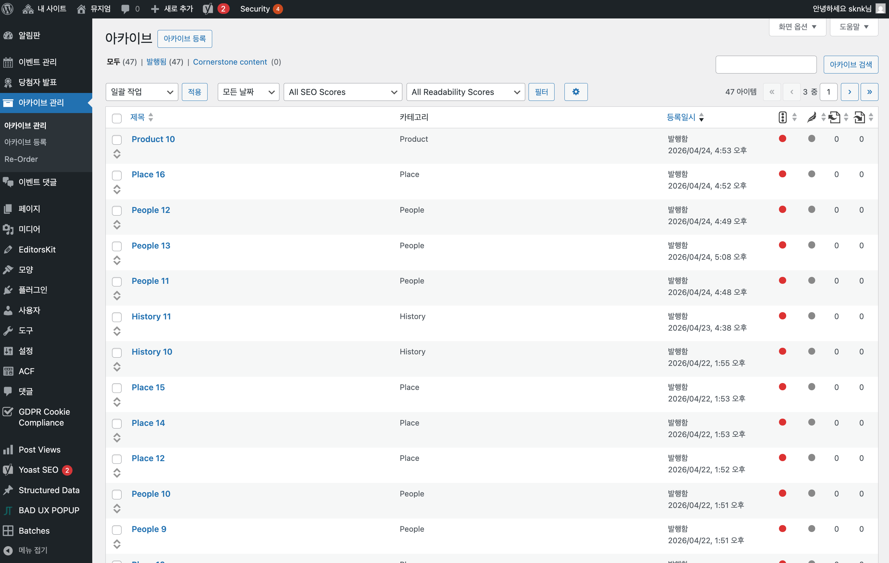
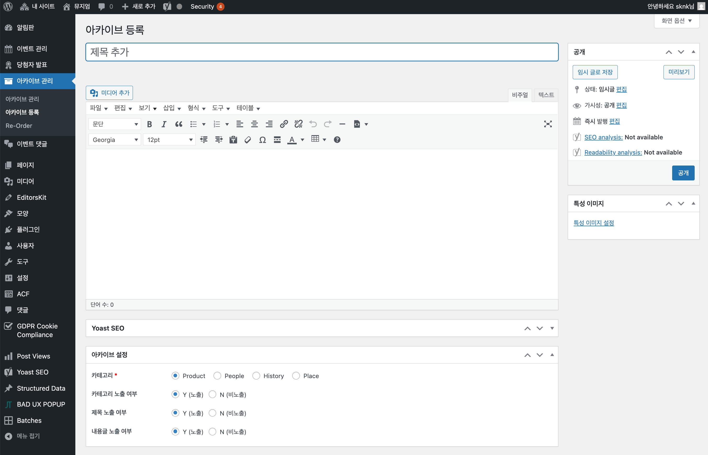
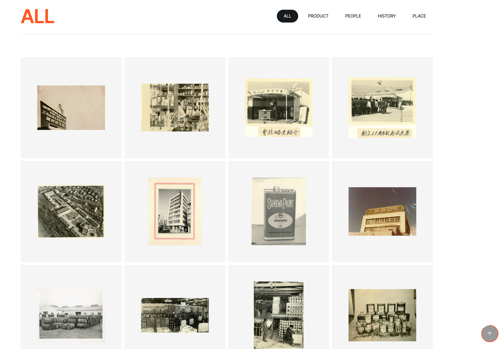

## 1.3.1 개요

아카이브 관리 기능은 **삼화 아카이브 100** 페이지에 표시되는 이미지들을 관리합니다.  
관리자 메뉴에서는 **아카이브 관리**로 표시되며, 프론트엔드에서는 **삼화 아카이브 100**으로 노출됩니다.

---

## 1.3.2 아카이브 목록

### 목록 확인

1. 좌측 메뉴에서 **아카이브 관리** 클릭
2. 등록된 아카이브 목록이 표시됩니다



### 관리자 목록 컬럼

| 컬럼 | 설명 |
|------|------|
| **제목** | 아카이브 항목 제목 |
| **카테고리** | 아카이브 카테고리 분류 |
| **등록일시** | 등록 날짜 및 시간 |

---

## 1.3.3 아카이브 등록

### 등록 절차

1. **아카이브 관리** > **새로 추가** 클릭
2. 다음 항목을 입력합니다:



### 입력 필드

| 필드 | 설명 | 필수 | 비고 |
|------|------|------|------|
| **제목** | 아카이브 항목 제목 | ✅ | 관리용 + 프론트 표시 |
| **내용** | 상세 설명 (에디터) | - | 모달 상세 표시 |
| **특성 이미지** | 대표 이미지 | ✅ | 썸네일 + 모달 이미지 |
| **카테고리** | Product / People / History / Place 중 선택 | ✅ | 라디오 버튼, 프론트엔드 필터 탭에 사용 |
| **카테고리 노출 여부** | 프론트 표시 여부 | - | Y(노출) / N(비노출) |
| **제목 노출 여부** | 프론트 표시 여부 | - | Y(노출) / N(비노출) |
| **내용글 노출 여부** | 프론트 표시 여부 | - | Y(노출) / N(비노출) |

- **특성 이미지**는 권장 용량인 2MB 이하로 업로드해 주시기 바랍니다.
- 권장 용량 초과 시, Front 화면의 목록(List) 로딩 속도가 저하될 수 있습니다.

3. **공개** 버튼 클릭하여 저장

### 표시 옵션 설명

| 옵션 | Y (노출) | N (비노출) |
|------|----------|----------|
| 카테고리 노출 여부 | 이미지 위에 카테고리 라벨 표시 | 카테고리 라벨 숨김 |
| 제목 노출 여부 | 이미지 하단에 제목 표시 | 제목 숨김 |
| 내용글 노출 여부 | 모달에서 내용 표시 | 이미지만 표시 |

---

## 1.3.4 프론트엔드 동작 방식

### 페이지 구조



### 기능 설명

| 기능 | 설명 |
|------|------|
| **필터 탭** | 아카이브 카테고리별 필터링 (중복 없이 탭 자동 생성) |
| **이미지 그리드** | 반응형 그리드 레이아웃 |
| **모달 상세** | 이미지 클릭 시 모달로 상세 보기 |
| **정렬** | Re-order로 설정한 **사용자 정의 순서** 또는 등록일 기준 정렬 |

### 정렬 기준

- **기본**: 등록일 기준 오래된 순(ASC) 정렬
- **Re-order 사용 시**: 리오더로 조정한 정렬 기준이 우선 적용

---

## 1.3.5 아카이브 수정

### 수정 절차

1. 아카이브 목록에서 수정할 항목의 **제목** 클릭
2. 필드 내용 수정
3. **업데이트** 버튼 클릭

### 이미지 교체

1. 대표 이미지 섹션에서 **이미지 제거** 클릭
2. **대표 이미지 설정** 클릭하여 새 이미지 선택
3. **업데이트** 클릭

---

## 1.3.6 아카이브 삭제

### 삭제 절차

1. 아카이브 목록에서 삭제할 항목에 마우스 오버
2. **휴지통** 클릭

### 영구 삭제

1. **아카이브 관리** > **휴지통** 이동
2. 영구 삭제할 항목에 마우스 오버
3. **영구 삭제** 클릭

> **주의**: 영구 삭제된 아카이브는 복구할 수 없습니다.

---

## 1.3.7 권장 이미지 규격

### 기본 규격

| 용도 | 권장 크기 | 형식 | 최대 용량 |
|------|----------|------|----------|
| 대표 이미지 | 1200 x 800px | JPG, WebP | 2MB |
| 고해상도 | 1920 x 1280px | JPG, WebP | 3MB |

### 이미지 비율

- 권장 비율: **3:2** 또는 **4:3**
- 정사각형(1:1)도 지원

### 파일명 규칙

- **영문** 사용 권장
- **숫자**, **하이픈(-)** 사용 가능
- **한글**, **공백**, **특수문자** 사용 금지

```
✅ 좋은 예: archive-1960-factory.jpg, samhwa-heritage-01.webp
❌ 나쁜 예: 아카이브 이미지.jpg, archive (1).jpg
```

---

## 1.3.8 카테고리 관리 팁

### 현재 등록된 카테고리

| 카테고리 | 설명 |
|----------|------|
| **Product** | 제품 관련 아카이브 |
| **People** | 인물 관련 아카이브 |
| **History** | 역사 관련 아카이브 |
| **Place** | 장소 관련 아카이브 |

### 카테고리 네이밍

일관된 카테고리명을 사용하세요:

```
✅ 좋은 예: Product, People, History, Place
❌ 나쁜 예: product, PRODUCT, 제품 (혼용)
```

### 필터 탭 생성 원리

- 등록된 아카이브의 **아카이브 카테고리** 값을 수집
- 중복 제거 후 **전체** 탭과 함께 표시
- 빈 값은 필터에서 제외

---

## 1.3.9 순서 변경 (Re-order)

### 기본 정렬 방식

아카이브는 기본적으로 **등록일 기준 오래된 순(ASC)**으로 정렬되어 프론트엔드에 표시됩니다.

순서를 직접 조정하고 싶다면 **Re-order** 기능을 사용하여 드래그 앤 드롭으로 변경할 수 있습니다.

### 순서 변경 절차

1. 좌측 메뉴에서 **아카이브 관리** 클릭
2. 목록 상단의 **Re-order** 버튼 클릭
3. 드래그 앤 드롭으로 순서 변경
4. **정렬 저장** 버튼 클릭

### 주의사항

- Re-order로 순서를 변경하면 프론트엔드에도 해당 순서가 반영됩니다
- 등록일 기준 정렬 대신 **사용자 정의 순서**가 우선 적용됩니다
- 새로 등록한 아카이브는 목록 맨 아래에 추가됩니다

---

## 1.3.10 자주 묻는 질문

### Q: 아카이브가 프론트에 표시되지 않아요

**A**: 다음을 확인하세요:
- 상태가 **공개됨**인지 확인
- 대표 이미지가 설정되어 있는지 확인

### Q: 카테고리 필터에 내 카테고리가 없어요

**A**: 해당 카테고리로 등록된 **공개** 상태의 아카이브가 1개 이상 있어야 필터 탭에 표시됩니다.

### Q: 표시 순서를 변경하고 싶어요

**A**: 아카이브 목록에서 **Re-order** 버튼을 클릭하여 드래그 앤 드롭으로 순서를 변경할 수 있습니다. 변경 후 **정렬 저장**을 클릭하세요.

### Q: 모달에서 내용이 안 보여요

**A**: 해당 아카이브의 **내용 표시** 옵션이 **Y**로 설정되어 있는지 확인하세요.
