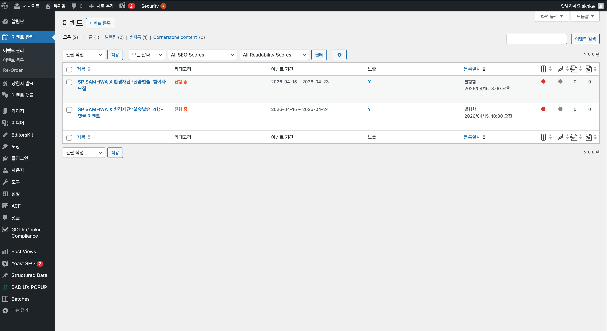
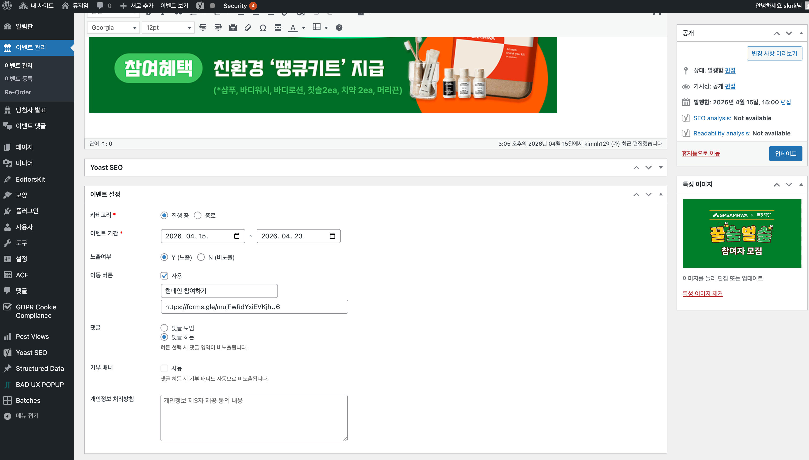

---

## 1.2.1.1 이벤트 목록

### 메뉴 접근

좌측 메뉴에서 **이벤트 관리** > **이벤트 관리**를 클릭하면 이벤트 목록 화면으로 이동합니다.



### 목록 구성

| 컬럼 | 설명 |
|------|------|
| **제목** | 이벤트 제목 (클릭하여 편집 화면으로 이동) |
| **카테고리** | 진행 중 / 종료 상태 표시 |
| **이벤트 기간** | 시작일 ~ 종료일 |
| **노출** | Y(노출) / N(비노출) 상태 |
| **등록일시** | 이벤트 등록 날짜 및 시간 |

### 탭 필터

목록 상단의 탭으로 이벤트를 필터링할 수 있습니다:

| 탭 | 설명 |
|---|------|
| **모두** | 전체 이벤트 |
| **내 글** | 내가 작성한 이벤트 |
| **발행됨** | 발행된 이벤트 |
| **휴지통** | 삭제된 이벤트 |

### 일괄 작업

여러 이벤트를 한 번에 처리하려면:
1. 처리할 이벤트 체크박스 선택
2. **일괄 작업** 드롭다운에서 작업 선택
3. **적용** 클릭

---

## 1.2.1.2 새 이벤트 등록

### 등록 방법

1. **이벤트 등록** 버튼 클릭 (목록 상단)
2. 또는 좌측 메뉴에서 **이벤트 관리** > **이벤트 등록** 클릭

### 기본 정보 입력

- **제목**
- 이벤트의 메인 제목을 입력합니다
- 목록 및 상세 페이지에 표시됩니다

- **내용 (본문)**
- 비주얼 에디터 또는 텍스트 에디터로 작성
- 이미지, 텍스트 서식 등을 자유롭게 구성할 수 있습니다

---

## 1.2.1.3 이벤트 설정

이벤트 편집 화면 하단의 **이벤트 설정** 섹션에서 상세 옵션을 설정합니다.



### 본문 이미지 (필수)

이벤트 게시물에 표시할 이미지를 본문에 업로드해야 합니다.

1. 본문 에디터에서 **미디어 추가** 버튼 클릭
2. **파일 업로드** 탭에서 이미지 파일 선택 또는 드래그 앤 드롭
3. 업로드 완료 후 **게시물에 삽입** 클릭
4. 이미지 크기 및 정렬 옵션 선택 가능

### 카테고리 (필수)

이벤트의 진행 상태를 설정합니다.

| 옵션 | 설명 |
|------|------|
| **진행 중** | 현재 참여 가능한 이벤트 |
| **종료** | 이벤트가 종료됨 |

### 이벤트 기간 (필수)

이벤트의 시작일과 종료일을 설정합니다.

- **시작일**: 이벤트 시작 날짜 선택
- **종료일**: 이벤트 종료 날짜 선택
- 날짜 선택 시 캘린더 팝업이 표시됩니다

### 노출여부

웹사이트에 이벤트 노출 여부를 설정합니다.

| 옵션 | 설명 |
|------|------|
| **Y (노출)** | 웹사이트에 표시됨 |
| **N (비노출)** | 웹사이트에 표시되지 않음 |

### 이동 버튼

이벤트 참여를 위한 외부 링크 버튼을 설정합니다.

1. **사용** 체크박스 활성화
2. **버튼 텍스트** 입력 (예: "캠페인 참여하기")
3. **URL** 입력 (예: Google Forms 링크)

```
예시:
- 버튼 텍스트: 캠페인 참여하기
- URL: https://forms.gle/xxxxx
```

### 댓글 설정

이벤트 상세 페이지의 댓글 영역 표시 여부를 설정합니다.

| 옵션 | 설명 |
|------|------|
| **댓글 보임** | 댓글 영역이 표시됨 |
| **댓글 히든** | 댓글 영역이 숨겨짐 |

> **참고**: 히든 선택 시 댓글 영역이 비노출됩니다.

### 기부 배너

기부 관련 배너 표시 여부를 설정합니다.

- **사용** 체크박스 활성화 시 기부 배너 표시
- 댓글 히든 시 기부 배너도 자동으로 비노출됩니다

### 개인정보 처리방침

이벤트 참여 시 표시할 개인정보 제3자 제공 동의 내용을 입력합니다.

---

## 1.2.1.4 특성 이미지 설정

우측 사이드바의 **특성 이미지** 섹션에서 이벤트 대표 이미지를 설정합니다.

1. **특성 이미지 설정** 클릭
2. 미디어 라이브러리에서 이미지 선택 또는 새로 업로드
3. **특성 이미지로 설정** 클릭

### 권장 이미지 규격

| 용도 | 권장 크기 | 형식 |
|------|----------|------|
| 특성 이미지 | 1200 x 630px | JPG, WebP |
| 본문 이미지 | 1920 x 1080px | JPG, WebP |

---

## 1.2.1.5 발행하기

### 새 이벤트 발행

1. 모든 필수 항목 입력 완료
2. 우측 **공개** 패널에서 **공개** 버튼 클릭

### 기존 이벤트 업데이트

1. 내용 수정 후
2. **업데이트** 버튼 클릭

### 발행 옵션

| 옵션 | 설명 |
|------|------|
| **임시 글로 저장** | 발행하지 않고 저장만 |
| **미리보기** | 발행 전 미리보기 |
| **상태** | 발행됨 / 임시글 / 예약됨 |
| **가시성** | 공개 / 비밀번호 보호 / 비공개 |
| **발행일** | 즉시 또는 예약 발행 |

---

## 1.2.1.6 이벤트 수정

### 수정 방법

1. 이벤트 목록에서 수정할 이벤트 **제목** 클릭
2. 편집 화면에서 내용 수정
3. **업데이트** 클릭

### 빠른 편집

목록에서 이벤트에 마우스 오버 시 나타나는 **빠른 편집** 링크로 간단한 정보만 수정할 수 있습니다.

---

## 1.2.1.7 이벤트 삭제

### 휴지통으로 이동

1. 이벤트 목록에서 삭제할 이벤트에 마우스 오버
2. **휴지통** 클릭
3. 휴지통 탭으로 이동됨

### 영구 삭제

1. **휴지통** 탭 클릭
2. 삭제할 이벤트에서 **영구 삭제** 클릭

> **주의**: 영구 삭제된 이벤트는 복구할 수 없습니다.

### 복원

휴지통의 이벤트는 **복원** 클릭으로 되돌릴 수 있습니다.

---

## 1.2.1.8 이벤트 순서 변경

좌측 메뉴의 **이벤트 관리** > **Re-Order**에서 이벤트 순서를 드래그 앤 드롭으로 변경할 수 있습니다.

---

## 1.2.1.9 자주 묻는 질문

### Q: 이벤트가 웹사이트에 표시되지 않아요

**A**: 다음을 확인하세요:
- **노출여부**가 Y(노출)로 설정되어 있는지
- **상태**가 발행됨인지
- **카테고리**가 진행 중인지

### Q: 이벤트 참여 버튼이 작동하지 않아요

**A**: 이동 버튼 설정을 확인하세요:
- **사용** 체크박스가 활성화되어 있는지
- **URL**이 올바르게 입력되어 있는지 (https:// 포함)

### Q: 댓글 영역이 보이지 않아요

**A**: 이벤트 설정에서 **댓글** 옵션이 "댓글 보임"으로 설정되어 있는지 확인하세요.
