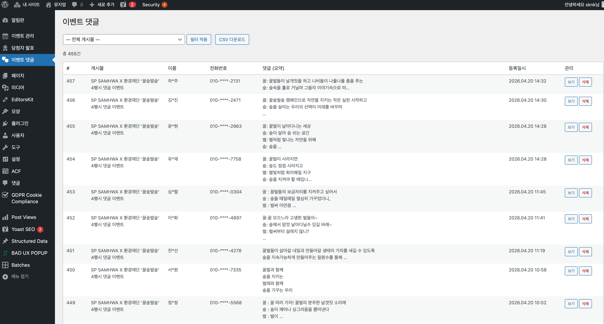

---

## 1.2.2.1 댓글 목록 확인

### 메뉴 접근

좌측 메뉴에서 **이벤트 댓글**을 클릭하면 댓글 관리 화면으로 이동합니다.

### 목록 구성

| 컬럼 | 설명 |
|------|------|
| **#** | 댓글 번호 (자동 부여) |
| **게시물** | 댓글이 달린 이벤트명 |
| **이름** | 댓글 작성자 이름 |
| **전화번호** | 작성자 연락처 (마스킹 처리됨) |
| **댓글 (요약)** | 댓글 내용 미리보기 |
| **등록일시** | 댓글 작성 날짜 및 시간 |
| **관리** | 보기 / 삭제 버튼 |

### 총 댓글 수

목록 상단에 **총 OOO건**으로 전체 댓글 수가 표시됩니다.

---

## 1.2.2.2 댓글 필터링

### 게시물별 필터

특정 이벤트의 댓글만 보고 싶을 때:

1. 상단의 **— 전체 게시물 —** 드롭다운 클릭
2. 원하는 이벤트 선택
3. **필터 적용** 버튼 클릭

### 필터 초기화

- 드롭다운에서 **— 전체 게시물 —** 선택
- **필터 적용** 클릭

---

## 1.2.2.3 댓글 상세 보기

### 보기 버튼

1. 댓글 목록에서 **보기** 버튼 클릭
2. 댓글 전체 내용이 팝업으로 표시됩니다

### 확인 가능 정보

- 댓글 전체 내용
- 작성자 정보
- 작성 일시

---

## 1.2.2.4 댓글 삭제

### 개별 삭제

1. 삭제할 댓글의 **삭제** 버튼 클릭
2. 확인 메시지에서 **확인** 클릭

> **주의**: 삭제된 댓글은 복구할 수 없습니다.

### 삭제 시 주의사항

- 삭제 전 댓글 내용을 확인하세요
- 실수로 삭제하지 않도록 주의가 필요합니다
- 부적절한 댓글만 삭제하는 것을 권장합니다

---

## 1.2.2.5 CSV 다운로드

댓글 데이터를 엑셀 파일로 내보낼 수 있습니다.

### 다운로드 방법

1. 상단의 **CSV 다운로드** 버튼 클릭
2. 파일이 자동으로 다운로드됩니다

### CSV 파일 내용

다운로드된 파일에는 다음 정보가 포함됩니다:

| 컬럼 | 설명 |
|------|------|
| 번호 | 댓글 번호 |
| 게시물 | 이벤트명 |
| 이름 | 작성자 |
| 전화번호 | 연락처 |
| 댓글 | 전체 내용 |
| 등록일시 | 작성 일시 |

### 활용 방법

- 이벤트 참여자 집계
- 당첨자 추첨용 데이터
- 참여 현황 보고서 작성

---

## 1.2.2.6 댓글 관리 팁

### 부적절한 댓글 처리

다음과 같은 댓글은 삭제를 고려하세요:

| 유형 | 설명 |
|------|------|
| 광고성 | 상품 홍보, 외부 링크 |
| 비속어 | 욕설, 비방 |
| 무의미 | 의미 없는 글자 나열 |
| 중복 | 동일 내용 반복 |
| 개인정보 | 타인의 개인정보 노출 |

### 정기 점검

- 매일 또는 정기적으로 새 댓글 확인
- 이벤트 종료 후 최종 댓글 정리

---

## 1.2.2.7 자주 묻는 질문

### Q: 댓글이 웹사이트에 표시되지 않아요

**A**: 해당 이벤트의 댓글 설정을 확인하세요:
- 이벤트 편집 화면 > 이벤트 설정 > 댓글 옵션이 "댓글 보임"으로 설정되어 있어야 합니다

### Q: 특정 이벤트의 댓글만 다운로드하고 싶어요

**A**: 
1. 게시물 필터에서 해당 이벤트 선택
2. **필터 적용** 클릭
3. 필터링된 상태에서 **CSV 다운로드** 클릭

### Q: 삭제한 댓글을 복구할 수 있나요?

**A**: 아니요, 삭제된 댓글은 복구할 수 없습니다. 삭제 전 신중하게 확인하세요.

### Q: 전화번호가 일부만 보여요

**A**: 개인정보 보호를 위해 전화번호는 마스킹 처리되어 표시됩니다 (예: 010-****-2131).
